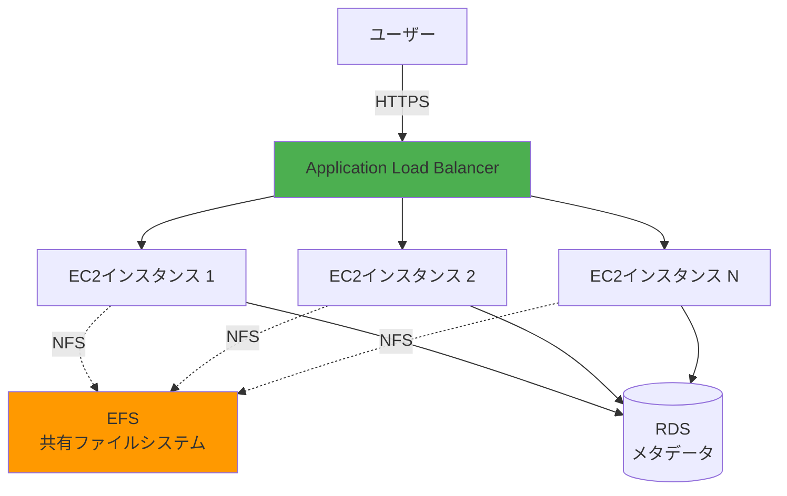
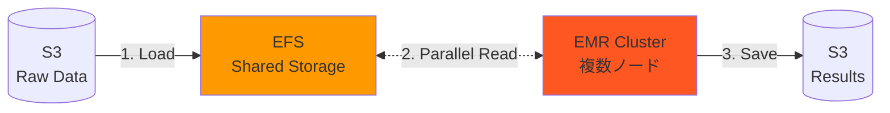
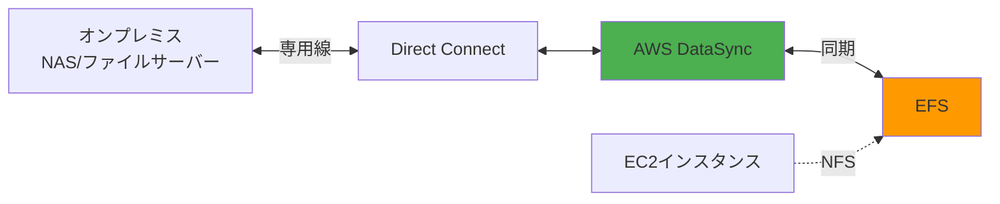

## EFS ユースケースおよびアーキテクチャパターン

### 1. 共有コンテンツリポジトリ（CMS）

```yaml
構成:
  ALB + Auto Scaling + EFS:
    - ALB: 負荷分散
    - EC2 Auto Scaling: 複数インスタンス
    - EFS: 共有ストレージ（画像、静的ファイル）
    - RDS: メタデータ

メリット:
  - 複数インスタンスで同じファイル参照
  - スケールアウト可能
  - ファイル整合性保証

用途:
  - WordPress、Drupalなど
  - メディアライブラリ
  - ドキュメント管理
```



### 2. コンテナ共有ストレージ

```yaml
構成:
  ECS/EKS + EFS:
    - ECS Fargate: コンテナ実行
    - EFS: 永続ストレージ
    - マルチタスク共有

ユースケース:
  - ML モデル共有
  - 設定ファイル共有
  - ログ集約
  - ステートフル アプリケーション

設定:
  ECS Task Definition:
    - EFS ボリューム定義
    - マウントポイント指定
    - アクセスポイント利用
```

```yaml
# ECS Task Definition例
{
  "family": "efs-task",
  "containerDefinitions": [{
    "name": "app",
    "image": "myapp:latest",
    "mountPoints": [{
      "sourceVolume": "efs-volume",
      "containerPath": "/mnt/efs"
    }]
  }],
  "volumes": [{
    "name": "efs-volume",
    "efsVolumeConfiguration": {
      "fileSystemId": "fs-12345678",
      "transitEncryption": "ENABLED",
      "authorizationConfig": {
        "accessPointId": "fsap-12345678",
        "iam": "ENABLED"
      }
    }
  }]
}
```

### 3. ホームディレクトリ

```yaml
構成:
  EC2 + EFS:
    - 各ユーザーのホームディレクトリ
    - EFS アクセスポイント活用
    - POSIX 権限制御

メリット:
  - ユーザーがどのインスタンスでも同じ環境
  - セッション維持不要
  - 自動スケーリング対応

用途:
  - 開発環境
  - リモートデスクトップ
  - ジャンプサーバー
```

```yaml
アクセスポイント構成:
  User1:
    Path: /home/user1
    UID: 1001
    GID: 1001
    Permissions: 0755
  
  User2:
    Path: /home/user2
    UID: 1002
    GID: 1002
    Permissions: 0755

セキュリティ:
  - ユーザーごとに分離
  - UID/GID強制
  - IAM認証可能
```

### 4. ビッグデータ分析

```yaml
構成:
  EMR/SageMaker + EFS:
    - 大規模データ共有
    - 複数ノードから並列読み取り
    - Max I/Oパフォーマンスモード

ワークフロー:
  1. S3からデータ取得
  2. EFSに展開
  3. 複数ノードで並列処理
  4. 結果をS3に保存

パフォーマンス:
  - Provisioned Throughput: 1GB/s
  - 同時接続: 数千ノード
```



### 5. バックアップ・ディザスタリカバリ

```yaml
構成:
  オンプレミス + AWS Backup + EFS:
    - AWS DataSync: オンプレ同期
    - EFS: クラウドコピー
    - AWS Backup: 自動バックアップ
    - クロスリージョンコピー

RTO/RPO:
  - RPO: DataSync間隔（15分〜）
  - RTO: 即時マウント可能

コスト最適化:
  - EFS Standard-IA活用
  - ライフサイクル管理
```

### 6. 機械学習トレーニング

```yaml
構成:
  SageMaker + EFS:
    - トレーニングデータ共有
    - モデルチェックポイント
    - 複数ジョブ並列実行

メリット:
  - S3よりも高速読み取り
  - インクリメンタルチェックポイント
  - 複数ジョブでデータ共有

パフォーマンス設定:
  - Elastic Throughputモード
  - General Purposeモード
  - 転送時暗号化
```

```yaml
SageMaker設定例:
from sagemaker.estimator import Estimator

estimator = Estimator(
    image_uri='...',
    role=role,
    instance_count=4,
    instance_type='ml.p3.2xlarge',
    subnets=['subnet-xxx'],
    security_group_ids=['sg-xxx'],
    input_mode='File',
    file_system_id='fs-12345678',
    file_system_type='EFS',
    file_system_access_mode='rw',
    file_system_directory_path='/ml/training'
)

estimator.fit()
```

### 7. Lambda関数との統合

```yaml
構成:
  Lambda + EFS:
    - 依存関係共有（大きなライブラリ）
    - 永続キャッシュ
    - 設定ファイル共有

制限:
  - VPC Lambda必須
  - コールドスタート増加（初回）
  - 同時接続数制限（3000）

ユースケース:
  - ML推論（モデルキャッシュ）
  - データ処理（一時ファイル）
  - 大きな依存関係
```

```python
# Lambda関数例
import os

EFS_MOUNT_PATH = '/mnt/efs'

def lambda_handler(event, context):
    # EFSからモデル読み込み
    model_path = f'{EFS_MOUNT_PATH}/models/latest.pkl'
    
    # 初回のみロード、以降はキャッシュ
    if not hasattr(lambda_handler, 'model'):
        with open(model_path, 'rb') as f:
            lambda_handler.model = pickle.load(f)
    
    # 推論実行
    result = lambda_handler.model.predict(event['data'])
    return {'prediction': result}
```

### 8. ハイブリッドクラウド

```yaml
構成:
  オンプレミス + AWS DataSync + EFS:
    - DataSync: 自動同期
    - Direct Connect: 専用線接続
    - EFS: クラウド側ストレージ

同期オプション:
  - スケジュール: 1時間ごと、毎日など
  - フィルタ: 特定ファイル・ディレクトリ
  - 帯域制限: ネットワーク影響最小化

用途:
  - クラウドバースト
  - バックアップ
  - 段階的移行
```



### アーキテクチャ選択ガイド

```yaml
EFSを選択すべき場合:
  ✓ 複数インスタンスから同時アクセス必要
  ✓ NFSプロトコル必要
  ✓ POSIX準拠ファイルシステム必要
  ✓ 共有設定・ライブラリ
  ✓ コンテナの永続ストレージ

EBSを選択すべき場合:
  ✓ 単一インスタンス専用
  ✓ 高IOPSデータベース
  ✓ ブートボリューム
  ✓ 低レイテンシー必須

S3を選択すべき場合:
  ✓ オブジェクトストレージ
  ✓ 静的コンテンツ配信
  ✓ バックアップ・アーカイブ
  ✓ データレイク
```

### まとめ

**EFS活用のポイント:**
- 共有ファイルシステムが必要な場合に最適
- コンテナ・サーバーレスとの統合が容易
- マルチAZで高可用性
- ライフサイクル管理でコスト最適化
- アクセスポイントでマルチテナント対応
