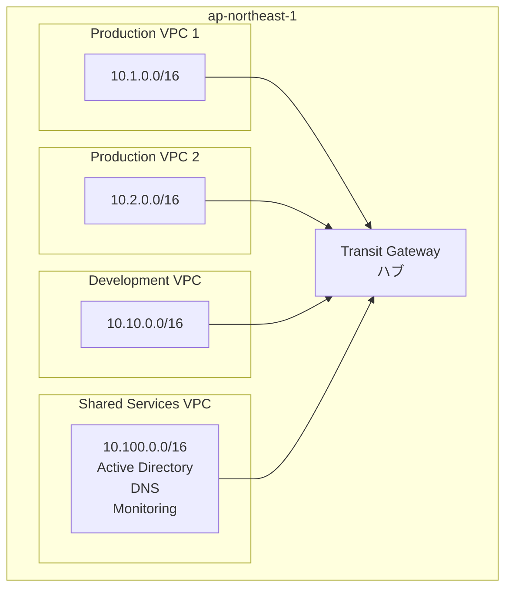

## Transit Gateway ユースケースおよびアーキテクチャパターン

実務で頻出するTransit Gatewayのアーキテクチャパターンを解説します。

### 1. マルチVPC接続（ハブアンドスポーク）



```yaml
構成:
  Transit Gateway:
    - 中央ハブ
    - 全VPC接続
  
  ルートテーブル:
    本番環境RT:
      - Prod1, Prod2 関連付け
      - Shared Services へのルート
      - 相互通信可能
    
    開発環境RT:
      - Dev 関連付け
      - Shared Services へのルート
      - 本番環境へのアクセス不可
    
    共有サービスRT:
      - Shared Services 関連付け
      - 全環境へのルート

メリット:
  - 環境分離: ルートテーブルで制御
  - 共有サービス利用: AD, DNS, 監視ツール
  - スケーラビリティ: VPC追加が容易
  - 管理簡素化: 中央集約管理

料金例 (4 VPC, 月間1TB):
  - アタッチメント: $0.05 × 4 × 24 × 30 = $144
  - データ処理: 1,000GB × $0.02 = $20
  - 合計: $164/月
```

### 2. ハイブリッドクラウド（オンプレミス統合）

```yaml
構成:
  AWS側:
    Transit Gateway:
      - 複数VPC接続
      - Direct Connect Gateway接続
      - VPN接続（バックアップ）
    
    VPC:
      - 本番VPC (10.0.0.0/16)
      - 開発VPC (10.10.0.0/16)
      - 共有サービスVPC (10.100.0.0/16)
  
  オンプレミス側:
    - データセンター (172.16.0.0/16)
    - Direct Connect (プライマリ)
    - Site-to-Site VPN (バックアップ)

接続:
  プライマリ:
    - Direct Connect (1Gbps または 10Gbps)
    - Transit Gateway経由で全VPC接続
    - 低レイテンシー、安定した帯域
  
  バックアップ:
    - Site-to-Site VPN
    - Direct Connect障害時に自動切り替え
    - ECMP使用で負荷分散

ルーティング:
  BGP設定:
    - AS_PATH prepending (優先度制御)
    - Direct Connect: AS_PATH短い（優先）
    - VPN: AS_PATH長い（バックアップ）
  
  フェイルオーバー:
    - Direct Connect障害時
    - 自動的にVPNへ切り替え
    - RPO: ほぼ0秒
    - RTO: 数十秒

使用例:
  - データベースレプリケーション
  - Active Directory統合
  - ファイルサーバー統合
  - バックアップデータ転送
```

### 3. マルチリージョン構成

```yaml
構成:
  プライマリリージョン (ap-northeast-1):
    Transit Gateway 1:
      - 本番VPC (3個)
      - 開発VPC (2個)
      - Direct Connect
      - VPN
  
  セカンダリリージョン (us-east-1):
    Transit Gateway 2:
      - DR用VPC (3個)
      - 開発VPC (1個)
      - Direct Connect
  
  接続:
    - Transit Gateway Peering
    - クロスリージョン通信

ルートテーブル設定:
  ap-northeast-1:
    本番RT:
      - ローカルVPC: 10.1.0.0/16, 10.2.0.0/16
      - us-east-1 VPC: 192.168.0.0/16 → TGW Peering
      - オンプレミス: 172.16.0.0/16 → Direct Connect
    
    開発RT:
      - ローカルVPC: 10.10.0.0/16
      - 共有サービス: 10.100.0.0/16
  
  us-east-1:
    DR RT:
      - ローカルVPC: 192.168.0.0/16
      - ap-northeast-1 VPC: 10.0.0.0/8 → TGW Peering
      - オンプレミス: 172.16.0.0/16 → Direct Connect

DRシナリオ:
  平常時:
    - データレプリケーション (DB, S3)
    - 設定同期
    - モニタリング
  
  障害時:
    - Route 53でフェイルオーバー
    - us-east-1へトラフィック切り替え
    - RTO: 5分
    - RPO: 1分

料金例 (両リージョン計8 VPC, Peering, 月間500GB):
  - アタッチメント: $0.05 × 10 × 24 × 30 = $360
  - データ処理: 500GB × $0.02 × 2 = $20
  - クロスリージョン: 500GB × $0.02 = $10
  - 合計: $390/月
```

### 4. マルチアカウント戦略（AWS Organizations）

```yaml
アカウント構成:
  Network Account:
    - Transit Gateway所有
    - Direct Connect
    - Route 53 Resolver
    - 共有サービス
  
  Production Accounts (事業部ごと):
    - 事業部A VPC
    - 事業部B VPC
    - 事業部C VPC
  
  Development Accounts:
    - 開発チームA VPC
    - 開発チームB VPC
  
  Security Account:
    - セキュリティツール
    - ログ集約
    - 監視

共有:
  AWS Resource Access Manager (RAM):
    - Transit Gateway共有
    - 各アカウントからアタッチメント作成可能
    - 中央管理維持

ルーティング制御:
  本番環境:
    - 事業部間通信可能
    - 共有サービスアクセス可能
    - オンプレミスアクセス可能
    - 開発環境へのアクセス不可
  
  開発環境:
    - 共有サービスアクセス可能
    - 開発環境間通信可能
    - 本番環境への制限付きアクセス
  
  セキュリティ:
    - 全環境へのアクセス可能
    - ログ収集
    - 監視

メリット:
  - アカウント分離: セキュリティ向上
  - 一元管理: Network Accountで管理
  - コスト配分: アカウントごとに課金分離
  - スケーラビリティ: 容易なアカウント追加
```

### 5. セグメンテーション（環境分離）

```yaml
ユースケース:
  - PCI DSS準拠環境
  - 本番/開発/ステージング分離
  - テナント分離（マルチテナントSaaS）

構成:
  Transit Gateway:
    - 単一Transit Gateway
    - 複数ルートテーブル
  
  ルートテーブル:
    PCI DSS RT:
      - カード情報処理VPC
      - 限定的なルート
      - 厳格なアクセス制御
    
    Production RT:
      - 一般本番VPC
      - 相互通信可能
      - オンプレミス接続
    
    Development RT:
      - 開発VPC
      - テスト環境
      - 本番へのアクセス不可
    
    Shared Services RT:
      - Active Directory
      - DNS
      - 監視ツール
      - 全環境からアクセス可能

セキュリティ:
  ネットワークレベル:
    - ルートテーブル分離
    - Transit Gateway Network ACL
    - VPC Security Group
  
  アプリケーションレベル:
    - IAMロール
    - リソースポリシー
    - 暗号化

コンプライアンス:
  - ネットワーク分離証明
  - アクセスログ
  - 監査証跡
```

### 6. 集中型セキュリティ（Egress VPC）

```yaml
構成:
  Egress VPC (セキュリティVPC):
    - インターネットゲートウェイ
    - NAT Gateway
    - ファイアウォール (AWS Network Firewall)
    - IDS/IPS
    - プロキシサーバー
  
  ワークロードVPC:
    - インターネットゲートウェイなし
    - Transit Gateway経由でEgress VPCへ
  
  Transit Gateway:
    - 全VPC接続
    - デフォルトルート (0.0.0.0/0) → Egress VPC

トラフィックフロー:
  インターネット向け:
    ワークロードVPC
    → Transit Gateway
    → Egress VPC
    → Network Firewall
    → NAT Gateway
    → インターネット
  
  検査内容:
    - マルウェアスキャン
    - URLフィルタリング
    - IDS/IPS
    - ログ記録

ルートテーブル:
  ワークロードVPC:
    - 0.0.0.0/0 → Transit Gateway
    - 他VPC CIDR → Transit Gateway
  
  Egress VPC:
    - インターネット向け → NAT Gateway
    - 内部トラフィック → Transit Gateway
  
  Transit Gateway RT (ワークロード用):
    - 0.0.0.0/0 → Egress VPC
    - 内部CIDR → 各VPC
  
  Transit Gateway RT (Egress用):
    - 各VPC CIDR → 各VPC

メリット:
  - 集中管理: セキュリティポリシー一元化
  - コスト削減: NAT Gateway/Firewallの共有
  - 可視性: 全トラフィック監視
  - コンプライアンス: 統一的なセキュリティ

料金例 (5 VPC + Egress VPC, 月間2TB):
  - アタッチメント: $0.05 × 6 × 24 × 30 = $216
  - データ処理: 2,000GB × $0.02 = $40
  - Network Firewall: 約$365/月
  - NAT Gateway: 約$77/月
  - 合計: 約$698/月
```

### 7. SD-WAN統合

```yaml
構成:
  AWS側:
    Transit Gateway:
      - VPC接続
      - SD-WAN Appliance接続
    
    SD-WAN VPC:
      - EC2ベースSD-WANアプライアンス
      - 複数ベンダー対応 (Cisco, VMware, etc.)
  
  ブランチオフィス:
    - SD-WANエッジデバイス
    - インターネット経由でAWS接続
    - 複数回線使用（冗長化）

メリット:
  - 柔軟な接続: インターネット経由で容易に接続
  - コスト削減: Direct Connectより安価
  - 帯域最適化: アプリケーション優先度制御
  - 冗長性: 複数回線自動切り替え

使用例:
  - 小規模ブランチオフィス接続
  - リモートサイト接続
  - M&A後の迅速な統合
  - Direct Connectバックアップ
```

### 8. マイクロサービス環境

```yaml
構成:
  Transit Gateway:
    - 複数のマイクロサービスVPC接続
  
  VPC分離:
    認証サービスVPC:
      - Cognito
      - API Gateway
    
    ビジネスロジックVPC:
      - ECS/EKS
      - Lambda
    
    データレイヤーVPC:
      - RDS
      - ElastiCache
      - Aurora
    
    共有サービスVPC:
      - Monitoring
      - Logging
      - Service Mesh Control Plane

ルーティング:
  API Gateway VPC:
    - 外部からのアクセス受付
    - 認証後、ビジネスロジックVPCへ
  
  ビジネスロジックVPC:
    - データレイヤーVPCへアクセス
    - 他マイクロサービスとの通信
  
  データレイヤーVPC:
    - プライベートサブネットのみ
    - ビジネスロジックVPCからのみアクセス

セキュリティ:
  - ネットワーク分離
  - 最小権限の原則
  - サービス間通信制御
  - 障害分離
```

### 9. グローバルネットワーク

```yaml
構成:
  リージョン:
    - ap-northeast-1 (東京)
    - us-east-1 (バージニア)
    - eu-west-1 (アイルランド)
    - ap-southeast-1 (シンガポール)
  
  各リージョン:
    - Transit Gateway
    - 複数VPC
    - Direct Connect
  
  リージョン間:
    - Transit Gateway Peering
    - フルメッシュまたはハブアンドスポーク

グローバルルーティング:
  ハブリージョン (東京):
    - すべてのリージョンとPeering
    - オンプレミスへの集約ポイント
  
  スポークリージョン:
    - 東京とPeering
    - 他リージョンへは東京経由

メリット:
  - グローバル展開
  - 低レイテンシー (リージョン間)
  - DR対応
  - データ主権対応

Network Manager:
  - グローバルネットワーク可視化
  - パフォーマンス監視
  - イベント管理
  - トラブルシューティング

料金考慮:
  - クロスリージョンデータ転送料
  - 各リージョンのアタッチメント料金
  - Peering Attachment料金
```

### 10. 段階的移行パターン

```yaml
フェーズ1: 準備
  - Transit Gateway作成
  - 共有サービスVPC接続
  - テスト環境での検証

フェーズ2: 開発環境移行
  - 開発VPC接続
  - VPC Peeringと並行運用
  - ルーティング確認

フェーズ3: 本番環境移行
  ステップバイステップ:
    1. VPC追加接続
    2. ルートテーブル設定
    3. トラフィック監視
    4. VPC Peering削除

フェーズ4: オンプレミス統合
  - Direct Connect追加
  - VPN追加（バックアップ）
  - 既存VGW削除

フェーズ5: 最適化
  - ルートテーブル統合
  - コスト最適化
  - セキュリティ強化

ロールバック計画:
  - VPC Peering維持（初期段階）
  - 迅速な切り戻し手順
  - トラフィック監視
```

### まとめ

**Transit Gatewayアーキテクチャ設計のポイント:**

1. **スケール**: 3個以上のVPC接続で効果的
2. **環境分離**: ルートテーブルで制御
3. **ハイブリッド**: オンプレミス統合に最適
4. **グローバル**: クロスリージョンPeeringで世界展開
5. **セキュリティ**: 集中型セキュリティアーキテクチャ
6. **段階的移行**: リスクを最小化した移行

適切なTransit Gateway設計により、スケーラブルで管理しやすいグローバルネットワークを構築できます。
