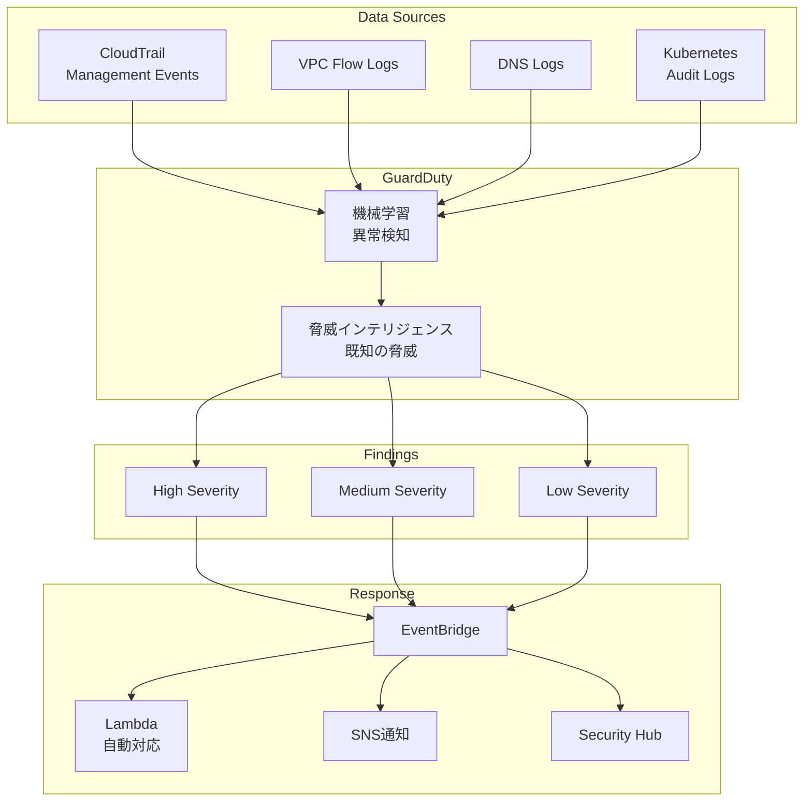

## AWS GuardDuty とは？


**ポケモンで例えると**: AWSを理解することは、新しい「わざ」を覚えるようなもの——使いこなせば、より強力な開発者になれます。

GuardDutyは、AWSアカウントとワークロードを保護するインテリジェント脅威検知サービスです。

### 主要機能

#### 1. 脅威検知

```yaml
検知対象:
  - 不正なAPI呼び出し
  - 異常なネットワークトラフィック
  - 侵害されたインスタンス
  - 不審なログインパターン
  - 暗号通貨マイニング
  - データ窃取の兆候
```

#### 2. データソース

```yaml
自動分析:
  - CloudTrail イベントログ
  - VPC Flow Logs
  - DNS クエリログ
  - Kubernetes 監査ログ
  - S3 データイベント（オプション）
  - EKS 監査ログ（オプション）
  - Lambda ネットワーク（オプション）
  - RDS ログインアクティビティ（オプション）
```

#### 3. 検出種類

```yaml
カテゴリ:
  Recon（偵察）:
    - ポートスキャン
    - ネットワーク偵察
  
  InstanceCompromise（侵害）:
    - マルウェア
    - 暗号通貨マイニング
    - データ窃取
  
  UnauthorizedAccess（不正アクセス）:
    - 異常なAPI呼び出し
    - 不審なログイン
  
  Impact（影響）:
    - DDoS攻撃
    - リソース乗っ取り
```

### アーキテクチャ



### Finding（検出結果）

```yaml
重要度:
  - High（8.0-10.0）: 即座の対応必要
  - Medium（4.0-7.9）: 調査推奨
  - Low（0.1-3.9）: 情報提供

情報:
  - 検出種類
  - リソース情報
  - アクション詳細
  - 重要度
  - タイムスタンプ
  - 推奨アクション
```

### 自動対応

```yaml
EventBridge統合:
  - Finding検出時トリガー
  - Lambda関数起動
  - 自動修復

対応例:
  - セキュリティグループ変更
  - インスタンス隔離
  - IAMロール無効化
  - SNS通知
  - Slack通知
```

### 料金

#### ログ分析料金

| ログソース | 価格 | 備考 |
|---|---|---|
| **CloudTrail分析** | $4.00 / 100万イベント | API呼び出しログ |
| **VPC Flow Logs分析** | $1.00 / GB | ネットワークトラフィック |
| **DNS Logs分析** | $0.40 / 100万クエリ | DNSクエリログ |
| **Kubernetes監査ログ** | $4.00 / 100万イベント | EKS監査ログ |

**30日間無料トライアル**

**料金計算例（月間CloudTrail 1億イベント、VPC Flow Logs 100GB、DNS 1億クエリ）:**

| 項目 | 計算 | 料金 |
|---|---|---|
| CloudTrail | (100 / 100万) × $4.00 | $0.40 |
| VPC Flow Logs | 100GB × $1.00 | $100.00 |
| DNS Logs | (100 / 100万) × $0.40 | $0.04 |
| **合計** | - | **$100.44/月** |

**コスト最適化のポイント:**
- 不要なログソースの無効化
- S3へのログエクスポートでコスト削減
- 重要なアカウント・リージョンのみ有効化

### ベストプラクティス

```yaml
有効化:
  - 全リージョンで有効化
  - 組織全体で自動有効化
  - オプション機能検討

対応:
  - EventBridge自動対応
  - SNS通知設定
  - 定期的な確認

統合:
  - Security Hub連携
  - Detective連携
  - 他セキュリティツール
```

## まとめ

**GuardDutyの重要ポイント:**
- 自動脅威検知
- 機械学習ベース
- 複数データソース分析
- 即座の通知
- 自動対応可能
- 30日間無料トライアル
