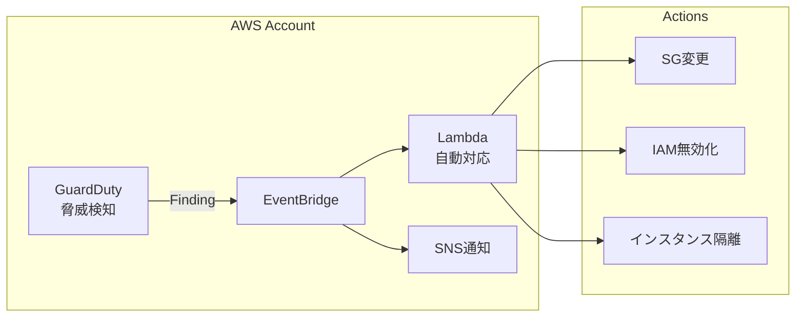

## ユースケース

### 1. セキュリティ監視

```yaml
シナリオ:
  - 不正アクセス検知
  - 異常なアクティビティ監視
  - 自動対応

実装:
  - GuardDuty有効化
  - EventBridge統合
  - Lambda自動対応
```

## アーキテクチャパターン



### 設計ポイント

```yaml
検知:
  - 全リージョン有効化
  - オプション機能有効化
  - 組織全体で管理

対応:
  - 重要度別アクション
  - 自動隔離
  - 通知エスカレーション
```

## まとめ

**アーキテクチャ設計のポイント:**
- 全リージョン有効化
- EventBridge自動対応
- Security Hub統合
- 定期的なFinding確認
