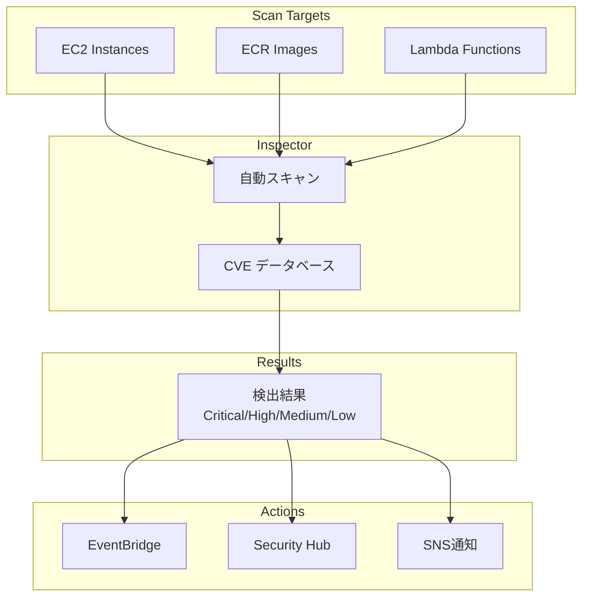

## Amazon Inspector とは？


**ポケモンで例えると**: AWSを理解することは、新しい「わざ」を覚えるようなもの——使いこなせば、より強力な開発者になれます。

Inspectorは、EC2インスタンスとコンテナイメージの脆弱性を自動スキャンするサービスです。

### 主要機能

```yaml
スキャン対象:
  - EC2インスタンス
  - ECRコンテナイメージ
  - Lambda関数

検出内容:
  - ソフトウェア脆弱性（CVE）
  - ネットワーク到達性
  - パッケージ脆弱性
```

### アーキテクチャ



### 検出結果

```yaml
重要度:
  - Critical
  - High
  - Medium
  - Low
  - Informational

情報:
  - CVE ID
  - CVSS スコア
  - 影響範囲
  - 修正方法
```

### 料金

#### スキャン料金

| スキャン対象 | 価格 | 備考 |
|---|---|---|
| **EC2スキャン** | $1.25 / インスタンス / 月 | 脆弱性・ネットワークスキャン |
| **ECRスキャン（初回）** | 無料 | イメージごとの最初のスキャン |
| **ECRスキャン（再スキャン）** | $0.09 / イメージ | 継続的スキャン |
| **Lambda** | $0.30 / 関数 / 月 | 関数コードスキャン |

**料金計算例（EC2 50インスタンス、ECR 100イメージ、Lambda 30関数）:**

| 項目 | 計算 | 料金 |
|---|---|---|
| EC2 | 50 × $1.25 | $62.50 |
| ECR初回 | 100 × $0（無料） | $0.00 |
| ECR再スキャン | 100 × $0.09 | $9.00 |
| Lambda | 30 × $0.30 | $9.00 |
| **合計** | - | **$80.50/月** |

**コスト最適化のポイント:**
- 開発環境は除外
- 不要なイメージの削除
- スキャン頻度の調整

## まとめ

**Inspectorの重要ポイント:**
- 自動脆弱性スキャン
- EC2/ECR/Lambda対応
- CVE検出
- 継続的監視
