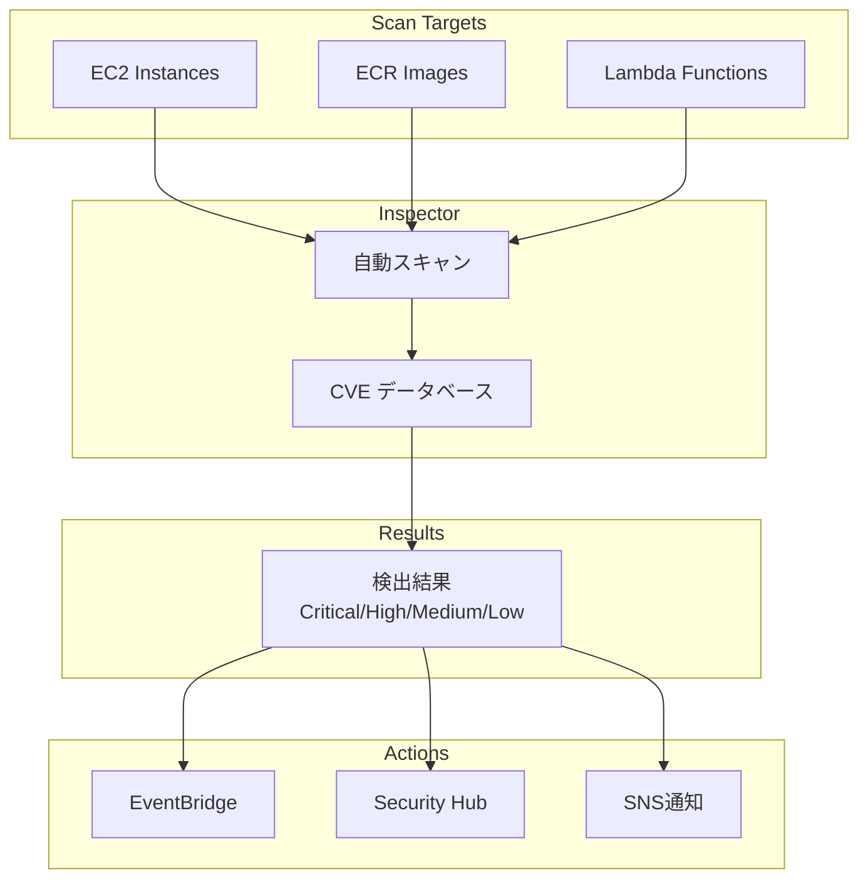

## Amazon Inspector とは？

Inspectorは、EC2インスタンスとコンテナイメージの脆弱性を自動スキャンするサービスです。

### 主要機能

```yaml
スキャン対象:
  - EC2インスタンス
  - ECRコンテナイメージ
  - Lambda関数

検出内容:
  - ソフトウェア脆弱性（CVE）
  - ネットワーク到達性
  - パッケージ脆弱性
```

### アーキテクチャ



### 検出結果

```yaml
重要度:
  - Critical
  - High
  - Medium
  - Low
  - Informational

情報:
  - CVE ID
  - CVSS スコア
  - 影響範囲
  - 修正方法
```

### 料金

```yaml
EC2スキャン:
  - $1.25 / インスタンス / 月

ECRスキャン:
  - 最初のスキャン: 無料
  - 再スキャン: $0.09 / イメージ

Lambda:
  - $0.30 / 関数 / 月
```

## まとめ

**Inspectorの重要ポイント:**
- 自動脆弱性スキャン
- EC2/ECR/Lambda対応
- CVE検出
- 継続的監視
