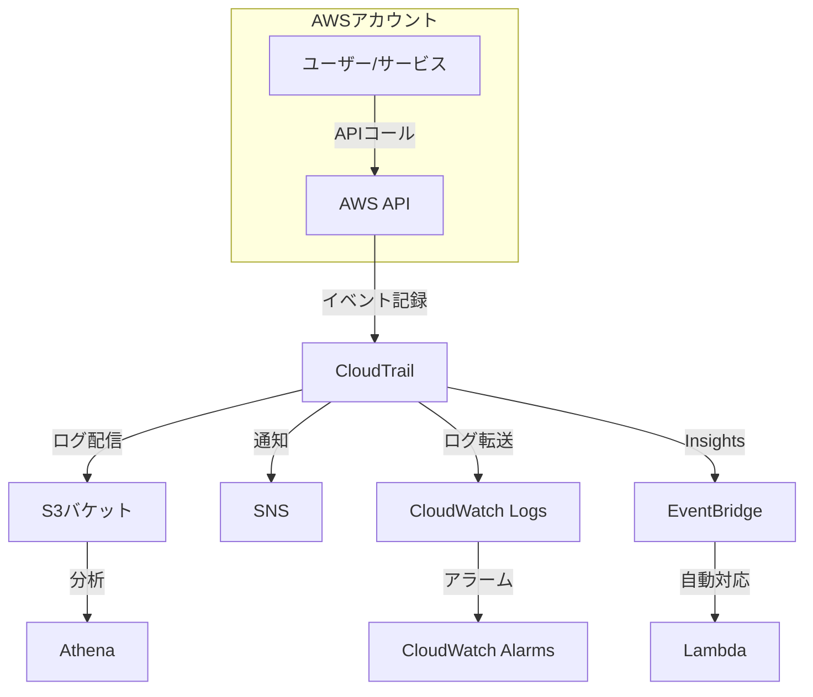

## CloudTrailとは？

AWS CloudTrail（クラウドトレイル）は、AWSアカウント内のAPIコールを記録・監視するサービスです。セキュリティ分析、リソース変更追跡、コンプライアンス監査、運用トラブルシューティングに使用されます。

## 主要機能

### 1. イベント履歴
- **管理イベント**: リソースの作成・削除・変更
- **データイベント**: S3オブジェクトやLambda関数の実行
- **Insightイベント**: 異常なAPI活動の検出
- **90日間の無料保存**: イベント履歴として自動保存

### 2. トレイル
- **証跡の作成**: S3バケットにログを長期保存
- **マルチリージョン対応**: 全リージョンのイベントを記録
- **組織トレイル**: AWS Organizations全体を監視
- **ログファイル暗号化**: KMSで自動暗号化

### 3. CloudTrail Insights
- **異常検知**: 通常と異なるAPI活動を自動検出
- **機械学習ベース**: ベースラインを確立して異常を特定
- **アラート**: 異常検知時に通知

### 4. ログファイル検証
- **整合性検証**: ログファイルの改ざん検出
- **ダイジェストファイル**: 定期的にハッシュを生成
- **監査証跡**: コンプライアンス要件に対応

## アーキテクチャ



## イベントタイプ

### 管理イベント
```json
{
  "eventVersion": "1.08",
  "userIdentity": {
    "type": "IAMUser",
    "principalId": "AIDAJ45Q7YFFAREXAMPLE",
    "arn": "arn:aws:iam::123456789012:user/Alice",
    "accountId": "123456789012",
    "userName": "Alice"
  },
  "eventTime": "2024-01-15T12:30:45Z",
  "eventSource": "ec2.amazonaws.com",
  "eventName": "RunInstances",
  "awsRegion": "us-east-1",
  "sourceIPAddress": "203.0.113.12",
  "userAgent": "aws-cli/2.13.0",
  "requestParameters": {
    "instanceType": "t3.micro",
    "imageId": "ami-0abcdef1234567890"
  },
  "responseElements": {
    "instancesSet": {
      "items": [
        {
          "instanceId": "i-1234567890abcdef0"
        }
      ]
    }
  }
}
```

### データイベント
```json
{
  "eventVersion": "1.08",
  "eventTime": "2024-01-15T12:35:20Z",
  "eventSource": "s3.amazonaws.com",
  "eventName": "GetObject",
  "awsRegion": "us-east-1",
  "requestParameters": {
    "bucketName": "my-secure-bucket",
    "key": "sensitive-data.csv"
  },
  "resources": [
    {
      "type": "AWS::S3::Object",
      "ARN": "arn:aws:s3:::my-secure-bucket/sensitive-data.csv"
    }
  ]
}
```

## 料金体系

### 無料枠
- **イベント履歴**: 90日間無料
- **管理イベント**: 最初の1つのトレイルは無料
- **データイベントのコピー**: 最初の1つのトレイルは無料

### 有料オプション

| サービス | 料金 |
|---------|------|
| 追加トレイル | $2.00 / 100,000イベント（管理イベント） |
| データイベント | $0.10 / 100,000イベント |
| CloudTrail Insights | $0.35 / 100,000書き込みイベント |
| CloudWatch Logs配信 | CloudWatch Logsの標準料金 |
| S3ストレージ | S3の標準料金 |

### コスト最適化のヒント
- **イベントフィルタリング**: 不要なイベントを除外
- **S3ライフサイクル**: 古いログをGlacierに移動
- **Athenaでの分析**: 必要な時だけクエリ実行
- **CloudWatch Logs統合**: 重要なイベントのみ転送

## セキュリティ機能

### 1. ログファイル暗号化
```bash
# KMSキーでの暗号化
aws cloudtrail create-trail \
  --name my-secure-trail \
  --s3-bucket-name my-trail-bucket \
  --kms-key-id arn:aws:kms:us-east-1:123456789012:key/12345678-1234-1234-1234-123456789012
```

### 2. ログファイル検証
```bash
# ログファイル検証の有効化
aws cloudtrail update-trail \
  --name my-trail \
  --enable-log-file-validation
```

### 3. MFA削除保護
```bash
# S3バケットにMFA削除を設定
aws s3api put-bucket-versioning \
  --bucket my-trail-bucket \
  --versioning-configuration Status=Enabled,MFADelete=Enabled \
  --mfa "arn:aws:iam::123456789012:mfa/user serial-number"
```

## CloudTrail Lake

### 概要
- **イベントデータストア**: SQL-likeなクエリで分析
- **7年間の保存**: 長期保管が可能
- **高速クエリ**: S3 + Athenaより高速
- **統合ビュー**: 複数アカウント・リージョンを統合

### 料金
| 項目 | 料金 |
|------|------|
| データ取り込み | $2.50 / GB |
| データストレージ | $0.023 / GB/月（7年保存） |
| クエリ実行 | $0.005 / GBスキャン |

### クエリ例
```sql
-- セキュリティグループの変更を検索
SELECT
  userIdentity.userName,
  eventTime,
  eventName,
  requestParameters
FROM cloudtrail_events
WHERE
  eventSource = 'ec2.amazonaws.com'
  AND eventName LIKE 'AuthorizeSecurityGroup%'
  AND eventTime > '2024-01-01'
ORDER BY eventTime DESC
```

## ベストプラクティス

### 1. トレイル設計
- すべてのリージョンで有効化
- 組織トレイルで全アカウントを監視
- 読み取り専用イベントも記録

### 2. ログ保護
- S3バケットポリシーで保護
- MFA削除を有効化
- バージョニングを有効化
- ログファイル検証を有効化

### 3. モニタリング
- CloudWatch Logsと統合
- 重要なイベントをアラーム化
- EventBridgeで自動対応

### 4. コスト管理
- 不要なデータイベントを除外
- S3ライフサイクルで古いログをアーカイブ
- CloudTrail Lakeを選択的に使用

## 統合サービス

### 1. CloudWatch Logs
```bash
# CloudWatch Logsへの配信設定
aws cloudtrail update-trail \
  --name my-trail \
  --cloud-watch-logs-log-group-arn arn:aws:logs:us-east-1:123456789012:log-group:CloudTrail/logs \
  --cloud-watch-logs-role-arn arn:aws:iam::123456789012:role/CloudTrailRole
```

### 2. EventBridge
```json
{
  "source": ["aws.cloudtrail"],
  "detail-type": ["AWS API Call via CloudTrail"],
  "detail": {
    "eventName": ["RunInstances", "TerminateInstances"]
  }
}
```

### 3. Athena
```sql
-- CloudTrailログテーブル作成
CREATE EXTERNAL TABLE cloudtrail_logs (
  eventversion STRING,
  useridentity STRUCT<
    type:STRING,
    principalid:STRING,
    arn:STRING,
    accountid:STRING,
    username:STRING
  >,
  eventtime STRING,
  eventsource STRING,
  eventname STRING,
  awsregion STRING,
  sourceipaddress STRING,
  useragent STRING
)
PARTITIONED BY (region STRING, year STRING, month STRING, day STRING)
ROW FORMAT SERDE 'com.amazon.emr.hive.serde.CloudTrailSerde'
STORED AS INPUTFORMAT 'com.amazon.emr.cloudtrail.CloudTrailInputFormat'
OUTPUTFORMAT 'org.apache.hadoop.hive.ql.io.HiveIgnoreKeyTextOutputFormat'
LOCATION 's3://my-trail-bucket/AWSLogs/123456789012/CloudTrail/';
```

## まとめ

CloudTrailは、AWSアカウントのガバナンス、コンプライアンス、運用監査、リスク監査を可能にする重要なサービスです。

**主な利点**
- セキュリティ分析とインシデント調査
- リソース変更の追跡
- コンプライアンス監査証跡
- 運用トラブルシューティング

**重要なポイント**
- すべてのリージョンで有効化
- ログファイルの整合性検証を有効化
- CloudWatch LogsとEventBridgeで自動対応
- 組織トレイルで全アカウントを監視
