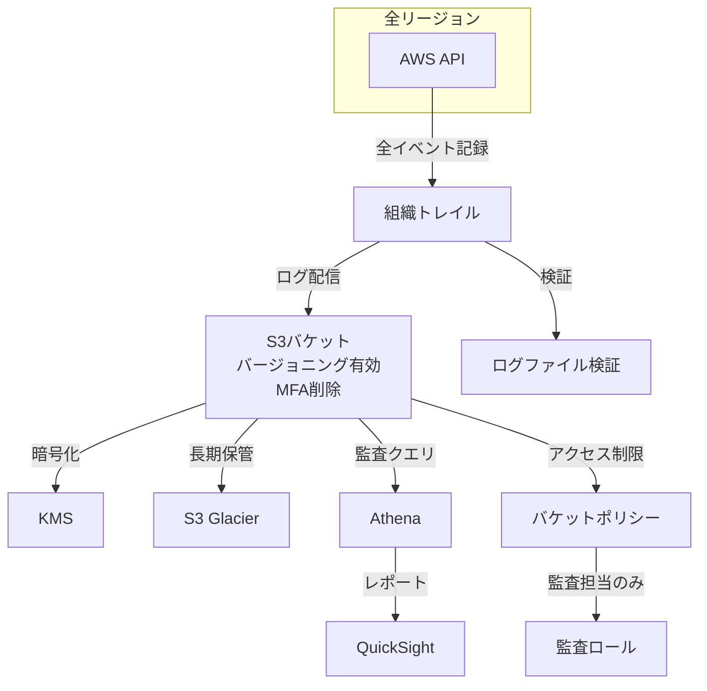
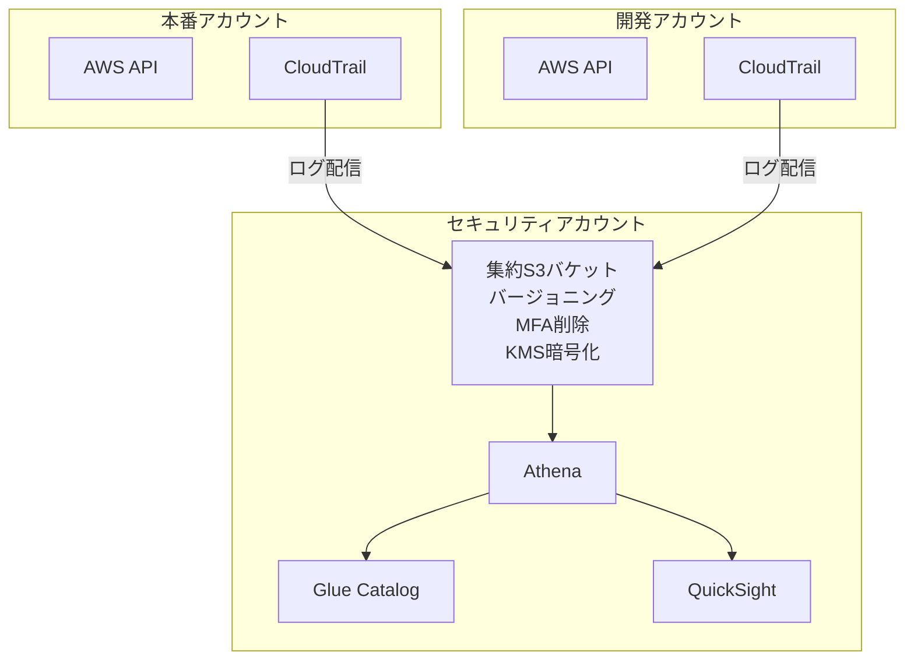
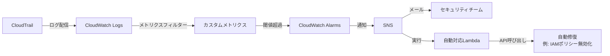
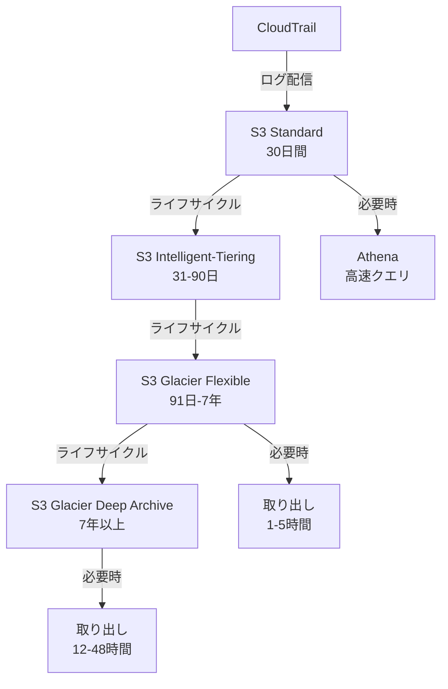
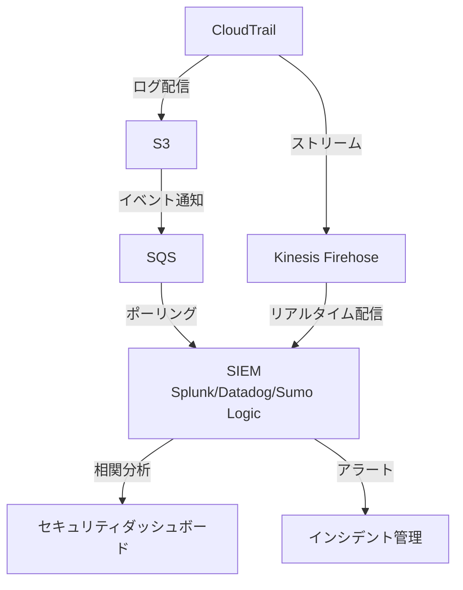
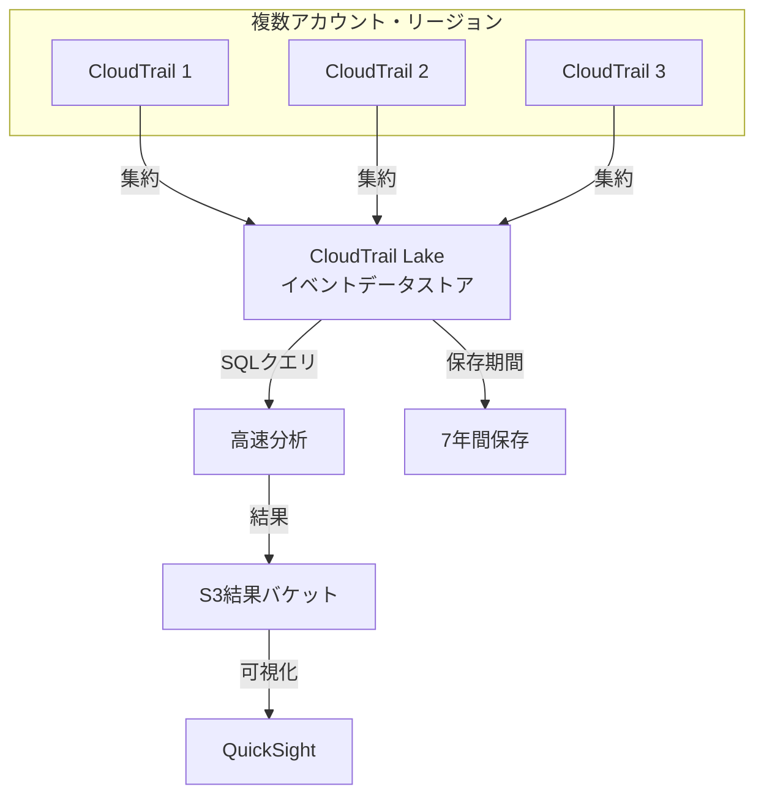

## ユースケース

### 1. セキュリティインシデント調査

**シナリオ**: 不正アクセスの可能性があるため、特定ユーザーの行動を追跡する必要があります。

**実装**
```bash
# 特定ユーザーのイベントを検索
aws cloudtrail lookup-events \
  --lookup-attributes AttributeKey=Username,AttributeValue=suspicious-user \
  --start-time 2024-01-01T00:00:00Z \
  --end-time 2024-01-15T23:59:59Z \
  --max-results 50
```

**CloudTrail Lakeでの分析**
```sql
-- 疑わしいIPアドレスからのアクティビティを検索
SELECT
  eventTime,
  eventName,
  userIdentity.userName,
  sourceIPAddress,
  requestParameters,
  responseElements
FROM cloudtrail_events
WHERE
  sourceIPAddress = '203.0.113.100'
  AND eventTime BETWEEN '2024-01-01' AND '2024-01-15'
ORDER BY eventTime DESC
LIMIT 100;
```

### 2. コンプライアンス監査

**シナリオ**: PCI DSS、HIPAA、SOC 2などのコンプライアンス要件を満たすため、監査証跡が必要です。

**アーキテクチャ**


**設定例**
```bash
# 組織トレイルの作成
aws cloudtrail create-trail \
  --name organization-compliance-trail \
  --s3-bucket-name compliance-logs-bucket \
  --is-organization-trail \
  --enable-log-file-validation \
  --kms-key-id arn:aws:kms:us-east-1:123456789012:key/compliance-key \
  --is-multi-region-trail

# トレイルの開始
aws cloudtrail start-logging --name organization-compliance-trail
```

### 3. リソース変更追跡

**シナリオ**: 本番環境で予期しない変更が発生し、誰がいつ何を変更したか特定する必要があります。

**CloudWatch Logsフィルターパターン**
```json
{
  "eventName": ["DeleteBucket", "DeleteDBInstance", "TerminateInstances"],
  "eventSource": ["s3.amazonaws.com", "rds.amazonaws.com", "ec2.amazonaws.com"]
}
```

**EventBridgeルールでアラート**
```json
{
  "source": ["aws.cloudtrail"],
  "detail-type": ["AWS API Call via CloudTrail"],
  "detail": {
    "eventName": [
      "DeleteBucket",
      "DeleteDBInstance",
      "TerminateInstances"
    ]
  }
}
```

**Lambda関数で通知**
```python
import json
import boto3

sns = boto3.client('sns')

def lambda_handler(event, context):
    detail = event['detail']
    
    message = f"""
    ⚠️ 本番環境で重要な削除操作が実行されました
    
    操作: {detail['eventName']}
    ユーザー: {detail['userIdentity']['userName']}
    時刻: {detail['eventTime']}
    リージョン: {detail['awsRegion']}
    IPアドレス: {detail['sourceIPAddress']}
    
    詳細を確認してください。
    """
    
    sns.publish(
        TopicArn='arn:aws:sns:us-east-1:123456789012:production-alerts',
        Subject='⚠️ 本番環境で重要な操作が実行されました',
        Message=message
    )
    
    return {'statusCode': 200}
```

### 4. 異常なAPI活動の検出

**シナリオ**: CloudTrail Insightsを使用して、通常と異なるAPI活動を自動検出します。

**設定**
```bash
# CloudTrail Insightsの有効化
aws cloudtrail put-insight-selectors \
  --trail-name my-trail \
  --insight-selectors '[{"InsightType":"ApiCallRateInsight"}]'
```

**EventBridgeで自動対応**
```json
{
  "source": ["aws.cloudtrail"],
  "detail-type": ["AWS Insight via CloudTrail"],
  "detail": {
    "insightDetails": {
      "insightType": ["ApiCallRateInsight"]
    }
  }
}
```

### 5. データアクセス監査（S3）

**シナリオ**: 機密データへのアクセスを追跡し、不正なダウンロードを検出します。

**データイベントの記録設定**
```bash
# S3データイベントの記録
aws cloudtrail put-event-selectors \
  --trail-name data-access-trail \
  --event-selectors '[
    {
      "ReadWriteType": "All",
      "IncludeManagementEvents": true,
      "DataResources": [
        {
          "Type": "AWS::S3::Object",
          "Values": [
            "arn:aws:s3:::sensitive-data-bucket/*"
          ]
        }
      ]
    }
  ]'
```

**Athenaクエリで分析**
```sql
-- 特定バケットへのアクセスを分析
SELECT
  eventTime,
  userIdentity.userName,
  eventName,
  requestParameters.bucketName,
  requestParameters.key,
  sourceIPAddress
FROM cloudtrail_logs
WHERE
  eventsource = 's3.amazonaws.com'
  AND requestParameters.bucketName = 'sensitive-data-bucket'
  AND eventname IN ('GetObject', 'DeleteObject', 'PutObject')
  AND year = '2024'
  AND month = '01'
ORDER BY eventtime DESC
LIMIT 100;
```

## アーキテクチャパターン

### パターン1: マルチアカウント監査基盤



**実装**
```bash
# セキュリティアカウントでS3バケット作成
aws s3 mb s3://organization-cloudtrail-logs --region us-east-1

# バケットポリシー設定
cat > bucket-policy.json << 'EOF'
{
  "Version": "2012-10-17",
  "Statement": [
    {
      "Sid": "AWSCloudTrailAclCheck",
      "Effect": "Allow",
      "Principal": {
        "Service": "cloudtrail.amazonaws.com"
      },
      "Action": "s3:GetBucketAcl",
      "Resource": "arn:aws:s3:::organization-cloudtrail-logs"
    },
    {
      "Sid": "AWSCloudTrailWrite",
      "Effect": "Allow",
      "Principal": {
        "Service": "cloudtrail.amazonaws.com"
      },
      "Action": "s3:PutObject",
      "Resource": "arn:aws:s3:::organization-cloudtrail-logs/AWSLogs/*",
      "Condition": {
        "StringEquals": {
          "s3:x-amz-acl": "bucket-owner-full-control"
        }
      }
    }
  ]
}
EOF

aws s3api put-bucket-policy \
  --bucket organization-cloudtrail-logs \
  --policy file://bucket-policy.json
```

### パターン2: リアルタイムセキュリティアラート



**CloudWatch Logsメトリクスフィルター**
```bash
# ルートアカウント使用の検出
aws logs put-metric-filter \
  --log-group-name CloudTrail/logs \
  --filter-name RootAccountUsage \
  --filter-pattern '{ $.userIdentity.type = "Root" && $.userIdentity.invokedBy NOT EXISTS && $.eventType != "AwsServiceEvent" }' \
  --metric-transformations \
    metricName=RootAccountUsageCount,metricNamespace=CloudTrailMetrics,metricValue=1

# アラーム作成
aws cloudwatch put-metric-alarm \
  --alarm-name RootAccountUsageAlarm \
  --alarm-description "Alert when root account is used" \
  --metric-name RootAccountUsageCount \
  --namespace CloudTrailMetrics \
  --statistic Sum \
  --period 300 \
  --threshold 1 \
  --comparison-operator GreaterThanOrEqualToThreshold \
  --evaluation-periods 1 \
  --alarm-actions arn:aws:sns:us-east-1:123456789012:security-alerts
```

### パターン3: 長期監査ログ保管



**S3ライフサイクル設定**
```json
{
  "Rules": [
    {
      "Id": "MoveToIntelligentTiering",
      "Status": "Enabled",
      "Filter": {
        "Prefix": "AWSLogs/"
      },
      "Transitions": [
        {
          "Days": 30,
          "StorageClass": "INTELLIGENT_TIERING"
        },
        {
          "Days": 90,
          "StorageClass": "GLACIER"
        },
        {
          "Days": 2555,
          "StorageClass": "DEEP_ARCHIVE"
        }
      ]
    }
  ]
}
```

### パターン4: SIEM統合



**Kinesis Firehose設定**
```bash
# Firehose配信ストリーム作成
aws firehose create-delivery-stream \
  --delivery-stream-name cloudtrail-to-splunk \
  --delivery-stream-type DirectPut \
  --splunk-destination-configuration '{
    "HECEndpoint": "https://splunk.example.com:8088",
    "HECEndpointType": "Event",
    "HECToken": "YOUR_HEC_TOKEN",
    "S3BackupMode": "AllEvents",
    "S3Configuration": {
      "RoleARN": "arn:aws:iam::123456789012:role/firehose-role",
      "BucketARN": "arn:aws:s3:::cloudtrail-backup"
    }
  }'
```

### パターン5: CloudTrail Lake統合分析



**CloudTrail Lake設定**
```bash
# イベントデータストア作成
aws cloudtrail create-event-data-store \
  --name organization-event-store \
  --retention-period 2555 \
  --multi-region-enabled \
  --organization-enabled \
  --advanced-event-selectors '[
    {
      "Name": "AllManagementEvents",
      "FieldSelectors": [
        {"Field": "eventCategory", "Equals": ["Management"]}
      ]
    }
  ]'

# クエリ実行
aws cloudtrail start-query \
  --query-statement "
    SELECT
      eventName,
      COUNT(*) as eventCount
    FROM
      $EVENT_DATA_STORE_ID
    WHERE
      eventTime > '2024-01-01'
    GROUP BY
      eventName
    ORDER BY
      eventCount DESC
    LIMIT 20
  "
```

## まとめ

CloudTrailは、セキュリティ、コンプライアンス、運用監査の基盤となる重要なサービスです。

**選択ガイド**
- **セキュリティ重視**: CloudWatch Logs + EventBridgeでリアルタイム対応
- **コンプライアンス**: 組織トレイル + S3 Glacier長期保管
- **高度な分析**: CloudTrail Lake + SQL分析
- **SIEM統合**: Kinesis Firehose + 外部SIEM

**ベストプラクティス**
- 全リージョン・全アカウントで有効化
- ログファイル検証を必ず有効化
- S3バケットのセキュリティを厳格に設定
- 重要なイベントをリアルタイムで監視
