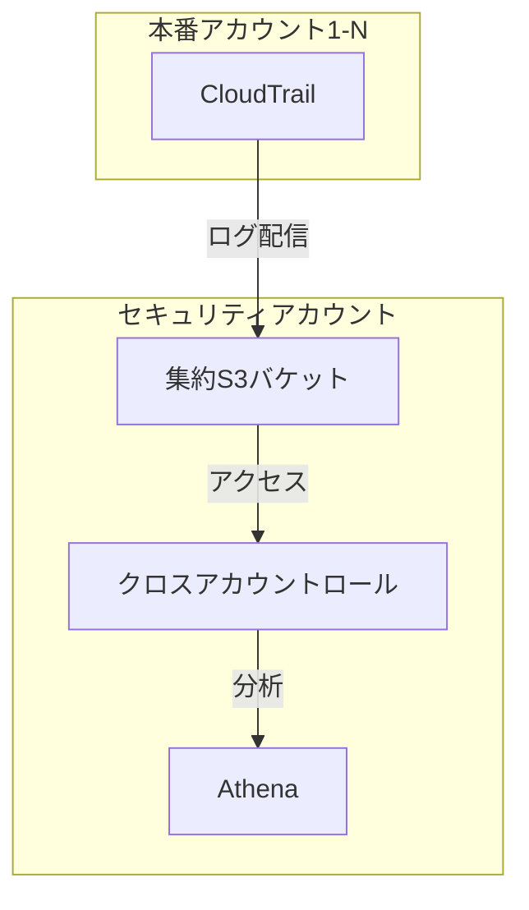

## 試験で問われやすいポイント

### 1. CloudTrailの基本機能

**重要ポイント**
- **90日間のイベント履歴**: 追加設定なしで自動的に記録される
- **トレイル作成**: S3に長期保存するために必要
- **マルチリージョン対応**: すべてのリージョンのイベントを記録可能
- **組織トレイル**: AWS Organizations全体を一括監視

**よくある試験問題**
> **問**: CloudTrailのイベント履歴は何日間保存されますか？
> 
> **答**: **90日間**。それ以上の保存が必要な場合はトレイルを作成してS3に保存する必要があります。

### 2. イベントタイプ

**管理イベント vs データイベント**

| 種類 | 内容 | 例 | デフォルト記録 |
|------|------|-----|---------------|
| **管理イベント** | リソースの作成・削除・変更 | EC2起動、S3バケット作成 | ✅ はい |
| **データイベント** | データの読み書き | S3オブジェクト取得、Lambda実行 | ❌ いいえ（有料） |
| **Insightイベント** | 異常なAPI活動 | 通常の10倍のEC2起動 | ❌ いいえ（有料） |

**試験問題例**
> **問**: S3バケット内のオブジェクトへのアクセスを監査する必要があります。どのように設定しますか？
> 
> **答**: CloudTrailで**データイベント**を有効化し、対象のS3バケットを指定します。管理イベントではオブジェクトレベルのアクセスは記録されません。

### 3. ログの保存先

**S3への配信**
- **デフォルト**: S3バケットにGzip圧縮されたJSON形式で保存
- **命名規則**: `s3://bucket-name/AWSLogs/account-id/CloudTrail/region/YYYY/MM/DD/`
- **暗号化**: KMSでの暗号化をサポート
- **整合性検証**: ダイジェストファイルでログの改ざん検出

**試験頻出**
> **問**: CloudTrailログが改ざんされていないことを証明する必要があります。どの機能を使用しますか？
> 
> **答**: **ログファイル検証（Log File Validation）** を有効化します。これによりダイジェストファイルが生成され、ログの整合性を検証できます。

### 4. CloudWatch Logs統合

**設定方法**
1. CloudWatch Logsロググループを作成
2. CloudTrailにIAMロールを設定
3. トレイル設定でCloudWatch Logsを有効化

**メリット**
- **リアルタイムモニタリング**: メトリクスフィルターでアラート
- **迅速な検索**: CloudWatch Logs Insightsで高速クエリ
- **自動対応**: EventBridgeと連携して自動修復

**試験問題例**
> **問**: ルートアカウントが使用されたときに即座に通知を受け取りたい。最適な方法は？
> 
> **答**: CloudTrailをCloudWatch Logsに統合し、メトリクスフィルターでルートアカウント使用を検出、CloudWatch Alarmsで通知します。

### 5. セキュリティベストプラクティス

#### 試験頻出のベストプラクティス

| ベストプラクティス | 理由 | 試験での重要度 |
|-------------------|------|---------------|
| **全リージョンで有効化** | すべての操作を追跡 | ⭐⭐⭐ |
| **ログファイル検証有効化** | 改ざん検出 | ⭐⭐⭐ |
| **S3バケットのMFA削除** | ログの誤削除防止 | ⭐⭐ |
| **KMS暗号化** | ログの機密性保護 | ⭐⭐ |
| **組織トレイル** | 全アカウント一括監視 | ⭐⭐⭐ |
| **CloudWatch Logs統合** | リアルタイム監視 | ⭐⭐ |

## SAA試験対策

### 頻出シナリオ1: コンプライアンス監査

**問題**
> PCI DSSコンプライアンスのため、すべてのAPI呼び出しを記録し、7年間保存する必要があります。最もコスト効率の良い方法は？

**選択肢**
- A. CloudTrailでトレイルを作成し、S3 Standardに保存
- B. CloudTrailでトレイルを作成し、S3ライフサイクルポリシーでGlacier Deep Archiveに移行
- C. CloudWatch Logsに7年間保存
- D. CloudTrail Lakeで7年間保存

**正解**: **B**

**解説**
- S3 Glacier Deep Archiveが最もコスト効率が良い
- ライフサイクルポリシーで自動移行（例: 30日後にIA、90日後にGlacier、1年後にDeep Archive）
- CloudWatch Logsは高コスト
- CloudTrail Lakeは便利だが、長期保存にはS3 + Glacierの方が安価

### 頻出シナリオ2: セキュリティインシデント調査

**問題**
> 過去6ヶ月間の特定ユーザーのすべての操作を調査する必要があります。CloudTrailのイベント履歴は90日間のみです。どうすればよいですか？

**選択肢**
- A. イベント履歴を使用（90日分のみ）
- B. S3のCloudTrailログをAthenaで分析
- C. CloudWatch Logsで検索
- D. CloudTrail Lakeでクエリ

**正解**: **B**

**解説**
- トレイルを作成していれば、S3に6ヶ月分のログが保存されている
- AthenaでSQLクエリにより柔軟な分析が可能
- CloudTrail Lake（D）も正解だが、事前に設定が必要
- イベント履歴（A）は90日間のみ

### 頻出シナリオ3: マルチアカウント監視

**問題**
> AWS Organizationsで100個のアカウントを管理しています。すべてのアカウントのCloudTrailログを1つのS3バケットに集約したい。最適な方法は？

**選択肢**
- A. 各アカウントで個別にトレイルを作成
- B. 管理アカウントで組織トレイルを作成
- C. CloudTrail Lakeで統合
- D. EventBridgeでログを転送

**正解**: **B**

**解説**
- **組織トレイル**は全アカウントのログを自動的に集約
- 新しいアカウントが追加されても自動的に適用される
- 管理が一元化され、運用が簡素化

### 頻出シナリオ4: リアルタイムセキュリティ対応

**問題**
> セキュリティグループが変更されたときに即座にセキュリティチームに通知し、変更を自動的に元に戻したい。

**選択肢**
- A. CloudTrail → S3 → Lambda
- B. CloudTrail → CloudWatch Logs → CloudWatch Alarms → SNS
- C. CloudTrail → EventBridge → Lambda + SNS
- D. CloudTrail → Kinesis → Lambda

**正解**: **C**

**解説**
- **EventBridge**はリアルタイムでイベントを処理
- Lambdaで自動修復、SNSで通知を同時実行可能
- CloudWatch Logs（B）も可能だが、EventBridgeの方が直接的
- S3経由（A）は遅延が大きい

## SAP試験対策

### 高度なシナリオ1: CloudTrail Lake

**問題**
> 複数リージョン、複数アカウントのCloudTrailログを統合し、SQLで高速に分析したい。7年間保存が必要で、毎日クエリを実行します。最適な方法は？

**選択肢**
- A. S3 + Athena + Glueカタログ
- B. CloudTrail Lake
- C. CloudWatch Logs Insights
- D. OpenSearch Service

**正解**: **B**

**解説**
- **CloudTrail Lake**は統合分析に最適
- SQLクエリが高速（S3 + Athenaより高速）
- 7年保存が可能
- 頻繁なクエリならコストメリットあり
- Athena（A）も可能だが、頻繁なクエリには高コスト

### 高度なシナリオ2: SIEM統合

**問題**
> CloudTrailログをSplunkにリアルタイムで送信し、相関分析を行いたい。

**選択肢**
- A. CloudTrail → S3 → SQS → Splunk
- B. CloudTrail → Kinesis Firehose → Splunk
- C. CloudTrail → CloudWatch Logs → Kinesis Firehose → Splunk
- D. CloudTrail → Lambda → Splunk

**正解**: **C**

**解説**
- CloudTrail → CloudWatch Logs → Kinesis Firehose → Splunk
- CloudWatch Logsサブスクリプションフィルターでストリーム
- Kinesis Firehoseでバッファリング・配信
- リアルタイム性とスケーラビリティを両立

### 高度なシナリオ3: クロスアカウント監査

**問題**
> セキュリティアカウントからすべての本番アカウントのCloudTrailログにアクセスし、分析する必要があります。

**アーキテクチャ**

**実装ポイント**
1. セキュリティアカウントでS3バケット作成
2. バケットポリシーで全アカウントからの書き込みを許可
3. 各本番アカウントでトレイル作成、セキュリティアカウントのS3を指定
4. セキュリティアカウントのIAMロールで分析

## よくある間違い

### 間違い1: データイベントはデフォルトで記録される
**❌ 間違い**: CloudTrailを有効化すればS3オブジェクトアクセスも記録される
**✅ 正解**: データイベントは別途設定が必要で、料金も発生する

### 間違い2: イベント履歴は永続的
**❌ 間違い**: イベント履歴で過去1年分のログを確認できる
**✅ 正解**: イベント履歴は90日間のみ。それ以上はトレイル作成が必要

### 間違い3: CloudTrailは特定サービスのみ対応
**❌ 間違い**: CloudTrailはEC2とS3のみサポートしている
**✅ 正解**: ほぼすべてのAWSサービスのAPI呼び出しを記録可能

### 間違い4: リージョンごとに設定が必要
**❌ 間違い**: 各リージョンで個別にCloudTrailを有効化する必要がある
**✅ 正解**: マルチリージョントレイルで全リージョンを一括設定可能

## 重要な用語と概念

### CloudTrail Lake
- **イベントデータストア**: 複数アカウント・リージョンを統合
- **SQLクエリ**: 高速な分析
- **最大7年保存**: 長期保管が可能
- **料金**: データ取り込み、ストレージ、クエリ実行で課金

### Insights
- **異常検知**: 機械学習でベースライン確立
- **API呼び出し率**: 通常と異なる活動を検出
- **アラート**: EventBridgeで通知・自動対応

### ログファイル検証
- **ダイジェストファイル**: 1時間ごとに生成
- **SHA-256ハッシュ**: ログの整合性を検証
- **改ざん検出**: コンプライアンス要件に対応

## 試験直前チェックリスト

### CloudTrailの基本
- [ ] イベント履歴は90日間無料で保存される
- [ ] トレイル作成でS3に長期保存が可能
- [ ] マルチリージョントレイルですべてのリージョンをカバー
- [ ] 組織トレイルで全アカウントを一括管理

### イベントタイプ
- [ ] 管理イベントはデフォルトで記録（無料）
- [ ] データイベントは別途設定が必要（有料）
- [ ] Insightイベントは異常検知（有料）

### セキュリティ
- [ ] ログファイル検証で改ざん検出
- [ ] KMS暗号化でログを保護
- [ ] S3バケットのMFA削除を有効化
- [ ] バケットポリシーでアクセス制限

### 統合
- [ ] CloudWatch Logsでリアルタイム監視
- [ ] EventBridgeで自動対応
- [ ] AthenaでSQL分析
- [ ] CloudTrail Lakeで統合分析

### コスト最適化
- [ ] S3ライフサイクルで古いログをアーカイブ
- [ ] 不要なデータイベントを除外
- [ ] Partition ProjectionでAthenaのコスト削減

## まとめ

**SAA試験対策**
- CloudTrailの基本機能（90日間、トレイル、マルチリージョン）
- イベントタイプ（管理、データ、Insights）
- CloudWatch Logs統合とリアルタイム監視
- S3ライフサイクルでのコスト最適化

**SAP試験対策**
- CloudTrail Lakeでの統合分析
- SIEM統合アーキテクチャ
- クロスアカウント監査設計
- 高度なセキュリティ要件への対応

**よく出る問題パターン**
1. コンプライアンス監査（長期保存）
2. セキュリティインシデント調査
3. マルチアカウント監視
4. リアルタイムセキュリティ対応
