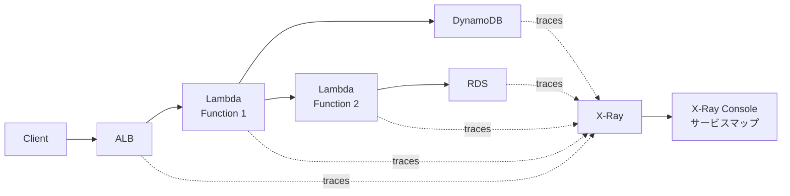

## AWS X-Ray とは？


**ポケモンで例えると**: AWSを理解することは、新しい「わざ」を覚えるようなもの——使いこなせば、より強力な開発者になれます。

X-Rayは、分散アプリケーションの動作を分析・デバッグできる分散トレーシングサービスです。

### 主要機能

```yaml
トレーシング:
  - リクエスト追跡
  - レイテンシ分析
  - エラー検出
  - ボトルネック特定

対応サービス:
  - Lambda
  - EC2
  - ECS/Fargate
  - Elastic Beanstalk
  - API Gateway
  - ALB/NLB
```

### アーキテクチャ



### サービスマップ

```yaml
表示内容:
  - サービス間の依存関係
  - レイテンシ
  - エラー率
  - リクエスト数

分析:
  - ボトルネック特定
  - エラー原因調査
  - パフォーマンス最適化
```

### 料金

#### トレース料金

| 項目 | 価格 | 備考 |
|---|---|---|
| **トレース（最初の100万）** | 無料 / 月 | 月間無料枠 |
| **トレース（100万以降）** | $5.00 / 100万 | 記録されたトレース |
| **トレース保存** | $0.50 / 100万 / 月 | 取得・保存されたトレース |

**無料枠:**
- 月間10万トレース取得・保存

**料金計算例（月間500万トレース記録、100万トレース保存）:**

| 項目 | 計算 | 料金 |
|---|---|---|
| トレース記録 | (500万 - 100万) / 100万 × $5.00 | $20.00 |
| トレース保存 | (100万 - 10万) / 100万 × $0.50 | $0.45 |
| **合計** | - | **$20.45/月** |

**料金計算例（月間1億トレース記録、1000万トレース保存）:**

| 項目 | 計算 | 料金 |
|---|---|---|
| トレース記録 | (1億 - 100万) / 100万 × $5.00 | $495.00 |
| トレース保存 | (1000万 - 10万) / 100万 × $0.50 | $4.95 |
| **合計** | - | **$499.95/月** |

**コスト最適化のポイント:**
- サンプリングレート調整（全トレースではなく一部のみ）
- 重要なエンドポイントのみ有効化
- 保存期間の最適化

## まとめ

**X-Rayの重要ポイント:**
- 分散トレーシング
- サービスマップで可視化
- レイテンシ・エラー分析
- Lambda統合簡単
