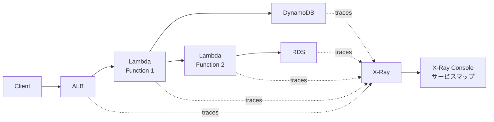

## AWS X-Ray とは？

X-Rayは、分散アプリケーションの動作を分析・デバッグできる分散トレーシングサービスです。

### 主要機能

```yaml
トレーシング:
  - リクエスト追跡
  - レイテンシ分析
  - エラー検出
  - ボトルネック特定

対応サービス:
  - Lambda
  - EC2
  - ECS/Fargate
  - Elastic Beanstalk
  - API Gateway
  - ALB/NLB
```

### アーキテクチャ



### サービスマップ

```yaml
表示内容:
  - サービス間の依存関係
  - レイテンシ
  - エラー率
  - リクエスト数

分析:
  - ボトルネック特定
  - エラー原因調査
  - パフォーマンス最適化
```

### 料金

```yaml
トレース:
  - 最初の100万: 無料
  - 以降: $5.00 / 100万

トレース保存:
  - $0.50 / 100万 / 月

無料枠: 月間10万トレース
```

## まとめ

**X-Rayの重要ポイント:**
- 分散トレーシング
- サービスマップで可視化
- レイテンシ・エラー分析
- Lambda統合簡単
