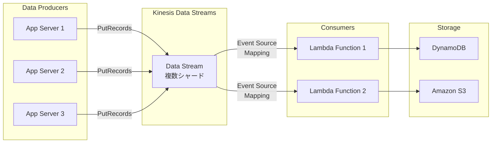

## ユースケース

### 1. リアルタイムログ分析

```yaml
シナリオ:
  - アプリケーションログ収集
  - リアルタイム異常検知
  - ダッシュボード表示

実装:
  Producer:
    - Kinesis Agent（EC2）
    - CloudWatch Logs Subscription
  
  Processing:
    - Lambda（異常検知）
    - Kinesis Data Analytics（集計）
  
  Storage:
    - S3（長期保存）
    - OpenSearch（検索・可視化）
```

### 2. IoTデータ収集

```yaml
シナリオ:
  - 数千のIoTデバイス
  - センサーデータ収集
  - リアルタイム監視

実装:
  IoT Core:
    - デバイス接続
    - Kinesis Data Streams へ配信
  
  処理:
    - Lambda（データ変換）
    - Kinesis Data Analytics（集計）
  
  保存:
    - Kinesis Data Firehose → S3
    - DynamoDB（最新値）
```

### 3. クリックストリーム分析

```yaml
シナリオ:
  - ウェブサイトユーザー行動追跡
  - リアルタイムレコメンデーション
  - A/Bテスト分析

実装:
  収集:
    - ウェブアプリ → Kinesis Agent
    - Kinesis Data Streams
  
  処理:
    - Lambda（ユーザー分析）
    - Personalize（レコメンド）
  
  分析:
    - Kinesis Data Firehose → S3
    - Athena / QuickSight
```

## アーキテクチャパターン

### パターン1: Lambda + Data Streams



```yaml
構成:
  Producer:
    - アプリケーション
    - Kinesis Producer Library（KPL）
  
  Kinesis Data Streams:
    - 複数シャード
    - チームションキー: user_id
  
  Consumer:
    - Lambda関数
    - バッチサイズ: 100
    - 並列実行
  
  Storage:
    - DynamoDB（処理結果）
    - S3（生データ）

設定:
  Lambda:
    - イベントソースマッピング
    - バッチウィンドウ: 5秒
    - リトライ: 3回
    - DLQ: SQS

メリット:
  - サーバーレス
  - 自動スケーリング
  - 簡単な実装
```

### パターン2: Firehose 配信パイプライン

```yaml
構成:
  Producer:
    - アプリケーション
    - CloudWatch Logs
  
  Kinesis Data Firehose:
    - バッファ: 5MB / 300秒
    - Lambda変換
    - S3配信
  
  Lambda（データ変換）:
    - JSON → Parquet
    - データクレンジング
    - エンリッチメント
  
  S3:
    - チームション: year/month/day/hour
    - 圧縮: GZIP
    - ライフサイクル: Glacier移行

分析:
  - Athena（アドホッククエリ）
  - QuickSight（ダッシュボード）
  - EMR（バッチ処理）
```

### パターン3: リアルタイム集計

```yaml
構成:
  Kinesis Data Streams:
    - イベントストリーム
  
  Kinesis Data Analytics:
    - SQL集計
    - 時系列ウィンドウ
    - 異常検知
  
  出力:
    Lambda:
      - アラート送信（SNS）
      - データ保存（DynamoDB）
    
    Kinesis Data Streams:
      - 下流処理へ

SQL例:
  - 1分間の集計
  - 移動平均計算
  - しきい値超過検知
```

```sql
-- Kinesis Data Analytics SQL例
CREATE OR REPLACE STREAM "DESTINATION_SQL_STREAM" (
  device_id VARCHAR(32),
  avg_temperature DOUBLE,
  max_temperature DOUBLE,
  event_count INTEGER,
  window_end TIMESTAMP
);

CREATE OR REPLACE PUMP "STREAM_PUMP" AS 
INSERT INTO "DESTINATION_SQL_STREAM"
SELECT STREAM 
  device_id,
  AVG(temperature) AS avg_temperature,
  MAX(temperature) AS max_temperature,
  COUNT(*) AS event_count,
  STEP("SOURCE_SQL_STREAM_001".ROWTIME BY INTERVAL '1' MINUTE) AS window_end
FROM "SOURCE_SQL_STREAM_001"
GROUP BY 
  device_id,
  STEP("SOURCE_SQL_STREAM_001".ROWTIME BY INTERVAL '1' MINUTE);
```

### パターン4: マルチコンシューマー

```yaml
構成:
  Kinesis Data Streams:
    - 単一ストリーム
    - Enhanced Fan-Out 有効化
  
  Consumer 1（リアルタイム処理）:
    - Lambda
    - 即時応答
  
  Consumer 2（集計）:
    - Kinesis Data Analytics
    - ダッシュボード更新
  
  Consumer 3（アーカイブ）:
    - Kinesis Data Firehose
    - S3 へ配信

メリット:
  - 単一データソース
  - 複数の処理パイプライン
  - 独立したスケーリング

Enhanced Fan-Out:
  - 専用スループット（2MB/秒/コンシューマー）
  - レイテンシ削減（70ms）
  - コンシューマー毎に課金
```

### パターン5: エラーハンドリング

```yaml
構成:
  Kinesis Data Streams:
    - メインストリーム
  
  Lambda Consumer:
    - 処理関数
    - エラーハンドリング
  
  失敗処理:
    On-Failure Destination:
      - SQS（DLQ）
      - SNS（アラート）
    
    リトライ:
      - 最大試行回数: 3
      - ビスマスクアラーム: 有効
      - 失敗時データ保持

  DLQ処理:
    Lambda:
      - エラー調査
      - データ修正
      - 再投入

モニタリング:
  CloudWatch:
    - Iterator Age（遅延）
    - Lambda Errors
    - Throttles
```

## 実装例

### Producer（Python）

```python
import boto3
import json
import time
from datetime import datetime

kinesis_client = boto3.client('kinesis', region_name='ap-northeast-1')

def put_record(stream_name, data, partition_key):
    """
    単一レコード送信
    """
    try:
        response = kinesis_client.put_record(
            StreamName=stream_name,
            Data=json.dumps(data),
            PartitionKey=partition_key
        )
        print(f"レコード送信成功: {response['SequenceNumber']}")
        return response
    except Exception as e:
        print(f"エラー: {e}")
        raise

def put_records_batch(stream_name, records):
    """
    バッチ送信（最大500レコード）
    """
    kinesis_records = [
        {
            'Data': json.dumps(record['data']),
            'PartitionKey': record['partition_key']
        }
        for record in records
    ]
    
    try:
        response = kinesis_client.put_records(
            StreamName=stream_name,
            Records=kinesis_records
        )
        
        failed_count = response['FailedRecordCount']
        if failed_count > 0:
            print(f"失敗レコード数: {failed_count}")
            # リトライ処理
            
        return response
    except Exception as e:
        print(f"バッチ送信エラー: {e}")
        raise

# 使用例
stream_name = 'my-data-stream'

# 単一レコード
data = {
    'timestamp': datetime.utcnow().isoformat(),
    'user_id': 'user123',
    'event': 'page_view',
    'page': '/products'
}
put_record(stream_name, data, partition_key='user123')

# バッチ送信
records = [
    {
        'data': {'user_id': f'user{i}', 'value': i},
        'partition_key': f'user{i}'
    }
    for i in range(100)
]
put_records_batch(stream_name, records)
```

### Consumer（Lambda）

```python
import json
import base64
import boto3

dynamodb = boto3.resource('dynamodb')
table = dynamodb.Table('ProcessedEvents')

def lambda_handler(event, context):
    """
    Kinesis Data Streams からのイベント処理
    """
    processed_count = 0
    failed_count = 0
    
    for record in event['Records']:
        try:
            # Kinesisレコードデコード
            payload = base64.b64decode(record['kinesis']['data'])
            data = json.loads(payload)
            
            # データ処理
            process_record(data)
            processed_count += 1
            
        except Exception as e:
            print(f"レコード処理エラー: {e}")
            print(f"レコード: {record}")
            failed_count += 1
            # エラーハンドリング
            # 部分的な失敗の場合、該当レコードのsequenceNumberを返す
    
    print(f"処理完了: {processed_count}, 失敗: {failed_count}")
    
    return {
        'statusCode': 200,
        'body': json.dumps({
            'processed': processed_count,
            'failed': failed_count
        })
    }

def process_record(data):
    """
    個別レコード処理
    """
    # ビジネスロジック
    user_id = data.get('user_id')
    event_type = data.get('event')
    
    # DynamoDB保存
    table.put_item(
        Item={
            'user_id': user_id,
            'timestamp': data.get('timestamp'),
            'event_type': event_type,
            'details': data
        }
    )
```

### Firehose データ変換 Lambda

```python
import json
import base64
from datetime import datetime

def lambda_handler(event, context):
    """
    Kinesis Firehose データ変換
    """
    output_records = []
    
    for record in event['records']:
        try:
            # 入力データデコード
            payload = base64.b64decode(record['data'])
            data = json.loads(payload)
            
            # データ変換
            transformed_data = transform_record(data)
            
            # エンコード
            output_data = json.dumps(transformed_data) + '\n'
            output_record = {
                'recordId': record['recordId'],
                'result': 'Ok',
                'data': base64.b64encode(output_data.encode('utf-8')).decode('utf-8')
            }
            
        except Exception as e:
            print(f"変換エラー: {e}")
            output_record = {
                'recordId': record['recordId'],
                'result': 'ProcessingFailed'
            }
        
        output_records.append(output_record)
    
    return {'records': output_records}

def transform_record(data):
    """
    データ変換ロジック
    """
    # タイムスタンプ追加
    data['processed_at'] = datetime.utcnow().isoformat()
    
    # データクレンジング
    if 'email' in data:
        data['email_domain'] = data['email'].split('@')[1]
    
    # データマスキング
    if 'credit_card' in data:
        data['credit_card'] = '*' * 12 + data['credit_card'][-4:]
    
    return data
```

## まとめ

**アーキテクチャ設計のポイント:**
- Data Streams でリアルタイム処理
- Firehose で簡単配信
- Lambda でサーバーレス処理
- Data Analytics で集計・分析
- チームションキーで均等分散
- エラーハンドリング設計
- モニタリング必須
