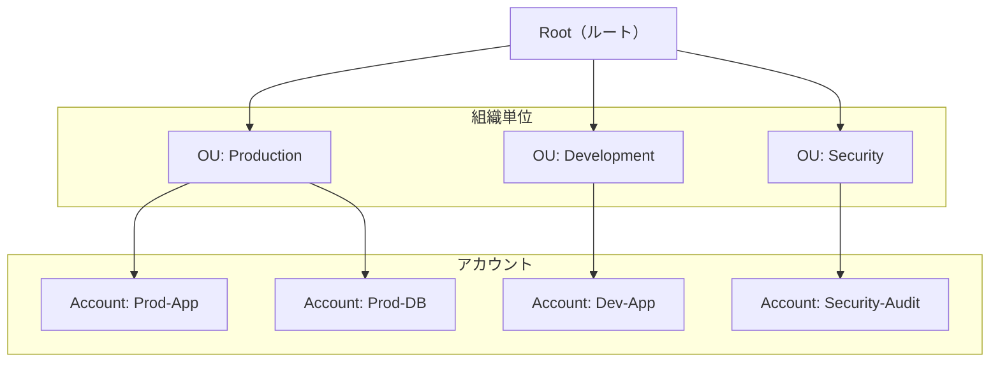

## AWS Organizations とは？

Organizationsは、複数のAWSアカウントを一元管理するサービスです。

### 主要機能

```yaml
アカウント管理:
  - 組織単位（OU）
  - アカウント階層
  - 一括請求

ポリシー:
  - SCP（Service Control Policies）
  - タグポリシー
  - バックアップポリシー
  - AIサービスポリシー
```

### 組織構造



### SCP（Service Control Policies）

```yaml
概要:
  - アカウント権限の制限
  - OU/アカウント単位適用
  - IAMポリシーより優先

例:
  - 特定リージョンのみ許可
  - 特定サービス禁止
  - ルートユーザー制限
```

### 料金

```yaml
無料:
  - 組織作成・管理
  - 一括請求

課金:
  - 各アカウントの利用料金
  - ボリュームディスカウント適用
```

## まとめ

**Organizationsの重要ポイント:**
- マルチアカウント管理
- SCP で権限制御
- 一括請求
- OU で階層管理
