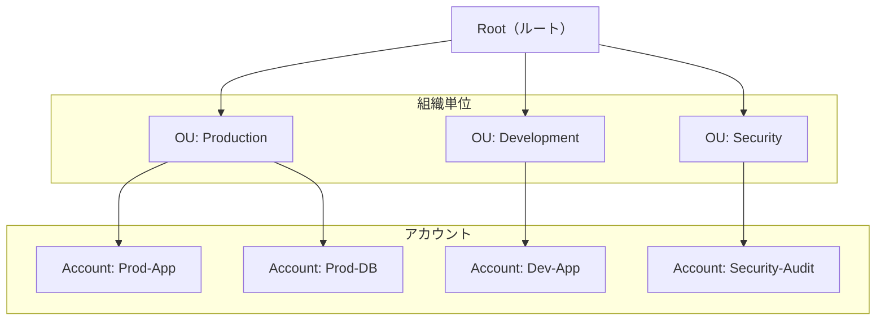

## AWS Organizations とは？


**ポケモンで例えると**: AWSを理解することは、新しい「わざ」を覚えるようなもの——使いこなせば、より強力な開発者になれます。

Organizationsは、複数のAWSアカウントを一元管理するサービスです。

### 主要機能

```yaml
アカウント管理:
  - 組織単位（OU）
  - アカウント階層
  - 一括請求

ポリシー:
  - SCP（Service Control Policies）
  - タグポリシー
  - バックアップポリシー
  - AIサービスポリシー
```

### 組織構造



### SCP（Service Control Policies）

```yaml
概要:
  - アカウント権限の制限
  - OU/アカウント単位適用
  - IAMポリシーより優先

例:
  - 特定リージョンのみ許可
  - 特定サービス禁止
  - ルートユーザー制限
```

### 料金

**Organizations本体は無料です**

| 項目 | 価格 | 備考 |
|---|---|---|
| **組織作成・管理** | 無料 | アカウント管理、OU作成 |
| **一括請求** | 無料 | コンソリデーテッドビリング |
| **SCP（Service Control Policies）** | 無料 | 権限制御 |
| **各アカウントの利用料金** | 各サービスの標準料金 | 実際の利用分のみ課金 |

**ボリュームディスカウント適用:**

一括請求により、全アカウントの合計使用量でティア計算されるため、コスト削減効果があります。

**料金計算例（3アカウント、各1TBのS3使用）:**

| シナリオ | 計算 | 月額料金 |
|---|---|---|
| **個別請求** | 1TB × 3 × $0.023 | $69.00 |
| **一括請求** | 3TB × $0.023 | $69.00 |

※この例では同じですが、ティア割引が適用される場合は一括請求が有利

**EC2のボリュームディスカウント例（個別 vs 一括）:**

| 使用量 | 個別請求（3アカウント×100時間） | 一括請求（合計300時間） |
|---|---|---|
| 各アカウント | 100時間 × 3 = $43.68 | - |
| 合計 | $131.04 | $128.88（RI適用でさらに安） |
| **差額** | - | **$2.16削減** |

**コストメリット:**
- Organizations自体は完全無料
- ボリュームディスカウントによるコスト削減
- リザーブドインスタンスの共有
- Savings Plansの共有

## まとめ

**Organizationsの重要ポイント:**
- マルチアカウント管理
- SCP で権限制御
- 一括請求
- OU で階層管理
