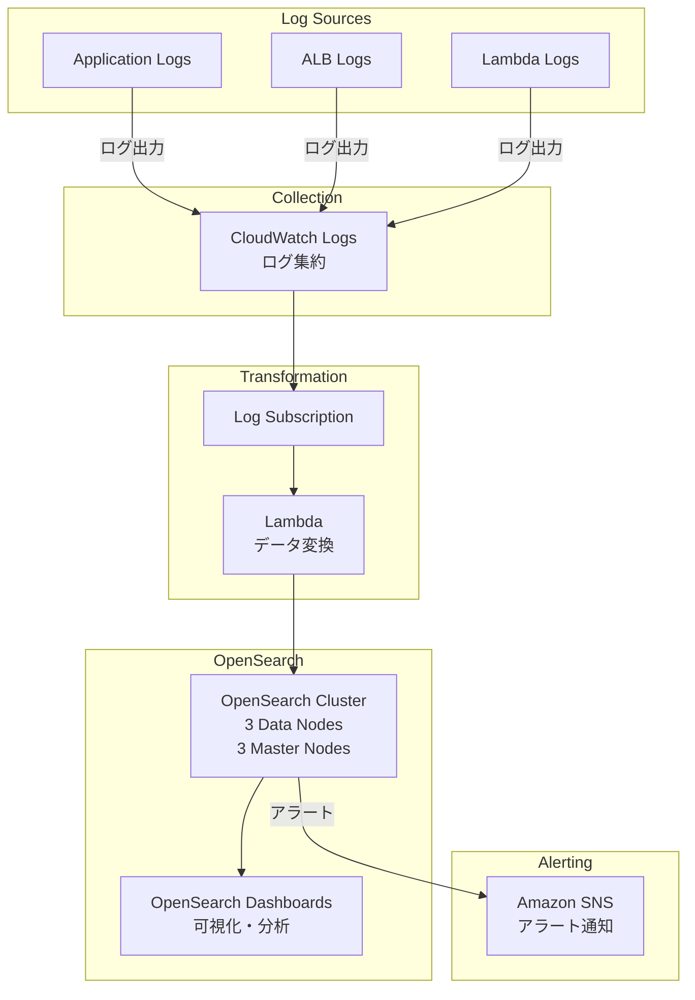

## ユースケース

### 1. ログ分析

```yaml
シナリオ:
  - アプリケーションログの集約
  - リアルタイム監視
  - トラブルシューティング
  - パフォーマンス分析

実装:
  1. CloudWatch Logs → OpenSearch
  2. Lambda → 必要に応じて変換
  3. OpenSearch Dashboards → 可視化
  4. アラート設定 → SNS通知
```

### 2. フルテキスト検索

```yaml
シナリオ:
  - Webサイト検索機能
  - ドキュメント検索
  - 製品カタログ検索
  - ユーザー投稿検索

実装:
  データソース:
    - RDS / DynamoDB
    - S3ドキュメント
  
  同期:
    - DynamoDB Streams → Lambda → OpenSearch
    - Change Data Capture
  
  検索:
    - REST API
    - 全文検索
    - オートコンプリート
    - ファジー検索
```

### 3. セキュリティ分析（SIEM）

```yaml
シナリオ:
  - セキュリティログ統合
  - 脅威検出
  - コンプライアンス監査
  - インシデント対応

実装:
  ログソース:
    - CloudTrail（API監査）
    - VPC Flow Logs（ネットワーク）
    - GuardDuty（脅威検出）
    - WAFログ
    - Security Hubアラート
  
  分析:
    - 異常検出
    - パターンマッチング
    - 相関分析
    - ダッシュボード可視化
  
  アラート:
    - SNS通知
    - Lambda自動対応
```

### 4. アプリケーション分析

```yaml
シナリオ:
  - ユーザー行動分析
  - パフォーマンスモニタリング
  - ビジネスメトリクス
  - エラートラッキング

実装:
  1. アプリケーション → Kinesis Firehose
  2. Firehose → Lambda（変換）
  3. OpenSearch → インデックス
  4. Dashboards → リアルタイム可視化
```

## アーキテクチャパターン

### パターン1: 基本的なログ分析



```yaml
構成:
  CloudWatch Logs:
    - 複数ソース集約
    - ログサブスクリプション
  
  Lambda:
    - ログ変換
    - フィルタリング
    - エンリッチメント
  
  OpenSearch:
    データノード: 3台（Multi-AZ）
    マスターノード: 3台
    インデックス:
      - application-logs-{YYYY.MM.DD}
      - 日次ローテーション
  
  Dashboards:
    - エラー率ダッシュボード
    - レスポンスタイム
    - アクセス統計

運用:
  - ISMポリシー（7日後Warm、30日後削除）
  - アラート（エラー率閾値）
  - 自動スナップショット
```

### パターン2: 準リアルタイムログ分析

```yaml
構成:
  Kinesis Firehose:
    - ストリーミング取り込み
    - バッファリング（60秒または1MB）
    - Lambda変換
    - OpenSearch配信
  
  OpenSearch:
    - リアルタイムインデックス
    - 低レイテンシ検索
  
  Dashboards:
    - 自動更新ダッシュボード
    - リアルタイムメトリクス

レイテンシ:
  - イベント発生: 0秒
  - Firehose配信: 60秒
  - インデックス作成: 数秒
  - 検索可能: 合計1〜2分

特徴:
  - 準リアルタイム
  - 完全マネージド
  - 自動再試行
  - S3バックアップ（オプション）
```

### パターン3: セキュリティ分析（SIEM）

```yaml
構成:
  ログソース:
    CloudTrail:
      - API呼び出し監査
      - リソース変更追跡
    
    VPC Flow Logs:
      - ネットワークトラフィック
      - 異常通信検出
    
    GuardDuty:
      - 脅威検出
      - EventBridge → Lambda
    
    WAF:
      - 攻撃パターン
      - Kinesis Firehose
  
  集約:
    - すべてOpenSearchへ
    - 統一インデックス設計
  
  相関分析:
    - 複数ソース横断
    - 時系列分析
    - 異常検出
  
  ダッシュボード:
    - セキュリティダッシュボード
    - コンプライアンスレポート
    - インシデント調査

アラート:
  トリガー:
    - 異常ログイン
    - 権限昇格
    - 不審なAPI呼び出し
    - DDoS攻撃兆候
  
  アクション:
    - SNS通知
    - Lambda自動対応
    - セキュリティグループ更新
```

### パターン4: ハイブリッドストレージ（Hot-Warm-Cold）

```yaml
構成:
  Hot層（最新7日間）:
    - データノード（高性能）
    - EBS gp3
    - 頻繁な書き込み・検索
  
  Warm層（8〜30日）:
    - UltraWarmノード
    - S3ベース
    - 読み取り専用
    - 検索可能
  
  Cold層（31日〜1年）:
    - コールドストレージ
    - S3
    - 選択的リストア
    - 最低コスト

ISMポリシー:
  インデックス作成:
    - Hot層に作成
  
  7日後:
    - UltraWarmへ移行
    - _warm_migration
  
  30日後:
    - Coldストレージへ
    - _cold_migration
  
  365日後:
    - 削除
    - _delete

コスト比較:
  Hot: $96/TB/月
  Warm: $24/TB/月（75%削減）
  Cold: $5/TB/月（95%削減）
```

### パターン5: フルテキスト検索（Eコマース）

```yaml
構成:
  データソース:
    - 商品データベース（RDS）
    - 商品画像（S3）
    - レビュー（DynamoDB）
  
  同期:
    DynamoDB:
      - DynamoDB Streams
      - Lambda → OpenSearch
      - リアルタイム同期
    
    RDS:
      - DMS（Change Data Capture）
      - または定期バッチ
  
  OpenSearch:
    インデックス設計:
      products:
        - id, name, description
        - price, category
        - ratings, review_count
        - 在庫状況
      
      reviews:
        - product_id
        - rating, text
        - user_id, timestamp
  
  検索機能:
    - 全文検索
    - ファセット（カテゴリ、価格帯）
    - オートコンプリート
    - 関連商品
    - スペルチェック

API構成:
  API Gateway:
    - /search
    - /autocomplete
    - /suggestions
  
  Lambda:
    - OpenSearch クエリ
    - 結果フォーマット
    - キャッシュ（ElastiCache）
```

### パターン6: マルチリージョン

```yaml
要件:
  - グローバルサービス
  - 低レイテンシアクセス
  - DR対応

アーキテクチャ:
  リージョン1（東京）:
    - OpenSearchドメイン
    - プライマリ
  
  リージョン2（シンガポール）:
    - OpenSearchドメイン
    - セカンダリ
  
  同期:
    方法1（アプリケーションレベル）:
      - 双方向書き込み
      - Lambda/Kinesis
    
    方法2（スナップショット）:
      - 定期スナップショット
      - クロスリージョンコピー
      - 定期リストア
  
  ルーティング:
    Route 53:
      - Geolocation routing
      - 最寄りリージョンへ
      - ヘルスチェック
      - フェイルオーバー

注意点:
  - 完全な同期レプリケーション未サポート
  - 最終的整合性を許容
  - または読み取り専用レプリカ
```

## 実装例

### Lambda変換関数（CloudWatch Logs → OpenSearch）

```python
import json
import boto3
import base64
import gzip
from datetime import datetime
from opensearchpy import OpenSearch, RequestsHttpConnection
from requests_aws4auth import AWS4Auth

def lambda_handler(event, context):
    # CloudWatch Logsデータのデコード
    compressed_payload = base64.b64decode(event['awslogs']['data'])
    uncompressed_payload = gzip.decompress(compressed_payload)
    log_data = json.loads(uncompressed_payload)
    
    # OpenSearch接続設定
    region = 'ap-northeast-1'
    service = 'es'
    credentials = boto3.Session().get_credentials()
    awsauth = AWS4Auth(
        credentials.access_key, 
        credentials.secret_key, 
        region, 
        service, 
        session_token=credentials.token
    )
    
    host = 'search-my-domain-xxxx.ap-northeast-1.es.amazonaws.com'
    client = OpenSearch(
        hosts=[{'host': host, 'port': 443}],
        http_auth=awsauth,
        use_ssl=True,
        verify_certs=True,
        connection_class=RequestsHttpConnection
    )
    
    # ドキュメント準備
    documents = []
    for log_event in log_data['logEvents']:
        doc = {
            'timestamp': datetime.fromtimestamp(
                log_event['timestamp'] / 1000.0
            ).isoformat(),
            'message': log_event['message'],
            'log_group': log_data['logGroup'],
            'log_stream': log_data['logStream'],
        }
        
        # JSONログのパース
        try:
            parsed = json.loads(log_event['message'])
            doc.update(parsed)
        except:
            pass
        
        documents.append(doc)
    
    # Bulk インデックス
    index_name = f"logs-{datetime.now().strftime('%Y.%m.%d')}"
    
    bulk_body = []
    for doc in documents:
        bulk_body.append({'index': {'_index': index_name}})
        bulk_body.append(doc)
    
    response = client.bulk(body=bulk_body)
    
    return {
        'statusCode': 200,
        'body': json.dumps(f'Indexed {len(documents)} documents')
    }
```

### インデックステンプレート作成

```json
PUT _index_template/logs-template
{
  "index_patterns": ["logs-*"],
  "template": {
    "settings": {
      "number_of_shards": 3,
      "number_of_replicas": 1,
      "index.refresh_interval": "30s",
      "index.codec": "best_compression"
    },
    "mappings": {
      "properties": {
        "timestamp": {
          "type": "date"
        },
        "level": {
          "type": "keyword"
        },
        "message": {
          "type": "text",
          "fields": {
            "keyword": {
              "type": "keyword",
              "ignore_above": 256
            }
          }
        },
        "service": {
          "type": "keyword"
        },
        "user_id": {
          "type": "keyword"
        },
        "duration_ms": {
          "type": "long"
        },
        "status_code": {
          "type": "integer"
        }
      }
    }
  }
}
```

### ISMポリシー設定

```json
{
  "policy": {
    "description": "Hot-Warm-Cold-Delete policy",
    "default_state": "hot",
    "states": [
      {
        "name": "hot",
        "actions": [],
        "transitions": [
          {
            "state_name": "warm",
            "conditions": {
              "min_index_age": "7d"
            }
          }
        ]
      },
      {
        "name": "warm",
        "actions": [
          {
            "warm_migration": {}
          }
        ],
        "transitions": [
          {
            "state_name": "cold",
            "conditions": {
              "min_index_age": "30d"
            }
          }
        ]
      },
      {
        "name": "cold",
        "actions": [
          {
            "cold_migration": {
              "start_time": "2024-01-01T00:00:00Z"
            }
          }
        ],
        "transitions": [
          {
            "state_name": "delete",
            "conditions": {
              "min_index_age": "365d"
            }
          }
        ]
      },
      {
        "name": "delete",
        "actions": [
          {
            "delete": {}
          }
        ]
      }
    ]
  }
}
```

### クエリ例（Query DSL）

```json
# エラーログ検索
POST /logs-*/_search
{
  "query": {
    "bool": {
      "must": [
        {
          "match": {
            "level": "ERROR"
          }
        },
        {
          "range": {
            "timestamp": {
              "gte": "now-1h"
            }
          }
        }
      ]
    }
  },
  "sort": [
    {
      "timestamp": {
        "order": "desc"
      }
    }
  ],
  "size": 100
}

# 集計クエリ（サービス別エラー数）
POST /logs-*/_search
{
  "size": 0,
  "query": {
    "bool": {
      "must": [
        {
          "match": {
            "level": "ERROR"
          }
        }
      ],
      "filter": [
        {
          "range": {
            "timestamp": {
              "gte": "now-24h"
            }
          }
        }
      ]
    }
  },
  "aggs": {
    "errors_by_service": {
      "terms": {
        "field": "service",
        "size": 10
      },
      "aggs": {
        "error_trend": {
          "date_histogram": {
            "field": "timestamp",
            "fixed_interval": "1h"
          }
        }
      }
    }
  }
}
```

### アラート設定

```json
{
  "name": "High Error Rate Alert",
  "type": "monitor",
  "monitor_type": "query_level_monitor",
  "enabled": true,
  "schedule": {
    "period": {
      "interval": 5,
      "unit": "MINUTES"
    }
  },
  "inputs": [
    {
      "search": {
        "indices": ["logs-*"],
        "query": {
          "size": 0,
          "query": {
            "bool": {
              "filter": [
                {
                  "range": {
                    "timestamp": {
                      "gte": "now-5m"
                    }
                  }
                },
                {
                  "term": {
                    "level": "ERROR"
                  }
                }
              ]
            }
          },
          "aggs": {
            "error_count": {
              "value_count": {
                "field": "_id"
              }
            }
          }
        }
      }
    }
  ],
  "triggers": [
    {
      "name": "Error threshold exceeded",
      "severity": "1",
      "condition": {
        "script": {
          "source": "ctx.results[0].aggregations.error_count.value > 100",
          "lang": "painless"
        }
      },
      "actions": [
        {
          "name": "Send SNS notification",
          "destination_id": "sns-destination-id",
          "message_template": {
            "source": "High error rate detected: {{ctx.results.0.aggregations.error_count.value}} errors in last 5 minutes"
          }
        }
      ]
    }
  ]
}
```

## まとめ

**アーキテクチャ設計のポイント:**
- 用途に応じたノード構成（データ/マスター分離）
- Multi-AZ配置で高可用性
- ISMポリシーでコスト最適化
- UltraWarm・Coldストレージ活用
- Kinesis Firehose でストリーミング取り込み
- インデックステンプレートで設計統一
- 適切なシャード数設計
- アラートで異常検知自動化
