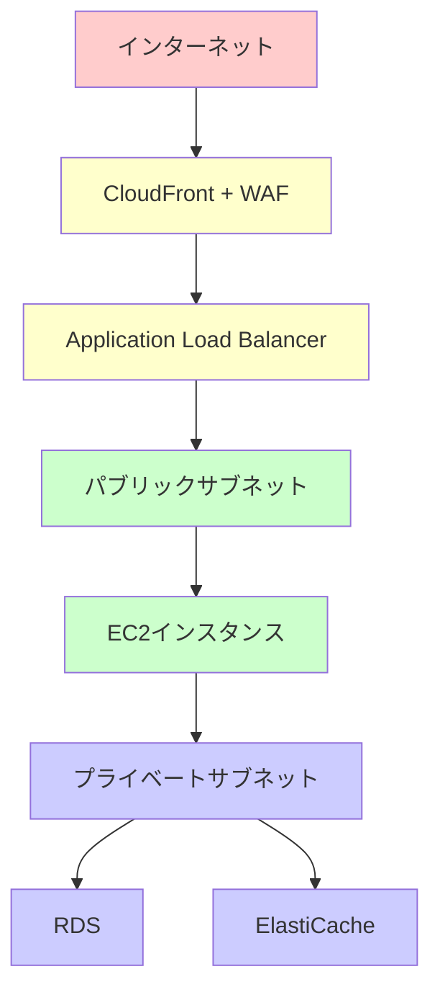
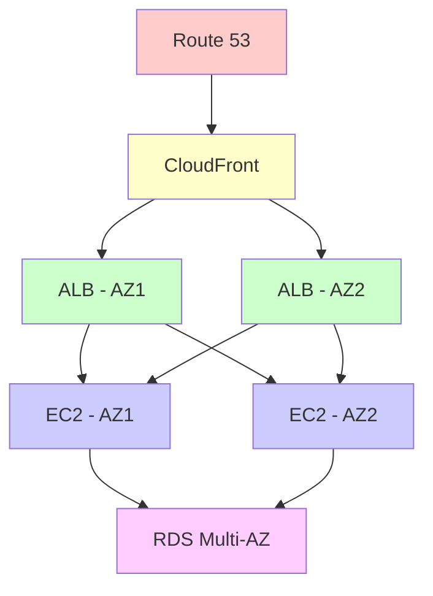
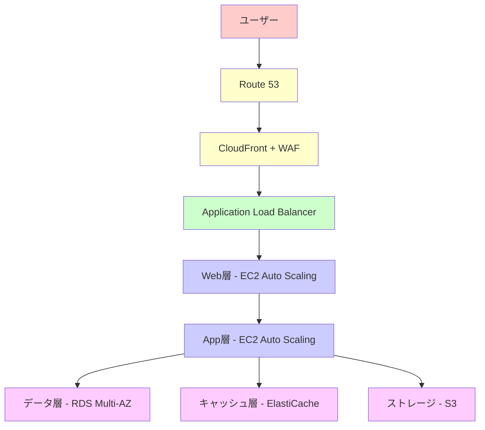
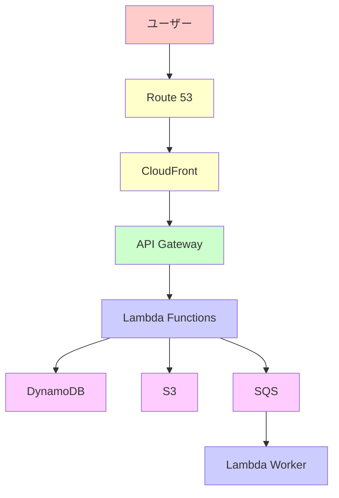

# AWSベストプラクティス構成完全ガイド

AWSでのベストプラクティス構成を、実務で使える実装例とベストプラクティスとともに詳しく解説します。

## 1. AWSベストプラクティス構成とは

### ベストプラクティス構成の目的

AWSベストプラクティス構成は、セキュリティ、可用性、パフォーマンス、コスト効率を最適化した構成です。

```
ベストプラクティス構成の要素
   ├─ セキュリティ
   ├─ 可用性
   ├─ パフォーマンス
   ├─ コスト効率
   └─ 運用性
```

### なぜベストプラクティス構成が必要か

**問題のある構成（ベストプラクティスなし）:**

```
問題のある状況:
- すべてのリソースがパブリックサブネットに配置
- セキュリティグループが緩い
- 単一AZ構成
- バックアップがない
- 監視が不十分

影響:
- セキュリティリスクが高い
- 可用性が低い
- 障害時の復旧が困難
- コストが最適化されていない
```

**解決: ベストプラクティス構成による最適化**

```
解決策:
- マルチAZ構成
- 適切なセキュリティ設定
- 自動バックアップ
- 監視とアラート
- コスト最適化

メリット:
- セキュリティが向上
- 可用性が向上（99.99%以上）
- 障害時の迅速な復旧
- コストが最適化される
```

## 2. セキュリティベストプラクティス

### パターン1: マルチレイヤーセキュリティ



**実装例:**

```yaml
# CloudFormationテンプレート例
Resources:
  # CloudFront + WAF
  CloudFrontDistribution:
    Type: AWS::CloudFront::Distribution
    Properties:
      DistributionConfig:
        Origins:
          - DomainName: !GetAtt ApplicationLoadBalancer.DNSName
            Id: ALBOrigin
        DefaultCacheBehavior:
          TargetOriginId: ALBOrigin
          ViewerProtocolPolicy: redirect-to-https
        Enabled: true
        WebACLId: !Ref WebACL
  
  WebACL:
    Type: AWS::WAFv2::WebACL
    Properties:
      Scope: CLOUDFRONT
      DefaultAction:
        Allow: {}
      Rules:
        - Name: AWSManagedRulesCommonRuleSet
          Priority: 1
          Statement:
            ManagedRuleGroupStatement:
              VendorName: AWS
              Name: AWSManagedRulesCommonRuleSet
          OverrideAction:
            None: {}
          VisibilityConfig:
            SampledRequestsEnabled: true
            CloudWatchMetricsEnabled: true
            MetricName: CommonRuleSetMetric
  
  # Application Load Balancer
  ApplicationLoadBalancer:
    Type: AWS::ElasticLoadBalancingV2::LoadBalancer
    Properties:
      Type: application
      Scheme: internet-facing
      Subnets:
        - !Ref PublicSubnet1
        - !Ref PublicSubnet2
      SecurityGroups:
        - !Ref ALBSecurityGroup
  
  ALBSecurityGroup:
    Type: AWS::EC2::SecurityGroup
    Properties:
      GroupDescription: Security group for ALB
      VpcId: !Ref VPC
      SecurityGroupIngress:
        - IpProtocol: tcp
          FromPort: 80
          ToPort: 80
          CidrIp: 0.0.0.0/0
        - IpProtocol: tcp
          FromPort: 443
          ToPort: 443
          CidrIp: 0.0.0.0/0
      SecurityGroupEgress:
        - IpProtocol: -1
          CidrIp: 0.0.0.0/0
  
  # EC2インスタンス（プライベートサブネット）
  EC2Instance:
    Type: AWS::EC2::Instance
    Properties:
      ImageId: ami-0c55b159cbfafe1f0
      InstanceType: t3.medium
      SubnetId: !Ref PrivateSubnet1
      SecurityGroupIds:
        - !Ref EC2SecurityGroup
      IamInstanceProfile: !Ref EC2InstanceProfile
  
  EC2SecurityGroup:
    Type: AWS::EC2::SecurityGroup
    Properties:
      GroupDescription: Security group for EC2
      VpcId: !Ref VPC
      SecurityGroupIngress:
        - IpProtocol: tcp
          FromPort: 80
          ToPort: 80
          SourceSecurityGroupId: !Ref ALBSecurityGroup
      SecurityGroupEgress:
        - IpProtocol: tcp
          FromPort: 443
          ToPort: 443
          CidrIp: 0.0.0.0/0
  
  # RDS（プライベートサブネット）
  RDSInstance:
    Type: AWS::RDS::DBInstance
    Properties:
      Engine: postgres
      EngineVersion: '14.5'
      DBInstanceClass: db.t3.medium
      MultiAZ: true
      StorageEncrypted: true
      KmsKeyId: !Ref KMSKey
      DBSubnetGroupName: !Ref DBSubnetGroup
      VPCSecurityGroups:
        - !Ref RDSSecurityGroup
      BackupRetentionPeriod: 7
      EnableCloudwatchLogsExports:
        - postgresql
  
  RDSSecurityGroup:
    Type: AWS::EC2::SecurityGroup
    Properties:
      GroupDescription: Security group for RDS
      VpcId: !Ref VPC
      SecurityGroupIngress:
        - IpProtocol: tcp
          FromPort: 5432
          ToPort: 5432
          SourceSecurityGroupId: !Ref EC2SecurityGroup
```

### パターン2: IAMベストプラクティス

```yaml
# IAMロールとポリシーの例
Resources:
  # EC2インスタンスロール
  EC2InstanceRole:
    Type: AWS::IAM::Role
    Properties:
      AssumeRolePolicyDocument:
        Version: '2012-10-17'
        Statement:
          - Effect: Allow
            Principal:
              Service: ec2.amazonaws.com
            Action: sts:AssumeRole
      ManagedPolicyArns:
        - arn:aws:iam::aws:policy/CloudWatchAgentServerPolicy
      Policies:
        - PolicyName: S3ReadOnlyAccess
          PolicyDocument:
            Version: '2012-10-17'
            Statement:
              - Effect: Allow
                Action:
                  - s3:GetObject
                  - s3:ListBucket
                Resource:
                  - !Sub 'arn:aws:s3:::${S3Bucket}/*'
                  - !Sub 'arn:aws:s3:::${S3Bucket}'
  
  EC2InstanceProfile:
    Type: AWS::IAM::InstanceProfile
    Properties:
      Roles:
        - !Ref EC2InstanceRole
  
  # KMSキー（暗号化用）
  KMSKey:
    Type: AWS::KMS::Key
    Properties:
      Description: KMS key for encryption
      KeyPolicy:
        Version: '2012-10-17'
        Statement:
          - Sid: Enable IAM User Permissions
            Effect: Allow
            Principal:
              AWS: !Sub 'arn:aws:iam::${AWS::AccountId}:root'
            Action: kms:*
            Resource: '*'
          - Sid: Allow EC2 to use the key
            Effect: Allow
            Principal:
              AWS: !GetAtt EC2InstanceRole.Arn
            Action:
              - kms:Decrypt
              - kms:DescribeKey
            Resource: '*'
```

## 3. 可用性ベストプラクティス

### パターン1: マルチAZ構成



**実装例:**

```yaml
# マルチAZ構成の例
Resources:
  # VPC
  VPC:
    Type: AWS::EC2::VPC
    Properties:
      CidrBlock: 10.0.0.0/16
      EnableDnsHostnames: true
      EnableDnsSupport: true
      Tags:
        - Key: Name
          Value: ProductionVPC
  
  # パブリックサブネット（AZ1）
  PublicSubnet1:
    Type: AWS::EC2::Subnet
    Properties:
      VpcId: !Ref VPC
      AvailabilityZone: !Select [0, !GetAZs '']
      CidrBlock: 10.0.1.0/24
      MapPublicIpOnLaunch: true
  
  # パブリックサブネット（AZ2）
  PublicSubnet2:
    Type: AWS::EC2::Subnet
    Properties:
      VpcId: !Ref VPC
      AvailabilityZone: !Select [1, !GetAZs '']
      CidrBlock: 10.0.2.0/24
      MapPublicIpOnLaunch: true
  
  # プライベートサブネット（AZ1）
  PrivateSubnet1:
    Type: AWS::EC2::Subnet
    Properties:
      VpcId: !Ref VPC
      AvailabilityZone: !Select [0, !GetAZs '']
      CidrBlock: 10.0.11.0/24
  
  # プライベートサブネット（AZ2）
  PrivateSubnet2:
    Type: AWS::EC2::Subnet
    Properties:
      VpcId: !Ref VPC
      AvailabilityZone: !Select [1, !GetAZs '']
      CidrBlock: 10.0.12.0/24
  
  # Auto Scaling Group（マルチAZ）
  AutoScalingGroup:
    Type: AWS::AutoScaling::AutoScalingGroup
    Properties:
      VPCZoneIdentifier:
        - !Ref PrivateSubnet1
        - !Ref PrivateSubnet2
      LaunchTemplate:
        LaunchTemplateId: !Ref LaunchTemplate
        Version: !GetAtt LaunchTemplate.LatestVersionNumber
      MinSize: 2
      MaxSize: 10
      DesiredCapacity: 2
      HealthCheckType: ELB
      HealthCheckGracePeriod: 300
      TargetGroupARNs:
        - !Ref TargetGroup
  
  # RDS Multi-AZ
  RDSInstance:
    Type: AWS::RDS::DBInstance
    Properties:
      Engine: postgres
      EngineVersion: '14.5'
      DBInstanceClass: db.t3.medium
      MultiAZ: true
      DBSubnetGroupName: !Ref DBSubnetGroup
      VPCSecurityGroups:
        - !Ref RDSSecurityGroup
      BackupRetentionPeriod: 7
      PreferredBackupWindow: '03:00-04:00'
      PreferredMaintenanceWindow: 'sun:04:00-sun:05:00'
```

### パターン2: 自動スケーリング

```yaml
# 自動スケーリングの設定
Resources:
  # ターゲット追跡スケーリングポリシー
  TargetTrackingScalingPolicy:
    Type: AWS::AutoScaling::ScalingPolicy
    Properties:
      AutoScalingGroupName: !Ref AutoScalingGroup
      PolicyType: TargetTrackingScaling
      TargetTrackingConfiguration:
        PredefinedMetricSpecification:
          PredefinedMetricType: ASGAverageCPUUtilization
        TargetValue: 70.0
        ScaleInCooldown: 300
        ScaleOutCooldown: 300
  
  # CloudWatchアラーム（CPU使用率）
  CPUUtilizationAlarm:
    Type: AWS::CloudWatch::Alarm
    Properties:
      AlarmName: HighCPUUtilization
      AlarmDescription: Alert when CPU exceeds 80%
      MetricName: CPUUtilization
      Namespace: AWS/EC2
      Statistic: Average
      Period: 300
      EvaluationPeriods: 2
      Threshold: 80
      ComparisonOperator: GreaterThanThreshold
      AlarmActions:
        - !Ref SNSTopic
```

## 4. パフォーマンスベストプラクティス

### パターン1: CDNとキャッシング

```yaml
# CloudFrontとElastiCacheの設定
Resources:
  # CloudFrontディストリビューション
  CloudFrontDistribution:
    Type: AWS::CloudFront::Distribution
    Properties:
      DistributionConfig:
        Origins:
          - DomainName: !GetAtt ApplicationLoadBalancer.DNSName
            Id: ALBOrigin
            CustomOriginConfig:
              HTTPPort: 80
              HTTPSPort: 443
              OriginProtocolPolicy: https-only
        DefaultCacheBehavior:
          TargetOriginId: ALBOrigin
          ViewerProtocolPolicy: redirect-to-https
          AllowedMethods:
            - DELETE
            - GET
            - HEAD
            - OPTIONS
            - PATCH
            - POST
            - PUT
          CachedMethods:
            - GET
            - HEAD
          Compress: true
          ForwardedValues:
            QueryString: true
            Cookies:
              Forward: all
          MinTTL: 0
          DefaultTTL: 86400
          MaxTTL: 31536000
        Enabled: true
        PriceClass: PriceClass_100
  
  # ElastiCache（Redis）
  ElastiCacheCluster:
    Type: AWS::ElastiCache::ReplicationGroup
    Properties:
      ReplicationGroupDescription: Redis cluster for caching
      NumCacheClusters: 2
      Engine: redis
      CacheNodeType: cache.t3.micro
      CacheSubnetGroupName: !Ref CacheSubnetGroup
      SecurityGroupIds:
        - !Ref ElastiCacheSecurityGroup
      AtRestEncryptionEnabled: true
      TransitEncryptionEnabled: true
      AutomaticFailoverEnabled: true
      MultiAZEnabled: true
```

### パターン2: データベース最適化

```yaml
# RDSの最適化設定
Resources:
  # RDS Read Replicas
  RDSReadReplica:
    Type: AWS::RDS::DBInstance
    Properties:
      DBInstanceIdentifier: mydb-read-replica
      SourceDBInstanceIdentifier: !Ref RDSInstance
      DBInstanceClass: db.t3.medium
      PubliclyAccessible: false
      MultiAZ: false
  
  # ElastiCache（セッションストア）
  ElastiCacheSessionStore:
    Type: AWS::ElastiCache::ReplicationGroup
    Properties:
      ReplicationGroupDescription: Redis for session store
      NumCacheClusters: 2
      Engine: redis
      CacheNodeType: cache.t3.micro
      AutomaticFailoverEnabled: true
      MultiAZEnabled: true
```

## 5. コスト最適化ベストプラクティス

### パターン1: リソースの最適化

```yaml
# コスト最適化の設定
Resources:
  # S3ライフサイクルポリシー
  S3Bucket:
    Type: AWS::S3::Bucket
    Properties:
      BucketName: my-application-bucket
      LifecycleConfiguration:
        Rules:
          - Id: TransitionToIA
            Status: Enabled
            Transitions:
              - TransitionInDays: 30
                StorageClass: STANDARD_IA
          - Id: TransitionToGlacier
            Status: Enabled
            Transitions:
              - TransitionInDays: 90
                StorageClass: GLACIER
          - Id: DeleteOldVersions
            Status: Enabled
            NoncurrentVersionExpirationInDays: 365
  
  # リザーブドインスタンス（開発環境）
  ReservedInstance:
    Type: AWS::EC2::ReservedInstances
    Properties:
      InstanceType: t3.medium
      InstanceCount: 1
      OfferingType: All Upfront
      ProductDescription: Linux/UNIX
      ReservedInstancesOfferingId: !Ref ReservedInstancesOffering
  
  # Spotインスタンス（バッチ処理）
  SpotFleet:
    Type: AWS::EC2::SpotFleet
    Properties:
      SpotFleetRequestConfig:
        IamFleetRole: !GetAtt SpotFleetRole.Arn
        TargetCapacity: 5
        LaunchSpecifications:
          - ImageId: ami-0c55b159cbfafe1f0
            InstanceType: t3.medium
            SubnetId: !Ref PrivateSubnet1
            SecurityGroups:
              - !Ref EC2SecurityGroup
```

### パターン2: 自動スケーリングによるコスト最適化

```yaml
# スケジュールベースのスケーリング（開発環境）
Resources:
  ScheduledScalingAction:
    Type: AWS::AutoScaling::ScheduledAction
    Properties:
      AutoScalingGroupName: !Ref AutoScalingGroup
      ScheduledActionName: ScaleDownAtNight
      Recurrence: '0 22 * * *'
      DesiredCapacity: 0
      MinSize: 0
      MaxSize: 0
  
  ScheduledScalingActionUp:
    Type: AWS::AutoScaling::ScheduledAction
    Properties:
      AutoScalingGroupName: !Ref AutoScalingGroup
      ScheduledActionName: ScaleUpInMorning
      Recurrence: '0 9 * * *'
      DesiredCapacity: 2
      MinSize: 2
      MaxSize: 10
```

## 6. 運用性ベストプラクティス

### パターン1: 監視とアラート

```yaml
# CloudWatch監視の設定
Resources:
  # CloudWatchダッシュボード
  CloudWatchDashboard:
    Type: AWS::CloudWatch::Dashboard
    Properties:
      DashboardName: ApplicationDashboard
      DashboardBody: !Sub |
        {
          "widgets": [
            {
              "type": "metric",
              "properties": {
                "metrics": [
                  ["AWS/ApplicationELB", "RequestCount", {"stat": "Sum"}],
                  [".", "TargetResponseTime", {"stat": "Average"}]
                ],
                "period": 300,
                "stat": "Average",
                "region": "${AWS::Region}",
                "title": "Application Load Balancer Metrics"
              }
            }
          ]
        }
  
  # SNSトピック（アラート用）
  SNSTopic:
    Type: AWS::SNS::Topic
    Properties:
      TopicName: ApplicationAlerts
      Subscription:
        - Endpoint: admin@example.com
          Protocol: email
  
  # CloudWatchアラーム
  HighErrorRateAlarm:
    Type: AWS::CloudWatch::Alarm
    Properties:
      AlarmName: HighErrorRate
      AlarmDescription: Alert when error rate exceeds 5%
      MetricName: HTTPCode_Target_5XX_Count
      Namespace: AWS/ApplicationELB
      Statistic: Sum
      Period: 300
      EvaluationPeriods: 2
      Threshold: 10
      ComparisonOperator: GreaterThanThreshold
      AlarmActions:
        - !Ref SNSTopic
```

### パターン2: ログ管理

```yaml
# CloudWatch Logsの設定
Resources:
  # CloudWatch Logs ロググループ
  ApplicationLogGroup:
    Type: AWS::Logs::LogGroup
    Properties:
      LogGroupName: /aws/ec2/application
      RetentionInDays: 30
  
  # CloudWatch Logs メトリクスフィルター
  ErrorMetricFilter:
    Type: AWS::Logs::MetricFilter
    Properties:
      LogGroupName: !Ref ApplicationLogGroup
      FilterPattern: '[timestamp, level=ERROR, ...]'
      MetricTransformations:
        - MetricName: ErrorCount
          MetricNamespace: Application
          MetricValue: '1'
```

## 7. 実践的な構成例

### ケース1: 3層Webアプリケーション



**構成の特徴:**
- **Web層**: 静的コンテンツ配信、CloudFrontでキャッシング
- **App層**: アプリケーションロジック、Auto Scalingでスケーリング
- **データ層**: RDS Multi-AZ、自動バックアップ、Read Replicas
- **キャッシュ層**: ElastiCache（Redis）でセッション管理とキャッシング
- **ストレージ**: S3でファイルストレージ

### ケース2: サーバーレスアプリケーション



**構成の特徴:**
- **API Gateway**: RESTful API、認証・認可
- **Lambda**: サーバーレス関数、自動スケーリング
- **DynamoDB**: NoSQLデータベース、自動スケーリング
- **S3**: ファイルストレージ、静的Webホスティング
- **SQS**: 非同期処理、メッセージキュー

## 8. よくある問題と解決策

### 問題1: セキュリティ設定が不十分

**原因:**
- パブリックアクセスが開きすぎている
- セキュリティグループが緩い

**解決策:**
```yaml
# セキュリティグループの最小権限の原則
SecurityGroup:
  Type: AWS::EC2::SecurityGroup
  Properties:
    SecurityGroupIngress:
      # 必要なポートのみ開放
      - IpProtocol: tcp
        FromPort: 443
        ToPort: 443
        SourceSecurityGroupId: !Ref ALBSecurityGroup
    SecurityGroupEgress:
      # 必要な通信のみ許可
      - IpProtocol: tcp
        FromPort: 443
        ToPort: 443
        CidrIp: 0.0.0.0/0
        Description: HTTPS outbound
```

### 問題2: コストが予想以上に高い

**原因:**
- リソースのサイズが大きすぎる
- 不要なリソースが残っている

**解決策:**
```yaml
# リソースの最適化
Resources:
  # 適切なインスタンスタイプの選択
  EC2Instance:
    Type: AWS::EC2::Instance
    Properties:
      InstanceType: t3.medium  # 必要最小限のサイズ
  
  # 自動スケーリングによるコスト最適化
  AutoScalingGroup:
    Type: AWS::AutoScaling::AutoScalingGroup
    Properties:
      MinSize: 1  # 最小サイズを設定
      MaxSize: 5  # 最大サイズを制限
```

### 問題3: 可用性が低い

**原因:**
- 単一AZ構成
- バックアップがない

**解決策:**
```yaml
# マルチAZ構成とバックアップ
Resources:
  # マルチAZ構成
  RDSInstance:
    Type: AWS::RDS::DBInstance
    Properties:
      MultiAZ: true  # マルチAZを有効化
      BackupRetentionPeriod: 7  # バックアップを7日間保持
  
  # Auto Scaling Group（複数AZ）
  AutoScalingGroup:
    Type: AWS::AutoScaling::AutoScalingGroup
    Properties:
      VPCZoneIdentifier:
        - !Ref PrivateSubnet1  # AZ1
        - !Ref PrivateSubnet2  # AZ2
```

## 9. Lambdaベストプラクティス

### パターン1: Lambda関数のセキュリティ

```yaml
# Lambda関数のセキュリティ設定
Resources:
  # Lambda関数
  LambdaFunction:
    Type: AWS::Lambda::Function
    Properties:
      FunctionName: SecureFunction
      Runtime: python3.11
      Handler: index.lambda_handler
      Role: !GetAtt LambdaExecutionRole.Arn
      Code:
        ZipFile: |
          def lambda_handler(event, context):
              return {'statusCode': 200}
      Timeout: 30
      MemorySize: 512
      Environment:
        Variables:
          ENV: production
      # VPC設定（プライベートサブネットに配置）
      VpcConfig:
        SubnetIds:
          - !Ref PrivateSubnet1
          - !Ref PrivateSubnet2
        SecurityGroupIds:
          - !Ref LambdaSecurityGroup
      # デッドレターキュー（エラー処理）
      DeadLetterConfig:
        TargetArn: !GetAtt DLQ.Arn
      # トレーシング（X-Ray）
      TracingConfig:
        Mode: Active
  
  # Lambda実行ロール（最小権限の原則）
  LambdaExecutionRole:
    Type: AWS::IAM::Role
    Properties:
      AssumeRolePolicyDocument:
        Version: '2012-10-17'
        Statement:
          - Effect: Allow
            Principal:
              Service: lambda.amazonaws.com
            Action: sts:AssumeRole
      ManagedPolicyArns:
        - arn:aws:iam::aws:policy/service-role/AWSLambdaVPCAccessExecutionRole
        - arn:aws:iam::aws:policy/AWSXRayDaemonWriteAccess
      Policies:
        - PolicyName: DynamoDBReadWrite
          PolicyDocument:
            Version: '2012-10-17'
            Statement:
              - Effect: Allow
                Action:
                  - dynamodb:GetItem
                  - dynamodb:PutItem
                  - dynamodb:UpdateItem
                  - dynamodb:DeleteItem
                Resource: !GetAtt DynamoDBTable.Arn
  
  # Lambdaセキュリティグループ
  LambdaSecurityGroup:
    Type: AWS::EC2::SecurityGroup
    Properties:
      GroupDescription: Security group for Lambda
      VpcId: !Ref VPC
      SecurityGroupEgress:
        - IpProtocol: tcp
          FromPort: 443
          ToPort: 443
          CidrIp: 0.0.0.0/0
          Description: HTTPS outbound
        - IpProtocol: tcp
          FromPort: 5432
          ToPort: 5432
          DestinationSecurityGroupId: !Ref RDSSecurityGroup
          Description: RDS access
  
  # デッドレターキュー
  DLQ:
    Type: AWS::SQS::Queue
    Properties:
      QueueName: lambda-dlq
      MessageRetentionPeriod: 1209600  # 14日間
      KmsMasterKeyId: !Ref KMSKey
```

### パターン2: Lambda関数のパフォーマンス最適化

```yaml
# Lambda関数のパフォーマンス最適化
Resources:
  # Lambda関数（最適化設定）
  OptimizedLambdaFunction:
    Type: AWS::Lambda::Function
    Properties:
      FunctionName: OptimizedFunction
      Runtime: python3.11
      Handler: index.lambda_handler
      Role: !GetAtt LambdaExecutionRole.Arn
      Code:
        ZipFile: |
          import boto3
          # グローバル変数で接続を再利用（コールドスタート対策）
          dynamodb = boto3.resource('dynamodb')
          table = dynamodb.Table('my-table')
          
          def lambda_handler(event, context):
              # 接続は再利用される
              response = table.get_item(Key={'id': '123'})
              return {'statusCode': 200, 'body': response}
      Timeout: 30
      MemorySize: 1024  # メモリを増やすとCPUも増える
      ReservedConcurrentExecutions: 10  # 同時実行数の制限
      # プロビジョンド同時実行（コールドスタート対策）
      ProvisionedConcurrencyConfig:
        ProvisionedConcurrentExecutions: 5
      # 環境変数（Secrets Managerから取得）
      Environment:
        Variables:
          ENV: production
      Layers:
        - !Ref LambdaLayer  # 共通ライブラリをレイヤーで管理
  
  # Lambdaレイヤー（共通ライブラリ）
  LambdaLayer:
    Type: AWS::Lambda::LayerVersion
    Properties:
      LayerName: CommonLayer
      Content:
        S3Bucket: my-lambda-layers-bucket
        S3Key: common-layer.zip
      CompatibleRuntimes:
        - python3.11
      Description: Common libraries layer
```

### パターン3: Lambda関数のエラーハンドリング

```python
# Lambda関数のエラーハンドリング
import json
import boto3
import logging
from botocore.exceptions import ClientError

# ロガーの設定
logger = logging.getLogger()
logger.setLevel(logging.INFO)

# グローバル変数で接続を再利用
dynamodb = boto3.resource('dynamodb')
table = dynamodb.Table('my-table')

def lambda_handler(event, context):
    try:
        # イベントの検証
        if not event or 'body' not in event:
            raise ValueError('Invalid event')
        
        # 処理の実行
        body = json.loads(event['body'])
        result = process_data(body)
        
        logger.info(f'Success: {result}')
        
        return {
            'statusCode': 200,
            'headers': {
                'Content-Type': 'application/json'
            },
            'body': json.dumps(result)
        }
    
    except ValueError as e:
        # バリデーションエラー
        logger.error(f'Validation error: {e}')
        return {
            'statusCode': 400,
            'body': json.dumps({'error': str(e)})
        }
    
    except ClientError as e:
        # AWSサービスのエラー
        logger.error(f'AWS error: {e}')
        # DLQに送信される
        raise
    
    except Exception as e:
        # その他のエラー
        logger.error(f'Unexpected error: {e}')
        # DLQに送信される
        raise

def process_data(body):
    # データ処理
    response = table.put_item(Item=body)
    return {'message': 'Data processed successfully'}
```

### パターン4: Lambda関数の監視とアラート

```yaml
# Lambda関数の監視とアラート
Resources:
  # CloudWatchアラーム（エラー率）
  LambdaErrorRateAlarm:
    Type: AWS::CloudWatch::Alarm
    Properties:
      AlarmName: LambdaErrorRate
      AlarmDescription: Alert when Lambda error rate exceeds 5%
      MetricName: Errors
      Namespace: AWS/Lambda
      Statistic: Sum
      Period: 300
      EvaluationPeriods: 2
      Threshold: 10
      ComparisonOperator: GreaterThanThreshold
      Dimensions:
        - Name: FunctionName
          Value: !Ref LambdaFunction
      AlarmActions:
        - !Ref SNSTopic
  
  # CloudWatchアラーム（実行時間）
  LambdaDurationAlarm:
    Type: AWS::CloudWatch::Alarm
    Properties:
      AlarmName: LambdaDuration
      AlarmDescription: Alert when Lambda duration exceeds 5 seconds
      MetricName: Duration
      Namespace: AWS/Lambda
      Statistic: Average
      Period: 300
      EvaluationPeriods: 2
      Threshold: 5000
      ComparisonOperator: GreaterThanThreshold
      Dimensions:
        - Name: FunctionName
          Value: !Ref LambdaFunction
      AlarmActions:
        - !Ref SNSTopic
  
  # CloudWatchアラーム（同時実行数）
  LambdaConcurrentExecutionsAlarm:
    Type: AWS::CloudWatch::Alarm
    Properties:
      AlarmName: LambdaConcurrentExecutions
      AlarmDescription: Alert when concurrent executions exceed 80%
      MetricName: ConcurrentExecutions
      Namespace: AWS/Lambda
      Statistic: Maximum
      Period: 300
      EvaluationPeriods: 2
      Threshold: 8  # ReservedConcurrentExecutions: 10の80%
      ComparisonOperator: GreaterThanThreshold
      Dimensions:
        - Name: FunctionName
          Value: !Ref LambdaFunction
      AlarmActions:
        - !Ref SNSTopic
  
  # CloudWatch Logs ロググループ
  LambdaLogGroup:
    Type: AWS::Logs::LogGroup
    Properties:
      LogGroupName: !Sub '/aws/lambda/${LambdaFunction}'
      RetentionInDays: 30
      KmsKeyId: !Ref KMSKey
```

### パターン5: Lambda関数のコスト最適化

```yaml
# Lambda関数のコスト最適化
Resources:
  # Lambda関数（コスト最適化設定）
  CostOptimizedLambdaFunction:
    Type: AWS::Lambda::Function
    Properties:
      FunctionName: CostOptimizedFunction
      Runtime: python3.11
      Handler: index.lambda_handler
      Role: !GetAtt LambdaExecutionRole.Arn
      Code:
        ZipFile: |
          def lambda_handler(event, context):
              return {'statusCode': 200}
      Timeout: 10  # 必要最小限のタイムアウト
      MemorySize: 256  # 必要最小限のメモリ
      # 予約済み同時実行数（コスト最適化）
      ReservedConcurrentExecutions: 5
      # 環境変数（コスト最適化）
      Environment:
        Variables:
          ENV: production
          LOG_LEVEL: INFO  # DEBUGは本番では無効化
```

### パターン6: Lambda関数のイベントソース設定

```yaml
# Lambda関数のイベントソース設定
Resources:
  # API Gateway統合
  ApiGatewayIntegration:
    Type: AWS::ApiGateway::Integration
    Properties:
      RestApiId: !Ref RestApi
      ResourceId: !Ref Resource
      HttpMethod: POST
      IntegrationHttpMethod: POST
      Type: AWS_PROXY
      Uri: !Sub 'arn:aws:apigateway:${AWS::Region}:lambda:path/2015-03-31/functions/${LambdaFunction.Arn}/invocations'
  
  LambdaApiPermission:
    Type: AWS::Lambda::Permission
    Properties:
      FunctionName: !Ref LambdaFunction
      Action: lambda:InvokeFunction
      Principal: apigateway.amazonaws.com
      SourceArn: !Sub 'arn:aws:execute-api:${AWS::Region}:${AWS::AccountId}:${RestApi}/*/*'
  
  # S3イベント
  S3EventPermission:
    Type: AWS::Lambda::Permission
    Properties:
      FunctionName: !Ref LambdaFunction
      Action: lambda:InvokeFunction
      Principal: s3.amazonaws.com
      SourceArn: !Sub '${S3Bucket}/*'
  
  S3Bucket:
    Type: AWS::S3::Bucket
    Properties:
      NotificationConfiguration:
        LambdaConfigurations:
          - Event: s3:ObjectCreated:*
            Function: !GetAtt LambdaFunction.Arn
            Filter:
              S3Key:
                Rules:
                  - Name: suffix
                    Value: .jpg
  
  # DynamoDBストリーム
  DynamoDBEventSourceMapping:
    Type: AWS::Lambda::EventSourceMapping
    Properties:
      EventSourceArn: !GetAtt DynamoDBTable.StreamArn
      FunctionName: !Ref LambdaFunction
      StartingPosition: LATEST
      BatchSize: 100
      MaximumBatchingWindowInSeconds: 5
      MaximumRetryAttempts: 3
      BisectBatchOnFunctionError: true
      ParallelizationFactor: 2
      TumblingWindowInSeconds: 60
  
  # EventBridge（スケジュール）
  ScheduledRule:
    Type: AWS::Events::Rule
    Properties:
      Description: Run every day at 1 AM
      ScheduleExpression: cron(0 1 * * ? *)
      State: ENABLED
      Targets:
        - Arn: !GetAtt LambdaFunction.Arn
          Id: ScheduledTaskTarget
          Input: '{"action": "daily-backup"}'
  
  LambdaScheduledPermission:
    Type: AWS::Lambda::Permission
    Properties:
      FunctionName: !Ref LambdaFunction
      Action: lambda:InvokeFunction
      Principal: events.amazonaws.com
      SourceArn: !GetAtt ScheduledRule.Arn
```

### パターン7: Lambda関数のベストプラクティス実装例

```python
# Lambda関数のベストプラクティス実装例
import json
import boto3
import logging
import os
from botocore.exceptions import ClientError
from typing import Dict, Any

# ロガーの設定
logger = logging.getLogger()
logger.setLevel(logging.INFO)

# グローバル変数で接続を再利用（コールドスタート対策）
dynamodb = boto3.resource('dynamodb')
table = dynamodb.Table(os.environ['TABLE_NAME'])

# Secrets Managerからシークレットを取得（グローバル変数でキャッシュ）
secrets_client = boto3.client('secretsmanager')
secret_cache = None

def get_secret():
    """Secrets Managerからシークレットを取得（キャッシュ）"""
    global secret_cache
    if secret_cache is None:
        try:
            response = secrets_client.get_secret_value(
                SecretId=os.environ['SECRET_NAME']
            )
            secret_cache = json.loads(response['SecretString'])
        except ClientError as e:
            logger.error(f'Error getting secret: {e}')
            raise
    return secret_cache

def lambda_handler(event: Dict[str, Any], context: Any) -> Dict[str, Any]:
    """
    Lambda関数のハンドラー
    
    Args:
        event: イベントデータ
        context: Lambdaコンテキスト
    
    Returns:
        レスポンスデータ
    """
    try:
        # シークレットの取得（キャッシュから）
        secret = get_secret()
        api_key = secret['api_key']
        
        # イベントの検証
        if not event or 'body' not in event:
            raise ValueError('Invalid event: body is required')
        
        body = json.loads(event['body'])
        
        # バリデーション
        if 'id' not in body:
            raise ValueError('Invalid body: id is required')
        
        # データ処理
        response = table.get_item(Key={'id': body['id']})
        
        if 'Item' not in response:
            return {
                'statusCode': 404,
                'headers': {
                    'Content-Type': 'application/json'
                },
                'body': json.dumps({'error': 'Item not found'})
            }
        
        logger.info(f'Success: Retrieved item {body["id"]}')
        
        return {
            'statusCode': 200,
            'headers': {
                'Content-Type': 'application/json'
            },
            'body': json.dumps(response['Item'])
        }
    
    except ValueError as e:
        # バリデーションエラー
        logger.error(f'Validation error: {e}')
        return {
            'statusCode': 400,
            'headers': {
                'Content-Type': 'application/json'
            },
            'body': json.dumps({'error': str(e)})
        }
    
    except ClientError as e:
        # AWSサービスのエラー
        logger.error(f'AWS error: {e}')
        # DLQに送信される
        raise
    
    except Exception as e:
        # その他のエラー
        logger.error(f'Unexpected error: {e}')
        # DLQに送信される
        raise
```

## 10. Lambdaベストプラクティスチェックリスト

### セキュリティ
- [ ] IAMロールに最小権限の原則を適用
- [ ] VPC設定でプライベートサブネットに配置
- [ ] Secrets Managerで機密情報を管理
- [ ] 環境変数の暗号化（KMS）
- [ ] デッドレターキュー（DLQ）の設定

### パフォーマンス
- [ ] グローバル変数で接続を再利用
- [ ] 適切なメモリサイズの設定
- [ ] プロビジョンド同時実行の設定（必要に応じて）
- [ ] Lambdaレイヤーで共通ライブラリを管理
- [ ] タイムアウトの適切な設定

### エラーハンドリング
- [ ] デッドレターキュー（DLQ）の設定
- [ ] リトライロジックの実装
- [ ] 適切なエラーログの記録
- [ ] エラーメトリクスの監視

### 監視
- [ ] CloudWatch Logsの設定
- [ ] CloudWatchアラームの設定（エラー率、実行時間、同時実行数）
- [ ] X-Rayトレーシングの有効化
- [ ] カスタムメトリクスの実装

### コスト最適化
- [ ] 必要最小限のメモリサイズ
- [ ] 必要最小限のタイムアウト
- [ ] 予約済み同時実行数の設定
- [ ] 不要なプロビジョンド同時実行の削除

これで、AWSベストプラクティス構成の基礎知識と実践方法、Lambdaベストプラクティスを理解できるようになりました。

