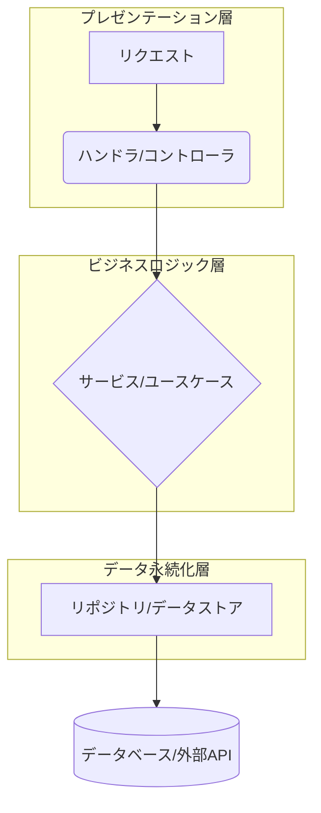

## `Go`におけるレイヤードアーキテクチャ 🧱

`Go`では、特定のアーキテクチャパターンは強制されませんが、役割ごとにコードを分けるレイヤードアーキテクチャが広く採用されています。これは`MVC`に似た考え方ですが、`Go`の設計哲学に沿ったよりシンプルで疎結合な構成です。

### 図解：`Go`のレイヤードアーキテクチャの概要



### 各レイヤーの役割

#### ハンドラ/コントローラ (プレゼンテーション層)

- **役割**: `HTTP`リクエストを受け付け、応答を返すインターフェースです。
- **機能**: リクエストの検証、データのパース（`JSON`など）、サービスへの処理依頼、レスポンスの生成を行います。
- **Goでの実装**: `net/http`パッケージや`Web`フレームワーク（`Echo`, `Gin`など）の`Handler`関数やメソッドとして実装されます。
- **`MVC`との比較**: `MVC`の「コントローラ」に相当します。

#### サービス/ユースケース (ビジネスロジック層)

- **役割**: アプリケーションのコアとなるビジネスロジックを実行します。
- **機能**: データの計算、複数のリポジトリの呼び出し、複雑なビジネスルールの適用など、アプリケーションの「中核」となる処理を担います。
- **Goでの実装**: サービスの構造体とそのメソッドとして実装されます。インターフェースを使って、依存するリポジトリなどを抽象化するのが一般的です。
- **`MVC`との比較**: `MVC`の「モデル」の一部（ビジネスロジック）に相当します。

#### リポジトリ/データストア (データ永続化層)

- **役割**: データの永続化（データベースへの保存）を抽象化します。
- **機能**: データベースへの接続、`SQL`クエリの実行、データの読み書きなど、具体的なデータ操作をカプセル化します。
- **Goでの実装**: データベース操作を定義するインターフェースと、それを実装する構造体として実装されます。
- **`MVC`との比較**: `MVC`の「モデル」の別の部分（データアクセス）に相当します。

この構成では、各レイヤーが独立しているため、例えばデータベースを変更する際も、リポジトリレイヤーの実装を差し替えるだけで、サービスやハンドラレイヤーに影響を与えないように設計できます。これにより、保守性とテスト容易性が大幅に向上します。

### ドメインモデル (`Domain Model`) の追加

提示された構成では、サービス層とリポジトリ層が直接データをやり取りしているように見えますが、その間にドメインモデルというレイヤーを追加することで、アプリケーションのコアな概念をより明確にすることができます。

- **役割**: アプリケーションの中心となるビジネスオブジェクトを定義します。これは、データベースのテーブル構造に直接縛られず、ビジネスルールを内包する純粋な`Go`の構造体です。
- **機能**: 例えば、ユーザーのパスワードハッシュ化や注文の合計金額計算など、そのオブジェクト自身が持つべきロジックをメソッドとして定義します。これにより、ビジネスロジックがサービス層だけでなく、より適切な場所に配置されるようになります。
- **実装**: `internal/domain/` ディレクトリに、各ドメイン（例: `user.go`, `order.go`）の構造体とメソッドを定義します。

#### 例：`User`ドメインモデル

```go
// internal/domain/user.go
package domain

import (
	"golang.org/x/crypto/bcrypt"
)

type User struct {
	ID        int
	Name      string
	Email     string
	Password  string // Hashed password
}

// NewUser は新しいユーザーを生成し、パスワードをハッシュ化する
func NewUser(name, email, password string) (*User, error) {
	hashedPassword, err := bcrypt.GenerateFromPassword([]byte(password), bcrypt.DefaultCost)
	if err != nil {
		return nil, err
	}
	return &User{
		Name:     name,
		Email:    email,
		Password: string(hashedPassword),
	}, nil
}
```

この例では、パスワードのハッシュ化というビジネスルールが、サービス層ではなく、ユーザーオブジェクト自身にカプセル化されています。これにより、どのレイヤーから`NewUser`を呼び出しても、一貫したルールが適用されます。

### 設定・インフラストラクチャ層 (`Configuration/Infrastructure Layer`) の役割明確化

提示された構成では`configs/`として言及されていますが、これは単なる設定ファイルの置き場以上の役割を持ちます。

- **役割**: アプリケーションの外部依存関係（データベース接続、ロギング、キャッシュなど）を初期化・管理します。
- **機能**: `main.go`の近くにこのロジックを集約することで、アプリケーションの起動時に必要なすべての外部サービスをセットアップする責任を明確にします。
- **実装**:
  - `configs/` ディレクトリ: `config.go`のようなファイルに、アプリケーション全体の共通設定を読み込むロジックを実装します。
  - `internal/infra/`: データベースクライアントや外部`API`クライアントなど、外部サービスへの接続クライアントを定義します。

#### 例：データベース接続の初期化

```go
// internal/infra/database.go
package infra

import (
    "database/sql"
    _ "github.com/lib/pq" // PostgreSQLドライバ
)

// NewPostgresDB はデータベース接続を確立する
func NewPostgresDB(connStr string) (*sql.DB, error) {
    db, err := sql.Open("postgres", connStr)
    if err != nil {
        return nil, err
    }
    if err := db.Ping(); err != nil {
        return nil, err
    }
    return db, nil
}
```

この`NewPostgresDB`関数は、`main.go`から呼び出され、確立された接続がリポジトリ層に注入されます。これにより、リポジトリ層は具体的なデータベース実装に依存せず、インターフェースを介して抽象的に操作できます。

### テスト戦略の明確化

レイヤードアーキテクチャの最大の利点の一つは、テスト容易性です。各レイヤーを独立してテストする戦略を明確にしておくと、開発効率が大幅に向上します。

- **プレゼンテーション層 (ハンドラ)**:
  - **テストタイプ**: ユニットテストとインテグレーションテスト。
  - **テスト方法**: モックのサービスを使用して、リクエストとレスポンスの処理が正しく行われているかを確認します。実際のビジネスロジックはテスト対象外です。

- **ビジネスロジック層 (サービス)**:
  - **テストタイプ**: ユニットテスト。
  - **テスト方法**: モックのリポジトリを使用して、複雑なビジネスロジックが期待通りに動作するかを検証します。データベースへのアクセスは行いません。

- **データ永続化層 (リポジトリ)**:
  - **テストタイプ**: インテグレーションテスト。
  - **テスト方法**: 実際のデータベースインスタンス（`Docker`コンテナなど）を起動して、`SQL`クエリやデータ操作が正しく行われるかを確認します。

これらの追加的な考慮事項は、`Go`でスケーラブルでメンテナンス性の高いアプリケーションを構築する上で非常に重要です。

### 依存性注入 (`DI`)

レイヤードアーキテクチャでは、各層が疎結合であるべきです。これを実現する最も効果的な手法が`DI`です。`DI`は、あるコンポーネントが依存するオブジェクトを、そのコンポーネント自身が生成するのではなく、外部から渡す（注入する）という設計パターンです。

- **なぜ`DI`が必要か**
  - **テスト容易性**: 依存性を外部から注入することで、テスト時にモックやスタブに簡単に差し替えることができます。例えば、サービス層のテストでは、本物のデータベース接続ではなく、モックのリポジトリを注入することで、データベースアクセスを伴わない高速なユニットテストが可能になります。
  - **柔軟性と再利用性**: 依存関係が明確になり、コンポーネントが特定の具象実装に縛られなくなります。これにより、リポジトリ層の実装を`PostgreSQL`から`MongoDB`に変更する場合でも、サービス層のコードを修正する必要がなくなります。

#### 実装例

サービス層にリポジトリを注入する例です。

```go
// internal/app/service/user_service.go
package service

import (
	"my-api-project/internal/domain"
)

// UserRepository はリポジトリ層の抽象化
type UserRepository interface {
	GetUserByID(id int) (*domain.User, error)
	// その他のデータベース操作...
}

// UserService はビジネスロジックを担う
type UserService struct {
	repo UserRepository // インターフェースを介して依存性を定義
}

// NewUserService は新しいUserServiceを初期化
func NewUserService(repo UserRepository) *UserService {
	return &UserService{repo: repo}
}

// GetUser はユーザーを取得するビジネスロジック
func (s *UserService) GetUser(id int) (*domain.User, error) {
	// リポジトリの抽象メソッドを呼び出す
	return s.repo.GetUserByID(id)
}
```

この例では、`UserService`は具体的な`UserRepository`の実装を知りません。`NewUserService`関数で注入された`UserRepository`インターフェースを介してのみ操作します。これにより、テスト時にはこのインターフェースのモック実装を渡すことができます。

### エラーの抽象化 (`Error Abstraction`)

`Go`のエラーハンドリングは強力ですが、各レイヤーで発生するエラーをそのまま上位層に伝播させると、レイヤー間の依存性が高まります。エラーを抽象化することで、この問題を解決し、堅牢なアーキテクチャを維持できます。

- **なぜエラーの抽象化が必要か**
  - **レイヤー間の分離**: リポジトリ層で発生したデータベース特有のエラー（例: `pq: no rows in result set`）をサービス層にそのまま渡してしまうと、サービス層がデータベースの実装に依存してしまいます。これを`domain.UserNotFound`のような汎用的なエラーに変換することで、依存関係を断ち切ります。
  - **一貫したエラー処理**: プレゼンテーション層（ハンドラ）は、抽象化されたエラー（例: `domain.InvalidInput`）を基に、適切な`HTTP`ステータスコード（例: `400 Bad Request`）を返すことができます。これにより、エラーの種別ごとに一貫したレスポンスを生成しやすくなります。

#### 実装例

リポジトリ層で発生したエラーを抽象化してサービス層に返す例です。

```go
// internal/app/service/user_service.go (修正版)
package service

import (
	"my-api-project/internal/domain"
	"errors"
)

func (s *UserService) GetUser(id int) (*domain.User, error) {
	user, err := s.repo.GetUserByID(id)
	if err != nil {
		if errors.Is(err, domain.ErrUserNotFound) {
			// リポジトリからの特定のエラーをサービス層のエラーに変換
			return nil, domain.ErrUserNotFound
		}
		// その他の予期せぬエラーはそのまま返す
		return nil, fmt.Errorf("failed to get user: %w", err)
	}
	return user, nil
}
```

```go
// internal/domain/error.go
package domain

import "errors"

var (
	ErrUserNotFound = errors.New("user not found")
	// その他のドメインエラー...
)
```

この構成では、`service`層は`repository`層の具体的なエラーを知る必要がなくなり、`domain`で定義されたエラーのみを扱います。これにより、各レイヤーが独立した責任を持つという原則が保たれます。

これらの概念を導入することで、`Go`のレイヤードアーキテクチャはさらに洗練され、長期的なプロジェクトのメンテナンス性が飛躍的に向上します。