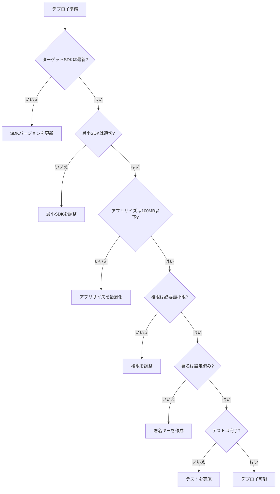
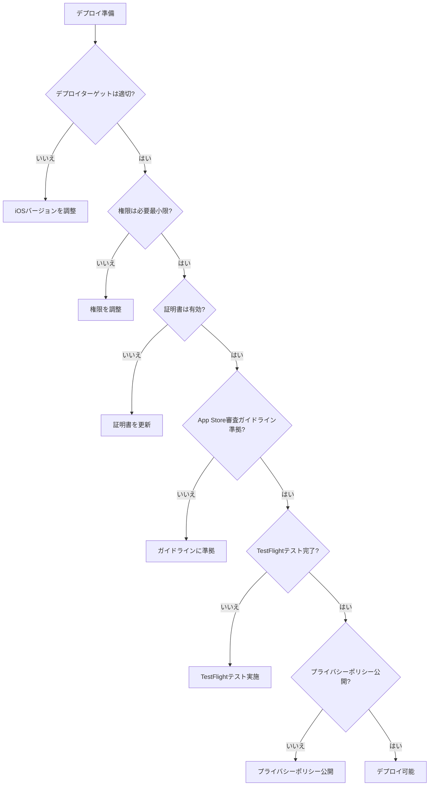

## デプロイ準備完全ガイド

FlutterアプリケーションをAndroidとiOSにデプロイする際の準備事項と、プラットフォーム別の検討事項を詳しく解説します。

### デプロイ準備とは

Flutterアプリケーションをデプロイする前に、適切な準備を行うことで、スムーズなデプロイとリリース後の安定運用を実現できます。

```
デプロイ準備の全体像
   ├─ 共通の準備事項
   ├─ Android固有の準備事項
   ├─ iOS固有の準備事項
   ├─ デプロイ前のチェックリスト
   └─ デプロイ後の確認事項
```

### なぜデプロイ準備が重要なのか

#### デプロイ準備なしの問題

**問題のある状況:**

```
- アプリのビルドが失敗する
- ストア審査に時間がかかる
- リリース後に不具合が発生する
- セキュリティの問題が発見される
- パフォーマンスの問題が発生する
```

**影響:**

- リリースが遅延する
- ユーザー体験が低下する
- セキュリティリスクが発生する
- 運用コストが増加する

#### デプロイ準備による解決

**改善された状況:**

```
- アプリのビルドが成功する
- ストア審査がスムーズに進む
- リリース後の不具合が少ない
- セキュリティが確保される
- パフォーマンスが最適化される
```

**メリット:**

- リリースがスムーズに進む
- ユーザー体験が向上する
- セキュリティリスクが低減する
- 運用コストが削減される

## 1. 共通の準備事項

### 1.1 アプリ情報の設定

#### アプリ情報の設定

アプリ情報は、ストアに表示される重要な情報です。適切に設定することで、ユーザーにアプリの価値を伝えることができます。

**設定すべきアプリ情報:**

1. **アプリ名**: アプリの名前（Android: `android/app/src/main/AndroidManifest.xml`、iOS: `ios/Runner/Info.plist`）
2. **バージョン**: アプリのバージョン（`pubspec.yaml`）
3. **説明**: アプリの説明（ストア用）
4. **アイコン**: アプリのアイコン（Android: `android/app/src/main/res/`、iOS: `ios/Runner/Assets.xcassets/AppIcon.appiconset/`）
5. **スクリーンショット**: アプリのスクリーンショット（ストア用）

**アプリ情報の設定例:**

```yaml
# pubspec.yaml
name: my_app
description: アプリの説明
version: 1.0.0+1  # バージョン名+ビルド番号

# AndroidManifest.xml
<manifest xmlns:android="http://schemas.android.com/apk/res/android">
    <application
        android:label="My App"  # アプリ名
        android:icon="@mipmap/ic_launcher">  # アイコン
    </application>
</manifest>

# Info.plist
<key>CFBundleDisplayName</key>
<string>My App</string>  # アプリ名
<key>CFBundleShortVersionString</key>
<string>1.0.0</string>  # バージョン名
<key>CFBundleVersion</key>
<string>1</string>  # ビルド番号
```

### 1.2 環境変数の設定

#### 環境変数の設定

環境変数は、開発環境と本番環境で異なる設定を管理するために使用します。

**環境変数の設定方法:**

1. **flutter_dotenvを使用**: `flutter_dotenv`パッケージを使用して環境変数を管理
2. **環境別の設定ファイル**: 開発環境と本番環境で異なる設定ファイルを使用
3. **機密情報の管理**: APIキーなどの機密情報を環境変数で管理

**環境変数の設定例:**

```dart
// pubspec.yaml
dependencies:
  flutter_dotenv: ^5.0.2

// .env.development
API_BASE_URL=https://api-dev.example.com
API_KEY=dev_api_key

// .env.production
API_BASE_URL=https://api.example.com
API_KEY=prod_api_key

// lib/config/env.dart
import 'package:flutter_dotenv/dotenv.dart';

class Env {
  static String get apiBaseUrl => dotenv.env['API_BASE_URL'] ?? '';
  static String get apiKey => dotenv.env['API_KEY'] ?? '';
}

// main.dart
void main() async {
  await dotenv.load(fileName: '.env.production');
  runApp(MyApp());
}
```

### 1.3 ビルド設定の最適化

#### ビルド設定の最適化

ビルド設定を最適化することで、アプリのパフォーマンスとサイズを改善できます。

**ビルド設定の最適化:**

1. **リリースビルド**: デバッグシンボルを削除し、最適化を有効化
2. **コード分割**: 必要なコードのみをバンドル
3. **アセットの最適化**: 画像やフォントなどのアセットを最適化

**ビルド設定の最適化例:**

```bash
# リリースビルド（Android）
flutter build apk --release
# または
flutter build appbundle --release

# リリースビルド（iOS）
flutter build ios --release

# ビルド設定の確認
flutter build apk --release --verbose
```

## 2. Android固有の準備事項

### 2.1 Androidのデプロイ準備

#### Androidのデプロイ準備

AndroidアプリをGoogle Play Storeにデプロイするには、以下の準備が必要です。

**Androidのデプロイ準備:**

1. **Google Play Consoleアカウント**: Google Play Consoleのアカウントを作成
2. **アプリの登録**: Google Play Consoleでアプリを登録
3. **署名キーの作成**: アプリの署名キーを作成
4. **App Bundleの作成**: Android App Bundle（AAB）を作成
5. **ストアリスティング**: ストアリスティング情報を設定

**Androidのデプロイ準備の例:**

```bash
# 署名キーの作成
keytool -genkey -v -keystore ~/upload-keystore.jks \
  -keyalg RSA -keysize 2048 -validity 10000 \
  -alias upload

# key.propertiesの作成
storePassword=your_store_password
keyPassword=your_key_password
keyAlias=upload
storeFile=/path/to/upload-keystore.jks

# android/app/build.gradleの設定
def keystoreProperties = new Properties()
def keystorePropertiesFile = rootProject.file('key.properties')
if (keystorePropertiesFile.exists()) {
    keystoreProperties.load(new FileInputStream(keystorePropertiesFile))
}

android {
    signingConfigs {
        release {
            keyAlias keystoreProperties['keyAlias']
            keyPassword keystoreProperties['keyPassword']
            storeFile keystoreProperties['storeFile'] ? file(keystoreProperties['storeFile']) : null
            storePassword keystoreProperties['storePassword']
        }
    }
    buildTypes {
        release {
            signingConfig signingConfigs.release
        }
    }
}

# App Bundleの作成
flutter build appbundle --release
```

### 2.2 Android固有の検討事項

#### Android固有の検討事項

Androidアプリをデプロイする際に検討すべき事項を詳しく解説します。

**Android固有の検討事項:**

1. **ターゲットSDKバージョン**: 最新のAndroid SDKバージョンをターゲットにする
2. **最小SDKバージョン**: サポートするAndroidの最小バージョンを設定
3. **権限の設定**: 必要な権限のみを要求する
4. **ProGuard/R8の設定**: コードの難読化と最適化を設定
5. **アプリサイズの最適化**: アプリサイズを最小化する

**ターゲットSDKバージョンの設定:**

```gradle
# android/app/build.gradle
android {
    compileSdkVersion 34
    
    defaultConfig {
        minSdkVersion 21  # Android 5.0以上
        targetSdkVersion 34  # 最新のAndroid SDK
    }
}
```

**権限の設定:**

```xml
<!-- android/app/src/main/AndroidManifest.xml -->
<manifest xmlns:android="http://schemas.android.com/apk/res/android">
    <!-- インターネットアクセス -->
    <uses-permission android:name="android.permission.INTERNET" />
    
    <!-- カメラアクセス（必要な場合のみ） -->
    <uses-permission android:name="android.permission.CAMERA" />
    
    <!-- 位置情報アクセス（必要な場合のみ） -->
    <uses-permission android:name="android.permission.ACCESS_FINE_LOCATION" />
</manifest>
```

**ProGuard/R8の設定:**

```gradle
# android/app/build.gradle
android {
    buildTypes {
        release {
            minifyEnabled true
            shrinkResources true
            proguardFiles getDefaultProguardFile('proguard-android-optimize.txt'), 'proguard-rules.pro'
        }
    }
}

# android/app/proguard-rules.pro
# Flutter関連のルール
-keep class io.flutter.app.** { *; }
-keep class io.flutter.plugin.** { *; }
-keep class io.flutter.util.** { *; }
-keep class io.flutter.view.** { *; }
-keep class io.flutter.** { *; }
```

**アプリサイズの最適化:**

```yaml
# pubspec.yaml
flutter:
  # 使用しないアセットを削除
  # 画像の最適化
  # フォントのサブセット化
```

### 2.3 Androidのデプロイ基準

#### Androidのデプロイ基準

Androidアプリをデプロイする際の基準を明確にすることで、適切な判断ができます。

**Androidのデプロイ基準:**

| 項目 | 基準 | 理由 |
|------|------|------|
| **ターゲットSDK** | 最新のSDKバージョン | Google Playの要件、セキュリティ向上 |
| **最小SDK** | Android 5.0（API 21）以上 | 市場シェア、機能の制約 |
| **アプリサイズ** | 100MB以下（推奨） | ダウンロード速度、ストレージ使用量 |
| **権限** | 必要最小限の権限 | プライバシー保護、ユーザー信頼 |
| **署名** | リリース署名必須 | アプリの整合性、更新の安全性 |
| **テスト** | 内部テスト完了 | 品質保証、ユーザー体験 |

**デプロイ基準の判断フロー:**



## 3. iOS固有の準備事項

### 3.1 iOSのデプロイ準備

#### iOSのデプロイ準備

iOSアプリをApp Storeにデプロイするには、以下の準備が必要です。

**iOSのデプロイ準備:**

1. **Apple Developerアカウント**: Apple Developer Programに登録（年間$99）
2. **証明書の作成**: 開発用と配布用の証明書を作成
3. **プロビジョニングプロファイル**: アプリのプロビジョニングプロファイルを作成
4. **App Store Connectでの登録**: App Store Connectでアプリを登録
5. **ストアリスティング**: ストアリスティング情報を設定

**iOSのデプロイ準備の例:**

```bash
# Xcodeで証明書とプロビジョニングプロファイルを設定
# 1. Xcodeを開く
# 2. Preferences → Accounts → Apple IDを追加
# 3. Signing & Capabilitiesで自動署名を有効化

# または手動で設定
# 1. Apple Developer Portalで証明書を作成
# 2. プロビジョニングプロファイルを作成
# 3. Xcodeで証明書とプロビジョニングプロファイルを設定

# ビルドとアーカイブ
flutter build ios --release
# Xcodeでアーカイブ
# Product → Archive → Distribute App → App Store Connect
```

### 3.2 iOS固有の検討事項

#### iOS固有の検討事項

iOSアプリをデプロイする際に検討すべき事項を詳しく解説します。

**iOS固有の検討事項:**

1. **デプロイターゲット**: サポートするiOSの最小バージョンを設定
2. **権限の設定**: Info.plistで必要な権限を設定
3. **App Transport Security**: HTTPS通信の要件を設定
4. **App Store審査ガイドライン**: App Store審査ガイドラインに準拠
5. **TestFlight**: ベータテストの実施

**デプロイターゲットの設定:**

```swift
// ios/Podfile
platform :ios, '12.0'  # iOS 12.0以上

// ios/Runner.xcodeproj/project.pbxproj
IPHONEOS_DEPLOYMENT_TARGET = 12.0;
```

**権限の設定:**

```xml
<!-- ios/Runner/Info.plist -->
<key>NSCameraUsageDescription</key>
<string>カメラを使用して写真を撮影します</string>

<key>NSLocationWhenInUseUsageDescription</key>
<string>位置情報を使用して現在地を表示します</string>

<key>NSPhotoLibraryUsageDescription</key>
<string>写真ライブラリから画像を選択します</string>
```

**App Transport Securityの設定:**

```xml
<!-- ios/Runner/Info.plist -->
<key>NSAppTransportSecurity</key>
<dict>
    <key>NSAllowsArbitraryLoads</key>
    <false/>
    <key>NSExceptionDomains</key>
    <dict>
        <key>api.example.com</key>
        <dict>
            <key>NSExceptionAllowsInsecureHTTPLoads</key>
            <false/>
            <key>NSIncludesSubdomains</key>
            <true/>
        </dict>
    </dict>
</dict>
```

**App Store審査ガイドラインへの準拠:**

```markdown
## App Store審査ガイドラインの主要な要件

1. **機能要件**
   - アプリは正常に動作すること
   - クラッシュやバグがないこと
   - 説明された機能が実装されていること

2. **コンテンツ要件**
   - 不適切なコンテンツがないこと
   - 著作権を侵害していないこと
   - プライバシーポリシーが公開されていること

3. **技術要件**
   - 最新のiOS SDKを使用していること
   - 適切な権限を要求していること
   - セキュリティが確保されていること

4. **デザイン要件**
   - アプリのデザインが適切であること
   - ユーザーインターフェースが使いやすいこと
```

### 3.3 iOSのデプロイ基準

#### iOSのデプロイ基準

iOSアプリをデプロイする際の基準を明確にすることで、適切な判断ができます。

**iOSのデプロイ基準:**

| 項目 | 基準 | 理由 |
|------|------|------|
| **デプロイターゲット** | iOS 12.0以上（推奨） | 市場シェア、機能の制約 |
| **App Store審査** | ガイドライン準拠 | 審査通過の必須要件 |
| **権限** | 必要最小限の権限 | プライバシー保護、ユーザー信頼 |
| **証明書** | 有効な配布証明書 | アプリの整合性、更新の安全性 |
| **TestFlight** | ベータテスト完了 | 品質保証、ユーザー体験 |
| **プライバシーポリシー** | 公開必須 | App Store審査要件 |

**デプロイ基準の判断フロー:**



## 4. デプロイ前のチェックリスト

### 4.1 共通チェックリスト

#### 共通チェックリスト

**共通チェックリスト:**

- [ ] **アプリ情報**: アプリ名、バージョン、説明が設定されている
- [ ] **アイコン**: アプリのアイコンが設定されている
- [ ] **スクリーンショット**: ストア用のスクリーンショットが準備されている
- [ ] **環境変数**: 本番環境の環境変数が設定されている
- [ ] **ビルド**: リリースビルドが成功する
- [ ] **テスト**: すべてのテストが通過する
- [ ] **パフォーマンス**: パフォーマンステストが完了している
- [ ] **セキュリティ**: セキュリティチェックが完了している

### 4.2 Android固有チェックリスト

#### Android固有チェックリスト

**Android固有チェックリスト:**

- [ ] **ターゲットSDK**: 最新のAndroid SDKをターゲットにしている
- [ ] **最小SDK**: 適切な最小SDKバージョンが設定されている
- [ ] **権限**: 必要な権限のみが要求されている
- [ ] **署名**: リリース署名が設定されている
- [ ] **App Bundle**: Android App Bundle（AAB）が作成されている
- [ ] **ProGuard/R8**: コードの難読化と最適化が設定されている
- [ ] **アプリサイズ**: アプリサイズが100MB以下（推奨）

### 4.3 iOS固有チェックリスト

#### iOS固有チェックリスト

**iOS固有チェックリスト:**

- [ ] **デプロイターゲット**: 適切なiOSバージョンが設定されている
- [ ] **権限**: Info.plistで必要な権限が設定されている
- [ ] **証明書**: 有効な配布証明書が設定されている
- [ ] **プロビジョニングプロファイル**: 配布用のプロビジョニングプロファイルが設定されている
- [ ] **App Store審査**: App Store審査ガイドラインに準拠している
- [ ] **TestFlight**: TestFlightでのベータテストが完了している
- [ ] **プライバシーポリシー**: プライバシーポリシーが公開されている

## 5. デプロイ後の確認事項

### 5.1 デプロイ後の確認事項

#### デプロイ後の確認事項

デプロイ後は、以下の事項を確認します。

**デプロイ後の確認事項:**

1. **ストアでの表示確認**: ストアでアプリが正しく表示されているか確認
2. **ダウンロードテスト**: 実際にダウンロードして動作確認
3. **クラッシュレポート**: クラッシュレポートを確認
4. **ユーザーフィードバック**: ユーザーからのフィードバックを確認
5. **パフォーマンス監視**: パフォーマンスメトリクスを監視

**デプロイ後の確認例:**

```markdown
## デプロイ後の確認例

### ストアでの表示確認

- [ ] アプリ名が正しく表示されている
- [ ] アイコンが正しく表示されている
- [ ] スクリーンショットが正しく表示されている
- [ ] 説明文が正しく表示されている
- [ ] 価格が正しく設定されている

### ダウンロードテスト

- [ ] アプリが正常にダウンロードできる
- [ ] アプリが正常にインストールできる
- [ ] アプリが正常に起動する
- [ ] 主要な機能が正常に動作する
- [ ] クラッシュが発生しない

### クラッシュレポート

- [ ] Firebase Crashlyticsでクラッシュレポートを確認
- [ ] クラッシュが発生していないことを確認
- [ ] エラーが発生していないことを確認
```

## 6. まとめ

デプロイ準備は、Flutterアプリケーションをスムーズにデプロイし、リリース後の安定運用を実現するための重要な活動です。

**重要なポイント:**

- **共通の準備事項**: アプリ情報、環境変数、ビルド設定の最適化
- **Android固有の準備事項**: 署名キー、App Bundle、ProGuard/R8の設定
- **iOS固有の準備事項**: 証明書、プロビジョニングプロファイル、App Store審査への準拠
- **デプロイ基準**: 明確な基準に基づいた判断
- **チェックリスト**: デプロイ前の確認事項
- **デプロイ後の確認**: ストアでの表示、ダウンロードテスト、クラッシュレポートの確認

これらのポイントを守ることで、Flutterアプリケーションをスムーズにデプロイし、リリース後の安定運用を実現できます。

