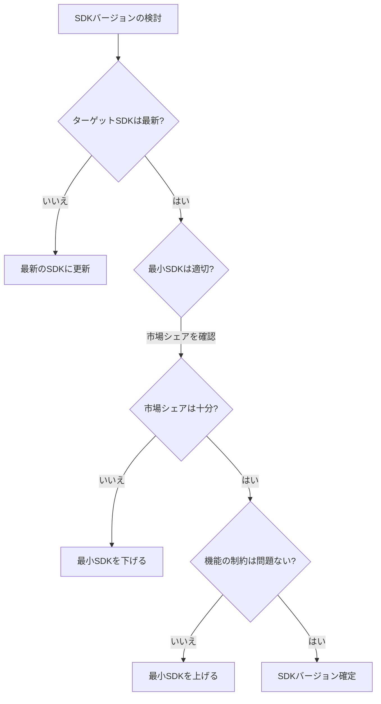
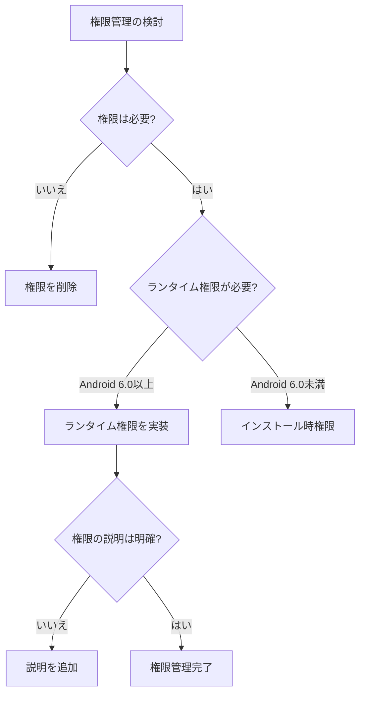
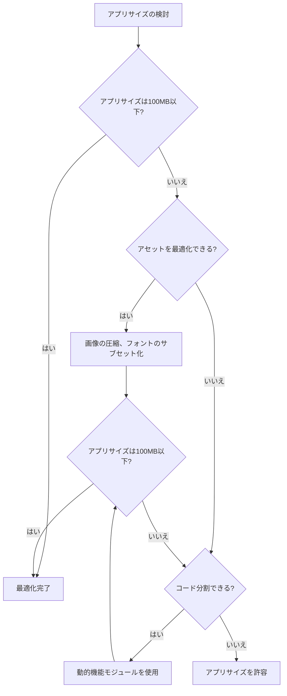
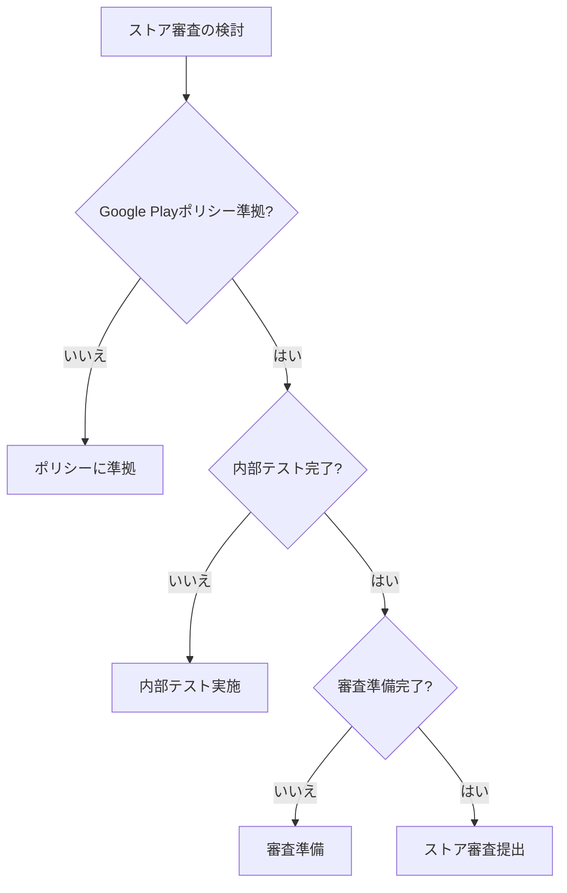
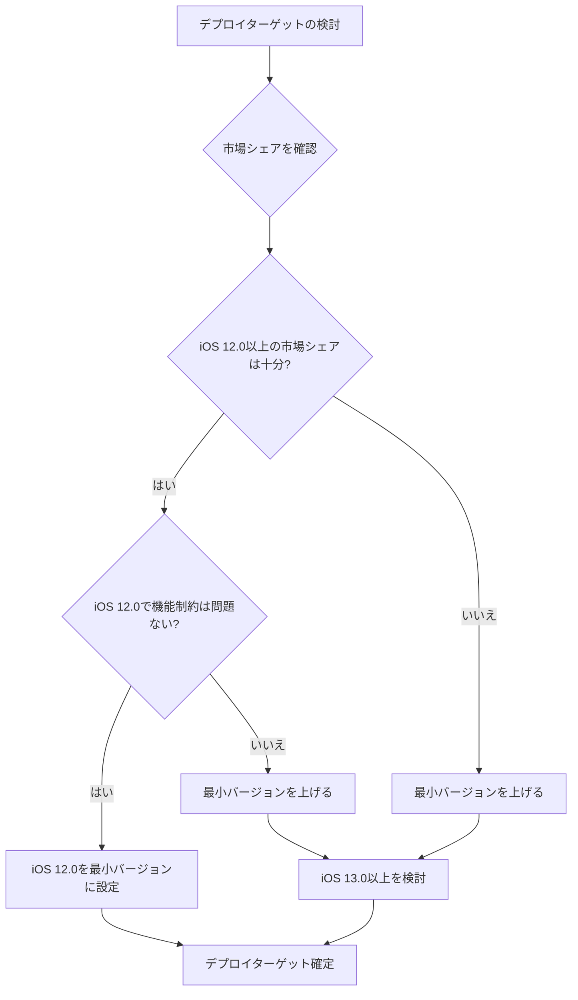
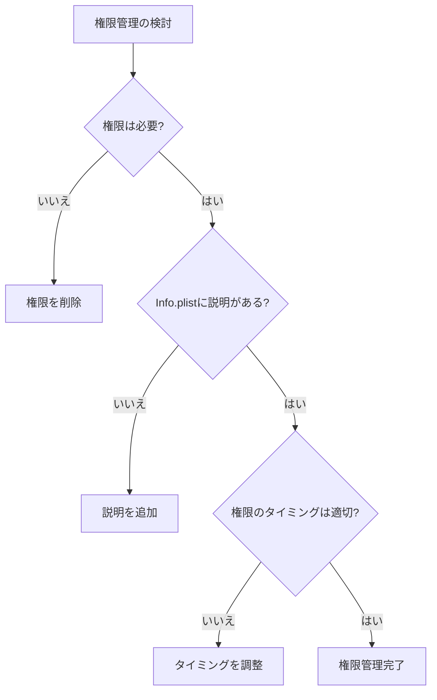
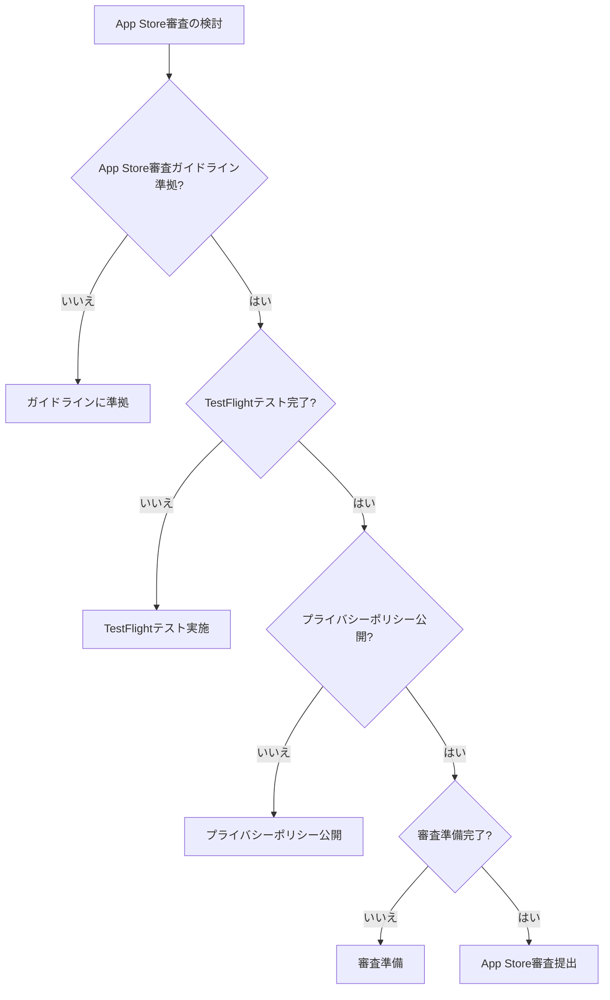
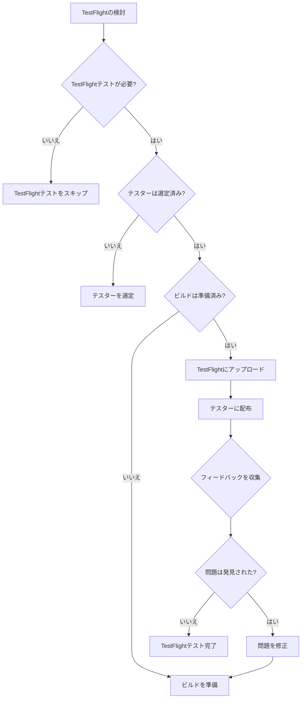
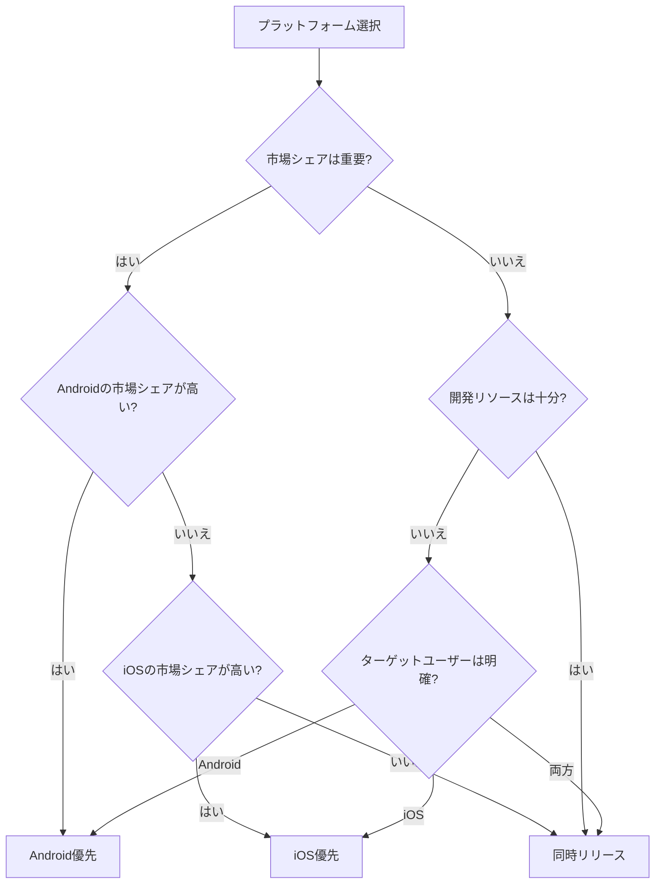

## AndroidとiOSの検討事項

FlutterアプリケーションをAndroidとiOSにデプロイする際の、プラットフォーム別の検討事項と判断基準を詳しく解説します。

### プラットフォーム別の検討事項とは

AndroidとiOSは、異なるプラットフォーム特性を持つため、それぞれに適した検討事項があります。

```
プラットフォーム別の検討事項
   ├─ Android固有の検討事項
   │   ├─ SDKバージョン
   │   ├─ 権限管理
   │   ├─ アプリサイズ
   │   └─ ストア審査
   └─ iOS固有の検討事項
       ├─ デプロイターゲット
       ├─ 権限管理
       ├─ App Store審査
       └─ TestFlight
```

### なぜプラットフォーム別の検討事項が重要なのか

#### プラットフォーム別の検討事項を理解しない場合の問題

**問題のある状況:**

```
- プラットフォームの特性を理解していない
- 適切な設定ができていない
- ストア審査に時間がかかる
- リリース後に不具合が発生する
```

**影響:**

- デプロイが遅延する
- ストア審査が通らない
- ユーザー体験が低下する
- 運用コストが増加する

#### プラットフォーム別の検討事項を理解することによる解決

**改善された状況:**

```
- プラットフォームの特性を理解している
- 適切な設定ができている
- ストア審査がスムーズに進む
- リリース後の不具合が少ない
```

**メリット:**

- デプロイがスムーズに進む
- ストア審査が通りやすい
- ユーザー体験が向上する
- 運用コストが削減される

## 1. Android固有の検討事項

### 1.1 SDKバージョンの検討

#### SDKバージョンの検討

AndroidのSDKバージョンは、アプリの互換性と機能に影響を与えます。

**SDKバージョンの検討基準:**

| 項目 | 基準 | 理由 |
|------|------|------|
| **ターゲットSDK** | 最新のSDKバージョン | Google Playの要件、セキュリティ向上、新機能の利用 |
| **最小SDK** | Android 5.0（API 21）以上 | 市場シェア、機能の制約、開発効率 |
| **推奨最小SDK** | Android 8.0（API 26）以上 | パフォーマンス、セキュリティ、機能の制約 |

**SDKバージョンの判断フロー:**



**SDKバージョンの設定例:**

```plaintext
# android/app/build.gradle
android {
    compileSdkVersion 34  # 最新のSDK
    
    defaultConfig {
        minSdkVersion 21  # Android 5.0以上（市場シェアを考慮）
        targetSdkVersion 34  # 最新のSDK
    }
}
```

**市場シェアの確認:**

```markdown
## Androidバージョンの市場シェア（2024年）

- Android 12以上: 約60%
- Android 11以上: 約75%
- Android 10以上: 約85%
- Android 8.0以上: 約95%
- Android 5.0以上: 約99%

**推奨:**
- 最小SDK: Android 5.0（API 21）以上
- 推奨最小SDK: Android 8.0（API 26）以上
```

### 1.2 権限管理の検討

#### 権限管理の検討

Androidの権限管理は、ユーザーのプライバシー保護とアプリの機能に影響を与えます。

**権限管理の検討基準:**

| 項目 | 基準 | 理由 |
|------|------|------|
| **権限の要求** | 必要最小限の権限 | プライバシー保護、ユーザー信頼、ストア審査 |
| **ランタイム権限** | Android 6.0以上でランタイム権限 | ユーザー体験、プライバシー保護 |
| **権限の説明** | 明確な説明を提供 | ユーザー理解、ストア審査 |

**権限管理の判断フロー:**



**権限管理の実装例:**

```dart
// lib/permissions/permission_handler.dart
import 'package:permission_handler/permission_handler.dart';

class PermissionHandler {
  // カメラ権限の要求
  static Future<bool> requestCameraPermission() async {
    final status = await Permission.camera.request();
    return status.isGranted;
  }
  
  // 位置情報権限の要求
  static Future<bool> requestLocationPermission() async {
    final status = await Permission.location.request();
    return status.isGranted;
  }
  
  // 権限の状態確認
  static Future<bool> isPermissionGranted(Permission permission) async {
    final status = await permission.status;
    return status.isGranted;
  }
}

// AndroidManifest.xml
<manifest xmlns:android="http://schemas.android.com/apk/res/android">
    <!-- 必要な権限のみを要求 -->
    <uses-permission android:name="android.permission.INTERNET" />
    <uses-permission android:name="android.permission.CAMERA" />
    <uses-permission android:name="android.permission.ACCESS_FINE_LOCATION" />
</manifest>
```

### 1.3 アプリサイズの検討

#### アプリサイズの検討

Androidアプリのサイズは、ダウンロード速度とストレージ使用量に影響を与えます。

**アプリサイズの検討基準:**

| 項目 | 基準 | 理由 |
|------|------|------|
| **推奨サイズ** | 100MB以下 | ダウンロード速度、ストレージ使用量、ユーザー体験 |
| **最大サイズ** | 150MB（APK）、2GB（App Bundle） | Google Playの制限 |
| **最適化** | コード分割、アセット最適化 | アプリサイズの削減 |

**アプリサイズの判断フロー:**



**アプリサイズの最適化例:**

```yaml
# pubspec.yaml
flutter:
  # 使用しないアセットを削除
  # 画像の最適化
  # フォントのサブセット化

# android/app/build.gradle
android {
    buildTypes {
        release {
            minifyEnabled true
            shrinkResources true  # 未使用リソースの削除
        }
    }
}
```

### 1.4 ストア審査の検討

#### ストア審査の検討

Google Play Storeの審査は、アプリの公開に必要なプロセスです。

**ストア審査の検討基準:**

| 項目 | 基準 | 理由 |
|------|------|------|
| **審査時間** | 通常1-3日 | 審査の迅速化 |
| **審査基準** | Google Playポリシー準拠 | 審査通過の必須要件 |
| **事前審査** | 内部テストで確認 | 審査通過率の向上 |

**ストア審査の判断フロー:**



## 2. iOS固有の検討事項

### 2.1 デプロイターゲットの検討

#### デプロイターゲットの検討

iOSのデプロイターゲットは、アプリの互換性と機能に影響を与えます。

**デプロイターゲットの検討基準:**

| 項目 | 基準 | 理由 |
|------|------|------|
| **最小バージョン** | iOS 12.0以上（推奨） | 市場シェア、機能の制約、開発効率 |
| **推奨最小バージョン** | iOS 13.0以上 | パフォーマンス、セキュリティ、機能の制約 |
| **最新バージョン** | 最新のiOSバージョン | 新機能の利用、セキュリティ向上 |

**デプロイターゲットの判断フロー:**



**デプロイターゲットの設定例:**

```swift
// ios/Podfile
platform :ios, '12.0'  # iOS 12.0以上

// ios/Runner.xcodeproj/project.pbxproj
IPHONEOS_DEPLOYMENT_TARGET = 12.0;
```

**市場シェアの確認:**

```markdown
## iOSバージョンの市場シェア（2024年）

- iOS 17以上: 約70%
- iOS 16以上: 約85%
- iOS 15以上: 約95%
- iOS 14以上: 約98%
- iOS 12以上: 約99%

**推奨:**
- 最小バージョン: iOS 12.0以上
- 推奨最小バージョン: iOS 13.0以上
```

### 2.2 権限管理の検討

#### 権限管理の検討

iOSの権限管理は、ユーザーのプライバシー保護とアプリの機能に影響を与えます。

**権限管理の検討基準:**

| 項目 | 基準 | 理由 |
|------|------|------|
| **権限の要求** | 必要最小限の権限 | プライバシー保護、ユーザー信頼、App Store審査 |
| **権限の説明** | Info.plistで明確な説明 | ユーザー理解、App Store審査 |
| **権限のタイミング** | 必要な時に要求 | ユーザー体験、プライバシー保護 |

**権限管理の判断フロー:**



**権限管理の実装例:**

```xml
<!-- ios/Runner/Info.plist -->
<key>NSCameraUsageDescription</key>
<string>カメラを使用して写真を撮影します</string>

<key>NSLocationWhenInUseUsageDescription</key>
<string>位置情報を使用して現在地を表示します</string>

<key>NSPhotoLibraryUsageDescription</key>
<string>写真ライブラリから画像を選択します</string>
```

```dart
// lib/permissions/permission_handler.dart
import 'package:permission_handler/permission_handler.dart';

class PermissionHandler {
  // カメラ権限の要求
  static Future<bool> requestCameraPermission() async {
    final status = await Permission.camera.request();
    return status.isGranted;
  }
  
  // 位置情報権限の要求
  static Future<bool> requestLocationPermission() async {
    final status = await Permission.locationWhenInUse.request();
    return status.isGranted;
  }
}
```

### 2.3 App Store審査の検討

#### App Store審査の検討

App Storeの審査は、アプリの公開に必要なプロセスです。

**App Store審査の検討基準:**

| 項目 | 基準 | 理由 |
|------|------|------|
| **審査時間** | 通常1-3日 | 審査の迅速化 |
| **審査基準** | App Store審査ガイドライン準拠 | 審査通過の必須要件 |
| **事前審査** | TestFlightで確認 | 審査通過率の向上 |

**App Store審査の判断フロー:**



**App Store審査ガイドラインの主要な要件:**

```markdown
## App Store審査ガイドラインの主要な要件

### 1. 機能要件
- アプリは正常に動作すること
- クラッシュやバグがないこと
- 説明された機能が実装されていること

### 2. コンテンツ要件
- 不適切なコンテンツがないこと
- 著作権を侵害していないこと
- プライバシーポリシーが公開されていること

### 3. 技術要件
- 最新のiOS SDKを使用していること
- 適切な権限を要求していること
- セキュリティが確保されていること

### 4. デザイン要件
- アプリのデザインが適切であること
- ユーザーインターフェースが使いやすいこと
```

### 2.4 TestFlightの検討

#### TestFlightの検討

TestFlightは、App Store審査前にベータテストを実施するためのツールです。

**TestFlightの検討基準:**

| 項目 | 基準 | 理由 |
|------|------|------|
| **テスト期間** | 最低1週間 | 十分なテスト期間の確保 |
| **テスター数** | 内部テスター25人、外部テスター最大10,000人 | 十分なテスト範囲の確保 |
| **フィードバック** | テスターからのフィードバックを収集 | 品質向上、問題の早期発見 |

**TestFlightの判断フロー:**



## 3. プラットフォーム別の比較

### 3.1 AndroidとiOSの比較

#### AndroidとiOSの比較

AndroidとiOSの主要な違いを比較します。

**AndroidとiOSの比較:**

| 項目 | Android | iOS |
|------|---------|-----|
| **開発者アカウント** | 一回限りの登録料（$25） | 年間$99 |
| **審査時間** | 通常1-3日 | 通常1-3日 |
| **審査基準** | Google Playポリシー | App Store審査ガイドライン |
| **最小バージョン** | Android 5.0（推奨） | iOS 12.0（推奨） |
| **権限管理** | ランタイム権限（Android 6.0以上） | Info.plistで説明必須 |
| **アプリサイズ** | 100MB以下（推奨） | 制限なし（推奨150MB以下） |
| **ベータテスト** | 内部テスト、クローズドテスト | TestFlight |

### 3.2 プラットフォーム選択の判断基準

#### プラットフォーム選択の判断基準

AndroidとiOSのどちらを優先するか、または両方を同時にリリースするかの判断基準を明確にします。

**プラットフォーム選択の判断基準:**

| 基準 | Android優先 | iOS優先 | 同時リリース |
|------|------------|---------|------------|
| **市場シェア** | 高い市場シェアが必要 | 高い収益性が必要 | 両方の市場をカバー |
| **開発リソース** | 限定的な開発リソース | 限定的な開発リソース | 十分な開発リソース |
| **ターゲットユーザー** | Androidユーザーが多い | iOSユーザーが多い | 両方のユーザー |
| **収益モデル** | 広告収益中心 | アプリ内課金中心 | 両方の収益モデル |

**プラットフォーム選択の判断フロー:**



## 4. まとめ

AndroidとiOSの検討事項を理解することで、適切な判断基準に基づいてデプロイを進めることができます。

**重要なポイント:**

- **Android固有の検討事項**: SDKバージョン、権限管理、アプリサイズ、ストア審査
- **iOS固有の検討事項**: デプロイターゲット、権限管理、App Store審査、TestFlight
- **判断基準**: 明確な基準に基づいた判断
- **プラットフォーム選択**: 市場シェア、開発リソース、ターゲットユーザーに基づいた選択

これらのポイントを理解することで、Flutterアプリケーションを適切にデプロイし、リリース後の安定運用を実現できます。

