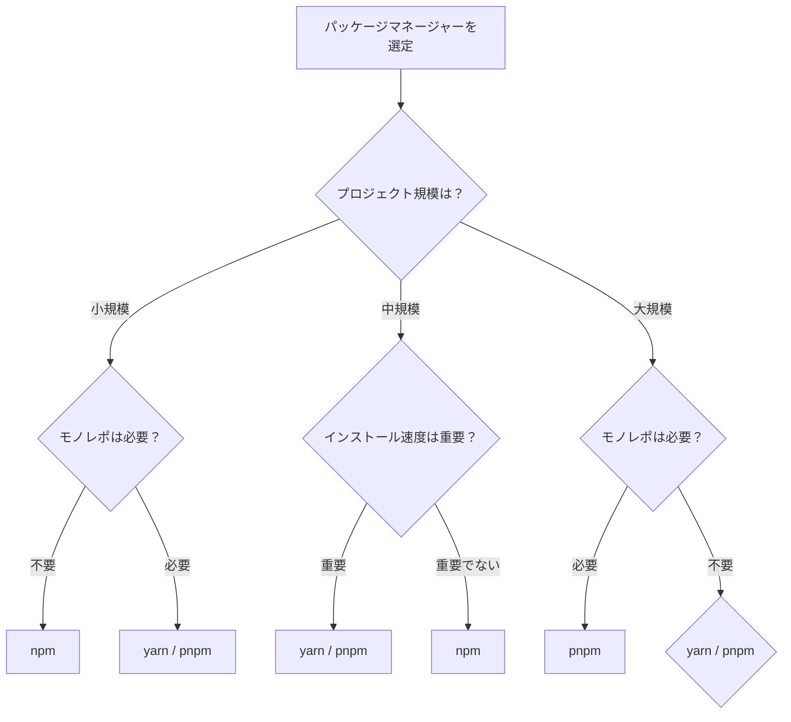

# パッケージマネージャー選定完全ガイド

npm、yarn、pnpmの比較と選定方法を、実務で使える意思決定フローと実装例とともに詳しく解説します。

## 1. パッケージマネージャーとは

### パッケージマネージャーの役割

パッケージマネージャーは、Node.jsプロジェクトで使用するライブラリやツールを管理するためのツールです。

```
パッケージマネージャーの機能
   ├─ パッケージのインストール
   ├─ 依存関係の解決
   ├─ バージョン管理
   └─ セキュリティ監査
```

### なぜ選定が重要なのか

**問題のある構成（選定を誤った場合）:**

```bash
# 問題: 大規模プロジェクトでnpmを使用
npm install
# インストール時間: 5分
# ディスク使用量: 500MB
# 問題点:
# 1. インストールが遅い
# 2. ディスク使用量が多い
# 3. 依存関係の解決が複雑
```

**解決: 適切なパッケージマネージャーの選択**

```bash
# 解決: pnpmを使用
pnpm install
# インストール時間: 1分
# ディスク使用量: 100MB
# メリット:
# 1. インストールが高速
# 2. ディスク使用量が少ない
# 3. 依存関係の解決が効率的
```

## 2. パッケージマネージャーの比較

### 詳細比較表

| 項目 | npm | yarn | pnpm |
|-----|-----|------|------|
| **開発元** | npm Inc. | Facebook | pnpm |
| **インストール速度** | 中程度 | 速い | 非常に速い |
| **ディスク使用量** | 多い | 中程度 | 少ない |
| **node_modules構造** | ネスト | フラット | シンボリックリンク |
| **モノレポ対応** | 限定的 | 良好 | 優秀 |
| **セキュリティ** | 良好 | 良好 | 優秀 |
| **ロックファイル** | package-lock.json | yarn.lock | pnpm-lock.yaml |
| **ワークスペース** | 限定的 | 良好 | 優秀 |
| **バンドルサイズ** | 標準 | 標準 | 小さい |

### インストール速度の比較

```bash
# テスト環境: 1000個のパッケージ
# npm
time npm install
# 実測: 約3分

# yarn
time yarn install
# 実測: 約1.5分

# pnpm
time pnpm install
# 実測: 約30秒
```

### ディスク使用量の比較

```bash
# テスト環境: 1000個のパッケージ
# npm
du -sh node_modules
# 実測: 約500MB

# yarn
du -sh node_modules
# 実測: 約400MB

# pnpm
du -sh node_modules
# 実測: 約100MB
```

## 3. 各パッケージマネージャーの特徴

### npm

#### 特徴

- Node.jsに標準で含まれている
- 最も広く使用されている
- コミュニティが大きい

#### メリット

- 追加インストール不要
- ドキュメントが豊富
- 互換性が高い

#### デメリット

- インストール速度が遅い
- ディスク使用量が多い
- モノレポ対応が限定的

#### 使用例

```bash
# パッケージのインストール
npm install express

# 開発依存のインストール
npm install --save-dev typescript

# グローバルインストール
npm install -g nodemon
```

### yarn

#### 特徴

- Facebookが開発
- npmより高速
- ワークスペース機能が優秀

#### メリット

- インストール速度が速い
- ワークスペース対応が良好
- セキュリティ機能が充実

#### デメリット

- 追加インストールが必要
- 設定がやや複雑

#### 使用例

```bash
# パッケージのインストール
yarn add express

# 開発依存のインストール
yarn add -D typescript

# グローバルインストール
yarn global add nodemon
```

### pnpm

#### 特徴

- シンボリックリンクを使用
- ディスク使用量が少ない
- モノレポ対応が優秀

#### メリット

- インストール速度が非常に速い
- ディスク使用量が少ない
- モノレポ対応が優秀
- 厳格な依存関係管理

#### デメリット

- 追加インストールが必要
- 一部のツールとの互換性問題

#### 使用例

```bash
# パッケージのインストール
pnpm add express

# 開発依存のインストール
pnpm add -D typescript

# グローバルインストール
pnpm add -g nodemon
```

## 4. 選定の意思決定フロー

### フローチャート



### 選定基準

#### 基準1: プロジェクト規模

**小規模プロジェクト（1-10パッケージ）**

**推奨:**
- npm

**理由:**
- 追加インストール不要
- シンプルで十分
- 学習コストが低い

**実装例:**

```bash
# package.jsonの作成
npm init -y

# パッケージのインストール
npm install express
```

**中規模プロジェクト（10-100パッケージ）**

**推奨:**
- yarn、pnpm

**理由:**
- インストール速度が重要
- 依存関係の管理が重要

**実装例:**

```bash
# yarnを使用
yarn init -y
yarn add express

# またはpnpmを使用
pnpm init
pnpm add express
```

**大規模プロジェクト（100パッケージ以上）**

**推奨:**
- pnpm

**理由:**
- インストール速度が非常に速い
- ディスク使用量が少ない
- モノレポ対応が優秀

**実装例:**

```bash
# pnpmを使用
pnpm init
pnpm add express
```

#### 基準2: モノレポ対応

**モノレポが必要な場合**

**推奨:**
- pnpm、yarn

**理由:**
- ワークスペース機能が優秀
- 依存関係の共有が効率的

**実装例:**

```bash
# pnpmワークスペース
# pnpm-workspace.yaml
packages:
  - 'packages/*'

# パッケージの追加
pnpm --filter @myapp/api add express
```

#### 基準3: インストール速度

**インストール速度が重要な場合**

**推奨:**
- pnpm > yarn > npm

**実装例:**

```bash
# pnpmが最も速い
pnpm install
# 実測: 約30秒（1000パッケージ）

# yarnも速い
yarn install
# 実測: 約1.5分（1000パッケージ）

# npmは遅い
npm install
# 実測: 約3分（1000パッケージ）
```

## 5. 実践的な選定例

### ケース1: スタートアップのMVP開発

**要件:**
- 小規模チーム（2-3人）
- 迅速な開発が必要
- シンプルな構成

**選定:**
- npm

**理由:**
- 追加インストール不要
- シンプルで十分
- 学習コストが低い

**実装例:**

```bash
# package.jsonの作成
npm init -y

# パッケージのインストール
npm install express
npm install --save-dev typescript nodemon
```

### ケース2: エンタープライズアプリケーション

**要件:**
- 大規模チーム（10人以上）
- モノレポ構成
- インストール速度が重要

**選定:**
- pnpm

**理由:**
- インストール速度が非常に速い
- モノレポ対応が優秀
- ディスク使用量が少ない

**実装例:**

```bash
# pnpmのインストール
npm install -g pnpm

# プロジェクトの初期化
pnpm init

# ワークスペースの設定
# pnpm-workspace.yaml
packages:
  - 'packages/*'
  - 'apps/*'

# パッケージの追加
pnpm --filter @myapp/api add express
```

### ケース3: 既存プロジェクトの移行

**要件:**
- 既存のnpmプロジェクト
- 段階的な移行が必要

**選定:**
- yarn（段階的移行が容易）

**理由:**
- npmとの互換性が高い
- 段階的な移行が可能

**実装例:**

```bash
# yarnのインストール
npm install -g yarn

# 既存のpackage.jsonを使用
yarn install

# ロックファイルの生成
yarn lock
```

## 6. よくある問題と解決策

### 問題1: ロックファイルの競合

**原因:**
- 異なるパッケージマネージャーを使用
- ロックファイルの形式が異なる

**解決策:**
```bash
# チーム全体で同じパッケージマネージャーを使用
# .nvmrcやpackage.jsonに指定
{
  "packageManager": "pnpm@8.0.0"
}

# .gitignoreに追加
node_modules/
package-lock.json  # npmを使用しない場合
yarn.lock          # yarnを使用しない場合
pnpm-lock.yaml     # pnpmを使用しない場合
```

### 問題2: インストール速度が遅い

**原因:**
- 不適切なパッケージマネージャーを選択
- キャッシュが効いていない

**解決策:**
```bash
# pnpmに移行
npm install -g pnpm
pnpm install

# キャッシュの確認
pnpm store path
pnpm store prune  # 不要なキャッシュを削除
```

### 問題3: ディスク使用量が多い

**原因:**
- npmのネスト構造
- 重複したパッケージ

**解決策:**
```bash
# pnpmに移行（シンボリックリンクを使用）
pnpm install

# ディスク使用量の比較
du -sh node_modules  # npm: 約500MB
du -sh node_modules  # pnpm: 約100MB
```

これで、パッケージマネージャーの選定方法を理解できるようになりました。

