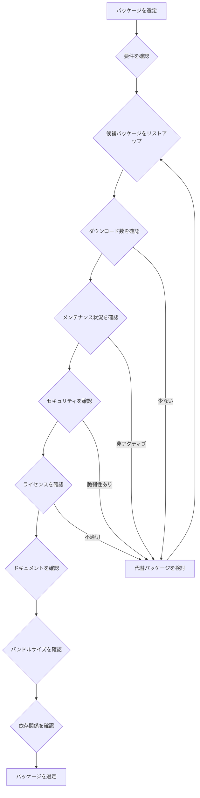

# パッケージ選定と精査完全ガイド

npmパッケージの選定方法と精査手順を、実務で使える実装例とベストプラクティスとともに詳しく解説します。

## 1. パッケージ選定の重要性

### なぜ選定が重要なのか

パッケージの選定は、プロジェクトの品質と保守性に大きく影響します。不適切な選択により、以下の問題が発生する可能性があります：

```
不適切な選定による問題
   ├─ セキュリティ脆弱性
   ├─ パフォーマンスの問題
   ├─ 保守性の低下
   └─ ライセンスの問題
```

### 選定を誤った場合の実際の事例

#### 事例1: セキュリティ脆弱性のあるパッケージ

**発生した問題:**
- 古いバージョンのパッケージを使用
- セキュリティ脆弱性が発見された
- 緊急でパッチを当てる必要があった

**結果:**
- セキュリティインシデントが発生
- 緊急対応に時間がかかる
- ユーザーへの影響

**適切な選定:**
- 定期的なセキュリティ監査
- パッケージの更新
- セキュリティ情報の確認

#### 事例2: メンテナンスされていないパッケージ

**発生した問題:**
- メンテナンスが停止したパッケージを使用
- バグが修正されない
- 新しいNode.jsバージョンに対応していない

**結果:**
- バグが修正されない
- 新機能が追加されない
- 移行コストが発生

**適切な選定:**
- メンテナンス状況の確認
- アクティブな開発の確認
- 代替パッケージの検討

## 2. パッケージ選定のチェックリスト

### チェック項目

- [ ] **ダウンロード数**: 週間ダウンロード数が十分か？
- [ ] **最終更新日**: 最近更新されているか？
- [ ] **メンテナンス状況**: アクティブにメンテナンスされているか？
- [ ] **セキュリティ**: セキュリティ脆弱性はないか？
- [ ] **ライセンス**: ライセンスは適切か？
- [ ] **ドキュメント**: ドキュメントは充実しているか？
- [ ] **TypeScript対応**: TypeScriptの型定義はあるか？
- [ ] **バンドルサイズ**: バンドルサイズは適切か？
- [ ] **依存関係**: 依存関係は少ないか？
- [ ] **コミュニティ**: コミュニティは活発か？

## 3. パッケージ情報の確認方法

### npmコマンドでの確認

```bash
# パッケージの基本情報
npm info express

# ダウンロード数
npm info express downloads

# 最終更新日
npm info express time.modified

# 依存関係
npm info express dependencies

# リポジトリ情報
npm info express repository

# ライセンス
npm info express license
```

### npm公式サイトでの確認

```bash
# ブラウザで確認
# https://www.npmjs.com/package/express

# 確認項目:
# - ダウンロード数
# - 最終更新日
# - メンテナンス状況
# - セキュリティ情報
# - ドキュメント
# - リポジトリ
```

### セキュリティ情報の確認

```bash
# セキュリティ監査
npm audit express

# セキュリティ情報の確認
npm audit

# 脆弱性の詳細
npm audit --json
```

## 4. パッケージの精査ツール

### bundle-phobia

```bash
# バンドルサイズの確認
npx bundle-phobia express

# 確認項目:
# - バンドルサイズ
# - 依存関係のサイズ
# - 代替パッケージの比較
```

### npm-check-updates

```bash
# パッケージの更新確認
npx npm-check-updates

# 更新可能なパッケージの一覧
npx npm-check-updates -u

# package.jsonの更新
npx npm-check-updates -u
npm install
```

### depcheck

```bash
# 未使用パッケージの確認
npx depcheck

# 確認項目:
# - 未使用の依存関係
# - 不足している依存関係
# - 未使用のdevDependencies
```

### npm-audit-resolver

```bash
# セキュリティ監査の解決
npx npm-audit-resolver

# 確認項目:
# - セキュリティ脆弱性
# - 修正方法
# - 影響範囲
```

## 5. 実践的な選定例

### ケース1: HTTPクライアントライブラリの選定

#### 候補パッケージ

- **axios**: 最も人気
- **node-fetch**: 軽量
- **got**: 機能が豊富

#### 比較

```bash
# axiosの確認
npm info axios
# 週間ダウンロード: 約50,000,000
# 最終更新: 2024-01-01
# 依存関係: 少ない

# node-fetchの確認
npm info node-fetch
# 週間ダウンロード: 約20,000,000
# 最終更新: 2024-01-01
# 依存関係: なし

# gotの確認
npm info got
# 週間ダウンロード: 約5,000,000
# 最終更新: 2024-01-01
# 依存関係: 中程度
```

#### 選定基準

| 項目 | axios | node-fetch | got |
|-----|-------|------------|-----|
| **人気度** | 非常に高い | 高い | 中程度 |
| **バンドルサイズ** | 中程度 | 小さい | 中程度 |
| **機能** | 豊富 | 基本的 | 豊富 |
| **TypeScript** | 対応 | 対応 | 対応 |

#### 選定結果

**小規模プロジェクト**: node-fetch（軽量）
**中規模プロジェクト**: axios（バランスが良い）
**大規模プロジェクト**: axios（機能が豊富）

### ケース2: 日付処理ライブラリの選定

#### 候補パッケージ

- **moment.js**: 最も人気（非推奨）
- **date-fns**: モダンなアプローチ
- **dayjs**: 軽量な代替

#### 比較

```bash
# moment.jsの確認
npm info moment
# 週間ダウンロード: 約20,000,000
# 最終更新: 2020-01-01（メンテナンスモード）
# バンドルサイズ: 約70KB

# date-fnsの確認
npm info date-fns
# 週間ダウンロード: 約15,000,000
# 最終更新: 2024-01-01
# バンドルサイズ: 約15KB（必要な関数のみ）

# dayjsの確認
npm info dayjs
# 週間ダウンロード: 約10,000,000
# 最終更新: 2024-01-01
# バンドルサイズ: 約2KB
```

#### 選定基準

| 項目 | moment.js | date-fns | dayjs |
|-----|-----------|----------|-------|
| **メンテナンス** | 非推奨 | アクティブ | アクティブ |
| **バンドルサイズ** | 大きい | 小さい | 非常に小さい |
| **機能** | 豊富 | 豊富 | 基本的 |
| **API** | 変更不可 | 関数型 | moment互換 |

#### 選定結果

**新規プロジェクト**: date-fns（モダン、軽量）
**既存プロジェクト**: dayjs（moment互換、軽量）

## 6. パッケージ選定の意思決定フロー

### フローチャート



## 7. 実務でのベストプラクティス

### パターン1: パッケージ選定の記録

```markdown
# パッケージ選定記録

## HTTPクライアントライブラリ

### 候補
- axios
- node-fetch
- got

### 選定理由
- axiosを選定
- 理由: 最も人気があり、機能が豊富

### 代替案
- node-fetch: 軽量が必要な場合
```

### パターン2: 定期的な精査

```bash
# 週次で実行
npm audit
npm outdated
npx depcheck

# 月次で実行
npx npm-check-updates
npx bundle-phobia <package-name>
```

### パターン3: パッケージの更新戦略

```bash
# パッチバージョンの更新（自動）
npm update

# マイナーバージョンの更新（確認後）
npm install express@^4.19.0

# メジャーバージョンの更新（慎重に）
npm install express@^5.0.0
# 破壊的変更の確認が必要
```

## 8. よくある問題と解決策

### 問題1: セキュリティ脆弱性

**原因:**
- 古いバージョンのパッケージ
- 脆弱性のある依存関係

**解決策:**
```bash
# セキュリティ監査
npm audit

# 自動修正
npm audit fix

# 手動で更新
npm install express@latest
```

### 問題2: メンテナンスが停止

**原因:**
- パッケージの開発が停止
- メンテナンスされていない

**解決策:**
```bash
# メンテナンス状況の確認
npm info <package-name> time

# 代替パッケージの検討
# 例: moment.js → date-fns
```

### 問題3: バンドルサイズが大きい

**原因:**
- 不要な機能が含まれている
- 依存関係が多い

**解決策:**
```bash
# バンドルサイズの確認
npx bundle-phobia <package-name>

# 代替パッケージの検討
# 例: moment.js → dayjs
```

これで、パッケージの選定と精査方法を理解できるようになりました。

