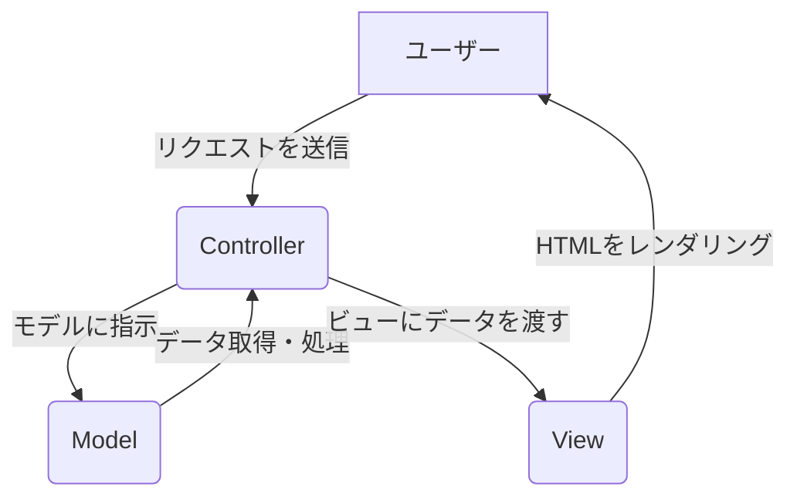
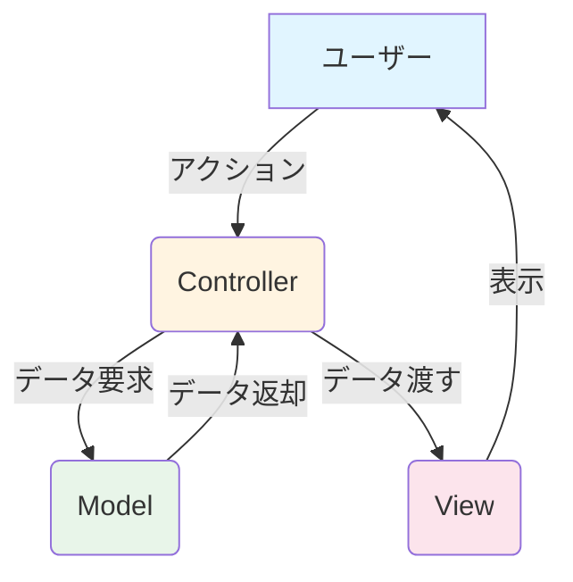

### 🎨 MVC（Model-View-Controller）とは？

MVCは、Model（モデル）、View（ビュー）、Controller（コントローラー）の頭文字をとった、Webアプリケーション開発で最も広く使われている設計パターンのひとつです。このパターンは、アプリケーションのコードを3つの独立した役割に分けて整理することで、開発をスムーズで効率的にします。まるで、プロの料理チームが役割分担をするようなものです！👨‍🍳

### なぜMVCがすごいのか？

MVCを使う最大のメリットは、アプリケーションの異なる部分を「分離」できることです。これにより、以下のような素晴らしい効果が生まれます。

- **壊れにくい！💪**: 各コンポーネントが独立しているので、例えばデザイン（View）を変更しても、データの扱い（Model）には影響しません。
- **チーム開発が楽に！🤝**: デザイナーはViewに、エンジニアはModelやControllerに集中できるので、みんなが同時に作業を進められます。
- **再利用性が高い！♻️**: 各コンポーネントが特定の役割に特化しているため、他のプロジェクトでも使い回しやすくなります。

### MVCの各コンポーネントの役割

MVCは、まるで「ウェブアプリケーションという名のレストラン」のチームです。

#### Model（モデル） 👩‍🍳

- **役割**: アプリの「データ」と「頭脳」です。データベースとやり取りし、データの読み書き、検証、関連付けといった、料理の「材料」を管理します。
- **例**: ユーザー情報、商品リスト、ブログ記事など、アプリケーションの「実体」となるものです。

#### View（ビュー） 🖼️

- **役割**: ユーザーに提供される「見た目」を担当します。モデルから受け取ったデータを、HTMLやCSSといった美しい「お皿」に盛り付けて表示します。
- **例**: ウェブページのレイアウト、フォーム、ボタンなど、ユーザーが目にするすべての要素です。

#### Controller（コントローラー） 🗣️

- **役割**: ユーザーからの「注文」を受け取り、モデルとビューをつなぐ「ウェイター」です。ユーザーのリクエストを分析し、どのデータを準備し（モデルに指示）、どのように提供するか（ビューに指示）を調整します。
- **例**: 「このURLにアクセスされたら、ユーザー一覧を準備して表示して！」といった司令塔の役割を果たします。

### 動作の流れ（レストランの注文プロセス風）

MVCがどのように連携しているかを、注文プロセスで見てみましょう。

1. **ユーザーからのリクエスト**: お客様が「ハンバーガーください！」と注文します。
2. **コントローラーが受信**: ウェイター（Controller）が注文を受け取ります。
3. **コントローラーがモデルに指示**: ウェイターは、ハンバーガーの材料（データ）を準備するようにシェフ（Model）に伝えます。
4. **モデルがデータを処理**: シェフは、レシピ（ロジック）に従って材料を調理します。
5. **モデルがデータを返す**: 調理が終わり、シェフは完成したハンバーガーをウェイターに渡します。
6. **コントローラーがビューに指示**: ウェイターは、ハンバーガーを素敵なお皿（View）に盛り付けるように指示します。
7. **ビューがレンダリング**: 盛り付けが完了し、お客様の元へ届けられます！

### コード スニペット

#### ⚠️ 現代のMVCの「循環参照」リスク

提供されたフロー図は一方通行ですが、実務ではここが複雑に絡み合います。

**問題点**:
- ユーザーの入力によってViewがModelを直接書き換えようとしたり、Modelの変更が勝手にViewに通知されたりする（双方向データバインディングなど）と、デバッグが地獄になります
- Reactの「単方向データフロー」に慣れた身からすると、RailsのMVCは「誰がいつデータを変えたか」が追いにくくなる瞬間があります

**推奨される原則**:
**「データは常にModelからViewへ。アクションは常にViewからControllerへ」**という一方向の循環を意識しましょう。

**重要なルール**:
1. **View → Controller**: ユーザーのアクション（クリック、フォーム送信など）は必ずController経由
2. **Controller → Model**: ControllerはModelにデータの取得・保存を依頼
3. **Model → Controller**: Modelは処理結果をControllerに返す
4. **Controller → View**: ControllerはデータをViewに渡す
5. **View → ユーザー**: Viewは最終的なHTMLをユーザーに表示

この一方向の流れを守ることで、データの流れが追いやすくなり、デバッグが容易になります。