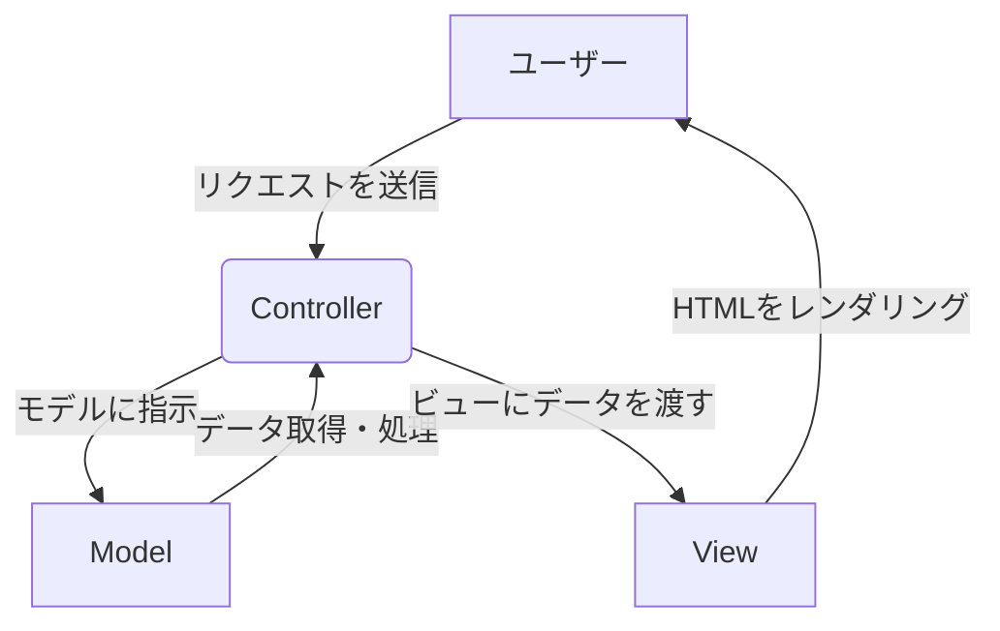

## MVCとは

MVCは、Model-View-Controllerの略で、ウェブアプリケーションの設計において広く採用されているデザインパターンの一つです。このパターンは、アプリケーションの役割を3つの独立した部分に分割することで、コードの整理と管理を容易にします。

### なぜMVCが重要なのか？

MVCパターンを使用する主な理由は、アプリケーションの異なる側面を分離することにあります。これにより、以下のメリットが得られます。

- **保守性の向上**: 各コンポーネントが独立しているため、ある部分の変更が他の部分に影響を与えにくくなります。

- **開発効率の向上**: 開発チームが役割ごとに分かれて作業できます。たとえば、デザイナーはViewに、データベース担当者はModelに集中できます。

- **再利用性の向上**: 各コンポーネントが特定の役割に特化しているため、他のプロジェクトやアプリケーションで再利用しやすくなります。

### MVCの各コンポーネント

1. **Model（モデル）**
   - モデルは、アプリケーションのデータとビジネスロジックを扱います。
   - **役割**: データベースとのやり取りを管理し、データの読み書き、検証、関連付けなどのロジックを保持します。
   - **例**: ユーザー情報、商品の詳細、ブログ記事など、アプリケーションの「実体」となるデータを表現します。

2. **View（ビュー）**
   - ビューは、ユーザーに表示されるインターフェースを担当します。
   - **役割**: モデルから受け取ったデータを基に、HTML、CSS、JavaScriptなどの形でユーザーに情報を表示します。
   - **例**: ウェブページのレイアウト、フォーム、ボタンなど、ユーザーが目にするすべての要素です。

3. **Controller（コントローラー）**
   - コントローラーは、ユーザーからのリクエストを処理し、モデルとビューを連携させます。
   - **役割**: ユーザーの入力（URLへのアクセス、フォームの送信など）を受け取り、どのモデルとビューを呼び出すかを決定します。モデルからデータを取得し、それをビューに渡してユーザーに表示させます。
   - **例**: `/users`へのアクセスがあった際に、Userモデルからすべてのユーザーデータを取得し、`users/index.html.erb`ビューをレンダリングする、といった処理を行います。

### 動作の流れ

1. **ユーザーからのリクエスト**: ユーザーがブラウザでURLにアクセスしたり、ボタンをクリックしたりします。
2. **コントローラーがリクエストを受信**: コントローラーがユーザーのリクエストを分析します。
3. **コントローラーがモデルに指示**: コントローラーは、必要なデータを取得するようモデルに指示します。
4. **モデルがデータを処理**: モデルはデータベースからデータを取得し、必要に応じてビジネスロジックを適用します。
5. **モデルがデータをコントローラーに返す**: モデルは処理したデータをコントローラーに返します。
6. **コントローラーがビューに指示**: コントローラーは、受け取ったデータを表示するようビューに指示します。
7. **ビューがレンダリング**: ビューはデータを基にHTMLを生成し、ユーザーに表示します。

