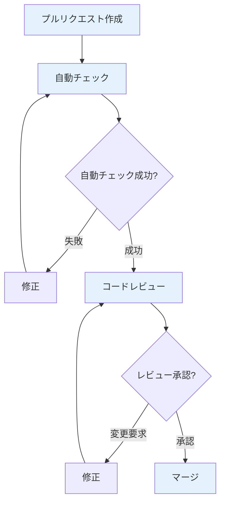

# コードレビュー完全ガイド

コードレビューの実践的な手法を、実務で使える実装例とベストプラクティスとともに詳しく解説します。

## 1. コードレビューとは

### コードレビューの定義

コードレビューは、コードの品質を向上させ、バグを早期に発見し、知識を共有するプロセスです。

```
コードレビューの目的
   ├─ 品質の向上
   ├─ バグの早期発見
   ├─ 知識の共有
   ├─ 一貫性の確保
   ├─ セキュリティの確保
   └─ チームの成長
```

### コードレビューの種類

```markdown
## コードレビューの種類

### 1. プルリクエストレビュー
- **タイミング**: プルリクエスト作成時
- **参加者**: 1-3名のレビュアー
- **形式**: 非同期レビュー

### 2. ペアプログラミング
- **タイミング**: 実装中
- **参加者**: 2名（ドライバー、ナビゲーター）
- **形式**: 同期レビュー

### 3. オーバーザショルダー
- **タイミング**: 実装後、すぐ
- **参加者**: 実装者とレビュアー
- **形式**: 対面レビュー

### 4. ツールベースレビュー
- **タイミング**: 自動化されたレビュー
- **参加者**: 静的解析ツール
- **形式**: 自動レビュー
```

## 2. コードレビューのチェックポイント

### 機能性のチェック

```markdown
## 機能性のチェック

### 要件の充足
- [ ] 要件を満たしているか
- [ ] 要件定義書と一致しているか
- [ ] 仕様書に記載されているか

### エッジケース
- [ ] null/undefinedの処理
- [ ] 空配列・空文字列の処理
- [ ] 境界値の処理（0、最大値、最小値）
- [ ] 異常系の処理

### エラーハンドリング
- [ ] 適切なエラーハンドリングがあるか
- [ ] エラーメッセージが分かりやすいか
- [ ] エラーログが適切か
- [ ] エラー時の復旧処理があるか

### テスト
- [ ] 単体テストがあるか
- [ ] テストカバレッジが十分か（80%以上）
- [ ] エッジケースのテストがあるか
- [ ] 統合テストがあるか（必要に応じて）
```

### コード品質のチェック

```markdown
## コード品質のチェック

### 可読性
- [ ] コードが読みやすいか
- [ ] コメントが適切か（必要最小限）
- [ ] 複雑なロジックに説明があるか
- [ ] 意図が明確か

### 命名
- [ ] 変数名が適切か（意図が明確）
- [ ] 関数名が適切か（何をするか明確）
- [ ] クラス名が適切か（責務が明確）
- [ ] 定数名が適切か（大文字、意味が明確）

### 重複
- [ ] コードの重複がないか
- [ ] DRY原則に従っているか
- [ ] 共通化できる部分がないか

### 複雑度
- [ ] 循環的複雑度が適切か（10以下）
- [ ] 関数が適切な長さか（50行以下）
- [ ] ネストが深すぎないか（3階層以下）
- [ ] 条件分岐が複雑すぎないか

### 設計原則
- [ ] 単一責任の原則（SRP）に従っているか
- [ ] 開放閉鎖の原則（OCP）に従っているか
- [ ] 依存性逆転の原則（DIP）に従っているか
- [ ] インターフェース分離の原則（ISP）に従っているか
```

### パフォーマンスのチェック

```markdown
## パフォーマンスのチェック

### アルゴリズム
- [ ] 時間計算量が適切か（O(n²)以上は要注意）
- [ ] 空間計算量が適切か
- [ ] 不要なループがないか
- [ ] 効率的なデータ構造を使用しているか

### データベース
- [ ] N+1問題がないか
- [ ] インデックスが適切か
- [ ] 不要なクエリがないか
- [ ] バッチ処理が適切か

### メモリ
- [ ] メモリリークがないか
- [ ] 不要なメモリ使用がないか
- [ ] キャッシュが適切に使用されているか

### ネットワーク
- [ ] 不要なAPI呼び出しがないか
- [ ] 並列処理が可能か
- [ ] リクエストの最適化がされているか
```

### セキュリティのチェック

```markdown
## セキュリティのチェック

### 入力検証
- [ ] SQLインジェクション対策があるか
- [ ] XSS対策があるか
- [ ] CSRF対策があるか
- [ ] 入力値の検証が適切か

### 認証・認可
- [ ] 認証が適切に実装されているか
- [ ] 認可が適切に実装されているか
- [ ] セッション管理が適切か
- [ ] パスワードのハッシュ化が適切か

### 機密情報
- [ ] 機密情報がコードに含まれていないか
- [ ] 環境変数を使用しているか
- [ ] ログに機密情報が出力されていないか
- [ ] エラーメッセージに機密情報が含まれていないか

### 依存関係
- [ ] 脆弱性のある依存関係がないか
- [ ] 依存関係が最新か
- [ ] セキュリティパッチが適用されているか
```

### アーキテクチャのチェック

```markdown
## アーキテクチャのチェック

### 設計
- [ ] アーキテクチャパターンに従っているか
- [ ] 責務が適切に分離されているか
- [ ] 依存関係が適切か
- [ ] 拡張性があるか

### 一貫性
- [ ] 既存のコードスタイルと一致しているか
- [ ] 既存のアーキテクチャと一致しているか
- [ ] 命名規則が統一されているか
- [ ] ディレクトリ構造が統一されているか
```

## 3. コードレビューコメントの書き方

### 良いレビューコメント

```markdown
## 良いレビューコメントの例

### 1. 具体的な指摘
❌ 悪い例:
「この関数は良くない」

✅ 良い例:
「この関数は複数の責務を持っているようです。
`calculateTotal`と`applyDiscount`に分割することを提案します。
理由: 単一責任の原則に従い、テストと保守が容易になります。」

### 2. 理由の説明
❌ 悪い例:
「変数名を変更してください」

✅ 良い例:
「この変数名`tmp`は意図が分かりにくいです。
`totalAmount`の方が明確で、コードの可読性が向上します。」

### 3. 改善案の提示
❌ 悪い例:
「この部分を改善してください」

✅ 良い例:
「この部分は`Array.reduce`を使うとより簡潔に書けます：

```typescript
// 現在のコード
let total = 0;
for (let i = 0; i < items.length; i++) {
  total += items[i].price;
}

// 改善案
const total = items.reduce((sum, item) => sum + item.price, 0);
```

メリット: より関数型のアプローチで、可読性が向上します。」

### 4. 質問形式
❌ 悪い例:
「この実装は間違っている」

✅ 良い例:
「この実装について質問です。
エラーハンドリングがないようですが、`items`が`null`の場合の処理は必要ないでしょうか？
また、`item.price`が負の値の場合の処理も検討した方が良いかもしれません。」
```

### レビューコメントのテンプレート

```markdown
## レビューコメントのテンプレート

### 機能性に関する指摘
```
**観点**: 機能性
**問題**: [具体的な問題点]
**影響**: [影響範囲]
**提案**: [改善案]
**優先度**: [高/中/低]
```

### コード品質に関する指摘
```
**観点**: コード品質
**問題**: [具体的な問題点]
**理由**: [なぜ問題なのか]
**改善案**: [具体的な改善案]
**優先度**: [高/中/低]
```

### セキュリティに関する指摘
```
**観点**: セキュリティ
**問題**: [セキュリティの問題点]
**リスク**: [リスクの説明]
**対策**: [具体的な対策]
**優先度**: [高（必須）/中/低]
```
```

## 4. コードレビューの観点

### 設計意図の確認

```markdown
## 設計意図の確認

### 確認すべき点
- **なぜこの実装方法を選んだか**: 実装方法の理由
- **他の選択肢は検討したか**: 代替案の検討
- **将来の拡張性**: 将来の変更に対応できるか
- **パフォーマンスへの影響**: パフォーマンスへの影響

### レビューコメント例
「この実装について質問です。
なぜ`Array.forEach`ではなく`Array.map`を使用したのでしょうか？
`map`を使用すると、より関数型のアプローチになり、可読性が向上すると思います。

また、将来的にフィルタリング機能を追加する可能性がある場合、
`Array.filter`と組み合わせやすい`map`の方が適切かもしれません。」
```

### 責務の確認

```markdown
## 責務の確認

### 確認すべき点
- **単一責任の原則**: 1つの関数・クラスが1つの責務を持っているか
- **関心の分離**: 関心が適切に分離されているか
- **依存関係**: 依存関係が適切か

### レビューコメント例
「このクラスは`Order`の計算と`Payment`の処理の両方を行っています。
単一責任の原則に従い、以下のように分割することを提案します：

```typescript
// 現在
class OrderProcessor {
  calculateTotal(order: Order): number { }
  processPayment(order: Order): void { }
}

// 改善案
class OrderCalculator {
  calculateTotal(order: Order): number { }
}

class PaymentProcessor {
  processPayment(order: Order): void { }
}
```

これにより、テストと保守が容易になります。」
```

### 未来への影響の確認

```markdown
## 未来への影響の確認

### 確認すべき点
- **拡張性**: 将来の機能追加に対応できるか
- **変更の影響範囲**: 変更の影響範囲は適切か
- **技術的負債**: 技術的負債を生み出していないか

### レビューコメント例
「この実装は現在の要件を満たしていますが、
将来的に複数の決済方法（クレジットカード、デビットカード、PayPal）を
サポートする場合、この実装では拡張が困難になる可能性があります。

Strategyパターンを使用することで、将来の拡張に対応しやすくなります：

```typescript
interface PaymentStrategy {
  process(amount: number): void;
}

class CreditCardPayment implements PaymentStrategy {
  process(amount: number): void { }
}

class PaymentProcessor {
  constructor(private strategy: PaymentStrategy) {}
  process(amount: number): void {
    this.strategy.process(amount);
  }
}
```」
```

## 5. コードレビューのプロセス

### プルリクエストの作成

```markdown
## プルリクエストの作成

### プルリクエストの説明欄

**テンプレート**:
```markdown
## 変更内容
- [変更の概要]

## 変更理由
- [なぜこの変更が必要か]

## 実装詳細
- [実装の詳細]

## テスト
- [ ] 単体テストを追加
- [ ] 統合テストを追加
- [ ] 手動テストを実施

## チェックリスト
- [ ] コードスタイルに準拠
- [ ] ドキュメントを更新
- [ ] 既存のテストが通る
- [ ] 新しいテストを追加

## スクリーンショット（UI変更の場合）
[スクリーンショット]

## 関連Issue
Closes #123
```

### プルリクエストのサイズ

```markdown
## プルリクエストのサイズ

### 推奨サイズ
- **小さい変更**: 50-200行
- **中程度の変更**: 200-500行
- **大きい変更**: 500行以上（分割を検討）

### 大きい変更の分割方法
1. **機能単位で分割**: 1つの機能ごとにPRを作成
2. **段階的な実装**: 段階的にPRを作成
3. **リファクタリングと機能追加を分離**: 別々のPRに分離
```

### レビューの流れ



### レビューのタイミング

```markdown
## レビューのタイミング

### SLA（Service Level Agreement）
- **通常の変更**: 24時間以内にレビュー
- **緊急の変更**: 4時間以内にレビュー
- **小さな変更**: 12時間以内にレビュー

### レビューの優先順位
1. **高優先度**: セキュリティ関連、クリティカルなバグ修正
2. **中優先度**: 通常の機能追加、改善
3. **低優先度**: リファクタリング、ドキュメント更新
```

## 6. レビュアーの心構え

### 建設的なフィードバック

```markdown
## 建設的なフィードバック

### 1. コードを批判するのではなく、改善を提案する
❌ 悪い例:
「このコードは最悪だ」

✅ 良い例:
「この実装は動作しますが、以下の改善を提案します：
- エラーハンドリングの追加
- テストの追加
- 関数の分割」

### 2. 理由を説明する
❌ 悪い例:
「この変数名を変更してください」

✅ 良い例:
「この変数名`data`は意図が分かりにくいです。
`userProfile`の方が明確で、コードの可読性が向上します。」

### 3. 改善案を提示する
❌ 悪い例:
「この部分を改善してください」

✅ 良い例:
「この部分は以下のように改善できます：
[具体的な改善案]
メリット: [改善によるメリット]」

### 4. 質問形式で確認する
❌ 悪い例:
「この実装は間違っている」

✅ 良い例:
「この実装について質問です。
[具体的な質問]
[確認したい点]」
```

### レビュアーのチェックリスト

```markdown
## レビュアーのチェックリスト

### レビュー前
- [ ] プルリクエストの説明を読んだ
- [ ] 関連するIssueを確認した
- [ ] 変更の背景を理解した

### レビュー中
- [ ] 機能性を確認した
- [ ] コード品質を確認した
- [ ] セキュリティを確認した
- [ ] パフォーマンスを確認した
- [ ] テストを確認した
- [ ] ドキュメントを確認した

### レビュー後
- [ ] 建設的なフィードバックを提供した
- [ ] 質問があれば質問した
- [ ] 承認または変更要求を明確にした
```

## 7. レビューイーの心構え

### フィードバックの受け入れ

```markdown
## フィードバックの受け入れ

### 1. オープンである
- **防御的にならない**: フィードバックを防御的に受け取らない
- **学習の機会**: レビューを学習の機会として捉える
- **感謝する**: レビューに感謝する

### 2. 質問する
- **不明な点は質問**: 分からない点は積極的に質問
- **理由を確認**: なぜその指摘なのか理由を確認
- **代替案を検討**: 代替案があるか検討

### 3. 学ぶ
- **パターンを学ぶ**: 良いパターンを学ぶ
- **ベストプラクティス**: ベストプラクティスを学ぶ
- **知識を共有**: 学んだ知識を共有する
```

### レビューイーのチェックリスト

```markdown
## レビューイーのチェックリスト

### プルリクエスト作成前
- [ ] 自己レビューを実施した
- [ ] テストを追加・更新した
- [ ] ドキュメントを更新した
- [ ] コードスタイルに準拠している

### レビュー中
- [ ] フィードバックを受け入れる準備ができている
- [ ] 質問があれば質問する準備ができている
- [ ] 学ぶ姿勢を持っている

### レビュー後
- [ ] すべてのコメントに返信した
- [ ] 指摘された内容を理解した
- [ ] 修正を実施した
- [ ] 修正後は再度レビューを依頼した
```

## 8. コードレビューの実践例

### 例1: 関数のリファクタリング

```typescript
// レビュー前のコード
function processOrder(order: Order): number {
  let total = 0;
  for (let i = 0; i < order.items.length; i++) {
    total += order.items[i].price * order.items[i].quantity;
  }
  if (order.customer.vip) {
    total = total * 0.9;
  }
  if (order.amount > 1000) {
    total = total - 50;
  }
  return total;
}

// レビューコメント
/**
 * レビューコメント:
 * 
 * この関数は複数の責務を持っています：
 * 1. 合計金額の計算
 * 2. VIP割引の適用
 * 3. 高額割引の適用
 * 
 * 単一責任の原則に従い、以下のように分割することを提案します：
 */

// 改善後のコード
function calculateSubtotal(items: OrderItem[]): number {
  return items.reduce(
    (sum, item) => sum + item.price * item.quantity,
    0
  );
}

function applyVipDiscount(total: number, isVip: boolean): number {
  return isVip ? total * 0.9 : total;
}

function applyHighAmountDiscount(total: number): number {
  return total > 1000 ? total - 50 : total;
}

function processOrder(order: Order): number {
  const subtotal = calculateSubtotal(order.items);
  const withVipDiscount = applyVipDiscount(subtotal, order.customer.vip);
  return applyHighAmountDiscount(withVipDiscount);
}
```

### 例2: エラーハンドリングの改善

```typescript
// レビュー前のコード
function getUserById(id: number): User {
  return users.find(user => user.id === id);
}

// レビューコメント
/**
 * レビューコメント:
 * 
 * この関数には以下の問題があります：
 * 1. `users.find`が`undefined`を返す可能性がある
 * 2. エラーハンドリングがない
 * 3. 型安全性が不十分
 * 
 * 以下の改善を提案します：
 */

// 改善後のコード
function getUserById(id: number): User {
  if (!id || id <= 0) {
    throw new Error('Invalid user ID');
  }
  
  const user = users.find(user => user.id === id);
  
  if (!user) {
    throw new Error(`User with ID ${id} not found`);
  }
  
  return user;
}
```

### 例3: セキュリティの改善

```typescript
// レビュー前のコード
function login(username: string, password: string): boolean {
  const query = `SELECT * FROM users WHERE username='${username}' AND password='${password}'`;
  const result = db.query(query);
  return result.length > 0;
}

// レビューコメント
/**
 * レビューコメント（セキュリティ）:
 * 
 * この実装には重大なセキュリティ問題があります：
 * 1. SQLインジェクションの脆弱性
 * 2. パスワードが平文で保存されている可能性
 * 3. パスワードがログに出力される可能性
 * 
 * 以下の改善を必須で実施してください：
 */

// 改善後のコード
async function login(username: string, password: string): Promise<boolean> {
  // 入力検証
  if (!username || !password) {
    throw new Error('Username and password are required');
  }
  
  // プリペアドステートメントを使用
  const user = await db.query(
    'SELECT id, password_hash FROM users WHERE username = ?',
    [username]
  );
  
  if (!user || user.length === 0) {
    return false;
  }
  
  // パスワードのハッシュを検証
  return await bcrypt.compare(password, user[0].password_hash);
}
```

## 9. コードレビューのツール

### GitHub

```markdown
## GitHubでのコードレビュー

### 機能
- **プルリクエスト**: 変更のレビュー
- **行単位のコメント**: 特定の行にコメント
- **ファイル単位のコメント**: ファイル全体へのコメント
- **承認**: 承認の表明
- **変更要求**: 変更の要求
- **承認条件**: 必須レビュアーの設定

### レビューの種類
- **承認（Approve）**: 変更を承認
- **変更要求（Request Changes）**: 変更を要求
- **コメント（Comment）**: コメントのみ

### 設定例
```yaml
# .github/pull_request_template.md
## 変更内容
- 

## テスト
- [ ] 単体テストを追加
- [ ] 統合テストを追加

## チェックリスト
- [ ] コードスタイルに準拠
- [ ] ドキュメントを更新
```
```

### GitLab

```markdown
## GitLabでのコードレビュー

### 機能
- **マージリクエスト**: 変更のレビュー
- **行単位のコメント**: 特定の行にコメント
- **承認**: 承認の表明
- **承認条件**: 必須承認者の設定

### レビューの種類
- **承認（Approve）**: 変更を承認
- **コメント（Comment）**: コメントのみ

### 設定例
```yaml
# .gitlab/merge_request_templates/default.md
## 変更内容
- 

## テスト
- [ ] 単体テストを追加
- [ ] 統合テストを追加
```
```

### その他のツール

```markdown
## その他のコードレビューツール

### 1. Reviewable
- **特徴**: 高度なレビュー機能
- **機能**: スレッド、承認管理、自動レビュー

### 2. Phabricator
- **特徴**: Facebook製のコードレビューツール
- **機能**: 包括的なコードレビュー機能

### 3. Crucible
- **特徴**: Atlassian製のコードレビューツール
- **機能**: Jiraとの統合
```

## 10. 自動化ツールの活用

### 静的解析ツール

```markdown
## 静的解析ツール

### ESLint（JavaScript/TypeScript）
```json
// .eslintrc.json
{
  "extends": ["eslint:recommended", "@typescript-eslint/recommended"],
  "rules": {
    "no-console": "warn",
    "no-unused-vars": "error",
    "complexity": ["error", 10]
  }
}
```

### SonarQube
- **機能**: コード品質の監視
- **チェック項目**: バグ、脆弱性、コードスメル、重複

### CodeClimate
- **機能**: コード品質の監視
- **チェック項目**: 複雑度、重複、メンテナンス性
```

### CI/CDへの統合

```yaml
# .github/workflows/code-review.yml
name: Code Review Checks

on:
  pull_request:
    branches: [main]

jobs:
  lint:
    runs-on: ubuntu-latest
    steps:
      - uses: actions/checkout@v2
      - name: Run ESLint
        run: npm run lint
      
  test:
    runs-on: ubuntu-latest
    steps:
      - uses: actions/checkout@v2
      - name: Run tests
        run: npm test
      - name: Check coverage
        run: npm run test:coverage
  
  security:
    runs-on: ubuntu-latest
    steps:
      - uses: actions/checkout@v2
      - name: Run security audit
        run: npm audit --audit-level=high
```

## 11. コードレビューのメトリクス

### レビューメトリクス

```markdown
## レビューメトリクス

### 1. レビュー時間
- **平均レビュー時間**: プルリクエストのレビューにかかる平均時間
- **目標**: 24時間以内

### 2. レビューサイクル
- **平均レビューサイクル**: 承認までにかかる平均サイクル数
- **目標**: 2サイクル以内

### 3. レビューコメント数
- **平均コメント数**: 1つのPRあたりの平均コメント数
- **目標**: 5-10コメント

### 4. バグ発見率
- **バグ発見率**: レビューで発見されたバグの割合
- **目標**: 80%以上
```

### メトリクスの可視化

```markdown
## メトリクスの可視化

### ダッシュボード
- **レビュー時間の推移**: 時系列での変化
- **レビューサイクルの推移**: 時系列での変化
- **バグ発見率**: バグ発見率の推移

### レポート
- **週次レポート**: 週次のレビューメトリクス
- **月次レポート**: 月次のレビューメトリクス
- **四半期レポート**: 四半期のレビューメトリクス
```

## 12. よくある問題と解決方法

### 問題1: レビューが遅い

```markdown
## 解決策

### 1. SLAの設定
- **通常の変更**: 24時間以内にレビュー
- **緊急の変更**: 4時間以内にレビュー
- **小さな変更**: 12時間以内にレビュー

### 2. レビュアーの割り当て
- **自動割り当て**: CODEOWNERSファイルで自動割り当て
- **ローテーション**: レビュアーをローテーション
- **バックアップ**: プライマリとセカンダリレビュアー

### 3. リマインダー
- **自動リマインダー**: 24時間経過後にリマインダー
- **Slack通知**: Slackで通知
- **レビュー待ちボード**: レビュー待ちを可視化
```

### 問題2: レビューコメントが抽象的

```markdown
## 解決策

### 1. テンプレートの使用
- **レビューコメントテンプレート**: テンプレートを使用
- **チェックリスト**: チェックリストを使用
- **例の提示**: 具体的な例を提示

### 2. 教育とトレーニング
- **レビュー研修**: レビューの研修を実施
- **ベストプラクティスの共有**: ベストプラクティスを共有
- **ペアレビュー**: 経験豊富なメンバーとペアレビュー

### 3. ツールの活用
- **静的解析ツール**: 自動で問題を発見
- **コードレビューツール**: ツールの機能を活用
```

### 問題3: レビューが形式的になる

```markdown
## 解決策

### 1. レビューの目的の明確化
- **目的の共有**: レビューの目的をチームで共有
- **期待値の設定**: レビューでの期待値を設定
- **成功事例の共有**: 良いレビューの例を共有

### 2. 学習機会として活用
- **質問を推奨**: 質問を積極的に推奨
- **知識の共有**: レビューで学んだことを共有
- **ペアプログラミング**: ペアプログラミングを推奨

### 3. フィードバックの改善
- **建設的なフィードバック**: 建設的なフィードバックを推奨
- **感謝の表明**: レビューに感謝する文化を作る
- **継続的な改善**: レビュープロセスを継続的に改善
```

### 問題4: レビューで対立が発生する

```markdown
## 解決策

### 1. コミュニケーションの改善
- **質問形式**: 批判ではなく質問形式で
- **理由の説明**: なぜその指摘なのか理由を説明
- **代替案の検討**: 複数の選択肢を検討

### 2. エスカレーション
- **テックリードに相談**: 意見が分かれた場合はテックリードに相談
- **チームで議論**: チーム全体で議論
- **ADRの作成**: アーキテクチャ決定記録を作成

### 3. 文化の構築
- **学習文化**: 学習と成長を重視する文化
- **相互尊重**: お互いを尊重する文化
- **失敗を許容**: 失敗を学習の機会として捉える文化
```

## 13. ベストプラクティス

### コードレビューのベストプラクティス

```markdown
## コードレビューのベストプラクティス

### 1. 小さな変更を推奨
- **PRのサイズ**: 200行以下を推奨
- **機能単位**: 1つの機能ごとにPRを作成
- **段階的な実装**: 段階的にPRを作成

### 2. 迅速なレビュー
- **24時間ルール**: 24時間以内にレビュー
- **優先順位**: 重要な変更を優先
- **自動化**: 自動チェックを活用

### 3. 建設的なフィードバック
- **具体的**: 抽象的ではなく具体的に
- **理由の説明**: なぜその指摘なのか理由を説明
- **改善案の提示**: 改善案を提示

### 4. 学習機会として活用
- **質問を推奨**: 質問を積極的に推奨
- **知識の共有**: レビューで学んだことを共有
- **ドキュメント化**: 重要な学びをドキュメント化

### 5. ツールの活用
- **静的解析**: 静的解析ツールを活用
- **CI/CD**: CI/CDで自動チェック
- **コードレビューツール**: ツールの機能を最大限活用
```

### レビューチェックリスト（詳細版）

```markdown
## レビューチェックリスト（詳細版）

### 機能性
- [ ] 要件を満たしているか
- [ ] エッジケースを考慮しているか（null、空配列、境界値）
- [ ] エラーハンドリングが適切か
- [ ] エラーメッセージが分かりやすいか
- [ ] テストが十分か（カバレッジ80%以上）
- [ ] エッジケースのテストがあるか

### コード品質
- [ ] 可読性が高いか
- [ ] 命名が適切か（意図が明確）
- [ ] 重複コードがないか
- [ ] 循環的複雑度が適切か（10以下）
- [ ] 関数が適切な長さか（50行以下）
- [ ] ネストが深すぎないか（3階層以下）
- [ ] コメントが適切か（必要最小限）

### 設計
- [ ] 単一責任の原則に従っているか
- [ ] 責務が適切に分離されているか
- [ ] 依存関係が適切か
- [ ] 拡張性があるか
- [ ] 既存のアーキテクチャと一致しているか

### パフォーマンス
- [ ] アルゴリズムが効率的か
- [ ] N+1問題がないか
- [ ] 不要な処理がないか
- [ ] メモリリークがないか
- [ ] キャッシュが適切に使用されているか

### セキュリティ
- [ ] SQLインジェクション対策があるか
- [ ] XSS対策があるか
- [ ] CSRF対策があるか
- [ ] 認証・認可が適切か
- [ ] 機密情報が漏洩していないか
- [ ] 脆弱性のある依存関係がないか

### 一貫性
- [ ] 既存のコードスタイルと一致しているか
- [ ] 命名規則が統一されているか
- [ ] ディレクトリ構造が統一されているか
- [ ] 既存のパターンに従っているか
```

## まとめ

コードレビュー完全ガイドのポイント：

- **チェックポイント**: 機能性、コード品質、パフォーマンス、セキュリティ、アーキテクチャ、一貫性
- **レビューコメント**: 具体的、理由の説明、改善案の提示、質問形式
- **レビュアーの心構え**: 建設的なフィードバック、具体的な指摘、理由の説明
- **レビューイーの心構え**: オープン、質問、学習
- **プロセス**: プルリクエストの作成、レビューの流れ、タイミング、SLA
- **実践例**: リファクタリング、エラーハンドリング、セキュリティの改善例
- **ツール**: GitHub、GitLab、静的解析ツール、CI/CD統合
- **メトリクス**: レビュー時間、レビューサイクル、バグ発見率
- **よくある問題**: レビューの遅延、抽象的コメント、形式的レビュー、対立
- **ベストプラクティス**: 小さな変更、迅速なレビュー、建設的なフィードバック、学習機会

適切なコードレビューにより、高品質なコードを維持できます。

