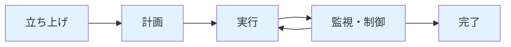

# プロジェクト管理完全ガイド

プロジェクト管理の実践的な手法を、実務で使える実装例とベストプラクティスとともに詳しく解説します。

## 1. プロジェクト管理とは

### プロジェクト管理の定義

プロジェクト管理は、プロジェクトの目標を達成するために、計画、実行、監視、制御を行う一連の活動です。

```
プロジェクト管理の要素
   ├─ スコープ管理
   ├─ スケジュール管理
   ├─ コスト管理
   ├─ 品質管理
   ├─ リスク管理
   ├─ ステークホルダー管理
   ├─ コミュニケーション管理
   └─ 調達管理
```

### プロジェクトライフサイクル



**各フェーズの特徴:**

- **立ち上げ**: プロジェクトの承認と初期設定
- **計画**: 詳細な計画の作成
- **実行**: 計画に基づく作業の実施
- **監視・制御**: 進捗の監視と計画の調整
- **完了**: プロジェクトの終了と振り返り

## 2. プロジェクト計画

### WBS（Work Breakdown Structure）

WBSは、プロジェクトを小さな作業単位に分解し、階層構造で表現する手法です。

```markdown
## WBSの例: Webアプリケーション開発プロジェクト

プロジェクト: ECサイト開発
├─ 1. 要件定義
│   ├─ 1.1 ヒアリング
│   ├─ 1.2 要件定義書作成
│   └─ 1.3 承認
├─ 2. 設計
│   ├─ 2.1 システム設計
│   ├─ 2.2 データベース設計
│   └─ 2.3 UI/UX設計
├─ 3. 実装
│   ├─ 3.1 フロントエンド開発
│   ├─ 3.2 バックエンド開発
│   └─ 3.3 API開発
├─ 4. テスト
│   ├─ 4.1 単体テスト
│   ├─ 4.2 結合テスト
│   └─ 4.3 システムテスト
└─ 5. デプロイ
    ├─ 5.1 本番環境構築
    ├─ 5.2 デプロイ
    └─ 5.3 動作確認
```

### ガントチャート

```markdown
## ガントチャートの例

| タスク | 開始日 | 終了日 | 期間 | 担当者 |
|--------|--------|--------|------|--------|
| 要件定義 | 2024/01/01 | 2024/01/15 | 15日 | PM |
| 設計 | 2024/01/16 | 2024/02/15 | 31日 | アーキテクト |
| 実装 | 2024/02/16 | 2024/04/30 | 74日 | 開発チーム |
| テスト | 2024/05/01 | 2024/05/31 | 31日 | QAチーム |
| デプロイ | 2024/06/01 | 2024/06/15 | 15日 | インフラチーム |
```

### 見積もり手法

#### 三点見積もり

```markdown
## 三点見積もりの例

タスク: ユーザー認証機能の実装

- 楽観的見積もり（O）: 3日
- 悲観的見積もり（P）: 8日
- 最可能見積もり（M）: 5日

期待値（E） = (O + 4M + P) / 6
           = (3 + 4×5 + 8) / 6
           = 5.17日

→ 6日（切り上げ）
```

#### ストーリーポイント

```markdown
## ストーリーポイントの例

- 1ポイント: 1時間程度の簡単なタスク
- 2ポイント: 半日程度のタスク
- 3ポイント: 1日程度のタスク
- 5ポイント: 2-3日程度のタスク
- 8ポイント: 1週間程度のタスク
- 13ポイント: 2週間程度のタスク（分割を検討）
```

## 3. スコープ管理

### スコープの定義

スコープは、プロジェクトで実施する作業の範囲を明確に定義することです。

```markdown
## スコープ定義書の例

### プロジェクトスコープ

**含まれるもの:**
- ユーザー認証機能
- 商品検索機能
- カート機能
- 決済機能

**含まれないもの:**
- 管理画面（別プロジェクト）
- モバイルアプリ（別プロジェクト）
- 多言語対応（将来の拡張）
```

### スコープクリープの防止

```markdown
## スコープクリープの防止策

### 1. 変更管理プロセスの確立
- 変更要求の提出
- 影響分析
- 承認プロセス
- 計画の更新

### 2. 明確な境界の設定
- 含まれるもの/含まれないものの明確化
- ステークホルダーとの合意

### 3. 定期的なレビュー
- 週次でのスコープレビュー
- 変更要求の追跡
```

## 4. スケジュール管理

### クリティカルパス

クリティカルパスは、プロジェクトの完了に最も長い時間がかかる経路です。

```markdown
## クリティカルパスの例

A（要件定義: 15日）
  ↓
B（設計: 31日）
  ↓
C（実装: 74日）← クリティカルパス
  ↓
D（テスト: 31日）
  ↓
E（デプロイ: 15日）

合計: 166日
```

### バッファ管理

```markdown
## バッファの設定

- 各タスクに10-20%のバッファを設定
- マイルストーンに20-30%のバッファを設定
- プロジェクト全体に15-25%のバッファを設定
```

### スケジュールの調整

```markdown
## スケジュール調整の方法

### 1. リソースの追加
- 人員の追加
- 外部リソースの活用

### 2. スコープの調整
- 優先度の低い機能の削減
- 機能の簡略化

### 3. 並行作業の推進
- 依存関係の見直し
- 並行可能なタスクの特定
```

## 5. コスト管理

### 予算の作成

```markdown
## 予算の内訳例

### 人件費
- PM: 100万円
- 開発者: 500万円
- QA: 100万円
- 合計: 700万円

### インフラ費用
- サーバー: 50万円
- ツール: 20万円
- 合計: 70万円

### その他
- 外部委託: 100万円
- その他: 30万円
- 合計: 130万円

**総予算: 900万円**
```

### コスト管理の指標

```markdown
## EVM（Earned Value Management）

### 指標
- PV（Planned Value）: 計画価値
- EV（Earned Value）: 出来高
- AC（Actual Cost）: 実コスト

### 指標の計算
- SPI（Schedule Performance Index） = EV / PV
- CPI（Cost Performance Index） = EV / AC

### 判断基準
- SPI > 1.0: スケジュールより進んでいる
- CPI > 1.0: 予算より安く進んでいる
```

## 6. 品質管理

### 品質計画

```markdown
## 品質計画の例

### 品質基準
- コードカバレッジ: 80%以上
- バグ密度: 1KLOCあたり1件以下
- レスポンスタイム: 1秒以内
- 可用性: 99.9%以上

### 品質保証活動
- コードレビュー: 全コード
- テスト: 単体、結合、システム
- 静的解析: 毎日実行
```

### 品質管理のプロセス

```markdown
## 品質管理のプロセス

1. **品質計画**: 品質基準の設定
2. **品質保証**: プロセスの監視
3. **品質管理**: 結果の確認と改善
```

## 7. リスク管理

### リスクの識別

```markdown
## リスク登録簿の例

| ID | リスク | 影響度 | 発生確率 | リスクスコア | 対策 |
|----|--------|--------|----------|--------------|------|
| R1 | 主要メンバーの離脱 | 高 | 中 | 高 | 知識共有、バックアップ要員 |
| R2 | 技術的難易度の誤算 | 高 | 中 | 高 | プロトタイプ作成、技術調査 |
| R3 | 要件変更の頻発 | 中 | 高 | 高 | 変更管理プロセスの確立 |
| R4 | 外部APIの障害 | 中 | 低 | 低 | フォールバック機能の実装 |
```

### リスク対応戦略

```markdown
## リスク対応戦略

### 1. 回避（Avoid）
- リスクを発生させない
- 例: 危険な技術の使用を避ける

### 2. 軽減（Mitigate）
- リスクの影響を減らす
- 例: バックアップの準備

### 3. 転嫁（Transfer）
- リスクを他に移す
- 例: 保険の加入、外部委託

### 4. 受容（Accept）
- リスクを受け入れる
- 例: 低リスクの場合は受容
```

## 8. ステークホルダー管理

### ステークホルダーの識別

```markdown
## ステークホルダーマップ

| ステークホルダー | 影響度 | 関心度 | 戦略 |
|------------------|--------|--------|------|
| プロジェクトオーナー | 高 | 高 | 満足させる |
| エンドユーザー | 高 | 中 | 満足させる |
| 開発チーム | 中 | 高 | 情報を提供 |
| 経営層 | 中 | 低 | 監視する |
```

### コミュニケーション計画

```markdown
## コミュニケーション計画

| ステークホルダー | 頻度 | 方法 | 内容 |
|------------------|------|------|------|
| プロジェクトオーナー | 週次 | 会議 | 進捗報告、課題共有 |
| 開発チーム | 日次 | スタンドアップ | 進捗、ブロッカー |
| 経営層 | 月次 | レポート | サマリー、マイルストーン |
```

## 9. 進捗管理

### 進捗の測定

```markdown
## 進捗測定の方法

### 1. 完了率ベース
- タスクの完了率: 50/100タスク = 50%

### 2. 工数ベース
- 完了工数: 200時間 / 総工数: 400時間 = 50%

### 3. ストーリーポイントベース
- 完了ポイント: 50ポイント / 総ポイント: 100ポイント = 50%
```

### 進捗レポート

```markdown
## 週次進捗レポートの例

### 今週の進捗
- 完了タスク: 10件
- 進行中タスク: 5件
- 未着手タスク: 3件

### マイルストーン
- 設計フェーズ: 100%完了 ✅
- 実装フェーズ: 60%完了

### 課題
- 外部APIのレスポンスが遅い（対応中）
- テスト環境の構築が遅れている（要対応）

### 来週の予定
- 認証機能の実装完了
- テスト環境の構築
```

## 10. 変更管理

### 変更管理プロセス

```markdown
## 変更管理プロセスの例

1. **変更要求の提出**
   - 変更要求フォームの記入
   - 変更内容の説明

2. **影響分析**
   - スコープへの影響
   - スケジュールへの影響
   - コストへの影響

3. **承認**
   - 変更管理委員会での承認
   - ステークホルダーの承認

4. **計画の更新**
   - プロジェクト計画の更新
   - チームへの通知
```

### 変更要求フォーム

```markdown
## 変更要求フォーム

**変更要求ID**: CR-001
**提出日**: 2024/03/15
**提出者**: プロジェクトオーナー

**変更内容**:
- 多言語対応機能の追加

**理由**:
- 海外展開のため

**影響分析**:
- スコープ: +20%
- スケジュール: +2週間
- コスト: +100万円

**承認状況**: 承認待ち
```

## 11. チームマネジメント

### チームの編成

```markdown
## チーム編成の例

### プロジェクトチーム
- PM: 1名
- アーキテクト: 1名
- フロントエンドエンジニア: 2名
- バックエンドエンジニア: 3名
- QAエンジニア: 2名
- インフラエンジニア: 1名

**合計: 10名**
```

### 役割と責任

```markdown
## RACIマトリックスの例

| タスク | PM | アーキテクト | 開発者 | QA |
|--------|----|--------------|--------|----|
| 要件定義 | A | R | I | I |
| 設計 | A | R | C | I |
| 実装 | A | C | R | I |
| テスト | A | I | C | R |
```

- **R（Responsible）**: 実行責任者
- **A（Accountable）**: 説明責任者
- **C（Consulted）**: 相談先
- **I（Informed）**: 情報提供先

## 12. プロジェクト管理ツール

### プロジェクト管理ツールの選定

```markdown
## 主要なプロジェクト管理ツール

### 1. Jira
- **特徴**: アジャイル開発に強い
- **用途**: タスク管理、バグ管理、スプリント管理

### 2. Asana
- **特徴**: 使いやすいUI
- **用途**: タスク管理、プロジェクト管理

### 3. Trello
- **特徴**: カンバンボード形式
- **用途**: 小規模プロジェクトの管理

### 4. Microsoft Project
- **特徴**: ガントチャートに強い
- **用途**: 大規模プロジェクトの管理

### 5. GitHub Projects
- **特徴**: GitHubと統合
- **用途**: 開発プロジェクトの管理
```

### ツールの活用例

```markdown
## Jiraの活用例

### プロジェクト設定
- プロジェクトタイプ: スクラム
- スプリント期間: 2週間

### イシュータイプ
- ストーリー: 機能要件
- タスク: 作業タスク
- バグ: 不具合
- エピック: 大きな機能

### ワークフロー
1. To Do
2. In Progress
3. Review
4. Done
```

## 13. プロジェクトの完了

### プロジェクト終了のプロセス

```markdown
## プロジェクト終了チェックリスト

### 1. 成果物の確認
- [ ] すべての成果物が完成している
- [ ] 成果物の品質が基準を満たしている
- [ ] 成果物が承認されている

### 2. ドキュメントの整理
- [ ] 設計書の完成
- [ ] 運用マニュアルの作成
- [ ] 知識の移転

### 3. リソースの解放
- [ ] チームメンバーの解放
- [ ] 環境の整理
- [ ] ツールの返却

### 4. 振り返り
- [ ] プロジェクトの振り返り会議
- [ ] 教訓の文書化
- [ ] 改善点の特定
```

### プロジェクト振り返り

```markdown
## 振り返りの観点

### 1. 良かった点
- スケジュールを守れた
- チームの連携が良かった
- 技術的な挑戦ができた

### 2. 改善点
- 見積もりの精度を上げる
- コミュニケーションを増やす
- テストの開始を早める

### 3. 教訓
- 早期のプロトタイプが有効だった
- 定期的なレビューが重要だった
- リスク管理が成功の鍵だった
```

## 14. PMBOKの知識エリア

### PMBOKの10の知識エリア

```markdown
## PMBOKの知識エリア

1. **プロジェクト統合管理**
   - プロジェクト全体の統合

2. **プロジェクトスコープ管理**
   - スコープの定義と管理

3. **プロジェクトスケジュール管理**
   - スケジュールの作成と管理

4. **プロジェクトコスト管理**
   - コストの見積もりと管理

5. **プロジェクト品質管理**
   - 品質の計画と管理

6. **プロジェクトリソース管理**
   - リソースの確保と管理

7. **プロジェクトコミュニケーション管理**
   - コミュニケーションの計画と管理

8. **プロジェクトリスク管理**
   - リスクの識別と対応

9. **プロジェクト調達管理**
   - 調達の計画と管理

10. **プロジェクトステークホルダー管理**
    - ステークホルダーの識別と管理
```

## まとめ

プロジェクト管理完全ガイドのポイント：

- **計画**: 詳細なプロジェクト計画の作成（WBS、ガントチャート、見積もり）
- **スコープ管理**: スコープの明確化とクリープの防止
- **スケジュール管理**: クリティカルパスの特定とバッファ管理
- **コスト管理**: 予算の作成とEVMによる管理
- **品質管理**: 品質基準の設定と品質保証活動
- **リスク管理**: リスクの識別と対応戦略
- **ステークホルダー管理**: ステークホルダーの識別とコミュニケーション
- **進捗管理**: 進捗の測定とレポート
- **変更管理**: 変更要求の管理プロセス
- **チームマネジメント**: チーム編成と役割の明確化
- **ツール活用**: 適切なプロジェクト管理ツールの選定と活用
- **プロジェクト完了**: 終了プロセスと振り返り

適切なプロジェクト管理により、成功するプロジェクトを構築できます。

