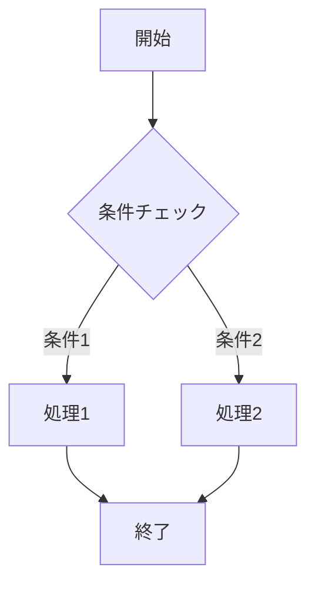
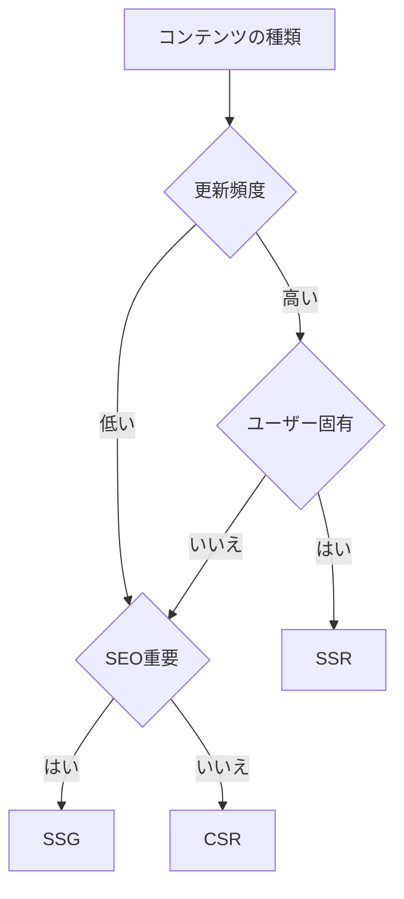
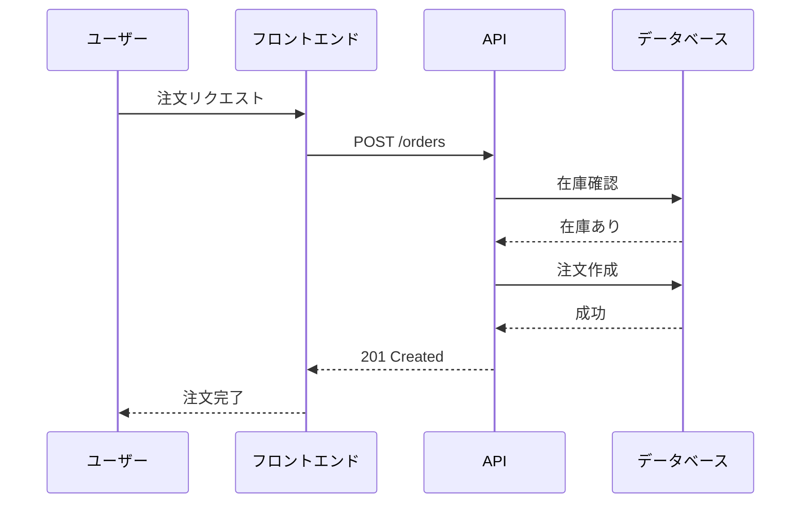
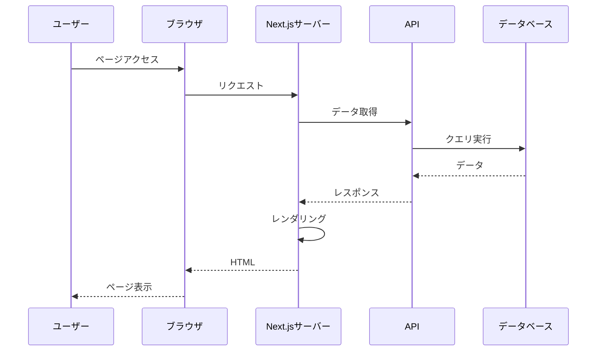
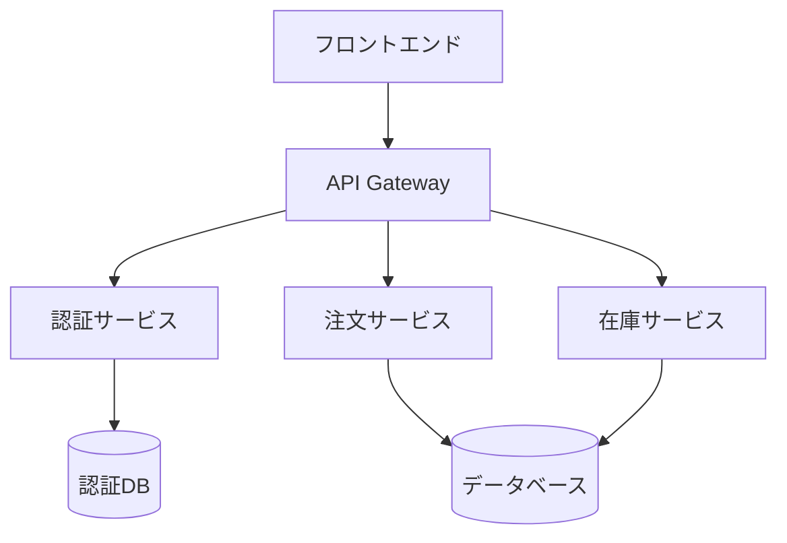
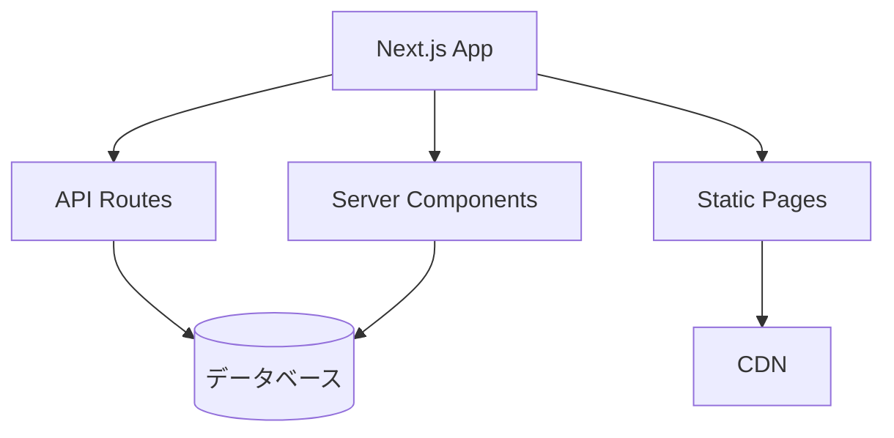
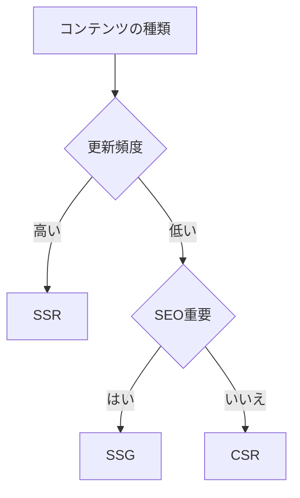
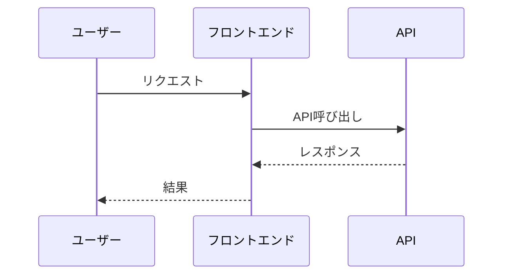
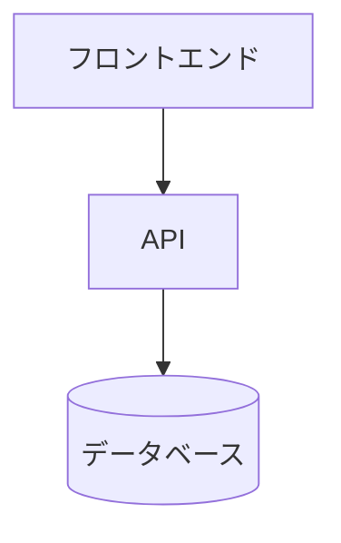
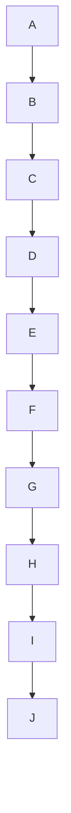

## 図や表の使い方

技術記事における図や表の使い方と、読者が理解しやすい視覚的な表現方法を詳しく解説します。

### 図や表の重要性

技術記事において、図や表は文章だけでは伝わりにくい情報を視覚的に表現する重要な要素です。

```
図や表の役割
   ├─ 複雑な概念の可視化
   ├─ 処理フローの説明
   ├─ データの比較
   ├─ アーキテクチャの説明
   └─ 読者の理解の促進
```

### なぜ図や表が重要なのか

#### 図や表なしの問題

**問題のある状況:**

```
- 複雑な概念が理解しにくい
- 処理フローが分からない
- データの比較が困難
- アーキテクチャが理解しにくい
```

**影響:**

- 読者が理解できない
- 読者が離脱する
- 記事の評価が低い
- 実践に役立たない

#### 図や表による解決

**改善された状況:**

```
- 複雑な概念が理解しやすくなる
- 処理フローが明確になる
- データの比較が容易になる
- アーキテクチャが理解しやすくなる
```

**メリット:**

- 読者が理解できる
- 読者が最後まで読む
- 記事の評価が高い
- 実践に役立つ

## 1. 図の種類と使い方

### 1.1 フローチャート

#### フローチャートの使い方

フローチャートは、処理の流れを視覚的に表現するための図です。

**フローチャートの例:**

```markdown
## フローチャートの例

### Mermaidを使用したフローチャート



**説明:**
- 開始から終了までの処理フローを視覚的に表現
- 条件分岐を明確に表現
- 読者が処理の流れを理解しやすい

### 実装例での使用

「Next.jsでSSRとSSGを使い分ける判断フロー：



このフローチャートに基づいて、適切にSSRとSSGを使い分けることができます。」
```

### 1.2 シーケンス図

#### シーケンス図の使い方

シーケンス図は、時系列での処理の流れを視覚的に表現するための図です。

**シーケンス図の例:**

```markdown
## シーケンス図の例

### Mermaidを使用したシーケンス図



**説明:**
- ユーザーからデータベースまでの処理の流れを時系列で表現
- 各コンポーネント間の通信を明確に表現
- 読者が処理の流れを理解しやすい

### 実装例での使用

「Next.jsでSSRを実装した際の処理フロー：



このシーケンス図により、SSRの処理フローが明確になります。」
```

### 1.3 アーキテクチャ図

#### アーキテクチャ図の使い方

アーキテクチャ図は、システムの構成を視覚的に表現するための図です。

**アーキテクチャ図の例:**

```markdown
## アーキテクチャ図の例

### Mermaidを使用したアーキテクチャ図



**説明:**
- システムの全体構成を視覚的に表現
- 各コンポーネント間の関係を明確に表現
- 読者がシステムの構成を理解しやすい

### 実装例での使用

「Next.jsアプリケーションのアーキテクチャ：



このアーキテクチャ図により、Next.jsアプリケーションの構成が明確になります。」
```

## 2. 表の使い方

### 2.1 比較表

#### 比較表の使い方

比較表は、複数の選択肢を比較するための表です。

**比較表の例:**

```markdown
## 比較表の例

### SSR、SSG、CSRの比較

| 特徴 | SSR | SSG | CSR |
|------|-----|-----|-----|
| **レンダリングタイミング** | リクエスト時 | ビルド時 | ブラウザ |
| **初回表示速度** | 遅い | 速い | 遅い |
| **SEO** | 強い | 強い | 弱い |
| **動的コンテンツ** | 対応可能 | 対応不可 | 対応可能 |
| **更新頻度** | 高い | 低い | 高い |

**説明:**
- SSR、SSG、CSRの特徴を比較
- 読者が適切な選択をしやすい
- 視覚的に分かりやすい
```

### 2.2 データ表

#### データ表の使い方

データ表は、データを整理して表示するための表です。

**データ表の例:**

```markdown
## データ表の例

### パフォーマンス比較

| 手法 | FCP (ms) | LCP (ms) | TTFB (ms) |
|------|----------|----------|-----------|
| **CSR** | 700 | 1200 | 50 |
| **SSR** | 50 | 200 | 100 |
| **SSG** | 10 | 50 | 10 |

**説明:**
- パフォーマンス指標を比較
- 数値データを視覚的に表現
- 読者がパフォーマンスの違いを理解しやすい
```

## 3. 図や表を使うタイミング

### 3.1 図を使うタイミング

#### 図を使うタイミング

図は、以下のような場合に使用します。

**図を使うタイミング:**

1. **複雑な概念を説明する場合**: 文章だけでは理解しにくい概念を説明する場合
2. **処理フローを説明する場合**: 処理の流れを説明する場合
3. **アーキテクチャを説明する場合**: システムの構成を説明する場合
4. **比較を説明する場合**: 複数の選択肢を比較する場合

**図を使うタイミングの例:**

```markdown
## 図を使うタイミングの例

### ✅ 良い例

「## Next.jsのレンダリング戦略

Next.jsでは、以下の3つのレンダリング戦略があります：

1. **SSR（Server-Side Rendering）**
2. **SSG（Static Site Generation）**
3. **CSR（Client-Side Rendering）**

これらの違いを理解するため、以下のフローチャートを参照してください：



このフローチャートにより、適切なレンダリング戦略を選択できます。」

### ❌ 悪い例

「Next.jsのレンダリング戦略について説明します。

SSRはサーバーでレンダリングし、SSGはビルド時に生成し、CSRはブラウザでレンダリングします。」

（問題点: 図がない、視覚的な説明がない、理解しにくい）
```

### 3.2 表を使うタイミング

#### 表を使うタイミング

表は、以下のような場合に使用します。

**表を使うタイミング:**

1. **比較を説明する場合**: 複数の選択肢を比較する場合
2. **データを整理する場合**: データを整理して表示する場合
3. **選択基準を説明する場合**: 選択基準を説明する場合

**表を使うタイミングの例:**

```markdown
## 表を使うタイミングの例

### ✅ 良い例

「## SSR、SSG、CSRの使い分け

以下の表に基づいて、適切なレンダリング戦略を選択します：

| 特徴 | SSR | SSG | CSR |
|------|-----|-----|-----|
| **更新頻度** | 高い | 低い | 高い |
| **ユーザー固有性** | あり | なし | あり |
| **SEO** | 重要 | 重要 | 不要 |

この表により、適切なレンダリング戦略を選択できます。」

### ❌ 悪い例

「SSR、SSG、CSRの使い分けについて説明します。

SSRは更新頻度が高く、ユーザー固有のコンテンツに適しています。
SSGは更新頻度が低く、SEOが重要です。
CSRは更新頻度が高く、SEOが不要です。」

（問題点: 表がない、視覚的な比較がない、理解しにくい）
```

## 4. 図や表の作成方法

### 4.1 Mermaidを使用した図の作成

#### Mermaidを使用した図の作成

Mermaidは、コードで図を書けるツールです。QiitaやZennで使用できます。

**Mermaidの使い方:**

```markdown
## Mermaidの使い方

### フローチャート


### シーケンス図



### アーキテクチャ図


```

### 4.2 画像の使い方

#### 画像の使い方

画像は、スクリーンショットや図を作成する際に使用します。

**画像の使い方:**

1. **スクリーンショット**: 実際の画面をキャプチャして使用
2. **図の作成**: Draw.io、Figmaなどのツールで図を作成
3. **適切なサイズ**: 読みやすいサイズに調整

**画像の使い方の例:**

```markdown
## 画像の使い方の例

### ✅ 良い例

「## Next.jsの開発サーバーの起動

Next.jsの開発サーバーを起動すると、以下の画面が表示されます：


**説明:**
- 開発サーバーが起動していることが確認できる
- アクセス可能なURLが表示されている
- エラーがないことが確認できる」

### ❌ 悪い例

「Next.jsの開発サーバーを起動します。」

（問題点: 画像がない、視覚的な説明がない、理解しにくい）
```

## 5. 図や表のベストプラクティス

### 5.1 図や表のベストプラクティス

#### 図や表のベストプラクティス

**ベストプラクティス:**

1. **適切なタイミングで使用**: 文章だけでは理解しにくい場合に使用
2. **説明を追加**: 図や表に説明を追加する
3. **簡潔に**: 複雑すぎる図や表は避ける
4. **統一されたスタイル**: 統一されたスタイルを使用する

**図や表のベストプラクティスの例:**

```markdown
## 図や表のベストプラクティスの例

### ✅ 良い例

「## Next.jsのレンダリング戦略

Next.jsでは、以下の3つのレンダリング戦略があります：


**説明:**
- 更新頻度が高い場合はSSR
- 更新頻度が低く、SEOが重要な場合はSSG
- 更新頻度が低く、SEOが不要な場合はCSR

このフローチャートにより、適切なレンダリング戦略を選択できます。」

### ❌ 悪い例

「Next.jsのレンダリング戦略について説明します。



（問題点: 説明がない、複雑すぎる、理解しにくい）
```

## 6. まとめ

図や表は、読者が理解しやすい記事を書くための重要な要素です。

**重要なポイント:**

- **適切なタイミングで使用**: 文章だけでは理解しにくい場合に使用
- **説明を追加**: 図や表に説明を追加する
- **簡潔に**: 複雑すぎる図や表は避ける
- **統一されたスタイル**: 統一されたスタイルを使用する
- **Mermaidを活用**: Mermaidを使用して、コードで図を書く

これらのポイントを守ることで、読者にとって理解しやすい技術記事を書くことができます。

