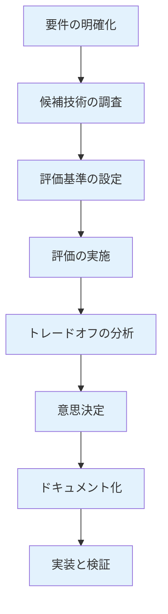

# 技術選定完全ガイド

技術選定の実践的な手法を、実務で使える実装例とベストプラクティスとともに詳しく解説します。

## 1. 技術選定とは

### 技術選定の定義

技術選定は、プロジェクトの要件を満たす最適な技術を選択する意思決定プロセスです。

```
技術選定の目的
   ├─ 要件の充足
   ├─ パフォーマンスの確保
   ├─ 開発効率の向上
   ├─ 保守性の確保
   ├─ コストの最適化
   └─ リスクの最小化
```

### 技術選定のプロセス



## 2. 要件の明確化

### 機能要件の整理

```markdown
## 機能要件の整理

### 必須要件（Must Have）
- ユーザー認証機能
- データの永続化
- RESTful API
- リアルタイム通信

### 重要要件（Should Have）
- 多言語対応
- ダークモード
- オフライン対応

### 任意要件（Nice to Have）
- アニメーション
- 高度な検索機能
- カスタマイズ機能
```

### 非機能要件の整理

```markdown
## 非機能要件の整理

### パフォーマンス
- レスポンスタイム: 1秒以内
- スループット: 1000リクエスト/秒
- 同時接続数: 10,000ユーザー

### スケーラビリティ
- 水平スケーリング: 必須
- 垂直スケーリング: 任意
- 自動スケーリング: 推奨

### 可用性
- 可用性: 99.9%以上
- ダウンタイム: 月8.76時間以内
- 災害復旧: RTO 1時間、RPO 1時間

### セキュリティ
- 認証・認可: OAuth2、JWT
- データ暗号化: TLS、AES-256
- コンプライアンス: GDPR、PIPEDA

### 保守性
- ドキュメント: 必須
- テストカバレッジ: 80%以上
- コードレビュー: 必須
```

### 制約条件の整理

```markdown
## 制約条件の整理

### 技術的制約
- 既存システムとの統合
- レガシーシステムとの互換性
- インフラの制約

### 組織的制約
- チームのスキルセット
- 予算の制約
- スケジュールの制約

### 法的制約
- データ所在地の制約
- コンプライアンス要件
- ライセンス要件
```

## 3. 候補技術の調査

### 調査方法

```markdown
## 技術調査の方法

### 1. 公式ドキュメント
- 技術の公式ドキュメントを読む
- チュートリアルを試す
- ベストプラクティスを確認

### 2. コミュニティの調査
- GitHubのスター数、コミット頻度
- Stack Overflowの質問数、回答率
- コミュニティの活発さ

### 3. 実績の調査
- 採用事例の調査
- 企業での使用実績
- 成功事例・失敗事例

### 4. ベンチマーク
- パフォーマンスベンチマーク
- 比較記事の調査
- 実際のテスト
```

### 調査項目

```markdown
## 技術調査のチェックリスト

### 基本情報
- [ ] 技術の概要と特徴
- [ ] バージョンとリリースサイクル
- [ ] ライセンス
- [ ] サポート体制

### 機能性
- [ ] 要件を満たす機能があるか
- [ ] 拡張性はあるか
- [ ] カスタマイズ性はあるか

### パフォーマンス
- [ ] パフォーマンスの実績
- [ ] スケーラビリティ
- [ ] リソース使用量

### エコシステム
- [ ] ライブラリ・パッケージの豊富さ
- [ ] コミュニティの活発さ
- [ ] サードパーティツール

### 開発体験
- [ ] 学習コスト
- [ ] 開発速度
- [ ] デバッグの容易さ
- [ ] エラーメッセージの分かりやすさ

### 保守性
- [ ] ドキュメントの充実度
- [ ] メンテナンスの頻度
- [ ] 後方互換性
- [ ] 移行パスの明確さ

### コスト
- [ ] ライセンス費用
- [ ] インフラコスト
- [ ] 開発コスト
- [ ] 保守コスト

### リスク
- [ ] 技術の成熟度
- [ ] ベンダーロックインのリスク
- [ ] セキュリティリスク
- [ ] 将来性
```

## 4. 評価基準の設定

### 評価基準のカテゴリ

```markdown
## 評価基準のカテゴリ

### 1. 機能性（30%）
- **要件充足度**: 要件をどの程度満たすか
- **機能の豊富さ**: 必要な機能が揃っているか
- **拡張性**: 将来の拡張に対応できるか

### 2. パフォーマンス（25%）
- **レスポンスタイム**: 応答速度
- **スループット**: 処理能力
- **スケーラビリティ**: スケールの容易さ
- **リソース効率**: リソース使用量

### 3. 開発体験（20%）
- **学習コスト**: 習得の容易さ
- **開発速度**: 開発の速さ
- **デバッグの容易さ**: 問題解決の容易さ
- **ツールの充実度**: 開発ツールの豊富さ

### 4. エコシステム（15%）
- **ライブラリの豊富さ**: 利用可能なライブラリ
- **コミュニティの活発さ**: コミュニティの規模と活動
- **サードパーティツール**: 関連ツールの充実度
- **採用実績**: 企業での採用実績

### 5. 保守性（10%）
- **ドキュメント**: ドキュメントの充実度
- **メンテナンス**: メンテナンスの頻度と品質
- **後方互換性**: バージョンアップの影響
- **移行パス**: 移行の容易さ
```

### 評価基準の重み付け

```markdown
## 評価基準の重み付け例

### スタートアップ向け
- 機能性: 25%
- パフォーマンス: 15%
- 開発体験: 30%
- エコシステム: 20%
- 保守性: 10%

### エンタープライズ向け
- 機能性: 30%
- パフォーマンス: 25%
- 開発体験: 15%
- エコシステム: 10%
- 保守性: 20%

### 高トラフィック向け
- 機能性: 20%
- パフォーマンス: 40%
- 開発体験: 15%
- エコシステム: 15%
- 保守性: 10%
```

## 5. 評価の実施

### 評価マトリックス

```markdown
## 評価マトリックスの例: フロントエンドフレームワーク

| 評価項目 | 重み | React | Vue.js | Angular | Svelte |
|---------|------|-------|--------|---------|--------|
| 機能性 | 30% | 9 | 8 | 9 | 7 |
| パフォーマンス | 25% | 8 | 9 | 7 | 10 |
| 開発体験 | 20% | 9 | 9 | 7 | 8 |
| エコシステム | 15% | 10 | 8 | 8 | 6 |
| 保守性 | 10% | 9 | 8 | 9 | 7 |
| **合計** | **100%** | **8.8** | **8.4** | **7.9** | **7.5** |
```

### POC（Proof of Concept）

```markdown
## POCの実施

### POCの目的
- 技術の実現可能性の確認
- パフォーマンスの検証
- 開発体験の確認
- リスクの特定

### POCの実施手順
1. **要件の定義**: POCで検証する要件を定義
2. **実装**: 最小限の実装を作成
3. **評価**: パフォーマンス、開発体験を評価
4. **レポート**: 結果をレポートにまとめる

### POCの評価項目
- 実装の容易さ
- パフォーマンス
- 開発体験
- 問題点の特定
```

### ベンチマークテスト

```markdown
## ベンチマークテストの実施

### ベンチマークの種類
- **パフォーマンスベンチマーク**: レスポンスタイム、スループット
- **リソースベンチマーク**: CPU、メモリ、ディスク使用量
- **スケーラビリティベンチマーク**: 負荷増加時の挙動

### ベンチマークの実施例
```bash
# レスポンスタイムの測定
ab -n 10000 -c 100 http://api.example.com/endpoint

# 負荷テスト
k6 run load-test.js

# メモリ使用量の測定
valgrind --tool=massif ./application
```
```

## 6. トレードオフの分析

### トレードオフの種類

```markdown
## よくあるトレードオフ

### 1. パフォーマンス vs 開発体験
- **高性能な技術**: 開発が複雑になる可能性
- **開発体験の良い技術**: パフォーマンスが劣る可能性

### 2. 機能性 vs シンプルさ
- **機能豊富な技術**: 学習コストが高い
- **シンプルな技術**: 機能が不足する可能性

### 3. エコシステム vs 新しさ
- **成熟した技術**: 古い可能性
- **新しい技術**: エコシステムが未成熟

### 4. コスト vs 機能性
- **高機能な技術**: コストが高い
- **低コストな技術**: 機能が不足する可能性
```

### トレードオフマトリックス

```markdown
## トレードオフマトリックスの例

### 技術A: 高性能だが複雑
- パフォーマンス: ⭐⭐⭐⭐⭐
- 開発体験: ⭐⭐
- エコシステム: ⭐⭐⭐⭐
- コスト: ⭐⭐⭐

### 技術B: バランス型
- パフォーマンス: ⭐⭐⭐⭐
- 開発体験: ⭐⭐⭐⭐
- エコシステム: ⭐⭐⭐⭐
- コスト: ⭐⭐⭐⭐

### 技術C: シンプルだが機能が少ない
- パフォーマンス: ⭐⭐⭐
- 開発体験: ⭐⭐⭐⭐⭐
- エコシステム: ⭐⭐⭐
- コスト: ⭐⭐⭐⭐⭐
```

## 7. 意思決定フレームワーク

### 意思決定のプロセス

```markdown
## 意思決定のプロセス

### ステップ1: 候補の絞り込み
- 3-5つの候補に絞り込む
- 明らかに不適切な候補を除外

### ステップ2: 評価の実施
- 評価マトリックスで評価
- POCやベンチマークを実施

### ステップ3: 議論
- チーム全体で議論
- 異なる視点から検討
- トレードオフを明確にする

### ステップ4: 意思決定
- 評価結果と議論を踏まえて決定
- 決定者（PM、テックリード、CTO）が最終決定

### ステップ5: 記録
- 意思決定の記録
- 理由の文書化
- 将来の参照用に保存
```

### 意思決定の記録

```markdown
## 意思決定記録（ADR: Architecture Decision Record）

### ADRテンプレート

**タイトル**: フロントエンドフレームワークの選定

**日付**: 2024/03/15

**状況**: 
ECサイトのフロントエンドフレームワークを選定する必要がある。

**決定**: 
Reactを採用する。

**理由**:
1. エコシステムが最も豊富（30%の重み）
2. チームの経験が豊富（開発体験: 20%の重み）
3. パフォーマンスが十分（25%の重み）
4. 採用実績が豊富（保守性: 10%の重み）

**代替案**:
- Vue.js: エコシステムがやや劣る
- Angular: 学習コストが高い
- Svelte: エコシステムが未成熟

**トレードオフ**:
- パフォーマンスはVue.jsやSvelteより劣るが、許容範囲内
- バンドルサイズは大きいが、コード分割で対応可能

**影響**:
- 開発速度: 向上（チームの経験により）
- 保守性: 向上（豊富なエコシステム）
- コスト: 標準的（オープンソース）

**ステータス**: 承認済み
```

## 8. 実践的な技術選定例

### フロントエンドフレームワークの選定

```markdown
## フロントエンドフレームワークの選定例

### 要件
- リアルタイム更新が必要
- モバイル対応が必要
- 開発速度が重要
- チームの経験: React、Vue.js

### 候補技術
1. React
2. Vue.js
3. Next.js（Reactベース）
4. Nuxt.js（Vue.jsベース）

### 評価結果

| 評価項目 | 重み | React | Vue.js | Next.js | Nuxt.js |
|---------|------|-------|--------|---------|---------|
| 機能性 | 30% | 8 | 8 | 9 | 8 |
| パフォーマンス | 25% | 8 | 9 | 9 | 9 |
| 開発体験 | 20% | 9 | 9 | 8 | 8 |
| エコシステム | 15% | 10 | 8 | 9 | 7 |
| 保守性 | 10% | 9 | 8 | 9 | 8 |
| **合計** | **100%** | **8.5** | **8.4** | **8.8** | **7.9** |

### 決定
Next.jsを採用（SSR、パフォーマンス、エコシステムのバランスが良い）
```

### データベースの選定

```markdown
## データベースの選定例

### 要件
- トランザクションが必要
- 高可用性が必要
- スケーラビリティが必要
- コストを抑えたい

### 候補技術
1. PostgreSQL
2. MySQL
3. MongoDB
4. DynamoDB

### 評価結果

| 評価項目 | 重み | PostgreSQL | MySQL | MongoDB | DynamoDB |
|---------|------|------------|-------|----------|----------|
| 機能性 | 30% | 9 | 8 | 7 | 8 |
| パフォーマンス | 25% | 9 | 8 | 8 | 10 |
| スケーラビリティ | 20% | 8 | 7 | 9 | 10 |
| コスト | 15% | 10 | 10 | 9 | 6 |
| 保守性 | 10% | 9 | 9 | 8 | 7 |
| **合計** | **100%** | **8.7** | **8.1** | **8.0** | **8.4** |

### 決定
PostgreSQLを採用（機能性、パフォーマンス、コストのバランスが良い）
```

### クラウドサービスの選定

```markdown
## クラウドサービスの選定例

### 要件
- グローバル展開が必要
- コンプライアンス要件がある
- コストを抑えたい
- チームの経験: AWS

### 候補技術
1. AWS
2. GCP
3. Azure

### 評価結果

| 評価項目 | 重み | AWS | GCP | Azure |
|---------|------|-----|-----|-------|
| 機能性 | 30% | 10 | 9 | 9 |
| パフォーマンス | 25% | 9 | 9 | 8 |
| コスト | 20% | 8 | 9 | 8 |
| エコシステム | 15% | 10 | 8 | 8 |
| チーム経験 | 10% | 10 | 6 | 7 |
| **合計** | **100%** | **9.3** | **8.4** | **8.2** |

### 決定
AWSを採用（機能性、エコシステム、チーム経験が優れている）
```

## 9. 技術選定のドキュメント化

### 技術選定書の構成

```markdown
## 技術選定書の構成

### 1. 概要
- プロジェクトの概要
- 選定の目的
- 選定の範囲

### 2. 要件
- 機能要件
- 非機能要件
- 制約条件

### 3. 候補技術
- 候補技術の一覧
- 各技術の概要

### 4. 評価基準
- 評価基準の定義
- 重み付け

### 5. 評価結果
- 評価マトリックス
- POCの結果
- ベンチマークの結果

### 6. トレードオフ分析
- トレードオフの整理
- 影響の分析

### 7. 意思決定
- 選定した技術
- 選定理由
- 代替案との比較

### 8. リスク
- 技術選定によるリスク
- リスク対策

### 9. 次のステップ
- 実装計画
- 移行計画
- 検証計画
```

## 10. よくある失敗パターン

### 技術選定の失敗パターン

```markdown
## よくある失敗パターン

### 1. 最新技術への過度な依存
**問題**: 最新技術を選ぶが、エコシステムが未成熟
**対策**: 成熟度を評価、実績を確認

### 2. 人気技術への盲目的な選択
**問題**: 人気だけで選ぶが、要件に合わない
**対策**: 要件を明確に、評価基準で評価

### 3. 既存技術への過度な依存
**問題**: 既存技術に固執し、より良い選択肢を無視
**対策**: 定期的に技術を再評価、新技術を検討

### 4. コストの過小評価
**問題**: 初期コストのみを考慮し、総所有コスト（TCO）を無視
**対策**: TCOを計算、長期的なコストを考慮

### 5. チームのスキルを無視
**問題**: 理想的な技術を選ぶが、チームが使えない
**対策**: チームのスキルを評価、学習コストを考慮

### 6. トレードオフの無視
**問題**: トレードオフを無視し、すべての要件を満たそうとする
**対策**: トレードオフを明確に、優先順位を設定
```

## 11. ベストプラクティス

### 技術選定のベストプラクティス

```markdown
## 技術選定のベストプラクティス

### 1. 要件を明確にする
- 機能要件と非機能要件を明確に
- 制約条件を整理
- 優先順位を設定

### 2. 複数の候補を検討する
- 3-5つの候補を検討
- 異なるアプローチを検討
- 既存技術も再評価

### 3. 定量的に評価する
- 評価マトリックスを使用
- POCやベンチマークを実施
- データに基づいて判断

### 4. トレードオフを明確にする
- トレードオフを整理
- 影響を分析
- ステークホルダーと共有

### 5. ドキュメント化する
- 意思決定を記録
- 理由を明確に
- 将来の参照用に保存

### 6. 定期的に再評価する
- 技術の再評価
- 要件の変化を確認
- より良い選択肢を検討
```

## まとめ

技術選定完全ガイドのポイント：

- **要件の明確化**: 機能要件、非機能要件、制約条件の整理
- **候補技術の調査**: 包括的な調査と評価
- **評価基準**: 機能性、パフォーマンス、開発体験、エコシステム、保守性
- **評価の実施**: 評価マトリックス、POC、ベンチマーク
- **トレードオフ分析**: トレードオフの整理と影響分析
- **意思決定フレームワーク**: 体系的な意思決定プロセス
- **実践例**: フロントエンド、データベース、クラウドサービスの選定例
- **ドキュメント化**: ADR（Architecture Decision Record）
- **失敗パターン**: よくある失敗と対策
- **ベストプラクティス**: 実践的なベストプラクティス

適切な技術選定により、成功するプロジェクトを構築できます。

