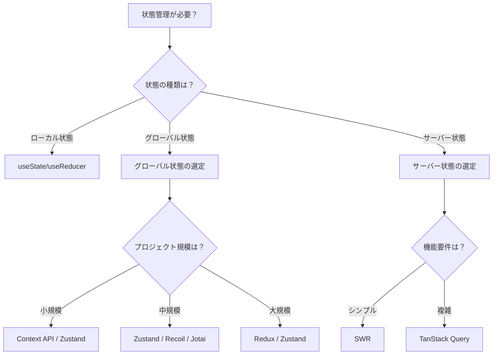

# 状態管理選定完全ガイド

状態管理ライブラリの選定方法を、実務で使える意思決定フローと実装例とともに詳しく解説します。

## 1. 選定の重要性

### なぜ選定が重要なのか

状態管理ライブラリの選定は、プロジェクトの成功に大きく影響します。不適切な選択により、以下の問題が発生する可能性があります：

```
不適切な選定による問題
   ├─ 開発速度の低下
   ├─ 保守性の低下
   ├─ パフォーマンスの問題
   └─ チームの混乱
```

### 選定を誤った場合の実際の事例

#### 事例1: 小規模プロジェクトでReduxを選択

**発生した問題:**
- ボイラープレートが多すぎて開発速度が低下
- シンプルな状態管理に過剰な複雑さが生じる
- チームメンバーの学習コストが高い

**結果:**
- 開発速度が40%低下
- コードの可読性が低下
- 新機能の追加に時間がかかる

**適切な選択:**
- ZustandやContext APIを使用
- 開発速度が30%向上
- コードの可読性が向上

#### 事例2: 大規模プロジェクトでContext APIのみを使用

**発生した問題:**
- パフォーマンスの問題（不要な再レンダリング）
- 状態管理の複雑さが増大
- デバッグが困難

**結果:**
- パフォーマンスが50%低下
- バグが2倍に増加
- デバッグ時間が3倍に増加

**適切な選択:**
- ReduxやZustandを使用
- パフォーマンスが2倍向上
- デバッグが容易になる

## 2. 選定の意思決定フロー

### ステップ1: 状態の種類を特定



### ステップ2: プロジェクト要件の評価

#### 評価項目

| 評価項目 | 説明 | 重要度 |
|---------|------|--------|
| **プロジェクト規模** | 小規模/中規模/大規模 | 高 |
| **チーム規模** | 1人/小規模チーム/大規模チーム | 中 |
| **学習コスト** | チームの経験値 | 中 |
| **パフォーマンス要件** | 高い/中程度/低い | 高 |
| **デバッグ要件** | タイムトラベル/通常/不要 | 中 |
| **型安全性** | TypeScript使用/JavaScript | 中 |
| **バンドルサイズ** | 重要/中程度/不要 | 低 |

### ステップ3: ライブラリの比較

#### グローバル状態管理ライブラリの比較

| ライブラリ | 学習コスト | ボイラープレート | 規模 | デバッグ | パフォーマンス | バンドルサイズ |
|-----------|-----------|----------------|------|---------|--------------|--------------|
| **Context API** | 低い | 少ない | 小規模 | 容易 | 中程度 | 0KB（標準） |
| **Redux** | 高い | 多い | 大規模 | 優秀 | 高い | 約12KB |
| **Zustand** | 非常に低い | 非常に少ない | 小〜中規模 | 容易 | 高い | 約1KB |
| **Recoil** | 低い | 少ない | 小〜大規模 | 容易 | 高い | 約14KB |
| **Jotai** | 非常に低い | 少ない | 小〜大規模 | 容易 | 高い | 約3KB |

#### サーバー状態管理ライブラリの比較

| ライブラリ | 学習コスト | 機能 | デバッグ | バンドルサイズ | コミュニティ |
|-----------|-----------|------|---------|--------------|------------|
| **SWR** | 低い | 基本的 | 容易 | 約4KB | Vercel中心 |
| **TanStack Query** | 中程度 | 豊富 | 優秀 | 約13KB | 大規模 |

## 3. 選定基準の詳細

### 基準1: プロジェクト規模

#### 小規模プロジェクト（1-5画面、1-3人）

**推奨:**
- **グローバル状態**: Context API、Zustand
- **サーバー状態**: SWR

**理由:**
- 学習コストが低い
- セットアップが簡単
- ボイラープレートが少ない

**実装例:**

```typescript
// Zustandを使用した小規模プロジェクト
import { create } from 'zustand';

interface UserStore {
  user: User | null;
  setUser: (user: User) => void;
}

const useUserStore = create<UserStore>((set) => ({
  user: null,
  setUser: (user) => set({ user }),
}));

// 使用
function UserProfile() {
  const user = useUserStore((state) => state.user);
  return <div>{user?.name}</div>;
}
```

#### 中規模プロジェクト（5-20画面、3-10人）

**推奨:**
- **グローバル状態**: Zustand、Recoil、Jotai
- **サーバー状態**: SWR、TanStack Query

**理由:**
- バランスの取れた機能とシンプルさ
- チーム開発に適している
- 拡張性がある

**実装例:**

```typescript
// Zustandを使用した中規模プロジェクト
import { create } from 'zustand';
import { devtools } from 'zustand/middleware';

interface AppStore {
  user: User | null;
  theme: 'light' | 'dark';
  setUser: (user: User) => void;
  setTheme: (theme: 'light' | 'dark') => void;
}

const useAppStore = create<AppStore>()(
  devtools(
    (set) => ({
      user: null,
      theme: 'light',
      setUser: (user) => set({ user }),
      setTheme: (theme) => set({ theme }),
    }),
    { name: 'AppStore' }
  )
);
```

#### 大規模プロジェクト（20画面以上、10人以上）

**推奨:**
- **グローバル状態**: Redux、Zustand
- **サーバー状態**: TanStack Query

**理由:**
- 厳格な状態管理が必要
- デバッグツールが重要
- チーム間の一貫性が必要

**実装例:**

```typescript
// Redux Toolkitを使用した大規模プロジェクト
import { configureStore, createSlice } from '@reduxjs/toolkit';

const userSlice = createSlice({
  name: 'user',
  initialState: { user: null },
  reducers: {
    setUser: (state, action) => {
      state.user = action.payload;
    },
  },
});

export const store = configureStore({
  reducer: {
    user: userSlice.reducer,
  },
});
```

### 基準2: 状態の複雑さ

#### シンプルな状態（数値、文字列、配列）

**推奨:**
- Context API、Zustand

**実装例:**

```typescript
// Context APIを使用
const ThemeContext = createContext<'light' | 'dark'>('light');

function ThemeProvider({ children }) {
  const [theme, setTheme] = useState<'light' | 'dark'>('light');
  return (
    <ThemeContext.Provider value={{ theme, setTheme }}>
      {children}
    </ThemeContext.Provider>
  );
}
```

#### 複雑な状態（ネストされたオブジェクト、配列の配列）

**推奨:**
- Redux、Zustand、Recoil

**実装例:**

```typescript
// Zustandを使用した複雑な状態
interface ComplexStore {
  users: User[];
  posts: Post[];
  comments: Comment[];
  addUser: (user: User) => void;
  addPost: (post: Post) => void;
  addComment: (comment: Comment) => void;
}

const useComplexStore = create<ComplexStore>((set) => ({
  users: [],
  posts: [],
  comments: [],
  addUser: (user) => set((state) => ({
    users: [...state.users, user],
  })),
  addPost: (post) => set((state) => ({
    posts: [...state.posts, post],
  })),
  addComment: (comment) => set((state) => ({
    comments: [...state.comments, comment],
  })),
}));
```

### 基準3: パフォーマンス要件

#### 高いパフォーマンス要件

**推奨:**
- Zustand、Recoil、Jotai、Redux

**理由:**
- 細かい粒度での再レンダリング制御
- メモ化が容易
- パフォーマンス最適化が可能

**実装例:**

```typescript
// Zustandを使用したパフォーマンス最適化
import { create } from 'zustand';
import { shallow } from 'zustand/shallow';

interface Store {
  count: number;
  name: string;
  increment: () => void;
}

const useStore = create<Store>((set) => ({
  count: 0,
  name: 'John',
  increment: () => set((state) => ({ count: state.count + 1 })),
}));

// 細かい粒度での選択
function Counter() {
  const count = useStore((state) => state.count);
  // nameが変更されても再レンダリングされない
  return <div>{count}</div>;
}
```

#### 中程度のパフォーマンス要件

**推奨:**
- Context API、Zustand

**実装例:**

```typescript
// Context APIを使用（メモ化で最適化）
const UserContext = createContext();

function UserProvider({ children }) {
  const [user, setUser] = useState(null);
  const value = useMemo(() => ({ user, setUser }), [user]);
  return (
    <UserContext.Provider value={value}>
      {children}
    </UserContext.Provider>
  );
}
```

### 基準4: デバッグ要件

#### タイムトラベルデバッグが必要

**推奨:**
- Redux（Redux DevTools）

**実装例:**

```typescript
// Redux DevToolsを使用
import { configureStore } from '@reduxjs/toolkit';

export const store = configureStore({
  reducer: {
    // reducers
  },
  devTools: process.env.NODE_ENV !== 'production',
});
```

#### 通常のデバッグで十分

**推奨:**
- Zustand、Recoil、Jotai

**実装例:**

```typescript
// Zustand DevToolsを使用
import { create } from 'zustand';
import { devtools } from 'zustand/middleware';

const useStore = create(
  devtools(
    (set) => ({
      count: 0,
      increment: () => set((state) => ({ count: state.count + 1 })),
    }),
    { name: 'CounterStore' }
  )
);
```

## 4. 実践的な選定例

### ケース1: スタートアップのMVP開発

**要件:**
- 小規模チーム（2-3人）
- 迅速な開発が必要
- 学習コストを抑えたい
- 将来的な拡張性も考慮

**選定:**
- **グローバル状態**: Zustand
- **サーバー状態**: SWR

**理由:**
- 学習コストが低い
- セットアップが簡単
- 将来的に拡張可能

**実装例:**

```typescript
// Zustand + SWRの組み合わせ
import { create } from 'zustand';
import useSWR from 'swr';

// グローバル状態
const useAppStore = create((set) => ({
  theme: 'light',
  setTheme: (theme) => set({ theme }),
}));

// サーバー状態
function UserList() {
  const { data } = useSWR('/api/users', fetcher);
  return <div>{data?.map(user => <div key={user.id}>{user.name}</div>)}</div>;
}
```

### ケース2: エンタープライズアプリケーション

**要件:**
- 大規模チーム（10人以上）
- 厳格な状態管理が必要
- タイムトラベルデバッグが必要
- 長期的な保守性が重要

**選定:**
- **グローバル状態**: Redux Toolkit
- **サーバー状態**: TanStack Query

**理由:**
- 厳格な状態管理
- 優秀なデバッグツール
- チーム間の一貫性
- 長期的な保守性

**実装例:**

```typescript
// Redux Toolkit + TanStack Queryの組み合わせ
import { configureStore } from '@reduxjs/toolkit';
import { QueryClient, QueryClientProvider } from '@tanstack/react-query';

// Redux Store
export const store = configureStore({
  reducer: {
    // reducers
  },
});

// TanStack Query
const queryClient = new QueryClient();

function App() {
  return (
    <QueryClientProvider client={queryClient}>
      <Provider store={store}>
        <YourApp />
      </Provider>
    </QueryClientProvider>
  );
}
```

### ケース3: パフォーマンス重視のアプリケーション

**要件:**
- 高いパフォーマンス要件
- 細かい粒度での再レンダリング制御
- リアルタイム更新が必要

**選定:**
- **グローバル状態**: Jotai、Recoil
- **サーバー状態**: TanStack Query

**理由:**
- アトミックな状態管理
- 細かい粒度での最適化
- パフォーマンスが高い

**実装例:**

```typescript
// Jotaiを使用したパフォーマンス最適化
import { atom, useAtom } from 'jotai';

const countAtom = atom(0);
const nameAtom = atom('John');

function Counter() {
  const [count] = useAtom(countAtom);
  // nameが変更されても再レンダリングされない
  return <div>{count}</div>;
}

function Name() {
  const [name] = useAtom(nameAtom);
  // countが変更されても再レンダリングされない
  return <div>{name}</div>;
}
```

## 5. 選定チェックリスト

### プロジェクト要件の確認

- [ ] プロジェクト規模は？（小規模/中規模/大規模）
- [ ] チーム規模は？（1人/小規模/大規模）
- [ ] 学習コストは重要か？（はい/いいえ）
- [ ] パフォーマンス要件は？（高い/中程度/低い）
- [ ] デバッグ要件は？（タイムトラベル/通常/不要）
- [ ] 型安全性は必要か？（TypeScript/JavaScript）
- [ ] バンドルサイズは重要か？（はい/いいえ）

### 状態の種類の確認

- [ ] ローカル状態のみ？（useState/useReducer）
- [ ] グローバル状態が必要？（Context API/Redux/Zustand等）
- [ ] サーバー状態が必要？（SWR/TanStack Query）

### 機能要件の確認

- [ ] タイムトラベルデバッグが必要か？
- [ ] ミドルウェアが必要か？
- [ ] 永続化が必要か？
- [ ] オフライン対応が必要か？

## 6. よくある問題と解決策

### 問題1: 選定を誤った場合の対処

**原因:**
- 要件の分析が不十分
- チームの経験値の考慮不足

**解決策:**
```typescript
// 段階的な移行
// 1. 新しいライブラリを部分的に導入
// 2. 既存のコードと並行運用
// 3. 段階的に移行

// 例: Context APIからZustandへの移行
// 既存のContext API
const UserContext = createContext();

// 新しいZustand Store
const useUserStore = create((set) => ({
  user: null,
  setUser: (user) => set({ user }),
}));

// 段階的に移行
function UserProfile() {
  // 既存: const { user } = useContext(UserContext);
  // 新規: const user = useUserStore((state) => state.user);
  const user = useUserStore((state) => state.user);
  return <div>{user?.name}</div>;
}
```

### 問題2: 複数のライブラリを混在させる

**原因:**
- 要件が複雑
- 段階的な導入

**解決策:**
```typescript
// 明確な使い分けルールを定義
// グローバル状態: Zustand
// サーバー状態: TanStack Query
// フォーム状態: React Hook Form

// 例: 明確な使い分け
import { useQuery } from '@tanstack/react-query';
import { useForm } from 'react-hook-form';
import { useUserStore } from './stores/userStore';

function UserForm() {
  // サーバー状態: TanStack Query
  const { data: user } = useQuery({
    queryKey: ['user'],
    queryFn: fetchUser,
  });
  
  // フォーム状態: React Hook Form
  const { register, handleSubmit } = useForm();
  
  // グローバル状態: Zustand
  const setUser = useUserStore((state) => state.setUser);
  
  // ...
}
```

これで、状態管理ライブラリの選定方法を理解できるようになりました。


