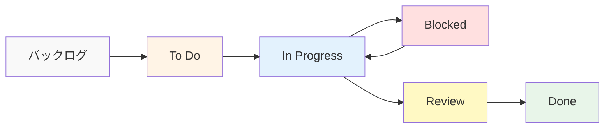

# タスク管理完全ガイド

この資料は、**管理コストを最小化し、エンジニアの心理的安全性を最大化する**ためのタスク管理ガイドです。
目的は「管理すること」ではなく、**詰まりを早期に見つけ、チームが自律的に前進できる状態**を作ることです。

## 1. タスク管理とは

### タスク管理の役割

タスク管理は、プロジェクトの作業を適切に分配し、**詰まりと遅延を早期に可視化する**ための仕組みです。

```
タスク管理の目的
   ├─ 作業の可視化
   ├─ 進捗の把握
   ├─ リソースの最適化
   ├─ 心理的安全性の確保
   └─ 品質の確保
```

### なぜタスク管理が必要か

**問題のある構成（タスク管理なし）:**

```
問題のある状況:
- 誰が何をやっているか分からない
- タスクの優先順位が不明確
- 進捗が把握できない
- タスクの重複が発生する
- リソースの無駄が発生する
 - 進捗が詰まっても言い出せない

影響:
- プロジェクトの遅延
- チームの混乱
- 品質の低下
- メンバーの負荷の偏り
 - 進捗の自己申告が信用できなくなる
```

**解決: タスク管理による明確な管理**

```
解決策:
- タスクの明確な定義
- 優先順位の設定
- 担当者の明確化
- 進捗の可視化
 - 詰まりを「責めずに助ける」運用

メリット:
- プロジェクトの進捗が把握できる
- チームの連携が向上する
- 品質が向上する
- メンバーの負荷が均等になる
 - 詰まりが早期に解消される
```

### 宣言: ベロシティは評価に使わない

ベロシティ（チームの消化ポイント数）を個人評価に使うと、ポイントのインフレが起きます。
**ベロシティはチームの予測精度を高めるための指標であり、個人の能力を測るものではない**と明記します。
この宣言が、見積もりの誠実さと心理的安全性を守ります。

## 2. タスクの振り方

### タスクの種類

#### 1. 機能開発タスク

```markdown
## タスク例: ユーザー認証機能の実装

### タスクの詳細
- **タイトル**: ユーザー認証機能の実装
- **説明**: JWTを使用したユーザー認証機能を実装する
- **優先度**: 高
- **見積もり**: 5日
- **担当者**: バックエンドエンジニア

### サブタスク
1. 認証APIの設計（1日）
2. JWTトークンの実装（2日）
3. 認証ミドルウェアの実装（1日）
4. テストの作成（1日）
```

#### 2. バグ修正タスク

```markdown
## タスク例: ログインエラーの修正

### タスクの詳細
- **タイトル**: ログインエラーの修正
- **説明**: 特定の条件下でログインが失敗する問題を修正
- **優先度**: 高（緊急）
- **見積もり**: 0.5日
- **担当者**: バックエンドエンジニア

### 再現手順
1. ユーザー名: test@example.com
2. パスワード: password123
3. ログインボタンをクリック
4. エラーが発生する
```

#### 3. リファクタリングタスク

```markdown
## タスク例: 認証ロジックのリファクタリング

### タスクの詳細
- **タイトル**: 認証ロジックのリファクタリング
- **説明**: 認証ロジックをより保守しやすい構造に変更
- **優先度**: 中
- **見積もり**: 3日
- **担当者**: バックエンドエンジニア

### リファクタリング内容
- 認証ロジックの分離
- エラーハンドリングの改善
- テストの追加
```

### タスクの振り方の原則

#### 原則1: スキルと経験を考慮

```markdown
## タスクの振り方

### 考慮すべき要素
1. **スキルレベル**: タスクの難易度とメンバーのスキルをマッチング
2. **経験**: 類似のタスクの経験があるか
3. **学習機会**: 成長の機会を提供する
4. **負荷**: メンバーの現在の負荷を考慮

### 実装例

#### シニアエンジニア向けタスク
- アーキテクチャ設計
- 複雑な機能の実装
- 技術的負債の解消

#### ジュニアエンジニア向けタスク
- 小さな機能の実装
- バグ修正
- テストの追加
- ドキュメントの作成
```

#### 原則2: 優先順位を明確にする

```markdown
## 優先順位の設定

### 優先順位のレベル
1. **緊急・重要**: すぐに対応が必要（例: 本番環境のバグ）
2. **重要・非緊急**: 重要だが時間的余裕がある（例: 新機能の実装）
3. **緊急・非重要**: 緊急だが重要度は低い（例: 小さなUI修正）
4. **非緊急・非重要**: 時間的余裕があり重要度も低い（例: リファクタリング）

### 実装例

#### 緊急・重要
- 本番環境のバグ修正
- セキュリティ脆弱性の対応
- データ損失の防止

#### 重要・非緊急
- 新機能の実装
- パフォーマンス改善
- ユーザー体験の向上
```

#### 原則3: 見積もりを再定義する

```markdown
## 見積もりの方法

### 見積もりの単位
- **ストーリーポイント**: 相対的な難易度（1, 2, 3, 5, 8, 13）
- **時間**: 実際の時間（時間、日）

### 見積もりの考慮事項
1. **見積もりは約束ではない**: 現在の理解度を示す予測である
2. **不確実性は前提**: 不確実性が高い場合はバッファを追加
3. **依存関係は明示**: 他のタスクに依存する場合は必ず記載
4. **リスクは見える化**: リスクが高い場合はバッファを追加

### バッファ運用（割り込み耐性）

稼働時間の**20%を計画外タスク**に充てるルールを置きます。
割り込みは必ず発生するため、計画に織り込まないと遅延は確定します。

### パーキンソンの法則対策（タイムボックス）

余裕を持たせた見積もりは、開発を引き延ばします。
**タスクにタイムボックスを設定し、期限内で成果を出す習慣**を作ります。

### 実装例

#### ストーリーポイント
- 1ポイント: 1-2時間（例: 小さなバグ修正）
- 2ポイント: 半日（例: 小さな機能追加）
- 3ポイント: 1日（例: 中程度の機能実装）
- 5ポイント: 2-3日（例: 複雑な機能実装）
- 8ポイント: 1週間（例: 大きな機能実装）
- 13ポイント: 2週間以上（例: アーキテクチャ変更）
```

## 3. タスクの管理方法

### タスク管理ツール

#### GitHub Issues

```markdown
## Issueの作成例

### タイトル
ユーザー認証機能の実装

### 説明
JWTを使用したユーザー認証機能を実装する

### ラベル
- feature
- backend
- high-priority

### 担当者
@backend-engineer

### マイルストーン
Sprint 1

### チェックリスト
- [ ] 認証APIの設計
- [ ] JWTトークンの実装
- [ ] 認証ミドルウェアの実装
- [ ] テストの作成
```

#### Jira

```markdown
## Jiraチケットの作成例

### タイトル
ユーザー認証機能の実装

### タイプ
Story

### 優先度
High

### 見積もり
5 Story Points

### 担当者
Backend Team

### 説明
JWTを使用したユーザー認証機能を実装する

### 受け入れ基準
- ユーザーがログインできる
- JWTトークンが発行される
- トークンで認証できる
- テストが作成されている
```

### タスクの進捗管理

#### カンバンボード



#### 「Blocked」を責めない運用

「進捗が遅れていることを言い出しにくい」状態が最大のリスクです。
カンバンに **Blocked（詰まっている）** を明確に作り、**責めるのではなく助ける**ことをプロセス化します。

```
Blocked時の行動:
1. ブロッカーを明記（仕様待ち / 依存未完了 / 環境不具合）
2. デイリーで声を上げる
3. チームが支援役を決める
```

#### 進捗の可視化

```markdown
## 進捗レポートの例

### スプリント進捗
- **総タスク数**: 20
- **完了タスク数**: 12
- **進行中タスク数**: 5
- **未着手タスク数**: 3
- **進捗率**: 60%

### タスクの状態
- **完了**: 12タスク
- **レビュー中**: 3タスク
- **実装中**: 5タスク
- **未着手**: 3タスク
```

## 4. 実務でのベストプラクティス

### パターン1: タスクの粒度管理

```markdown
## タスクの粒度

### 適切な粒度
- **小さすぎる**: 5分程度のタスク（統合すべき）
- **適切**: 半日〜1日程度のタスク
- **大きすぎる**: 1週間以上のタスク（分割すべき）

### 実装例

#### 大きすぎるタスク（分割前）
- ユーザー管理機能の実装（1週間）

#### 適切に分割したタスク
- ユーザー登録機能の実装（1日）
- ユーザー一覧機能の実装（1日）
- ユーザー編集機能の実装（1日）
- ユーザー削除機能の実装（1日）
- テストの作成（1日）
```

### パターン2: タスクの依存関係管理

```markdown
## 依存関係の管理

### 依存関係の種類
1. **完了依存**: 前のタスクが完了してから開始
2. **開始依存**: 前のタスクが開始してから開始
3. **並行実行**: 同時に実行可能

### 実装例

#### 完了依存
```
タスクA: データベース設計（完了）
  ↓
タスクB: API実装（開始可能）
```

#### 並行実行
```
タスクA: フロントエンド実装
タスクB: バックエンド実装
（同時に実行可能）
```
```

### パターン3: タスクの優先順位付け

```markdown
## 優先順位付けの方法

### マトリックス法

| 重要度 | 緊急度 | 優先度 |
|--------|--------|--------|
| 高 | 高 | 最優先 |
| 高 | 低 | 高 |
| 低 | 高 | 中 |
| 低 | 低 | 低 |

### 実装例

#### 最優先
- 本番環境のバグ修正
- セキュリティ脆弱性の対応

#### 高
- 新機能の実装
- パフォーマンス改善

#### 中
- UIの改善
- ドキュメントの更新

#### 低
- リファクタリング
- 技術的負債の解消
```

### パターン4: 完了定義（DoD）の徹底

「動いたから終わり」ではなく、**テスト・レビュー・ドキュメントまで含めた真の完了**を定義します。

```
DoDの例:
- 期待する挙動のテストが追加されている
- レビューが完了している
- 変更点のドキュメントが更新されている
- 監視やアラートに影響がないことを確認済み
```

### パターン5: 詰まりの可視化と救出儀式

```
運用ルール:
- Blockedが1日続いたら必ずデイリーで共有
- 誰かが支援役になるまでBlockedを放置しない
- ブロッカーが解消されるまで他タスクに安易に逃げない
```

## 5. よくある問題と解決策

### 問題1: タスクの重複

**原因:**
- タスクの定義が不明確
- コミュニケーション不足

**解決策:**
```markdown
## タスクの明確化

### タスク定義のテンプレート
- **タイトル**: 明確で具体的なタイトル
- **説明**: 何を実装するか、なぜ必要か
- **受け入れ基準**: 完了の条件
- **関連タスク**: 関連するタスクへのリンク
- **参考資料**: 関連するドキュメントへのリンク
```

### 問題2: タスクの進捗が把握できない

**原因:**
- タスクの状態が更新されていない
- 進捗の可視化が不十分

**解決策:**
```markdown
## 進捗管理の仕組み

### 定期的な更新
- **デイリースタンドアップ**: 毎日の進捗共有
- **週次レポート**: 週次の進捗レポート
- **スプリントレビュー**: スプリント終了時のレビュー

### 可視化
- **カンバンボード**: タスクの状態を可視化
- **バーンダウンチャート**: 進捗を可視化
- **ベロシティ**: 予測精度向上のために使う（評価には使わない）
```

### 問題3: タスクの負荷が偏る

**原因:**
- タスクの振り方が不適切
- メンバーのスキルを考慮していない

**解決策:**
```markdown
## 負荷の均等化

### 負荷の確認
- **タスク数**: 各メンバーのタスク数を確認
- **見積もり**: 各メンバーの見積もり合計を確認
- **スキル**: タスクの難易度とスキルのマッチング

### 調整方法
- タスクの再分配
- ペアプログラミングの活用
- メンター制度の活用
```

これで、タスク管理の基礎知識と実務での使い方を理解できるようになりました。


