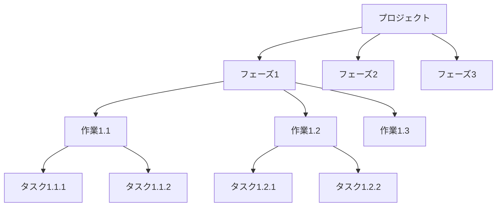
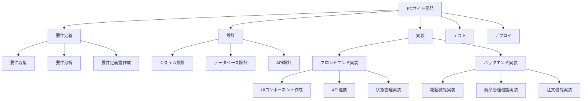
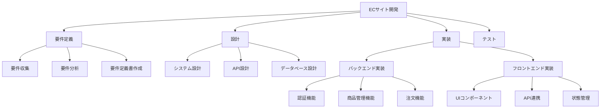

# WBS完全ガイド

WBS（Work Breakdown Structure）の作成方法を、実務で使える実装例とベストプラクティスとともに詳しく解説します。

## 1. WBSとは

### WBSの役割

WBS（Work Breakdown Structure）は、プロジェクトを小さな作業単位に分解し、階層構造で表現する手法です。

```
WBSの目的
   ├─ プロジェクトの全体像の把握
   ├─ 作業の明確化
   ├─ 見積もりの精度向上
   └─ 進捗管理の容易化
```

### なぜWBSが必要か

**問題のある構成（WBSなし）:**

```
問題のある状況:
- プロジェクトの全体像が把握できない
- 作業の漏れが発生する
- 見積もりが不正確
- 進捗管理が困難

影響:
- プロジェクトの遅延
- 予算の超過
- 品質の低下
- チームの混乱
```

**解決: WBSによる明確な構造化**

```
解決策:
- プロジェクトを階層的に分解
- 作業の漏れを防止
- 見積もりの精度向上
- 進捗管理の容易化

メリット:
- プロジェクトの全体像が把握できる
- 作業の漏れが減る
- 見積もりが正確になる
- 進捗管理が容易になる
```

## 2. WBSの基本構造

### WBSの階層構造



### WBSのレベル

```
レベル1: プロジェクト全体
レベル2: フェーズ/マイルストーン
レベル3: 作業パッケージ
レベル4: タスク
レベル5: サブタスク（必要に応じて）
```

## 3. WBSの線の引き方

### 原則1: 100%ルール

```markdown
## 100%ルール

### 原則
- 親要素の作業は、子要素の作業の合計と等しくなければならない
- すべての作業が漏れなく含まれている必要がある

### 実装例

#### 正しい例
```
プロジェクト: ECサイト開発（100%）
├── フェーズ1: 要件定義（20%）
│   ├── 要件収集（10%）
│   └── 要件定義書作成（10%）
├── フェーズ2: 設計（30%）
│   ├── システム設計（15%）
│   └── データベース設計（15%）
└── フェーズ3: 実装（50%）
    ├── フロントエンド実装（25%）
    └── バックエンド実装（25%）
```

#### 間違った例
```
プロジェクト: ECサイト開発（100%）
├── フェーズ1: 要件定義（20%）
├── フェーズ2: 設計（30%）
└── フェーズ3: 実装（40%）
# 問題: 合計が90%で、10%が不足している
```
```

### 原則2: 相互排他性

```markdown
## 相互排他性

### 原則
- 各作業は、他の作業と重複してはならない
- 各作業は、明確に区別できる必要がある

### 実装例

#### 正しい例
```
実装フェーズ
├── フロントエンド実装
│   ├── UIコンポーネント作成
│   └── API連携
└── バックエンド実装
    ├── API実装
    └── データベース操作
```

#### 間違った例
```
実装フェーズ
├── フロントエンド実装
│   ├── UIコンポーネント作成
│   └── API実装（重複）
└── バックエンド実装
    ├── API実装（重複）
    └── データベース操作
# 問題: API実装が重複している
```
```

### 原則3: 成果物指向

```markdown
## 成果物指向

### 原則
- 作業ではなく、成果物（Deliverable）で分解する
- 成果物が明確になれば、作業も明確になる

### 実装例

#### 成果物指向（推奨）
```
ECサイト開発
├── 要件定義書
│   ├── 機能要件
│   └── 非機能要件
├── 設計書
│   ├── システム設計書
│   └── データベース設計書
└── 実装成果物
    ├── フロントエンドコード
    └── バックエンドコード
```

#### 作業指向（非推奨）
```
ECサイト開発
├── 要件定義作業
├── 設計作業
└── 実装作業
# 問題: 成果物が不明確
```
```

## 4. WBSの作成手順

### ステップ1: プロジェクトの分解

```markdown
## プロジェクトの分解

### 方法
1. プロジェクトを主要なフェーズに分解
2. 各フェーズを作業パッケージに分解
3. 各作業パッケージをタスクに分解

### 実装例

#### レベル1: プロジェクト
ECサイト開発プロジェクト

#### レベル2: フェーズ
1. 要件定義
2. 設計
3. 実装
4. テスト
5. デプロイ

#### レベル3: 作業パッケージ
要件定義
├── 要件収集
├── 要件分析
└── 要件定義書作成
```

### ステップ2: 詳細化

```markdown
## 詳細化

### 方法
1. 各作業パッケージをさらに詳細化
2. タスクレベルまで分解
3. 見積もり可能な単位まで分解

### 実装例

#### レベル4: タスク
要件収集
├── ステークホルダーインタビュー
├── 既存システムの調査
└── 競合他社の調査
```

### ステップ3: 検証

```markdown
## 検証

### チェック項目
- [ ] 100%ルールが守られているか
- [ ] 相互排他性が保たれているか
- [ ] 成果物が明確か
- [ ] 見積もり可能な単位まで分解されているか
- [ ] 作業の漏れがないか
```

## 5. 実践的なWBS例

### ケース1: ECサイト開発プロジェクト



### ケース2: API開発プロジェクト

```markdown
## API開発プロジェクトのWBS

### レベル1: プロジェクト
API開発プロジェクト

### レベル2: フェーズ
1. 要件定義（20%）
2. 設計（30%）
3. 実装（40%）
4. テスト（10%）

### レベル3: 作業パッケージ

#### 要件定義（20%）
- 要件収集（10%）
  - ステークホルダーインタビュー（5%）
  - 既存システムの調査（3%）
  - 競合他社の調査（2%）
- 要件分析（5%）
  - 機能要件の整理（3%）
  - 非機能要件の整理（2%）
- 要件定義書作成（5%）
  - 機能要件書作成（3%）
  - 非機能要件書作成（2%）

#### 設計（30%）
- システム設計（15%）
  - アーキテクチャ設計（8%）
  - データモデル設計（4%）
  - セキュリティ設計（3%）
- API設計（10%）
  - RESTful API設計（5%）
  - エラーハンドリング設計（3%）
  - 認証・認可設計（2%）
- データベース設計（5%）
  - テーブル設計（3%）
  - インデックス設計（2%）

#### 実装（40%）
- バックエンド実装（25%）
  - 認証機能実装（5%）
  - ユーザー管理機能実装（5%）
  - 商品管理機能実装（8%）
  - 注文機能実装（7%）
- フロントエンド実装（15%）
  - UIコンポーネント作成（5%）
  - API連携（5%）
  - 状態管理実装（3%）
  - ルーティング実装（2%）

#### テスト（10%）
- 単体テスト（5%）
  - バックエンドテスト（3%）
  - フロントエンドテスト（2%）
- 統合テスト（3%）
  - APIテスト（2%）
  - E2Eテスト（1%）
- テストレビュー（2%）
```

## 6. WBSの線の引き方の実践例

### パターン1: 機能別の分解

```markdown
## 機能別の分解

### 実装例
ECサイト開発
├── ユーザー管理機能
│   ├── ユーザー登録
│   ├── ユーザー認証
│   └── ユーザー情報管理
├── 商品管理機能
│   ├── 商品一覧
│   ├── 商品詳細
│   └── 商品検索
└── 注文管理機能
    ├── カート機能
    ├── 注文作成
    └── 注文履歴
```

### パターン2: フェーズ別の分解

```markdown
## フェーズ別の分解

### 実装例
ECサイト開発
├── 要件定義フェーズ
│   ├── 要件収集
│   ├── 要件分析
│   └── 要件定義書作成
├── 設計フェーズ
│   ├── システム設計
│   ├── API設計
│   └── データベース設計
├── 実装フェーズ
│   ├── バックエンド実装
│   └── フロントエンド実装
└── テストフェーズ
    ├── 単体テスト
    └── 統合テスト
```

### パターン3: コンポーネント別の分解

```markdown
## コンポーネント別の分解

### 実装例
ECサイト開発
├── フロントエンド
│   ├── ユーザーインターフェース
│   ├── 状態管理
│   └── API連携
├── バックエンド
│   ├── API実装
│   ├── ビジネスロジック
│   └── データアクセス
└── インフラ
    ├── サーバー構築
    ├── データベース構築
    └── CI/CD構築
```

## 7. WBSの作成ツール

### Mermaidを使用したWBS



### 表形式のWBS

### 表形式のWBS

| ID | 作業名 | 親ID | 見積もり | 担当者 | 状態 |
|----|--------|------|----------|--------|------|
| 1.0 | ECサイト開発 | - | 100% | PM | 進行中 |
| 1.1 | 要件定義 | 1.0 | 20% | BA | 完了 |
| 1.1.1 | 要件収集 | 1.1 | 10% | BA | 完了 |
| 1.1.2 | 要件分析 | 1.1 | 5% | BA | 完了 |
| 1.1.3 | 要件定義書作成 | 1.1 | 5% | BA | 完了 |
| 1.2 | 設計 | 1.0 | 30% | アーキテクト | 進行中 |
| 1.2.1 | システム設計 | 1.2 | 15% | アーキテクト | 完了 |
| 1.2.2 | API設計 | 1.2 | 10% | アーキテクト | 進行中 |
| 1.2.3 | データベース設計 | 1.2 | 5% | アーキテクト | 未着手 |
| 1.3 | 実装 | 1.0 | 40% | エンジニア | 未着手 |
| 1.3.1 | バックエンド実装 | 1.3 | 25% | バックエンド | 未着手 |
| 1.3.2 | フロントエンド実装 | 1.3 | 15% | フロントエンド | 未着手 |
| 1.4 | テスト | 1.0 | 10% | QA | 未着手 |
| 1.4.1 | 単体テスト | 1.4 | 5% | エンジニア | 未着手 |
| 1.4.2 | 統合テスト | 1.4 | 3% | QA | 未着手 |
| 1.4.3 | テストレビュー | 1.4 | 2% | QA | 未着手 |

## 8. 実務でのベストプラクティス

### パターン1: WBSの粒度管理

```markdown
## WBSの粒度

### 適切な粒度
- **レベル1-2**: プロジェクト全体、フェーズ（粗い粒度）
- **レベル3-4**: 作業パッケージ、タスク（中程度の粒度）
- **レベル5以下**: サブタスク（細かい粒度、必要に応じて）

### 実装例

#### 適切な粒度
```
レベル1: ECサイト開発
レベル2: 実装フェーズ
レベル3: バックエンド実装
レベル4: 認証機能実装
レベル5: JWTトークン実装（必要に応じて）
```

#### 不適切な粒度
```
レベル1: ECサイト開発
レベル2: 実装フェーズ
レベル3: バックエンド実装
レベル4: 認証機能実装
レベル5: JWTトークン実装
レベル6: トークン生成処理
レベル7: トークン検証処理
レベル8: トークン更新処理
# 問題: 細かすぎる
```
```

### パターン2: WBSの更新

```markdown
## WBSの更新

### 更新タイミング
- **プロジェクト開始時**: 初期WBSの作成
- **フェーズ開始時**: 詳細化
- **進捗に応じて**: 必要に応じて更新
- **変更時**: プロジェクトの変更に応じて更新

### 更新の責任者
- **プロジェクトマネージャー**: WBS全体の管理
- **テックリード**: 技術的な作業の分解
- **チームメンバー**: 担当作業の詳細化
```

### パターン3: WBSとスケジュールの連携

```markdown
## WBSとスケジュールの連携

### ガントチャートとの連携
- WBSの各作業をガントチャートに反映
- 依存関係を明確にする
- マイルストーンを設定

### 実装例

#### ガントチャート
```
タスク名           | 開始日    | 終了日    | 期間
-------------------|----------|----------|------
要件定義           | 2024-01-01 | 2024-01-05 | 5日
設計              | 2024-01-06 | 2024-01-12 | 7日
実装              | 2024-01-13 | 2024-02-02 | 21日
テスト            | 2024-02-03 | 2024-02-07 | 5日
```
```

## 9. よくある問題と解決策

### 問題1: WBSが複雑になりすぎる

**原因:**
- 細かく分解しすぎている
- 階層が深すぎる

**解決策:**
```markdown
## WBSの簡素化

### 方法
1. 不要な階層を削除
2. 関連する作業を統合
3. 適切な粒度を維持

### 実装例

#### 複雑なWBS（改善前）
```
実装
├── バックエンド実装
│   ├── 認証機能実装
│   │   ├── JWTトークン実装
│   │   │   ├── トークン生成
│   │   │   └── トークン検証
│   │   └── 認証ミドルウェア実装
│   └── ユーザー管理機能実装
└── フロントエンド実装
```

#### 簡素化したWBS（改善後）
```
実装
├── バックエンド実装
│   ├── 認証機能実装
│   └── ユーザー管理機能実装
└── フロントエンド実装
```
```

### 問題2: 作業の漏れ

**原因:**
- WBSの作成が不十分
- 100%ルールが守られていない

**解決策:**
```markdown
## 作業の漏れ防止

### 方法
1. 100%ルールの徹底
2. チーム全体でのレビュー
3. 過去のプロジェクトの参照
4. チェックリストの使用

### チェックリスト
- [ ] すべてのフェーズが含まれているか
- [ ] すべての機能が含まれているか
- [ ] テストが含まれているか
- [ ] ドキュメント作成が含まれているか
- [ ] デプロイが含まれているか
```
```

### 問題3: WBSが更新されない

**原因:**
- 更新の責任者が不明確
- 更新のプロセスがない

**解決策:**
```markdown
## WBSの更新プロセス

### 方法
1. 更新の責任者を明確にする
2. 定期的な更新をスケジュールする
3. 変更時の更新を義務付ける
4. 更新履歴を記録する

### 実装例

#### 更新スケジュール
- **週次**: 進捗に応じた更新
- **フェーズ開始時**: 詳細化
- **変更時**: 即座に更新

#### 更新履歴
- 日付: 2024-01-15
- 変更内容: 認証機能の実装を追加
- 変更理由: 要件の追加
- 変更者: プロジェクトマネージャー
```
```

これで、WBSの基礎知識と実務での使い方を理解できるようになりました。


