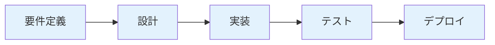
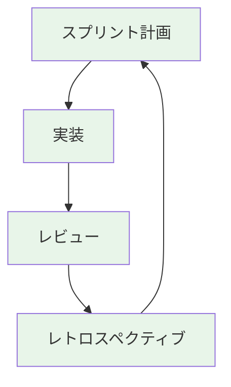
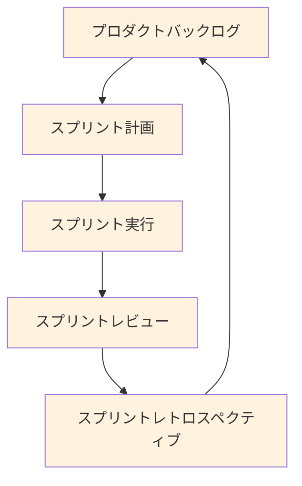

# プロジェクト管理完全ガイド

プロジェクト管理の手法を、実務で使える実装例とベストプラクティスとともに詳しく解説します。

## 1. プロジェクト管理とは

### プロジェクト管理の役割

プロジェクト管理は、プロジェクトを成功に導くための計画、実行、監視、制御のプロセスです。

```
プロジェクト管理の要素
   ├─ スコープ管理
   ├─ スケジュール管理
   ├─ コスト管理
   ├─ 品質管理
   ├─ リスク管理
   └─ ステークホルダー管理
```

### なぜプロジェクト管理が必要か

**問題のある構成（プロジェクト管理なし）:**

```
問題のある状況:
- プロジェクトの目標が不明確
- スケジュールが守られない
- 予算が超過する
- 品質が低下する
- チームが混乱する

影響:
- プロジェクトの失敗
- 顧客の不満
- チームのモチベーション低下
- 会社の信頼失墜
```

**解決: プロジェクト管理による明確な管理**

```
解決策:
- プロジェクトの目標を明確にする
- スケジュールを管理する
- 予算を管理する
- 品質を確保する
- リスクを管理する

メリット:
- プロジェクトの成功率が向上する
- 顧客の満足度が向上する
- チームのモチベーションが向上する
- 会社の信頼が向上する
```

## 2. プロジェクト管理の手法

### ウォーターフォール



**特徴:**
- 各フェーズを順次実行
- 前のフェーズが完了してから次のフェーズに進む
- 変更が困難

**適しているプロジェクト:**
- 要件が明確
- 変更が少ない
- 大規模プロジェクト

### アジャイル



**特徴:**
- 短いスプリントで反復開発
- 変更に柔軟に対応
- 顧客との協働

**適しているプロジェクト:**
- 要件が変わりやすい
- 小〜中規模プロジェクト
- 迅速な開発が必要

### スクラム



**特徴:**
- スプリントベースの開発
- 役割の明確化（プロダクトオーナー、スクラムマスター、開発チーム）
- 定期的なレビューと改善

**適しているプロジェクト:**
- 複雑なプロジェクト
- チーム開発
- 継続的な改善が必要

## 3. タスクの振り方の詳細

### タスクの振り方の原則

#### 原則1: スキルと経験を考慮

```markdown
## スキルマトリックス

### メンバーのスキル評価

| メンバー | フロントエンド | バックエンド | インフラ | 経験年数 |
|---------|--------------|------------|---------|---------|
| 田中 | 高 | 中 | 低 | 5年 |
| 佐藤 | 中 | 高 | 中 | 3年 |
| 鈴木 | 高 | 高 | 高 | 7年 |

### タスクの振り方
- **フロントエンドタスク**: 田中、鈴木
- **バックエンドタスク**: 佐藤、鈴木
- **インフラタスク**: 鈴木（メンターとして佐藤をサポート）
```

#### 原則2: 負荷の均等化

```markdown
## 負荷の均等化

### 負荷の確認

| メンバー | 現在のタスク数 | 見積もり合計 | 負荷率 |
|---------|--------------|------------|--------|
| 田中 | 3 | 5日 | 100% |
| 佐藤 | 2 | 3日 | 60% |
| 鈴木 | 4 | 7日 | 140% |

### 調整方法
- 鈴木のタスクを佐藤に再分配
- ペアプログラミングの活用
- タスクの優先順位を調整
```

#### 原則3: 学習機会の提供

```markdown
## 学習機会の提供

### メンター制度
- **シニアエンジニア**: 複雑なタスクを担当し、ジュニアをサポート
- **ジュニアエンジニア**: 小さなタスクから始め、段階的に成長

### 実装例
- ジュニアエンジニア: 小さなバグ修正から開始
- シニアエンジニア: 複雑な機能実装を担当し、レビューで指導
- ペアプログラミング: 知識の伝承
```

## 4. 実務でのベストプラクティス

### パターン1: タスクの優先順位付け

```markdown
## 優先順位付けの方法

### マトリックス法

| 重要度 | 緊急度 | 優先度 | 対応 |
|--------|--------|--------|------|
| 高 | 高 | 最優先 | すぐに対応 |
| 高 | 低 | 高 | 計画して対応 |
| 低 | 高 | 中 | 可能な範囲で対応 |
| 低 | 低 | 低 | 余裕があるときに対応 |

### 実装例

#### 最優先タスク
- 本番環境のバグ修正
- セキュリティ脆弱性の対応
- データ損失の防止

#### 高優先度タスク
- 新機能の実装
- パフォーマンス改善
- ユーザー体験の向上

#### 中優先度タスク
- UIの改善
- ドキュメントの更新
- 小さなバグ修正

#### 低優先度タスク
- リファクタリング
- 技術的負債の解消
- 将来の改善
```

### パターン2: タスクの依存関係管理

```markdown
## 依存関係の管理

### 依存関係の種類
1. **完了依存（FS）**: 前のタスクが完了してから開始
2. **開始依存（SS）**: 前のタスクが開始してから開始
3. **完了-開始依存（FF）**: 前のタスクが完了してから完了
4. **開始-開始依存（SF）**: 前のタスクが開始してから完了

### 実装例

#### 完了依存
```
タスクA: データベース設計（完了）
  ↓
タスクB: API実装（開始可能）
```

#### 並行実行
```
タスクA: フロントエンド実装
タスクB: バックエンド実装
（同時に実行可能）
```

#### 開始依存
```
タスクA: 要件定義（開始）
  ↓
タスクB: 設計（開始可能）
```
```

### パターン3: タスクの進捗管理

```markdown
## 進捗管理の方法

### デイリースタンドアップ
- **時間**: 毎日15分
- **内容**: 
  - 昨日やったこと
  - 今日やること
  - ブロッカー（障害）

### 週次レポート
- **時間**: 毎週金曜日
- **内容**:
  - 今週の進捗
  - 来週の予定
  - リスクと課題

### スプリントレビュー
- **時間**: スプリント終了時
- **内容**:
  - 完了したタスク
  - 未完了のタスク
  - ベロシティの確認
```

## 5. よくある問題と解決策

### 問題1: タスクの進捗が把握できない

**原因:**
- タスクの状態が更新されていない
- 進捗の可視化が不十分

**解決策:**
```markdown
## 進捗管理の仕組み

### 定期的な更新
- **デイリースタンドアップ**: 毎日の進捗共有
- **週次レポート**: 週次の進捗レポート
- **スプリントレビュー**: スプリント終了時のレビュー

### 可視化
- **カンバンボード**: タスクの状態を可視化
- **バーンダウンチャート**: 進捗を可視化
- **ベロシティ**: チームの速度を把握
```

### 問題2: タスクの負荷が偏る

**原因:**
- タスクの振り方が不適切
- メンバーのスキルを考慮していない

**解決策:**
```markdown
## 負荷の均等化

### 負荷の確認
- **タスク数**: 各メンバーのタスク数を確認
- **見積もり**: 各メンバーの見積もり合計を確認
- **スキル**: タスクの難易度とスキルのマッチング

### 調整方法
- タスクの再分配
- ペアプログラミングの活用
- メンター制度の活用
```

これで、プロジェクト管理の基礎知識と実務での使い方を理解できるようになりました。


