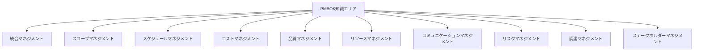

# PM論完全ガイド

プロジェクトマネージャー（PM）に必要な観点とPMBOKに基づく知識を、実務で使える実装例とベストプラクティスとともに詳しく解説します。

## 1. PM論とは

### プロジェクトマネージャーの役割

プロジェクトマネージャーは、プロジェクトの成功を導くための責任者です。

```
プロジェクトマネージャーの役割
   ├─ プロジェクトの計画
   ├─ チームのマネジメント
   ├─ ステークホルダー管理
   ├─ リスク管理
   ├─ 品質管理
   └─ コミュニケーション管理
```

### なぜPM論が重要なのか

**問題のある構成（PM論なし）:**

```
問題のある状況:
- PMの役割が不明確
- 必要なスキルが不足
- プロジェクト管理の知識が不足
- チームマネジメントが不適切

影響:
- プロジェクトの失敗
- チームの混乱
- ステークホルダーの不満
- 品質の低下
```

**解決: PM論による体系的な知識**

```
解決策:
- PMの役割を明確にする
- 必要なスキルを習得する
- プロジェクト管理の知識を身につける
- チームマネジメントのスキルを向上させる

メリット:
- プロジェクトの成功率が向上する
- チームの生産性が向上する
- ステークホルダーの満足度が向上する
- 品質が向上する
```

## 2. PMに必要な観点

### 観点1: 戦略的思考

#### 戦略的思考とは

プロジェクトの目的とビジネス価値を理解し、長期的な視点で考える能力です。

**必要なスキル:**
- ビジネス理解力
- 戦略的思考力
- 意思決定力

**実装例:**

```markdown
## 戦略的思考の実践

### プロジェクトの目的を理解する
- なぜこのプロジェクトが必要か？
- ビジネス価値は何か？
- 成功の定義は何か？

### 長期的な視点で考える
- プロジェクトの完了後はどうなるか？
- 将来の拡張性はどうか？
- 技術的負債はどうか？

### 意思決定の基準を明確にする
- 優先順位の基準は何か？
- トレードオフの判断基準は何か？
- リスク許容度はどうか？
```

### 観点2: コミュニケーション能力

#### コミュニケーション能力とは

ステークホルダーとの効果的なコミュニケーションを実現する能力です。

**必要なスキル:**
- 傾聴力
- 説明力
- 交渉力
- プレゼンテーション力

**実装例:**

```markdown
## コミュニケーション能力の実践

### ステークホルダーとのコミュニケーション
- 定期的な報告: 週次、月次での進捗報告
- 適切なタイミングでの連絡: 問題発生時の即座の連絡
- 明確な説明: 技術的な内容を分かりやすく説明

### チームとのコミュニケーション
- デイリースタンドアップ: 毎日の進捗共有
- フィードバック: 定期的なフィードバック
- エスカレーション: 問題の早期発見と対応
```

### 観点3: リスク管理能力

#### リスク管理能力とは

プロジェクトのリスクを早期に発見し、適切に対応する能力です。

**必要なスキル:**
- リスク識別力
- リスク分析力
- リスク対応力

**実装例:**

```markdown
## リスク管理能力の実践

### リスクの識別
- 定期的なリスクレビュー: 週次でのリスクレビュー
- ステークホルダーからの情報収集: 関係者からの情報収集
- 過去のプロジェクトからの学習: 過去の経験を活用

### リスクの分析
- 影響度と発生確率の評価: リスクマトリックスを使用
- 優先順位の設定: 影響度の高いリスクから対応
- 対策の検討: リスクに対する対策を検討

### リスクの対応
- リスク回避: リスクを回避する
- リスク軽減: リスクの影響を軽減する
- リスク転嫁: リスクを他に転嫁する
- リスク受容: リスクを受け入れる
```

### 観点4: チームマネジメント能力

#### チームマネジメント能力とは

チームメンバーを適切にマネジメントし、チームの生産性を向上させる能力です。

**必要なスキル:**
- リーダーシップ
- モチベーション管理
- コンフリクト管理
- パフォーマンス管理

**実装例:**

```markdown
## チームマネジメント能力の実践

### リーダーシップ
- ビジョンの共有: プロジェクトのビジョンを共有
- エンパワーメント: メンバーに権限を委譲
- サポート: メンバーをサポート

### モチベーション管理
- 目標の明確化: 明確な目標を設定
- フィードバック: 定期的なフィードバック
- 承認: 成果を承認する

### コンフリクト管理
- 早期発見: コンフリクトを早期に発見
- 対話: 対話による解決
- 調停: 必要に応じて調停
```

### 観点5: 技術的理解

#### 技術的理解とは

プロジェクトで使用する技術を理解し、技術的な判断ができる能力です。

**必要なスキル:**
- 技術知識
- アーキテクチャ理解
- 技術トレンドの理解

**実装例:**

```markdown
## 技術的理解の実践

### 技術知識の習得
- 定期的な学習: 技術書、技術ブログの読書
- ハンズオン: 実際に技術を試す
- コミュニティへの参加: 技術コミュニティへの参加

### アーキテクチャ理解
- システム設計の理解: システム設計を理解する
- 技術的負債の理解: 技術的負債を理解する
- スケーラビリティの理解: スケーラビリティを理解する

### 技術トレンドの理解
- 技術トレンドの把握: 最新の技術トレンドを把握
- 技術選定: 適切な技術選定
- 技術的リスクの理解: 技術的リスクを理解する
```

## 3. PMBOK（Project Management Body of Knowledge）

### PMBOKとは

PMBOKは、プロジェクトマネジメント協会（PMI）が発行するプロジェクトマネジメントの知識体系です。

### PMBOKの10の知識エリア



### 知識エリアの詳細

#### 1. 統合マネジメント

**定義:**
プロジェクトのすべての要素を統合的に管理すること

**主要プロセス:**
- プロジェクト憲章の作成
- プロジェクトマネジメント計画の作成
- プロジェクト作業の指揮・管理
- プロジェクト知識の管理
- 変更の監視・管理
- プロジェクトの終結

**実装例:**

```markdown
## 統合マネジメントの実践

### プロジェクト憲章の作成
- プロジェクトの目的: 明確な目的を定義
- 成功基準: 成功の基準を定義
- 主要ステークホルダー: 主要ステークホルダーを特定
- 予算とスケジュール: 予算とスケジュールを設定

### プロジェクトマネジメント計画の作成
- スコープ管理計画: スコープ管理の計画
- スケジュール管理計画: スケジュール管理の計画
- コスト管理計画: コスト管理の計画
- 品質管理計画: 品質管理の計画
- リスク管理計画: リスク管理の計画
```

#### 2. スコープマネジメント

**定義:**
プロジェクトのスコープを定義し、管理すること

**主要プロセス:**
- スコープ管理計画の作成
- スコープの収集
- スコープの定義
- WBSの作成
- スコープの承認
- スコープの監視

**実装例:**

```markdown
## スコープマネジメントの実践

### スコープの収集
- ステークホルダーからの要件収集: インタビュー、ワークショップ
- 要件の文書化: 要件定義書の作成
- 要件の優先順位付け: 優先順位の設定

### WBSの作成
- プロジェクトの分解: プロジェクトを小さな作業に分解
- 作業パッケージの定義: 作業パッケージを定義
- 責任者の割り当て: 各作業パッケージに責任者を割り当て
```

#### 3. スケジュールマネジメント

**定義:**
プロジェクトのスケジュールを計画し、管理すること

**主要プロセス:**
- スケジュール管理計画の作成
- アクティビティの定義
- アクティビティの順序設定
- アクティビティの所要期間の見積もり
- スケジュールの作成
- スケジュールの監視

**実装例:**

```markdown
## スケジュールマネジメントの実践

### アクティビティの定義
- WBSからアクティビティを抽出: WBSを基にアクティビティを定義
- アクティビティの詳細化: アクティビティを詳細化
- アクティビティの文書化: アクティビティリストの作成

### スケジュールの作成
- ガントチャートの作成: ガントチャートでスケジュールを可視化
- クリティカルパスの特定: クリティカルパスを特定
- バッファの設定: リスクを考慮してバッファを設定
```

#### 4. コストマネジメント

**定義:**
プロジェクトのコストを計画し、管理すること

**主要プロセス:**
- コスト管理計画の作成
- コストの見積もり
- 予算の設定
- コストの監視

**実装例:**

```markdown
## コストマネジメントの実践

### コストの見積もり
- ボトムアップ見積もり: 各作業のコストを積み上げ
- アナログ見積もり: 過去のプロジェクトから見積もり
- パラメトリック見積もり: 統計的手法による見積もり

### 予算の設定
- 予算の配分: 各作業に予算を配分
- 予備費の設定: リスクを考慮して予備費を設定
- 予算の承認: ステークホルダーから予算の承認を得る
```

#### 5. 品質マネジメント

**定義:**
プロジェクトの品質を計画し、管理すること

**主要プロセス:**
- 品質管理計画の作成
- 品質の管理
- 品質の保証

**実装例:**

```markdown
## 品質マネジメントの実践

### 品質管理計画の作成
- 品質基準の定義: 品質基準を定義
- 品質測定方法の定義: 品質測定方法を定義
- 品質保証活動の計画: 品質保証活動を計画

### 品質の管理
- 品質の測定: 定期的に品質を測定
- 品質の問題の特定: 品質の問題を特定
- 品質の改善: 品質を改善する
```

#### 6. リソースマネジメント

**定義:**
プロジェクトのリソースを計画し、管理すること

**主要プロセス:**
- リソース管理計画の作成
- リソースの見積もり
- リソースの獲得
- チームの構築
- チームの管理
- リソースの管理

**実装例:**

```markdown
## リソースマネジメントの実践

### リソースの見積もり
- 必要なスキルの特定: 必要なスキルを特定
- リソースの数量の見積もり: 必要なリソースの数量を見積もり
- リソースの獲得計画: リソースの獲得計画を立てる

### チームの構築
- チームメンバーの選定: 適切なメンバーを選定
- チームの役割の明確化: 各メンバーの役割を明確化
- チームビルディング: チームビルディング活動を実施
```

#### 7. コミュニケーションマネジメント

**定義:**
プロジェクトのコミュニケーションを計画し、管理すること

**主要プロセス:**
- コミュニケーション管理計画の作成
- コミュニケーションの管理
- コミュニケーションの監視

**実装例:**

```markdown
## コミュニケーションマネジメントの実践

### コミュニケーション管理計画の作成
- ステークホルダーの分析: ステークホルダーを分析
- コミュニケーション方法の定義: コミュニケーション方法を定義
- コミュニケーション頻度の設定: コミュニケーション頻度を設定

### コミュニケーションの管理
- 定期的な報告: 週次、月次での進捗報告
- 会議の実施: 定期的な会議の実施
- ドキュメントの共有: ドキュメントの共有
```

#### 8. リスクマネジメント

**定義:**
プロジェクトのリスクを識別し、管理すること

**主要プロセス:**
- リスク管理計画の作成
- リスクの識別
- リスクの定性的分析
- リスクの定量的分析
- リスク対応計画の作成
- リスク対応の実施
- リスクの監視

**実装例:**

```markdown
## リスクマネジメントの実践

### リスクの識別
- ブレインストーミング: チームでリスクを洗い出す
- チェックリスト: 過去のプロジェクトからリスクを抽出
- 専門家の意見: 専門家から意見を収集

### リスクの分析
- 影響度と発生確率の評価: リスクマトリックスを使用
- 優先順位の設定: 影響度の高いリスクから対応
- リスク対応計画の作成: リスクに対する対策を計画
```

#### 9. 調達マネジメント

**定義:**
プロジェクトの調達を計画し、管理すること

**主要プロセス:**
- 調達管理計画の作成
- 調達の実施
- 調達の管理

**実装例:**

```markdown
## 調達マネジメントの実践

### 調達管理計画の作成
- 調達対象の特定: 調達が必要なものを特定
- 調達方法の決定: 調達方法を決定
- 調達スケジュールの設定: 調達スケジュールを設定

### 調達の実施
- RFPの作成: 提案依頼書（RFP）を作成
- ベンダーの選定: 適切なベンダーを選定
- 契約の締結: 契約を締結
```

#### 10. ステークホルダーマネジメント

**定義:**
プロジェクトのステークホルダーを識別し、管理すること

**主要プロセス:**
- ステークホルダーの識別
- ステークホルダー分析
- ステークホルダー管理計画の作成
- ステークホルダーの管理

**実装例:**

```markdown
## ステークホルダーマネジメントの実践

### ステークホルダーの識別
- ステークホルダーリストの作成: すべてのステークホルダーをリストアップ
- ステークホルダーの分類: ステークホルダーを分類
- ステークホルダーの影響度の評価: 影響度を評価

### ステークホルダー管理計画の作成
- コミュニケーション計画: 各ステークホルダーとのコミュニケーション計画
- エンゲージメント戦略: ステークホルダーのエンゲージメント戦略
- 管理方法の定義: ステークホルダーの管理方法を定義
```

## 4. 実務でのベストプラクティス

### パターン1: PMスキルの継続的な向上

```markdown
## PMスキルの継続的な向上

### 学習方法
1. **PMBOKの学習**: PMBOKガイドを読む
2. **資格取得**: PMP、PgMPなどの資格取得
3. **実践**: 実際のプロジェクトで実践
4. **メンタリング**: 経験豊富なPMから学ぶ
5. **コミュニティへの参加**: PMコミュニティへの参加

### スキルマップ
- 戦略的思考: 中級
- コミュニケーション能力: 上級
- リスク管理能力: 中級
- チームマネジメント能力: 上級
- 技術的理解: 中級
```

### パターン2: PMBOKの実践的活用

```markdown
## PMBOKの実践的活用

### プロジェクトの規模に応じた適用
- **小規模プロジェクト**: 必要最小限のプロセスを適用
- **中規模プロジェクト**: 主要なプロセスを適用
- **大規模プロジェクト**: すべてのプロセスを適用

### アジャイルとの統合
- アジャイル手法とPMBOKの統合
- スクラムとPMBOKの統合
- カンバンとPMBOKの統合
```

## 5. よくある問題と解決策

### 問題1: PMの役割が不明確

**原因:**
- PMの役割が定義されていない
- PMとテックリードの役割が重複している

**解決策:**
```markdown
## PMの役割の明確化

### 方法
1. PMの役割を文書化
2. テックリードとの役割分担を明確化
3. チームに役割を共有
4. 定期的に見直し
```

### 問題2: PMBOKの適用が困難

**原因:**
- PMBOKが複雑すぎる
- プロジェクトの規模に合っていない

**解決策:**
```markdown
## PMBOKの適用

### 方法
1. プロジェクトの規模に応じて適用
2. 必要最小限のプロセスを選択
3. 段階的に適用
4. チームのフィードバックを反映
```

これで、PM論の基礎知識とPMBOKに基づく実践方法を理解できるようになりました。


