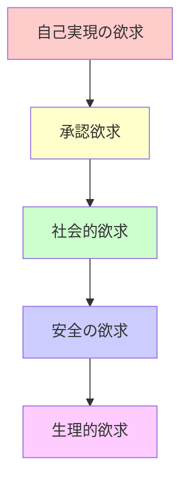
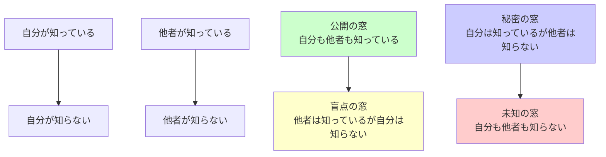
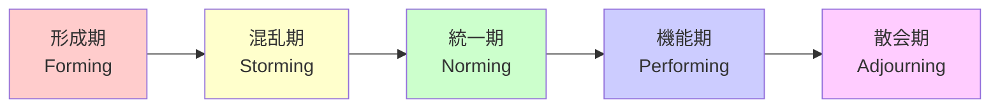

# 行動経済学と心理学に基づく組織論完全ガイド

行動経済学と心理学の観点から、組織で人と接する方法を、実務で使える実装例とベストプラクティスとともに詳しく解説します。

## 1. 行動経済学と心理学とは

### 行動経済学と心理学の役割

行動経済学と心理学は、人間の行動パターンや意思決定プロセスを理解し、組織運営に活用する学問です。

```
行動経済学と心理学の要素
   ├─ 認知バイアス
   ├─ モチベーション理論
   ├─ コミュニケーション理論
   ├─ 意思決定プロセス
   └─ チームダイナミクス
```

### なぜ行動経済学と心理学が重要なのか

**問題のある構成（行動経済学・心理学の理解なし）:**

```
問題のある状況:
- メンバーの行動を理解できない
- モチベーションが上がらない
- コミュニケーションがうまくいかない
- 意思決定が非効率
- チームの結束が弱い

影響:
- チームの生産性が低下
- メンバーの離脱
- プロジェクトの失敗
- 組織の停滞
```

**解決: 行動経済学・心理学による理解**

```
解決策:
- 人間の行動パターンを理解する
- モチベーションを適切に管理する
- 効果的なコミュニケーションを実現する
- 効率的な意思決定を促進する
- チームの結束を高める

メリット:
- チームの生産性が向上
- メンバーのエンゲージメントが向上
- プロジェクトの成功率が向上
- 組織の成長
```

## 2. 認知バイアスと組織運営

### 認知バイアスとは

認知バイアスは、人間が情報を処理する際に生じる系統的な誤りです。

### 主要な認知バイアスと対策

#### 1. 確証バイアス（Confirmation Bias）

**定義:**
自分の既存の信念や仮説を支持する情報を優先的に探し、反証する情報を無視する傾向

**組織での影響:**
- 意思決定が偏る
- フィードバックを拒否する
- 新しいアイデアを受け入れない

**対策:**

```markdown
## 確証バイアスの対策

### 実装例

#### 意思決定プロセスの改善
```
リーダー: 「この技術を採用するかどうか、判断する必要があります。確証バイアスを避けるために、以下のアプローチを取ります：

1. 反対意見を積極的に求める
   - この技術のデメリットは何か？
   - 代替案は何か？
   - リスクは何か？

2. 複数の視点から評価する
   - 技術的な視点
   - コストの視点
   - リスクの視点
   - チームのスキルの視点

3. データに基づいて判断する
   - 定量的なデータを収集
   - 定性的なデータも考慮
   - バイアスを排除した評価
```
```

#### 2. アンカリング効果（Anchoring Effect）

**定義:**
最初に提示された情報（アンカー）に判断が引きずられる傾向

**組織での影響:**
- 見積もりが最初の数字に引きずられる
- 交渉で不利になる
- 評価が偏る

**対策:**

```markdown
## アンカリング効果の対策

### 実装例

#### 見積もりの改善
```
リーダー: 「この機能の見積もりを依頼します。アンカリング効果を避けるために、以下のアプローチを取ります：

1. 複数の見積もりを求める
   - 複数のメンバーから見積もりを取得
   - 平均値を取る
   - 外れ値を除外

2. 参照情報を提供しない
   - 最初の見積もりを提示しない
   - 過去の見積もりを提示しない
   - 独立した見積もりを求める

3. 範囲で見積もる
   - 最小値、最大値、最頻値を求める
   - 不確実性を考慮する
```
```

#### 3. 損失回避（Loss Aversion）

**定義:**
損失を利益よりも大きく感じる傾向（損失の痛みは利益の喜びの約2倍）

**組織での影響:**
- リスクを過度に回避する
- 変化を恐れる
- 意思決定が遅れる

**対策:**

```markdown
## 損失回避の対策

### 実装例

#### リスク管理の改善
```
リーダー: 「このプロジェクトにはリスクがありますが、損失回避バイアスを考慮して、以下のアプローチを取ります：

1. リスクを明確に定義する
   - リスクの内容を明確にする
   - リスクの影響度を評価する
   - リスクの発生確率を評価する

2. リスクと機会のバランスを取る
   - リスクだけでなく、機会も評価する
   - リスクを取ることのメリットを明確にする
   - リスクを取らないことのコストを明確にする

3. 小さなステップで進める
   - 大きなリスクを小さなリスクに分割
   - 段階的に進める
   - 各ステップで評価する
```
```

#### 4. 現状維持バイアス（Status Quo Bias）

**定義:**
現状を維持することを好む傾向

**組織での影響:**
- 変化を拒否する
- 改善が進まない
- イノベーションが阻害される

**対策:**

```markdown
## 現状維持バイアスの対策

### 実装例

#### 変化の促進
```
リーダー: 「新しいプロセスを導入します。現状維持バイアスを考慮して、以下のアプローチを取ります：

1. 変化の必要性を明確にする
   - 現状の問題点を明確にする
   - 変化によるメリットを明確にする
   - 変化しないことのリスクを明確にする

2. 小さな変化から始める
   - 大きな変化ではなく、小さな変化から始める
   - 段階的に変化を導入する
   - 各ステップで成功を確認する

3. メンバーを巻き込む
   - メンバーに意見を求める
   - メンバーに決定権を与える
   - メンバーの不安に寄り添う
```
```

## 3. モチベーション理論

### 理論1: マズローの欲求5段階説

#### マズローの欲求5段階説とは

人間の欲求を5段階に分類した理論です。



**実装例:**

```markdown
## マズローの欲求5段階説の実践

### 生理的欲求
- 給与の確保
- 労働環境の整備
- 健康管理の支援

### 安全の欲求
- 雇用の安定
- セキュリティの確保
- リスク管理

### 社会的欲求
- チームビルディング
- コミュニケーションの促進
- 組織文化の構築

### 承認欲求
- 成果の承認
- フィードバックの提供
- 成長機会の提供

### 自己実現の欲求
- チャレンジングな仕事
- 創造性の発揮機会
- 自己成長の支援
```

### 理論2: ハーズバーグの動機付け・衛生理論

#### 動機付け・衛生理論とは

満足と不満足を引き起こす要因が異なるという理論です。

**動機付け要因（満足を引き起こす）:**
- 達成
- 承認
- 仕事そのもの
- 責任
- 昇進

**衛生要因（不満足を防ぐ）:**
- 給与
- 労働条件
- 会社の方針
- 人間関係
- 地位

**実装例:**

```markdown
## 動機付け・衛生理論の実践

### 動機付け要因の強化
```
リーダー: 「メンバーのモチベーションを向上させるために、動機付け要因を強化します：

1. 達成の機会を提供
   - チャレンジングな目標を設定
   - 達成可能な目標を設定
   - 達成を祝う

2. 承認の提供
   - 成果を公開的に承認
   - 定期的なフィードバック
   - 感謝の表現

3. 仕事そのものの充実
   - 興味深い仕事を割り当て
   - 多様な仕事を提供
   - 自律性を与える

4. 責任の委譲
   - 意思決定の権限を委譲
   - プロジェクトのオーナーシップを与える
   - 失敗を許容する

5. 成長機会の提供
   - スキルアップの機会
   - 新しいプロジェクトへの参加
   - メンタリングの提供
```
```

### 衛生要因の改善
```
リーダー: 「メンバーの不満を防ぐために、衛生要因を改善します：

1. 給与の適正化
   - 市場価格に合わせた給与
   - 公平な評価制度
   - 透明な給与体系

2. 労働条件の改善
   - 適切な労働時間
   - 柔軟な働き方
   - 快適な労働環境

3. 会社の方針の明確化
   - 明確な方針の提示
   - 方針の理由の説明
   - メンバーの意見を反映

4. 人間関係の改善
   - オープンなコミュニケーション
   - コンフリクトの解決
   - チームビルディング

5. 地位の明確化
   - 役割の明確化
   - 責任の明確化
   - 評価基準の明確化
```
```

### 理論3: 自己決定理論（Self-Determination Theory）

#### 自己決定理論とは

人間の動機付けには3つの基本的な心理的欲求があるという理論です。

**3つの基本的な心理的欲求:**
- **自律性（Autonomy）**: 自分の行動を自分で決定したい
- **有能感（Competence）**: 自分の能力を発揮したい
- **関係性（Relatedness）**: 他者とつながりたい

**実装例:**

```markdown
## 自己決定理論の実践

### 自律性の支援
```
リーダー: 「メンバーの自律性を支援します：

1. 意思決定の権限を委譲
   - 小さな決定から始める
   - 段階的に権限を拡大
   - サポートを提供

2. 選択肢を提供
   - 複数の選択肢を提示
   - メンバーに選択させる
   - 選択の理由を尊重

3. 強制を避ける
   - 命令ではなく、提案
   - 理由を説明する
   - メンバーの意見を尊重
```
```

### 有能感の支援
```
リーダー: 「メンバーの有能感を支援します：

1. 適切なチャレンジを提供
   - 難易度が適切なタスク
   - 達成可能な目標
   - 段階的な難易度の向上

2. フィードバックの提供
   - 定期的なフィードバック
   - 建設的なフィードバック
   - 成長を認める

3. 学習機会の提供
   - スキルアップの機会
   - 新しい技術の学習
   - メンタリングの提供
```
```

### 関係性の支援
```
リーダー: 「メンバーの関係性を支援します：

1. チームビルディング
   - 定期的なチーム活動
   - オープンなコミュニケーション
   - 相互支援の促進

2. コミュニケーションの促進
   - 定期的な1on1
   - チームミーティング
   - カジュアルな交流

3. 組織文化の構築
   - 共通の価値観
   - 信頼関係の構築
   - 相互尊重の文化
```
```

## 4. コミュニケーション理論

### 理論1: アクティブリスニング

#### アクティブリスニングとは

相手の話を積極的に聞き、理解しようとするコミュニケーション技術です。

**実装例:**

```markdown
## アクティブリスニングの実践

### 基本的な技術
```
リーダー: 「メンバーの話を聞く際、アクティブリスニングを実践します：

1. 注意を向ける
   - 目を見る
   - 姿勢を整える
   - スマートフォンを置く

2. 相槌を打つ
   - 「なるほど」「そうですね」など
   - 適切なタイミングで
   - 自然に

3. 要約して確認する
   - 「つまり、こういうことですね」
   - 理解を確認する
   - 誤解を防ぐ

4. 質問をする
   - 不明な点を質問
   - 深掘りする質問
   - オープンクエスチョン

5. 共感を示す
   - 感情を理解する
   - 共感の表現
   - サポートの提供
```
```

### 理論2: 非暴力コミュニケーション（NVC）

#### 非暴力コミュニケーションとは

相手を責めず、自分の感情やニーズを伝えるコミュニケーション方法です。

**4つのステップ:**
1. **観察**: 事実を観察する
2. **感情**: 感情を表現する
3. **ニーズ**: ニーズを明確にする
4. **リクエスト**: 具体的なリクエストをする

**実装例:**

```markdown
## 非暴力コミュニケーションの実践

### フィードバックの提供
```
リーダー: 「フィードバックを提供する際、非暴力コミュニケーションを実践します：

#### 悪い例（暴力コミュニケーション）
「あなたはいつも遅刻する。だらしない。」

#### 良い例（非暴力コミュニケーション）
「先週、3回遅刻がありました（観察）。私はプロジェクトの進捗が心配です（感情）。チーム全体の進捗を守りたいです（ニーズ）。来週からは定刻に来てもらえますか？（リクエスト）」
```
```

### コンフリクトの解決
```
リーダー: 「コンフリクトを解決する際、非暴力コミュニケーションを実践します：

1. 観察: 事実を確認する
   - 「AさんとBさんが意見の相違があるようです」

2. 感情: 感情を理解する
   - 「Aさんは、この方針に不安を感じています」
   - 「Bさんは、この方針を推進したいと考えています」

3. ニーズ: ニーズを明確にする
   - 「Aさんは、リスクを最小化したいと考えています」
   - 「Bさんは、迅速に進めたいと考えています」

4. リクエスト: 解決策を提案する
   - 「両方のニーズを満たす解決策を一緒に考えましょう」
```
```

### 理論3: ジョハリの窓

#### ジョハリの窓とは

自己理解と他者理解を4つの領域に分類したモデルです。



**実装例:**

```markdown
## ジョハリの窓の実践

### 公開の窓を広げる
```
リーダー: 「メンバーとの相互理解を深めるために、ジョハリの窓を活用します：

1. 盲点の窓を減らす
   - フィードバックを求める
   - 360度評価の実施
   - オープンなコミュニケーション

2. 秘密の窓を減らす
   - 自分の考えを共有
   - 感情を表現する
   - 透明性を高める

3. 未知の窓を減らす
   - 新しい経験を共有
   - 学習機会の提供
   - 探索を促進
```
```

## 5. 意思決定プロセス

### 理論1: プロスペクト理論

#### プロスペクト理論とは

人間の意思決定は、利益と損失を非対称に評価するという理論です。

**主要な概念:**
- **損失回避**: 損失を利益よりも大きく感じる
- **確実性効果**: 確実な結果を好む
- **参照点依存**: 参照点によって評価が変わる

**実装例:**

```markdown
## プロスペクト理論の実践

### 意思決定の改善
```
リーダー: 「意思決定を改善するために、プロスペクト理論を活用します：

1. 損失回避を考慮
   - 損失を強調しすぎない
   - 利益と損失のバランスを取る
   - 小さなステップで進める

2. 確実性効果を考慮
   - 不確実性を減らす
   - 情報を提供する
   - リスクを明確にする

3. 参照点を調整
   - 適切な参照点を設定
   - 期待値を調整
   - 現実的な目標を設定
```
```

### 理論2: 選択のパラドックス

#### 選択のパラドックスとは

選択肢が多すぎると、かえって満足度が下がるという現象です。

**実装例:**

```markdown
## 選択のパラドックスの対策

### 選択肢の最適化
```
リーダー: 「選択のパラドックスを避けるために、選択肢を最適化します：

1. 選択肢の数を制限
   - 3-5個の選択肢が最適
   - 多すぎる選択肢は避ける
   - 少なすぎる選択肢も避ける

2. 選択肢を分類
   - カテゴリーごとに分類
   - 段階的に選択
   - 複雑さを減らす

3. デフォルトオプションを設定
   - 推奨オプションを提示
   - 選択を容易にする
   - 迷いを減らす
```
```

## 6. チームダイナミクス

### 理論1: タックマンのチーム発達モデル

#### タックマンのチーム発達モデルとは

チームが発達する過程を5段階に分類したモデルです。



**実装例:**

```markdown
## タックマンのチーム発達モデルの実践

### 形成期（Forming）
```
リーダー: 「チームの形成期では、以下のアプローチを取ります：

1. チームの目的を明確にする
   - ビジョンの共有
   - 目標の設定
   - 役割の明確化

2. メンバーを紹介する
   - メンバーの紹介
   - スキルの共有
   - 関係性の構築

3. ルールを設定する
   - コミュニケーションルール
   - 作業ルール
   - 意思決定ルール
```
```

### 混乱期（Storming）
```
リーダー: 「チームの混乱期では、以下のアプローチを取ります：

1. コンフリクトを管理する
   - コンフリクトを早期に発見
   - 対話による解決
   - 調停の実施

2. 意見の相違を尊重する
   - 多様な意見を尊重
   - 建設的な議論を促進
   - 合意形成を支援

3. チームの結束を高める
   - 共通の目標を再確認
   - チームビルディング活動
   - 信頼関係の構築
```
```

### 統一期（Norming）
```
リーダー: 「チームの統一期では、以下のアプローチを取ります：

1. 規範を確立する
   - チームの規範を明確にする
   - 規範を共有する
   - 規範を守る

2. 役割を明確にする
   - 各メンバーの役割を明確にする
   - 責任を明確にする
   - 権限を委譲する

3. 協力を促進する
   - 相互支援を促進
   - コミュニケーションを促進
   - チームワークを強化
```
```

### 機能期（Performing）
```
リーダー: 「チームの機能期では、以下のアプローチを取ります：

1. 自律性を支援する
   - メンバーに自律性を与える
   - 意思決定を委譲する
   - サポートを提供する

2. 継続的な改善
   - 定期的な振り返り
   - 改善の実施
   - 学習の促進

3. 成果を認める
   - 成果を承認する
   - 成功を祝う
   - フィードバックを提供
```
```

### 理論2: 社会的アイデンティティ理論

#### 社会的アイデンティティ理論とは

人間は集団への帰属意識によって自己アイデンティティを形成するという理論です。

**実装例:**

```markdown
## 社会的アイデンティティ理論の実践

### チームアイデンティティの構築
```
リーダー: 「チームのアイデンティティを構築します：

1. 共通の目標を設定
   - チームのビジョン
   - 共通の目標
   - 価値観の共有

2. チームの文化を構築
   - チームの文化を定義
   - 文化を実践する
   - 文化を継承する

3. チームの成功を共有
   - 成功を祝う
   - 成功を共有する
   - チームの誇りを高める
```
```

## 7. 実務でのベストプラクティス

### パターン1: フィードバックの提供

```markdown
## フィードバックの提供

### サンドイッチ法
```
リーダー: 「フィードバックを提供する際、サンドイッチ法を使用します：

1. ポジティブなフィードバック
   - 「この機能の実装、よくできていますね」

2. 改善点の指摘
   - 「ただし、パフォーマンスの観点から、キャッシュの活用を検討してください」

3. ポジティブなフィードバック
   - 「全体的には、とても良い実装です。引き続きよろしくお願いします」
```
```

### パターン2: モチベーションの向上

```markdown
## モチベーションの向上

### 内発的動機付けの促進
```
リーダー: 「メンバーの内発的動機付けを促進します：

1. 自律性の支援
   - 意思決定の権限を委譲
   - 選択肢を提供
   - 強制を避ける

2. 有能感の支援
   - 適切なチャレンジを提供
   - フィードバックを提供
   - 学習機会を提供

3. 関係性の支援
   - チームビルディング
   - コミュニケーションの促進
   - 組織文化の構築
```
```

### パターン3: コンフリクトの解決

```markdown
## コンフリクトの解決

### ウィン・ウィン解決
```
リーダー: 「コンフリクトを解決する際、ウィン・ウィン解決を目指します：

1. 両方の立場を理解する
   - Aさんの立場を理解
   - Bさんの立場を理解
   - 共通点を探す

2. 創造的な解決策を探す
   - 両方のニーズを満たす解決策
   - 代替案を検討
   - 妥協点を見つける

3. 合意形成
   - 解決策に合意
   - 実行計画を立てる
   - フォローアップを実施
```
```

## 8. よくある問題と解決策

### 問題1: メンバーのモチベーションが低い

**原因:**
- 動機付け要因が不足
- 衛生要因が不十分
- 内発的動機付けが不足

**解決策:**
```markdown
## モチベーションの向上

### 方法
1. 動機付け要因を強化
   - 達成の機会を提供
   - 承認を提供
   - 成長機会を提供

2. 衛生要因を改善
   - 給与の適正化
   - 労働条件の改善
   - 人間関係の改善

3. 内発的動機付けを促進
   - 自律性の支援
   - 有能感の支援
   - 関係性の支援
```
```

### 問題2: コミュニケーションがうまくいかない

**原因:**
- アクティブリスニングが不足
- 非暴力コミュニケーションができていない
- ジョハリの窓が狭い

**解決策:**
```markdown
## コミュニケーションの改善

### 方法
1. アクティブリスニングを実践
   - 注意を向ける
   - 相槌を打つ
   - 要約して確認する

2. 非暴力コミュニケーションを実践
   - 観察、感情、ニーズ、リクエスト
   - 相手を責めない
   - 自分の感情を表現する

3. ジョハリの窓を広げる
   - フィードバックを求める
   - 自分の考えを共有
   - 透明性を高める
```
```

### 問題3: 意思決定が非効率

**原因:**
- 認知バイアスの影響
- 情報が不足
- 意思決定プロセスが不明確

**解決策:**
```markdown
## 意思決定の改善

### 方法
1. 認知バイアスを認識する
   - 確証バイアスを避ける
   - アンカリング効果を避ける
   - 損失回避を考慮する

2. 情報を収集する
   - 複数の情報源から収集
   - 定量的なデータを収集
   - 定性的なデータも考慮

3. 意思決定プロセスを明確にする
   - 意思決定の基準を明確にする
   - 意思決定の責任者を明確にする
   - 意思決定のタイミングを明確にする
```
```

これで、行動経済学と心理学に基づく組織論の基礎知識と実践方法を理解できるようになりました。

