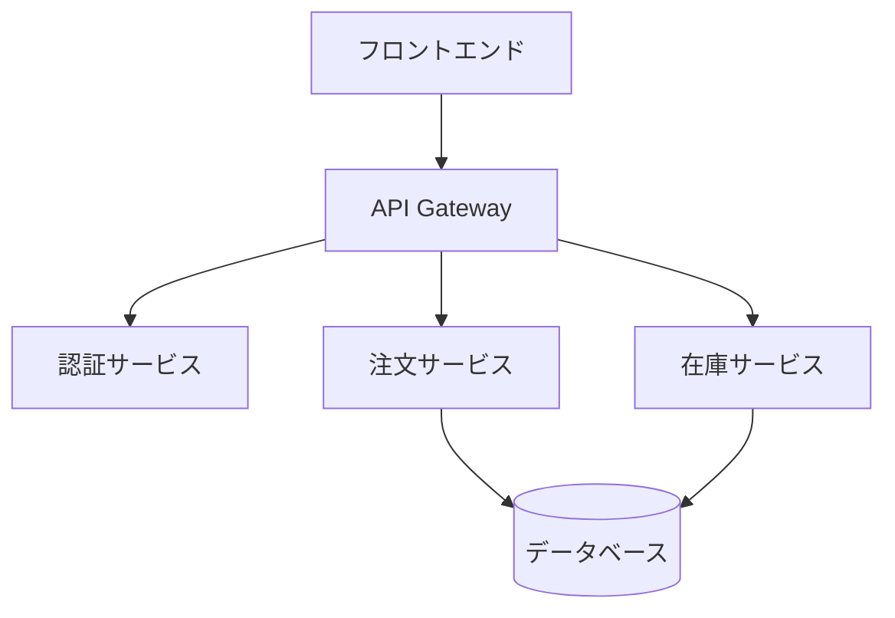

# 実践ツールとチェックリスト

## シニア振る舞いチェックリスト（週1自己点検）

### 🧠 思考編

- [ ] 不確実な点（UNKNOWN）を明示している
- [ ] 正解よりトレードオフを話している
- [ ] 「今回は決めない」を選んだことがある

### 🧩 設計編

- [ ] トランザクション境界を説明できる
- [ ] 冪等性・再実行を設計に含めている
- [ ] 将来の変更点を先に列挙している

### 👥 チーム編

- [ ] 自分が抜けても判断が再現できる
- [ ] レビューで人ではなく構造を見ている
- [ ] 属人化を意図的に壊している

### 判定基準

- **7個以上 YES** → 完全にシニア挙動
- **4–6個 YES** → 伸び代ゾーン（最重要）
- **0–3個 YES** → 技術より思考を強化すべき

## 前提整理テンプレート

レビュー前に、自分の頭の中でこれを作ります。

### 1. 業務目的：何を守りたい？

**例:**
- ユーザーの注文情報の整合性を守りたい
- 在庫の正確性を守りたい
- 支払い情報のセキュリティを守りたい

### 2. 失敗パターン：何が壊れると一番痛い？

**例:**
- 在庫が負の値になる（データ整合性の破綻）
- 注文が重複して作成される（冪等性の欠如）
- 支払い処理が失敗したのに在庫が減る（トランザクション境界の不備）

### 3. 変更可能性：どこが将来変わりそう？

**例:**
- 支払い方法が増える（クレジットカード以外にも追加）
- 配送方法が変わる（宅配便以外にも追加）
- 在庫管理のルールが変わる（予約在庫の導入など）

## 炎上PJ用：シニア初動テンプレ

### Step1：図を書く（30分）

システム構成図、データフロー、業務フローを図にする



### Step2：UNKNOWNを貼り出す

**決まっていない仕様、想定負荷、障害時挙動を貼り出す**

1. **決まっていない仕様**
   - 注文キャンセルの期限は？（24時間？48時間？）
   - 在庫が0になった時の挙動は？（待ち？エラー？）

2. **想定負荷**
   - 同時アクセス数は？（100？1000？）
   - ピーク時のリクエスト数は？（1000/秒？10000/秒？）

3. **障害時挙動**
   - データベース障害時の挙動は？（エラー？リトライ？）
   - 外部API障害時の挙動は？（タイムアウト？フォールバック？）

### Step3：判断ログを残す

**なぜ今決めないか、何が分かれば決めるか、決めなかったリスクを記録**

```markdown
#### 判断1: キャッシュ戦略

**なぜ今決めないか:**
- アクセスパターンのデータが不足している
- データ更新頻度が不明確

**何が分かれば決めるか:**
- 1ヶ月間のアクセスログが集まったら判断
- 負荷テストの結果が出たら判断

**決めなかったリスク:**
- パフォーマンスが低下する可能性
- 運用コストが増加する可能性

**暫定対応:**
- メモリキャッシュを採用（簡単に変更可能）
- 監視を実装してデータを収集

**判断日:** 2024-01-15
**決定期限:** 2024-02-15
```

## 面接・評価で使える「シニアらしい説明文」

### Q. あなたの強みは？

```markdown
私は実装力よりも、
「設計の前提条件と不確実性を整理し、
チームが安全に判断できる状態を作ること」に価値を置いています。
正解を即断するより、
トレードオフを明示し、将来の変更に耐える設計を重視しています。
```

### Q. 設計で意識していることは？

```markdown
常に「失敗した時にどこまで戻せるか」と
「変更が入った時にどこを触るか」を先に考えます。
UNKNOWN を無理に潰さず、
状態として管理することを意識しています。
```

### Q. シニアとしてどうチームに貢献しますか？

```markdown
自分が多く書くより、
判断基準や設計意図を共有し、
チーム全体のアウトプットが安定することを重視します。
私がいなくても回る状態を作ることが、
シニアの役割だと考えています。
```

## 名ばかりシニア回避チェック

定期的に自分に問う質問です。

### チェック項目

1. **自分が休んだら止まる？**
   - [ ] 自分がいないとプロジェクトが止まる
   - [ ] 自分しか知らない情報がある

2. **自分しか知らない判断はある？**
   - [ ] 設計判断の理由が自分しか知らない
   - [ ] 技術選定の理由が文書化されていない

3. **設計理由は残っている？**
   - [ ] 設計ドキュメントが存在する
   - [ ] 決定ログが残っている

**YESが多いほど危険**

### 改善アクション

**YESが多い場合の対応:**

1. **知識の共有**
   - 設計ドキュメントを作成
   - 決定ログを残す
   - 判断基準を文書化

2. **標準化の推進**
   - コーディング規約の整備
   - 設計パターンの標準化
   - ベストプラクティスの共有

3. **メンタリングの実践**
   - チームメンバーに知識を伝える
   - 判断力を高める
   - 自律的な行動を促す

## シニアの"見えない仕事"

評価されにくいが、本質的な価値があります。

### 1. 会議で論点を整理する

**具体例:**
- 議論が散漫になった時、論点を整理する
- 複数の意見を統合して、次のアクションを明確にする
- 不確実な点を明示して、判断を促す

### 2. 技術と事業の翻訳

**具体例:**
- ビジネス要件を技術的な実装に翻訳
- 技術的な判断をビジネス価値に翻訳
- 非エンジニアに技術的な内容を説明

### 3. 空気が悪くなる前に手を打つ

**具体例:**
- チームの雰囲気が悪くなる前に介入
- 技術的負債が蓄積する前に警告
- プロジェクトが炎上する前に対策を提案

### 4. 無理なものを静かに止める

**具体例:**
- 無理な要求をデータに基づいて説明
- 優先順位を明確にして、選択を促す
- リスクを明確にして、判断を支援

これらができる人は替えが効かない存在になります。