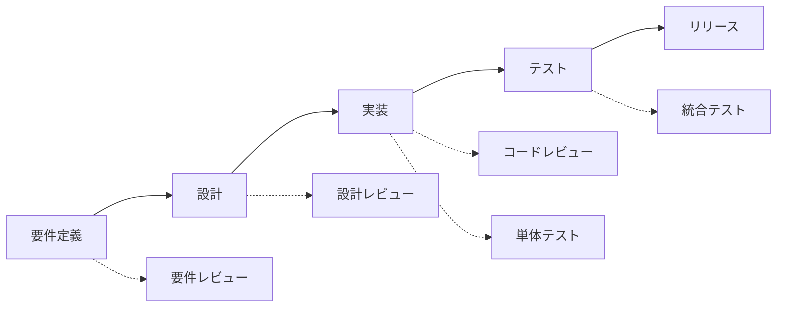

# バグ管理の実践ガイド

効果的なバグ管理は、プロジェクトの品質を維持し、開発チームの生産性を向上させる重要な要素です。現代的な開発手法に対応したバグ管理の実践方法を解説します。

## バグ管理の現代的アプローチ

### なぜ効果的なバグ管理が重要なのか

**従来の問題:**
```
開発者A: 「あのバグ、直した？」
開発者B: 「どのバグ？」
開発者A: 「ログインできないやつ」
開発者B: 「ああ、それはまだ直してない。でも、どこで発生してるか忘れた」
```

**現代的な解決:**
- **可視化**: バグの状況が一目でわかる
- **自動化**: CI/CDパイプラインとの連携
- **予防**: 品質ゲートとテスト自動化
- **分析**: データドリブンな改善

### バグ管理の基本原則

#### 1. Shift-Left（早期発見）


#### 2. 品質ゲート
```typescript
// 品質ゲートの例
interface QualityGate {
  testCoverage: number; // 80%以上
  criticalBugs: number; // 0個
  highBugs: number; // 5個以下
  codeReviewApproval: boolean; // 必須
  securityScan: boolean; // パス必須
}

const canDeploy = (metrics: QualityGate): boolean => {
  return metrics.testCoverage >= 80 &&
         metrics.criticalBugs === 0 &&
         metrics.highBugs <= 5 &&
         metrics.codeReviewApproval &&
         metrics.securityScan;
};
```

#### 3. 継続的改善
- **メトリクス収集**: バグ発生率、修正時間、再発率
- **根本原因分析**: なぜそのバグが発生したか
- **プロセス改善**: 再発防止策の実装

## バグ管理システムの設計

### 必須項目とデータ構造

```typescript
interface Bug {
  // 基本情報
  id: string; // BUG-2024-001
  title: string;
  description: string;
  
  // 分類
  severity: 'critical' | 'high' | 'medium' | 'low';
  priority: 'urgent' | 'high' | 'medium' | 'low';
  category: 'functional' | 'performance' | 'security' | 'ui' | 'data';
  
  // ステータス管理
  status: 'open' | 'in-progress' | 'resolved' | 'verified' | 'closed' | 'rejected';
  resolution?: 'fixed' | 'duplicate' | 'wont-fix' | 'cannot-reproduce';
  
  // 担当者情報
  reporter: User;
  assignee?: User;
  reviewer?: User;
  
  // 日時管理
  createdAt: Date;
  updatedAt: Date;
  dueDate?: Date;
  resolvedAt?: Date;
  
  // 技術情報
  environment: Environment;
  stepsToReproduce: string[];
  expectedBehavior: string;
  actualBehavior: string;
  
  // 関連情報
  relatedIssues: string[];
  attachments: Attachment[];
  tags: string[];
  
  // メトリクス
  timeToResolve?: number; // 分単位
  reopenCount: number;
}

interface Environment {
  os: string;
  browser?: string;
  version: string;
  device?: string;
  network?: string;
}
```

### 優先度マトリクス

```typescript
// ビジネスインパクト × 技術的複雑度
const getPriority = (
  businessImpact: 'high' | 'medium' | 'low',
  technicalComplexity: 'high' | 'medium' | 'low'
): 'urgent' | 'high' | 'medium' | 'low' => {
  const matrix = {
    high: {
      high: 'high',
      medium: 'high', 
      low: 'urgent'
    },
    medium: {
      high: 'medium',
      medium: 'medium',
      low: 'high'
    },
    low: {
      high: 'low',
      medium: 'low',
      low: 'medium'
    }
  };
  
  return matrix[businessImpact][technicalComplexity];
};
```

### SLA（Service Level Agreement）

| 優先度 | 初回応答 | 解決目標 | エスカレーション |
|--------|----------|----------|------------------|
| **Urgent** | 1時間以内 | 4時間以内 | 2時間後 |
| **High** | 4時間以内 | 1営業日以内 | 8時間後 |
| **Medium** | 1営業日以内 | 3営業日以内 | 2営業日後 |
| **Low** | 3営業日以内 | 1週間以内 | 1週間後 |

## 現代的なバグ管理ツールと実装

### 1. GitHub Issues + Actions

```yaml
# .github/workflows/bug-triage.yml
name: Bug Triage
on:
  issues:
    types: [opened, labeled]

jobs:
  auto-triage:
    runs-on: ubuntu-latest
    steps:
      - name: Auto-assign critical bugs
        if: contains(github.event.issue.labels.*.name, 'critical')
        uses: actions/github-script@v6
        with:
          script: |
            github.rest.issues.addAssignees({
              owner: context.repo.owner,
              repo: context.repo.repo,
              issue_number: context.issue.number,
              assignees: ['tech-lead']
            });
            
      - name: Set SLA due date
        uses: actions/github-script@v6
        with:
          script: |
            const priority = github.event.issue.labels.find(l => 
              ['urgent', 'high', 'medium', 'low'].includes(l.name)
            )?.name || 'medium';
            
            const sla = {
              urgent: 4, // 4時間
              high: 24, // 1日
              medium: 72, // 3日
              low: 168 // 1週間
            };
            
            const dueDate = new Date();
            dueDate.setHours(dueDate.getHours() + sla[priority]);
            
            github.rest.issues.update({
              owner: context.repo.owner,
              repo: context.repo.repo,
              issue_number: context.issue.number,
              milestone: dueDate.toISOString()
            });
```

### 2. Jira + Automation

```javascript
// Jira Automation Rule
// トリガー: Issue created
// 条件: Issue Type = Bug AND Priority = Highest
// アクション: 
{
  "trigger": "issue_created",
  "conditions": [
    {
      "field": "issuetype",
      "value": "Bug"
    },
    {
      "field": "priority", 
      "value": "Highest"
    }
  ],
  "actions": [
    {
      "type": "assign_issue",
      "assignee": "tech-lead"
    },
    {
      "type": "send_notification",
      "recipients": ["dev-team-slack"],
      "message": "🚨 Critical bug reported: {{issue.summary}}"
    },
    {
      "type": "set_field",
      "field": "duedate",
      "value": "{{now.plusHours(4)}}"
    }
  ]
}
```

### 3. Linear + API Integration

```typescript
// Linear API integration
import { LinearClient } from '@linear/sdk';

class BugManager {
  private linear: LinearClient;
  
  constructor(apiKey: string) {
    this.linear = new LinearClient({ apiKey });
  }
  
  async createBug(bugData: BugReport): Promise<string> {
    const team = await this.linear.teams({ first: 1 });
    const teamId = team.nodes[0].id;
    
    const issue = await this.linear.issueCreate({
      teamId,
      title: bugData.title,
      description: this.formatDescription(bugData),
      priority: this.mapPriority(bugData.severity),
      labelIds: await this.getLabels(['bug', bugData.category])
    });
    
    return issue.issue?.id || '';
  }
  
  private formatDescription(bug: BugReport): string {
    return `
## 概要
${bug.description}

## 再現手順
${bug.stepsToReproduce.map((step, i) => `${i + 1}. ${step}`).join('\n')}

## 期待される動作
${bug.expectedBehavior}

## 実際の動作  
${bug.actualBehavior}

## 環境
- OS: ${bug.environment.os}
- Browser: ${bug.environment.browser}
- Version: ${bug.environment.version}
    `;
  }
}
```

### 4. Notion Database

```typescript
// Notion API integration
import { Client } from '@notionhq/client';

class NotionBugTracker {
  private notion: Client;
  private databaseId: string;
  
  constructor(token: string, databaseId: string) {
    this.notion = new Client({ auth: token });
    this.databaseId = databaseId;
  }
  
  async createBug(bug: BugReport) {
    return await this.notion.pages.create({
      parent: { database_id: this.databaseId },
      properties: {
        'Title': {
          title: [{ text: { content: bug.title } }]
        },
        'Status': {
          select: { name: 'Open' }
        },
        'Priority': {
          select: { name: bug.priority }
        },
        'Severity': {
          select: { name: bug.severity }
        },
        'Reporter': {
          people: [{ id: bug.reporter.notionId }]
        },
        'Created': {
          date: { start: new Date().toISOString() }
        },
        'Environment': {
          rich_text: [{
            text: { content: JSON.stringify(bug.environment, null, 2) }
          }]
        }
      },
      children: [
        {
          object: 'block',
          type: 'heading_2',
          heading_2: {
            rich_text: [{ text: { content: '再現手順' } }]
          }
        },
        {
          object: 'block',
          type: 'numbered_list_item',
          numbered_list_item: {
            rich_text: bug.stepsToReproduce.map(step => ({
              text: { content: step }
            }))
          }
        }
      ]
    });
  }
}

## バグ管理ワークフローの自動化

### 1. CI/CDパイプラインとの連携

```yaml
# .github/workflows/quality-gate.yml
name: Quality Gate
on:
  pull_request:
    branches: [main]

jobs:
  quality-check:
    runs-on: ubuntu-latest
    steps:
      - uses: actions/checkout@v3
      
      - name: Run tests
        run: npm test -- --coverage
        
      - name: Check quality gate
        run: |
          COVERAGE=$(cat coverage/coverage-summary.json | jq '.total.lines.pct')
          if (( $(echo "$COVERAGE < 80" | bc -l) )); then
            echo "❌ Coverage below 80%: $COVERAGE%"
            exit 1
          fi
          
      - name: Security scan
        uses: securecodewarrior/github-action-add-sarif@v1
        with:
          sarif-file: security-scan.sarif
          
      - name: Create bug if quality gate fails
        if: failure()
        uses: actions/github-script@v6
        with:
          script: |
            const { data: issue } = await github.rest.issues.create({
              owner: context.repo.owner,
              repo: context.repo.repo,
              title: `Quality Gate Failed - PR #${context.payload.pull_request.number}`,
              body: `
                ## Quality Gate Failure
                
                **PR**: #${context.payload.pull_request.number}
                **Branch**: ${context.payload.pull_request.head.ref}
                **Commit**: ${context.sha}
                
                ### Failed Checks
                - [ ] Test Coverage < 80%
                - [ ] Security vulnerabilities found
                
                ### Action Required
                Please fix the quality issues before merging.
              `,
              labels: ['bug', 'quality-gate', 'urgent']
            });
```

### 2. 自動バグ検出

```typescript
// 自動バグ検出システム
class AutoBugDetection {
  private errorThreshold = {
    errorRate: 0.05, // 5%以上のエラー率
    responseTime: 5000, // 5秒以上のレスポンス時間
    memoryUsage: 0.9 // 90%以上のメモリ使用率
  };
  
  async monitorApplication() {
    const metrics = await this.collectMetrics();
    
    if (metrics.errorRate > this.errorThreshold.errorRate) {
      await this.createAutoBug({
        title: `High Error Rate Detected: ${(metrics.errorRate * 100).toFixed(2)}%`,
        severity: 'high',
        category: 'performance',
        description: `Error rate exceeded threshold of ${this.errorThreshold.errorRate * 100}%`,
        environment: await this.getCurrentEnvironment(),
        autoDetected: true
      });
    }
    
    if (metrics.avgResponseTime > this.errorThreshold.responseTime) {
      await this.createAutoBug({
        title: `Slow Response Time: ${metrics.avgResponseTime}ms`,
        severity: 'medium',
        category: 'performance',
        description: `Average response time exceeded ${this.errorThreshold.responseTime}ms`,
        environment: await this.getCurrentEnvironment(),
        autoDetected: true
      });
    }
  }
  
  private async createAutoBug(bugData: Partial<Bug>) {
    // 重複チェック
    const existingBugs = await this.findSimilarBugs(bugData.title!);
    if (existingBugs.length > 0) {
      return; // 重複バグは作成しない
    }
    
    // バグ作成
    const bug = await this.bugManager.create({
      ...bugData,
      reporter: { id: 'system', name: 'Auto Detection System' },
      status: 'open',
      createdAt: new Date()
    });
    
    // 通知送信
    await this.notificationService.send({
      channel: '#dev-alerts',
      message: `🤖 Auto-detected bug: ${bug.title}`,
      bug: bug
    });
  }
}
```

### 3. バグトリアージの自動化

```typescript
// AI支援バグトリアージ
class AIBugTriage {
  async triageBug(bug: Bug): Promise<TriageResult> {
    // 類似バグの検索
    const similarBugs = await this.findSimilarBugs(bug);
    
    // 優先度の自動判定
    const priority = await this.calculatePriority(bug);
    
    // 担当者の自動割り当て
    const assignee = await this.suggestAssignee(bug);
    
    // 解決時間の予測
    const estimatedTime = await this.estimateResolutionTime(bug);
    
    return {
      suggestedPriority: priority,
      suggestedAssignee: assignee,
      estimatedResolutionTime: estimatedTime,
      similarBugs: similarBugs,
      confidence: this.calculateConfidence(bug)
    };
  }
  
  private async calculatePriority(bug: Bug): Promise<Priority> {
    const factors = {
      userImpact: this.assessUserImpact(bug),
      businessCriticality: this.assessBusinessCriticality(bug),
      technicalComplexity: this.assessTechnicalComplexity(bug),
      securityRisk: this.assessSecurityRisk(bug)
    };
    
    // 重み付きスコア計算
    const score = 
      factors.userImpact * 0.3 +
      factors.businessCriticality * 0.3 +
      factors.technicalComplexity * 0.2 +
      factors.securityRisk * 0.2;
    
    if (score >= 0.8) return 'urgent';
    if (score >= 0.6) return 'high';
    if (score >= 0.4) return 'medium';
    return 'low';
  }
}
```

## バグ分析とメトリクス

### 1. 重要なKPI

```typescript
interface BugMetrics {
  // 発見・解決メトリクス
  bugsFound: number;
  bugsResolved: number;
  bugBacklog: number;
  
  // 時間メトリクス
  averageTimeToResolve: number; // 時間
  averageTimeToFirstResponse: number; // 時間
  
  // 品質メトリクス
  bugReopenRate: number; // %
  bugEscapeRate: number; // %
  defectDensity: number; // バグ数/KLOC
  
  // 分類別メトリクス
  bugsByCategory: Record<string, number>;
  bugsBySeverity: Record<string, number>;
  bugsByComponent: Record<string, number>;
}

class BugAnalytics {
  async generateReport(period: DateRange): Promise<BugMetrics> {
    const bugs = await this.getBugsInPeriod(period);
    
    return {
      bugsFound: bugs.filter(b => this.isInPeriod(b.createdAt, period)).length,
      bugsResolved: bugs.filter(b => b.status === 'resolved' && this.isInPeriod(b.resolvedAt!, period)).length,
      bugBacklog: bugs.filter(b => ['open', 'in-progress'].includes(b.status)).length,
      
      averageTimeToResolve: this.calculateAverageResolutionTime(bugs),
      averageTimeToFirstResponse: this.calculateAverageResponseTime(bugs),
      
      bugReopenRate: this.calculateReopenRate(bugs),
      bugEscapeRate: this.calculateEscapeRate(bugs),
      defectDensity: await this.calculateDefectDensity(bugs, period),
      
      bugsByCategory: this.groupBy(bugs, 'category'),
      bugsBySeverity: this.groupBy(bugs, 'severity'),
      bugsByComponent: this.groupBy(bugs, 'component')
    };
  }
}
```

### 2. ダッシュボード実装

```typescript
// React Dashboard Component
const BugDashboard: React.FC = () => {
  const [metrics, setMetrics] = useState<BugMetrics>();
  const [period, setPeriod] = useState<DateRange>({
    start: subDays(new Date(), 30),
    end: new Date()
  });
  
  useEffect(() => {
    const fetchMetrics = async () => {
      const data = await bugAnalytics.generateReport(period);
      setMetrics(data);
    };
    
    fetchMetrics();
  }, [period]);
  
  if (!metrics) return <Loading />;
  
  return (
    <div className="grid grid-cols-4 gap-4">
      <MetricCard
        title="Open Bugs"
        value={metrics.bugBacklog}
        trend={calculateTrend(metrics.bugBacklog)}
        color="red"
      />
      
      <MetricCard
        title="Avg Resolution Time"
        value={`${Math.round(metrics.averageTimeToResolve / 24)}d`}
        trend={calculateTrend(metrics.averageTimeToResolve)}
        color="blue"
      />
      
      <MetricCard
        title="Reopen Rate"
        value={`${(metrics.bugReopenRate * 100).toFixed(1)}%`}
        trend={calculateTrend(metrics.bugReopenRate)}
        color="yellow"
      />
      
      <MetricCard
        title="Bugs Resolved"
        value={metrics.bugsResolved}
        trend={calculateTrend(metrics.bugsResolved)}
        color="green"
      />
      
      <div className="col-span-2">
        <BugTrendChart data={metrics} />
      </div>
      
      <div className="col-span-2">
        <BugCategoryChart data={metrics.bugsByCategory} />
      </div>
    </div>
  );
};
```

## バグ予防とプロセス改善

### 1. 根本原因分析（RCA）

```typescript
interface RootCauseAnalysis {
  bugId: string;
  category: 'human-error' | 'process-gap' | 'tool-limitation' | 'knowledge-gap';
  rootCause: string;
  contributingFactors: string[];
  preventionMeasures: PreventionMeasure[];
  processImprovements: ProcessImprovement[];
}

class RCAProcess {
  async conductRCA(bug: Bug): Promise<RootCauseAnalysis> {
    // 5 Whys分析
    const whyAnalysis = await this.fiveWhysAnalysis(bug);
    
    // フィッシュボーン分析
    const fishboneAnalysis = await this.fishboneAnalysis(bug);
    
    // 予防策の提案
    const preventionMeasures = await this.suggestPreventionMeasures(bug);
    
    return {
      bugId: bug.id,
      category: this.categorizeRootCause(whyAnalysis),
      rootCause: whyAnalysis.finalWhy,
      contributingFactors: fishboneAnalysis.factors,
      preventionMeasures: preventionMeasures,
      processImprovements: await this.suggestProcessImprovements(bug)
    };
  }
  
  private async fiveWhysAnalysis(bug: Bug): Promise<WhyAnalysis> {
    const whys = [];
    let currentWhy = `Why did ${bug.title} occur?`;
    
    for (let i = 0; i < 5; i++) {
      const answer = await this.analyzeWhy(currentWhy, bug);
      whys.push({ question: currentWhy, answer });
      currentWhy = `Why ${answer}?`;
    }
    
    return {
      whys: whys,
      finalWhy: whys[whys.length - 1].answer
    };
  }
}
```

### 2. 品質ゲートの実装

```typescript
// 品質ゲート設定
const qualityGates = {
  development: {
    unitTestCoverage: 80, // %
    lintErrors: 0,
    typeErrors: 0,
    securityVulnerabilities: 0
  },
  
  staging: {
    integrationTestPass: 100, // %
    performanceThreshold: 2000, // ms
    accessibilityScore: 90, // %
    criticalBugs: 0
  },
  
  production: {
    smokeTestPass: 100, // %
    rollbackPlan: true,
    monitoringSetup: true,
    documentationComplete: true
  }
};

class QualityGateValidator {
  async validateGate(
    stage: keyof typeof qualityGates,
    metrics: QualityMetrics
  ): Promise<ValidationResult> {
    const requirements = qualityGates[stage];
    const violations = [];
    
    for (const [key, threshold] of Object.entries(requirements)) {
      if (!this.meetsRequirement(metrics[key], threshold)) {
        violations.push({
          requirement: key,
          expected: threshold,
          actual: metrics[key],
          severity: this.getSeverity(key)
        });
      }
    }
    
    return {
      passed: violations.length === 0,
      violations: violations,
      canProceed: violations.filter(v => v.severity === 'critical').length === 0
    };
  }
}
```

### 3. 継続的改善プロセス

```typescript
// 改善提案システム
class ContinuousImprovement {
  async analyzePatterns(period: DateRange): Promise<ImprovementSuggestions> {
    const bugs = await this.getBugsInPeriod(period);
    
    // パターン分析
    const patterns = {
      frequentComponents: this.findFrequentlyBuggyComponents(bugs),
      commonRootCauses: this.findCommonRootCauses(bugs),
      timePatterns: this.findTimePatterns(bugs),
      teamPatterns: this.findTeamPatterns(bugs)
    };
    
    // 改善提案生成
    const suggestions = [];
    
    // 頻繁にバグが発生するコンポーネント
    for (const component of patterns.frequentComponents) {
      suggestions.push({
        type: 'refactoring',
        priority: 'high',
        description: `Consider refactoring ${component.name} - ${component.bugCount} bugs in ${period.days} days`,
        estimatedEffort: this.estimateRefactoringEffort(component),
        expectedImpact: 'Reduce bug count by 60-80%'
      });
    }
    
    // 共通の根本原因
    for (const rootCause of patterns.commonRootCauses) {
      suggestions.push({
        type: 'process-improvement',
        priority: 'medium',
        description: `Address root cause: ${rootCause.cause}`,
        proposedSolution: rootCause.suggestedSolution,
        estimatedEffort: rootCause.effort
      });
    }
    
    return {
      patterns: patterns,
      suggestions: suggestions,
      roi: this.calculateROI(suggestions)
    };
  }
}
```

## チーム運用のベストプラクティス

### 1. バグトリアージ会議

```typescript
// 週次トリアージ会議の構造
interface TriageMeeting {
  date: Date;
  attendees: TeamMember[];
  agenda: TriageAgenda;
  decisions: TriageDecision[];
  actionItems: ActionItem[];
}

class TriageManager {
  async prepareWeeklyTriage(): Promise<TriageAgenda> {
    const newBugs = await this.getNewBugs();
    const escalatedBugs = await this.getEscalatedBugs();
    const stalebugs = await this.getStaleBugs();
    
    return {
      newBugs: newBugs.map(bug => ({
        bug: bug,
        suggestedPriority: await this.aiTriage.suggestPriority(bug),
        suggestedAssignee: await this.aiTriage.suggestAssignee(bug)
      })),
      
      escalatedBugs: escalatedBugs.map(bug => ({
        bug: bug,
        escalationReason: this.getEscalationReason(bug),
        suggestedAction: this.getSuggestedAction(bug)
      })),
      
      staleBugs: stalebugs.map(bug => ({
        bug: bug,
        staleDuration: this.calculateStaleDuration(bug),
        suggestedAction: 'close-or-prioritize'
      })),
      
      metrics: await this.generateWeeklyMetrics()
    };
  }
}
```

### 2. バグレポートテンプレート

```markdown
<!-- .github/ISSUE_TEMPLATE/bug_report.md -->
---
name: Bug Report
about: Create a report to help us improve
title: '[BUG] '
labels: 'bug, needs-triage'
assignees: ''
---

## 🐛 Bug Description
A clear and concise description of what the bug is.

## 🔄 Steps to Reproduce
1. Go to '...'
2. Click on '....'
3. Scroll down to '....'
4. See error

## ✅ Expected Behavior
A clear and concise description of what you expected to happen.

## ❌ Actual Behavior
A clear and concise description of what actually happened.

## 📱 Environment
- OS: [e.g. iOS, Windows, macOS]
- Browser: [e.g. chrome, safari]
- Version: [e.g. 22]
- Device: [e.g. iPhone6, Desktop]

## 📸 Screenshots
If applicable, add screenshots to help explain your problem.

## 🔗 Additional Context
Add any other context about the problem here.

## 🏷️ Labels
Please add appropriate labels:
- Priority: `urgent` | `high` | `medium` | `low`
- Severity: `critical` | `high` | `medium` | `low`  
- Category: `functional` | `performance` | `security` | `ui` | `data`
```

### 3. SLA監視とアラート

```typescript
// SLA監視システム
class SLAMonitor {
  private slaThresholds = {
    urgent: { response: 1, resolution: 4 }, // hours
    high: { response: 4, resolution: 24 },
    medium: { response: 24, resolution: 72 },
    low: { response: 72, resolution: 168 }
  };
  
  async checkSLAViolations(): Promise<SLAViolation[]> {
    const openBugs = await this.getOpenBugs();
    const violations = [];
    
    for (const bug of openBugs) {
      const sla = this.slaThresholds[bug.priority];
      const hoursOpen = this.getHoursOpen(bug);
      
      // 初回応答SLA違反
      if (!bug.firstResponseAt && hoursOpen > sla.response) {
        violations.push({
          bugId: bug.id,
          type: 'response',
          slaHours: sla.response,
          actualHours: hoursOpen,
          severity: 'high'
        });
      }
      
      // 解決SLA違反
      if (bug.status !== 'resolved' && hoursOpen > sla.resolution) {
        violations.push({
          bugId: bug.id,
          type: 'resolution',
          slaHours: sla.resolution,
          actualHours: hoursOpen,
          severity: bug.priority === 'urgent' ? 'critical' : 'high'
        });
      }
    }
    
    // アラート送信
    if (violations.length > 0) {
      await this.sendSLAAlert(violations);
    }
    
    return violations;
  }
}
```

## まとめ

現代的なバグ管理では以下が重要です：

### 技術的要素
- **自動化**: CI/CD連携、自動検出、トリアージ支援
- **可視化**: リアルタイムダッシュボード、メトリクス分析
- **統合**: 開発ツールとの連携、API活用

### プロセス要素  
- **予防**: 品質ゲート、根本原因分析、継続的改善
- **効率化**: SLA管理、自動割り当て、テンプレート化
- **コミュニケーション**: 明確な報告、定期的なレビュー

### 組織的要素
- **文化**: 品質重視、学習志向、透明性
- **スキル**: 分析能力、問題解決、チームワーク
- **改善**: データドリブン、継続的学習、フィードバックループ

効果的なバグ管理により、製品品質の向上と開発効率の最適化を実現できます。

