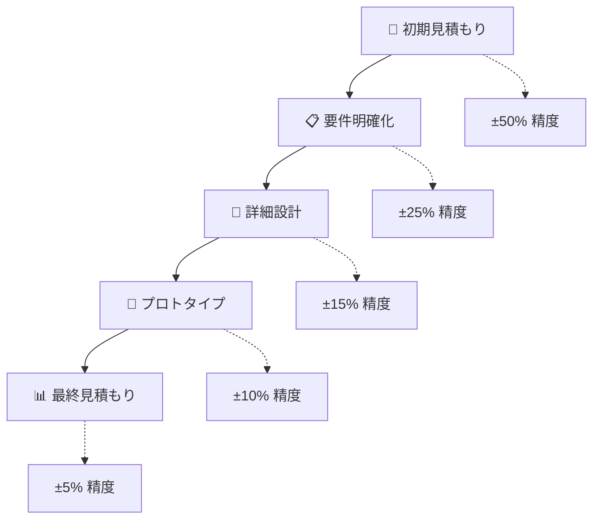

# 📊 工数試算の実践ガイド

工数試算は、プロジェクトの成功を左右する重要な経営スキルです。適切な工数試算により、現実的なスケジュールと予算を設定し、ステークホルダーの信頼を獲得できます。

## 🎯 なぜ工数試算が重要なのか

### ❌ 工数試算なしの問題

**問題のある状況:**
```
PM: 「この機能、いつまでにできますか？」
開発者: 「うーん、3日くらいかな...」
（実際には1週間かかった）
```

| 問題点 | 影響 | コスト |
|--------|------|--------|
| 🎯 見積もりが不正確 | スケジュール遅延 | 💰 予算超過 |
| ⏰ 計画性の欠如 | チーム負荷増加 | 😰 ストレス増大 |
| 🤝 信頼関係の悪化 | ステークホルダー離れ | 📉 プロジェクト失敗 |

### ✅ 工数試算による解決

**改善された状況:**
```
適切な工数試算により:
✨ 見積もりが正確
📅 スケジュールが守られる
💰 予算が管理できる
🤝 ステークホルダーの信頼向上
```

| メリット | 効果 | 価値 |
|----------|------|------|
| 🎯 現実的なスケジュール | 計画通りの進行 | 📈 成功確率向上 |
| 💰 適切な予算管理 | コスト最適化 | 💎 ROI向上 |
| 👥 リソース最適配置 | 効率的な作業 | ⚡ 生産性向上 |

## 📚 工数試算の基本概念

### 🔢 工数の定義と単位

| 単位 | 定義 | 計算式 | 用途 |
|------|------|--------|------|
| 👤 **人時** | 1人が1時間で完了する作業量 | 基本単位 | 細かいタスク |
| 📅 **人日** | 1人が1日で完了する作業量 | 8時間 | 一般的な見積もり |
| 📆 **人月** | 1人が1ヶ月で完了する作業量 | 20人日 = 160時間 | プロジェクト全体 |

**💡 実働時間の考慮:**
```typescript
const workingHours = {
  perDay: 8,        // 1日8時間
  perMonth: 20,     // 月20営業日
  efficiency: 0.8   // 実効率80%（会議・休憩等を考慮）
};

// 実際の作業時間
const actualWorkingHours = {
  perDay: workingHours.perDay * workingHours.efficiency,     // 6.4時間
  perMonth: workingHours.perMonth * workingHours.perDay * workingHours.efficiency // 128時間
};
```

### 🏗️ 工数の分類

#### 🔧 開発工数
| フェーズ | 内容 | 割合目安 | 特徴 |
|----------|------|----------|------|
| 📋 **設計** | 要件定義、詳細設計 | 20-25% | 🧠 思考集約的 |
| 💻 **実装** | コーディング、単体テスト | 40-50% | ⚡ 作業集約的 |
| 🧪 **テスト** | 結合・システムテスト | 15-20% | 🔍 品質保証 |
| 🐛 **デバッグ** | バグ修正、リファクタリング | 10-15% | 🔧 問題解決 |
| 📖 **ドキュメント** | 設計書、マニュアル | 5-10% | 📝 知識共有 |

#### 🤝 非開発工数
| 項目 | 内容 | 時間割合 | 対策 |
|------|------|----------|------|
| 🗣️ **会議** | 定例会議、レビュー | 10-15% | 📊 効率化必須 |
| 💬 **コミュニケーション** | メール、チャット | 5-10% | 🚀 ツール活用 |
| 📚 **学習** | 技術調査、勉強会 | 5-10% | 🎯 計画的実施 |
| 🏖️ **その他** | 休暇、病欠 | 5-10% | 📅 事前計画 |

## 🛠️ 工数試算の4つの手法

### 1. 🔍 ボトムアップ見積もり

**📝 定義:** タスクを細かく分解し、各タスクの工数を見積もって合計する方法

| 👍 メリット | 👎 デメリット |
|-------------|---------------|
| ✅ 詳細な見積もりが可能 | ⏰ 時間がかかる |
| 📊 各タスクの工数が明確 | 🔍 細かすぎると複雑 |
| 📈 進捗管理が容易 | 🌳 木を見て森を見ず |

**💻 実践例:**
```typescript
interface Task {
  id: string;
  name: string;
  subtasks: Subtask[];
  estimatedHours: number;
  confidence: 'high' | 'medium' | 'low';
}

// 🔐 ユーザー認証機能の開発例
const userAuthTask: Task = {
  id: 'TASK-001',
  name: '🔐 ユーザー認証機能の開発',
  subtasks: [
    { id: 'ST-001', name: '🖥️ ログイン画面の実装', estimatedHours: 8, confidence: 'high' },
    { id: 'ST-002', name: '🔌 認証APIの実装', estimatedHours: 16, confidence: 'medium' },
    { id: 'ST-003', name: '🍪 セッション管理の実装', estimatedHours: 8, confidence: 'high' },
    { id: 'ST-004', name: '🧪 単体テストの作成', estimatedHours: 8, confidence: 'high' },
    { id: 'ST-005', name: '🔗 結合テストの実施', estimatedHours: 4, confidence: 'medium' },
    { id: 'ST-006', name: '🐛 バグ修正バッファ', estimatedHours: 8, confidence: 'low' },
  ],
  estimatedHours: 52, // 📊 合計: 6.5人日
  confidence: 'medium'
};
```

### 2. 🏔️ トップダウン見積もり

**📝 定義:** プロジェクト全体の工数を見積もり、それを各タスクに配分する方法

| 👍 メリット | 👎 デメリット |
|-------------|---------------|
| ⚡ 迅速に見積もりが可能 | 🔍 詳細な見積もりが困難 |
| 🌍 プロジェクト全体の把握が容易 | ❓ 各タスクの工数が不明確 |
| 📊 予算計画に適している | 🎯 精度が低い場合がある |

**📊 実践例:**
```typescript
// 🏗️ プロジェクト全体の工数配分
const projectEstimate = {
  totalDays: 100,
  phases: {
    '📋 要件定義': { days: 10, percentage: 10 },
    '🎨 設計': { days: 20, percentage: 20 },
    '💻 開発': { days: 50, percentage: 50 },
    '🧪 テスト': { days: 15, percentage: 15 },
    '🚀 デプロイ': { days: 5, percentage: 5 }
  }
};

// 🎯 機能別配分
const featureAllocation = {
  '🔐 ユーザー認証': 10,    // 10%
  '📦 商品管理': 25,        // 25%
  '🛒 注文処理': 30,        // 30%
  '💳 決済機能': 20,        // 20%
  '📊 管理画面': 15         // 15%
};
```

### 3. 🔄 類推見積もり（アナロジー法）

**📝 定義:** 過去の類似プロジェクトの実績を基に工数を見積もる方法

| 👍 メリット | 👎 デメリット |
|-------------|---------------|
| 📈 過去の実績を活用 | 📊 実績データが必要 |
| ⚡ 比較的迅速 | 🔍 プロジェクトの違いを考慮必要 |
| 🎯 現実的な見積もり | 📉 新技術には不向き |

**📊 実践例:**
```typescript
interface ProjectHistory {
  name: string;
  features: string[];
  actualDays: number;
  complexity: 'low' | 'medium' | 'high';
  teamSize: number;
}

const pastProjects: ProjectHistory[] = [
  {
    name: '🛒 ECサイト（小規模）',
    features: ['商品一覧', 'カート', '決済'],
    actualDays: 60,
    complexity: 'low',
    teamSize: 3
  },
  {
    name: '🏢 ECサイト（中規模）',
    features: ['商品一覧', 'カート', '決済', '会員管理', '管理画面'],
    actualDays: 120,
    complexity: 'medium',
    teamSize: 5
  }
];

// 🎯 類推による見積もり
function estimateByAnalogy(
  newFeatures: string[],
  pastProjects: ProjectHistory[]
): number {
  const similarProject = findMostSimilar(newFeatures, pastProjects);
  const complexityFactor = calculateComplexityFactor(newFeatures, similarProject);
  return similarProject.actualDays * complexityFactor;
}
```

### 4. 📐 三点見積もり（PERT法）

**📝 定義:** 楽観値、悲観値、最頻値の3つの値から工数を算出する方法

| 👍 メリット | 👎 デメリット |
|-------------|---------------|
| 🎯 不確実性を考慮 | 🔢 3つの値の見積もりが必要 |
| ⚖️ リスクを考慮した見積もり | 🧮 計算が複雑 |
| 📊 統計的に信頼性が高い | 🤔 経験が必要 |

**🧮 PERT計算式:**
```
見積もり工数 = (楽観値 + 4 × 最頻値 + 悲観値) ÷ 6
```

**💻 実践例:**
```typescript
interface ThreePointEstimate {
  optimistic: number;   // 😊 楽観値（最良のケース）
  pessimistic: number;  // 😰 悲観値（最悪のケース）
  mostLikely: number;   // 🎯 最頻値（最も可能性が高い）
}

function calculatePERT(estimate: ThreePointEstimate): {
  expected: number;
  standardDeviation: number;
  confidence90: number;
} {
  const expected = (
    estimate.optimistic + 
    4 * estimate.mostLikely + 
    estimate.pessimistic
  ) / 6;
  
  const standardDeviation = (estimate.pessimistic - estimate.optimistic) / 6;
  const confidence90 = expected + 1.645 * standardDeviation; // 90%信頼区間
  
  return { expected, standardDeviation, confidence90 };
}

// 🔐 ユーザー認証機能の例
const userAuthEstimate: ThreePointEstimate = {
  optimistic: 4,    // 😊 4人日（すべて順調）
  pessimistic: 12,  // 😰 12人日（問題多発）
  mostLikely: 7     // 🎯 7人日（通常ケース）
};

const result = calculatePERT(userAuthEstimate);
// 📊 結果: 期待値 7.3人日、90%信頼区間 9.1人日
```

## 💼 実践的な工数試算例

### 🛒 ECサイト開発プロジェクト

#### 📊 機能別工数見積もり

| 🎯 機能 | 🎨 設計 | 💻 開発 | 🧪 テスト | 📝 ドキュメント | 🔄 合計 | 💰 コスト |
|---------|---------|---------|-----------|----------------|---------|-----------|
| 🔐 ユーザー認証 | 1日 | 4日 | 1日 | 0.5日 | **6.5日** | ¥520,000 |
| 📦 商品管理 | 2日 | 6日 | 2日 | 1日 | **11日** | ¥880,000 |
| 🛒 カート機能 | 2日 | 8日 | 2日 | 1日 | **13日** | ¥1,040,000 |
| 💳 決済処理 | 3日 | 12日 | 3日 | 2日 | **20日** | ¥1,600,000 |
| 📊 管理画面 | 3日 | 10日 | 2日 | 2日 | **17日** | ¥1,360,000 |
| 📱 レスポンシブ対応 | 1日 | 5日 | 2日 | 0.5日 | **8.5日** | ¥680,000 |
| **🎯 合計** | **12日** | **45日** | **12日** | **7日** | **76日** | **¥6,080,000** |

*💡 単価: ¥80,000/人日で計算*

#### 📈 フェーズ別工数配分

```typescript
interface ProjectPhase {
  phase: string;
  days: number;
  percentage: number;
  milestone: string;
  deliverables: string[];
}

const projectPhases: ProjectPhase[] = [
  {
    phase: '📋 要件定義',
    days: 8,
    percentage: 10.5,
    milestone: '要件確定',
    deliverables: ['要件定義書', 'ユーザーストーリー', 'UI/UXデザイン']
  },
  {
    phase: '🎨 基本設計',
    days: 12,
    percentage: 15.8,
    milestone: '設計完了',
    deliverables: ['システム設計書', 'DB設計書', 'API仕様書']
  },
  {
    phase: '💻 開発実装',
    days: 45,
    percentage: 59.2,
    milestone: '機能実装完了',
    deliverables: ['各機能モジュール', '単体テスト', 'コードレビュー']
  },
  {
    phase: '🧪 テスト',
    days: 8,
    percentage: 10.5,
    milestone: 'テスト完了',
    deliverables: ['テスト仕様書', 'テスト結果', 'バグ修正']
  },
  {
    phase: '🚀 リリース',
    days: 3,
    percentage: 4.0,
    milestone: '本番稼働',
    deliverables: ['デプロイ', '運用手順書', '保守マニュアル']
  }
];
```

### 🏢 チーム構成と役割分担

| 👤 役割 | 👥 人数 | 💰 単価/日 | 📊 稼働率 | 🎯 主な担当 |
|---------|---------|------------|-----------|-------------|
| 🎯 **PM** | 1名 | ¥100,000 | 50% | プロジェクト管理、進捗管理 |
| 🏗️ **アーキテクト** | 1名 | ¥120,000 | 30% | システム設計、技術選定 |
| 👨‍💻 **シニア開発者** | 2名 | ¥100,000 | 100% | 核心機能開発、レビュー |
| 👩‍💻 **ジュニア開発者** | 2名 | ¥60,000 | 100% | 一般機能開発、テスト |
| 🎨 **デザイナー** | 1名 | ¥80,000 | 40% | UI/UX設計、フロントエンド |
| 🧪 **QAエンジニア** | 1名 | ¥80,000 | 60% | テスト設計、品質保証 |

**💰 総人件費計算:**
```typescript
const teamCost = {
  pm: 100000 * 0.5 * 76,           // ¥3,800,000
  architect: 120000 * 0.3 * 76,    // ¥2,736,000
  seniorDev: 100000 * 1.0 * 76 * 2, // ¥15,200,000
  juniorDev: 60000 * 1.0 * 76 * 2,  // ¥9,120,000
  designer: 80000 * 0.4 * 76,       // ¥2,432,000
  qa: 80000 * 0.6 * 76              // ¥3,648,000
};

const totalCost = Object.values(teamCost).reduce((sum, cost) => sum + cost, 0);
// 💰 総額: ¥36,936,000
```

## ⚖️ 工数調整とリスク管理

### 🛡️ バッファの戦略的活用

| 📊 プロジェクト複雑度 | 🎯 推奨バッファ | 📈 適用ケース | ⚠️ 注意点 |
|---------------------|----------------|---------------|-----------|
| 🟢 **低複雑度** | 5-10% | 既知技術、経験豊富チーム | 過小見積もりリスク |
| 🟡 **中複雑度** | 15-25% | 新技術混在、標準チーム | バランス重要 |
| 🔴 **高複雑度** | 25-40% | 新技術、新チーム、新領域 | 過大見積もりリスク |

```typescript
interface BufferStrategy {
  baseEstimate: number;
  complexity: 'low' | 'medium' | 'high';
  teamExperience: 'junior' | 'mixed' | 'senior';
  technologyRisk: 'low' | 'medium' | 'high';
  bufferPercentage: number;
  finalEstimate: number;
}

function calculateBuffer(
  baseEstimate: number,
  factors: {
    complexity: 'low' | 'medium' | 'high';
    teamExperience: 'junior' | 'mixed' | 'senior';
    technologyRisk: 'low' | 'medium' | 'high';
  }
): BufferStrategy {
  const bufferMatrix = {
    complexity: { low: 5, medium: 15, high: 25 },
    teamExperience: { senior: 0, mixed: 10, junior: 20 },
    technologyRisk: { low: 0, medium: 10, high: 20 }
  };
  
  const totalBuffer = 
    bufferMatrix.complexity[factors.complexity] +
    bufferMatrix.teamExperience[factors.teamExperience] +
    bufferMatrix.technologyRisk[factors.technologyRisk];
  
  const cappedBuffer = Math.min(totalBuffer, 50); // 最大50%
  const finalEstimate = baseEstimate * (1 + cappedBuffer / 100);
  
  return {
    baseEstimate,
    ...factors,
    bufferPercentage: cappedBuffer,
    finalEstimate
  };
}
```

### ⚠️ リスク要因の定量化

| 🎯 リスク要因 | 📊 影響度 | 🎲 発生確率 | 🔢 リスクスコア | 🛡️ 対策 |
|---------------|-----------|-------------|----------------|----------|
| 🆕 **新技術採用** | 4/5 | 30% | 1.2 | 📚 事前学習、🧪 PoC実施 |
| 📝 **要件変更** | 3/5 | 50% | 1.5 | 🔒 要件凍結、📋 変更管理 |
| 👥 **リソース不足** | 5/5 | 20% | 1.0 | 🔄 代替要員、📈 スキルアップ |
| 🔗 **外部連携** | 3/5 | 40% | 1.2 | 🧪 早期テスト、📞 密な連携 |
| 🏢 **承認遅延** | 2/5 | 60% | 1.2 | ⏰ 早期エスカレーション |

```typescript
interface RiskAssessment {
  factor: string;
  impact: number;        // 1-5スケール
  probability: number;   // 0-1スケール
  riskScore: number;     // impact × probability
  mitigation: string[];
  contingency: string;
}

function assessProjectRisks(baseEstimate: number): {
  risks: RiskAssessment[];
  adjustedEstimate: number;
  confidenceLevel: number;
} {
  const risks: RiskAssessment[] = [
    {
      factor: '🆕 新技術採用',
      impact: 4,
      probability: 0.3,
      riskScore: 1.2,
      mitigation: ['事前学習', 'PoC実施', '専門家コンサル'],
      contingency: '従来技術への切り替え'
    },
    {
      factor: '📝 要件変更',
      impact: 3,
      probability: 0.5,
      riskScore: 1.5,
      mitigation: ['要件凍結', '変更管理プロセス', 'ステークホルダー合意'],
      contingency: 'スコープ調整'
    }
  ];
  
  const totalRiskScore = risks.reduce((sum, risk) => sum + risk.riskScore, 0);
  const riskAdjustment = 1 + (totalRiskScore / 10);
  const adjustedEstimate = baseEstimate * riskAdjustment;
  
  // 信頼度計算（リスクが低いほど高い）
  const confidenceLevel = Math.max(0.6, 1 - (totalRiskScore / 20));
  
  return {
    risks,
    adjustedEstimate,
    confidenceLevel
  };
}
```

### 📊 見積もり精度の段階的向上

| 📅 フェーズ | 🎯 精度 | 📊 信頼区間 | 🔍 根拠 | 📈 改善アクション |
|-------------|---------|-------------|---------|-------------------|
| 🌱 **初期構想** | ±50% | 50-150% | 類推、経験則 | 📋 要件明確化 |
| 📋 **要件定義後** | ±25% | 75-125% | 機能分解、WBS | 🎨 詳細設計 |
| 🎨 **設計完了後** | ±15% | 85-115% | 詳細タスク分解 | 🧪 プロトタイプ |
| 🧪 **開発開始後** | ±10% | 90-110% | 実績ベース | 📊 継続監視 |

```typescript
interface EstimateEvolution {
  phase: string;
  accuracy: string;
  confidenceRange: [number, number];
  baseEstimate: number;
  adjustedRange: [number, number];
  basisOfEstimate: string[];
}

function evolveEstimate(
  initialEstimate: number,
  phase: 'concept' | 'requirements' | 'design' | 'development'
): EstimateEvolution {
  const phaseData = {
    concept: {
      accuracy: '±50%',
      confidenceRange: [0.5, 1.5] as [number, number],
      basisOfEstimate: ['類推', '経験則', '概算']
    },
    requirements: {
      accuracy: '±25%',
      confidenceRange: [0.75, 1.25] as [number, number],
      basisOfEstimate: ['機能分解', 'WBS', 'ユーザーストーリー']
    },
    design: {
      accuracy: '±15%',
      confidenceRange: [0.85, 1.15] as [number, number],
      basisOfEstimate: ['詳細設計', 'タスク分解', 'アーキテクチャ']
    },
    development: {
      accuracy: '±10%',
      confidenceRange: [0.9, 1.1] as [number, number],
      basisOfEstimate: ['実績データ', '進捗実測', 'ベロシティ']
    }
  };
  
  const data = phaseData[phase];
  
  return {
    phase,
    accuracy: data.accuracy,
    confidenceRange: data.confidenceRange,
    baseEstimate: initialEstimate,
    adjustedRange: [
      initialEstimate * data.confidenceRange[0],
      initialEstimate * data.confidenceRange[1]
    ],
    basisOfEstimate: data.basisOfEstimate
  };
}
```

## 🏆 工数試算のベストプラクティス

### 📈 過去実績データの戦略的活用

```typescript
interface HistoricalMetrics {
  project: string;
  feature: string;
  estimatedDays: number;
  actualDays: number;
  variance: number;          // 差異率
  complexity: 'low' | 'medium' | 'high';
  teamProductivity: number;  // 生産性係数
  lessons: string[];
}

class EstimationDatabase {
  private history: HistoricalMetrics[] = [];
  
  // 📊 調整係数の計算
  calculateAdjustmentFactor(
    feature: string,
    complexity: 'low' | 'medium' | 'high'
  ): number {
    const relevantData = this.history.filter(
      h => h.feature === feature && h.complexity === complexity
    );
    
    if (relevantData.length === 0) return 1.0;
    
    const avgVariance = relevantData.reduce(
      (sum, data) => sum + data.variance, 0
    ) / relevantData.length;
    
    return 1 + (avgVariance / 100);
  }
  
  // 🎯 信頼度の計算
  getConfidenceLevel(feature: string): number {
    const dataPoints = this.history.filter(h => h.feature === feature).length;
    
    if (dataPoints >= 10) return 0.9;      // 高信頼度
    if (dataPoints >= 5) return 0.75;      // 中信頼度
    if (dataPoints >= 2) return 0.6;       // 低信頼度
    return 0.4;                             // 非常に低い
  }
}
```

### 👥 チーム生産性の考慮

| 👤 経験レベル | 🎯 生産性係数 | 📊 品質係数 | 🔄 学習コスト | 💡 最適配置 |
|---------------|---------------|-------------|---------------|-------------|
| 🌟 **シニア** | 1.3-1.5x | 1.2x | 低 | 🏗️ アーキテクチャ、🔍 レビュー |
| 👨‍💻 **ミドル** | 1.0x | 1.0x | 中 | 💻 核心機能、🧪 テスト設計 |
| 🌱 **ジュニア** | 0.6-0.8x | 0.8x | 高 | 🎨 UI実装、📝 ドキュメント |

```typescript
interface TeamProductivity {
  member: string;
  level: 'junior' | 'middle' | 'senior';
  productivity: number;
  qualityFactor: number;
  learningCost: number;
  specialties: string[];
}

function calculateTeamEfficiency(team: TeamProductivity[]): {
  averageProductivity: number;
  qualityAdjustment: number;
  learningOverhead: number;
} {
  const totalProductivity = team.reduce((sum, member) => 
    sum + member.productivity, 0) / team.length;
  
  const qualityAdjustment = team.reduce((sum, member) => 
    sum + member.qualityFactor, 0) / team.length;
  
  const learningOverhead = team.reduce((sum, member) => 
    sum + member.learningCost, 0) / team.length;
  
  return {
    averageProductivity: totalProductivity,
    qualityAdjustment,
    learningOverhead
  };
}
```

### 🔄 段階的見積もりプロセス



### 🎯 見積もり品質チェックリスト

| ✅ チェック項目 | 🎯 基準 | 📊 重要度 | 🔍 確認方法 |
|----------------|---------|-----------|-------------|
| 📋 **要件の明確性** | 90%以上明確 | 🔴 高 | ステークホルダー確認 |
| 🏗️ **WBS完成度** | レベル3まで分解 | 🔴 高 | タスク粒度チェック |
| 📊 **過去実績参照** | 類似プロジェクト3件以上 | 🟡 中 | データベース検索 |
| 👥 **チーム確定** | 80%以上確定 | 🟡 中 | リソース計画確認 |
| ⚠️ **リスク評価** | 主要リスク5件以上特定 | 🟡 中 | リスクレジスター |
| 🛡️ **バッファ設定** | 適切な%設定 | 🟢 低 | 複雑度マトリクス |

```typescript
interface EstimationQuality {
  requirementClarity: number;    // 0-1
  wbsCompleteness: number;      // 0-1
  historicalDataUsage: boolean;
  teamConfirmation: number;     // 0-1
  riskAssessment: number;       // 0-1
  bufferAppropriateness: boolean;
}

function assessEstimationQuality(quality: EstimationQuality): {
  score: number;
  grade: 'A' | 'B' | 'C' | 'D';
  recommendations: string[];
} {
  const weights = {
    requirementClarity: 0.3,
    wbsCompleteness: 0.25,
    historicalDataUsage: 0.15,
    teamConfirmation: 0.15,
    riskAssessment: 0.1,
    bufferAppropriateness: 0.05
  };
  
  const score = 
    quality.requirementClarity * weights.requirementClarity +
    quality.wbsCompleteness * weights.wbsCompleteness +
    (quality.historicalDataUsage ? 1 : 0) * weights.historicalDataUsage +
    quality.teamConfirmation * weights.teamConfirmation +
    quality.riskAssessment * weights.riskAssessment +
    (quality.bufferAppropriateness ? 1 : 0) * weights.bufferAppropriateness;
  
  let grade: 'A' | 'B' | 'C' | 'D';
  if (score >= 0.9) grade = 'A';
  else if (score >= 0.8) grade = 'B';
  else if (score >= 0.7) grade = 'C';
  else grade = 'D';
  
  const recommendations = [];
  if (quality.requirementClarity < 0.8) {
    recommendations.push('📋 要件をより明確にする');
  }
  if (quality.wbsCompleteness < 0.8) {
    recommendations.push('🏗️ WBSをより詳細に分解する');
  }
  if (!quality.historicalDataUsage) {
    recommendations.push('📊 過去実績データを活用する');
  }
  
  return { score, grade, recommendations };
}
```

## 📊 まとめ：成功する工数試算の要点

### 🎯 重要な成功要因

| 📈 要因 | 💡 ポイント | 🎯 目標 |
|---------|-------------|---------|
| 🔍 **精度向上** | 段階的な見積もり精度向上 | ±10%以内 |
| ⚖️ **リスク管理** | 適切なバッファとリスク対策 | 90%以上の成功率 |
| 👥 **チーム考慮** | 生産性と経験レベルの反映 | 現実的な計画 |
| 📊 **データ活用** | 過去実績の戦略的活用 | 継続的改善 |
| 🔄 **プロセス改善** | 見積もりプロセスの標準化 | 組織的成熟 |

### 🚀 実践のための行動計画

1. **📊 データベース構築** - 過去プロジェクトの実績収集
2. **🛠️ ツール導入** - 見積もりツールとテンプレート整備  
3. **👥 チーム教育** - 見積もり手法の標準化とトレーニング
4. **🔄 継続改善** - 定期的な見積もり精度レビューと改善

適切な工数試算により、プロジェクトの成功確率を大幅に向上させ、ステークホルダーとの信頼関係を構築できます。

