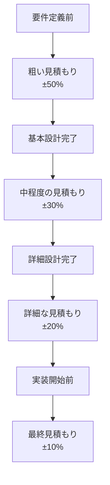

## 工数試算で考慮すべき要素

工数試算やWBSを作成する際に考慮すべき要素を詳しく解説します。Function Point法、基本情報の範囲、その他の重要な要素を含めます。

### 工数試算で考慮すべき要素とは

工数試算は、単純なタスクの見積もりだけでなく、プロジェクトの様々な要素を総合的に考慮する必要があります。

```
工数試算で考慮すべき要素
   ├─ 見積もり手法（Function Point法、COCOMO法）
   ├─ 情報の範囲（基本設計、詳細設計、実装、テスト）
   ├─ 非開発工数（レビュー、ドキュメント、コミュニケーション）
   ├─ リスク要因（技術的負債、学習コスト、変更リスク）
   └─ バッファと調整係数
```

### なぜこれらの要素を考慮することが重要なのか

#### 考慮要素なしの問題

**問題のある状況:**

```
見積もりが不正確:
- 基本設計の範囲が不明確
- レビュー工数が考慮されていない
- 技術的負債の影響が考慮されていない
- 学習コストが考慮されていない

影響:
- 見積もりが過小評価される
- プロジェクトが遅延する
- 予算が超過する
- チームの負荷が増加する
```

#### 考慮要素による解決

**改善された状況:**

```
適切な考慮要素:
- 基本設計から実装までの範囲が明確
- レビュー工数が適切に考慮されている
- 技術的負債の影響が考慮されている
- 学習コストが考慮されている

メリット:
- 見積もりが正確になる
- プロジェクトが計画通りに進む
- 予算が適切に管理できる
- チームの負荷が適切に管理できる
```

## 1. 見積もり手法

### 1.1 Function Point法（機能点法）

#### Function Point法とは

Function Point法は、ソフトウェアの機能を測定して工数を算出する手法です。機能の複雑さと数を基に、客観的な工数を見積もります。

**Function Point法の特徴:**

```
Function Point法の特徴
   ├─ 機能の複雑さを測定
   ├─ 客観的な見積もりが可能
   ├─ プロジェクト間で比較可能
   └─ 標準化された手法
```

**Function Point法の計算方法:**

```typescript
// Function Point法の計算例
interface FunctionPoint {
  type: 'EI' | 'EO' | 'EQ' | 'ILF' | 'EIF'; // 機能タイプ
  complexity: 'low' | 'average' | 'high';    // 複雑さ
  count: number;                              // 機能数
}

// 機能タイプの定義
// EI: External Input（外部入力）
// EO: External Output（外部出力）
// EQ: External Inquiry（外部照会）
// ILF: Internal Logical File（内部論理ファイル）
// EIF: External Interface File（外部インターフェースファイル）

// 複雑さによる重み付け
const complexityWeights = {
  EI: { low: 3, average: 4, high: 6 },
  EO: { low: 4, average: 5, high: 7 },
  EQ: { low: 3, average: 4, high: 6 },
  ILF: { low: 7, average: 10, high: 15 },
  EIF: { low: 5, average: 7, high: 10 },
};

// Function Pointの計算
function calculateFunctionPoints(functions: FunctionPoint[]): number {
  return functions.reduce((total, func) => {
    const weight = complexityWeights[func.type][func.complexity];
    return total + (weight * func.count);
  }, 0);
}

// 例: ECサイトのFunction Point計算
const ecSiteFunctions: FunctionPoint[] = [
  { type: 'EI', complexity: 'average', count: 5 },  // ログイン、商品登録など
  { type: 'EO', complexity: 'average', count: 3 },  // 商品一覧、注文履歴など
  { type: 'EQ', complexity: 'low', count: 2 },       // 商品検索など
  { type: 'ILF', complexity: 'average', count: 4 }, // ユーザー、商品、注文、在庫
  { type: 'EIF', complexity: 'low', count: 1 },      // 決済API連携
];

const totalFP = calculateFunctionPoints(ecSiteFunctions); // 合計Function Point

// Function Pointから工数への変換（経験値）
// 1 Function Point = 0.5〜2.0人日（プロジェクトの複雑さによる）
const productivityRate = 1.0; // 1 Function Point = 1人日
const estimatedDays = totalFP * productivityRate;
```

**Function Point法のメリット:**

- **客観性**: 機能の複雑さを数値化できる
- **比較可能性**: プロジェクト間で比較可能
- **標準化**: 業界標準の手法

**Function Point法のデメリット:**

- **初期コスト**: 機能の分類と複雑さの判定に時間がかかる
- **経験が必要**: 正確な判定には経験が必要

### 1.2 COCOMO法

#### COCOMO法とは

COCOMO（Constructive Cost Model）法は、ソフトウェアの規模（コード行数）を基に工数を算出する手法です。

**COCOMO法の計算方法:**

```typescript
// COCOMO法の計算例
interface COCOMOParams {
  linesOfCode: number;        // コード行数（KLOC: 1000行単位）
  projectType: 'organic' | 'semi-detached' | 'embedded';
}

// プロジェクトタイプによる係数
const cocomoCoefficients = {
  organic: { a: 2.4, b: 1.05, c: 2.5, d: 0.38 },
  'semi-detached': { a: 3.0, b: 1.12, c: 2.5, d: 0.35 },
  embedded: { a: 3.6, b: 1.20, c: 2.5, d: 0.32 },
};

// 工数の計算（人月）
function calculateCOCOMO(params: COCOMOParams): number {
  const coeff = cocomoCoefficients[params.projectType];
  const kloc = params.linesOfCode / 1000;
  
  // 工数（人月）= a × (KLOC)^b
  const effort = coeff.a * Math.pow(kloc, coeff.b);
  
  // 開発期間（月）= c × (工数)^d
  const duration = coeff.c * Math.pow(effort, coeff.d);
  
  return { effort, duration };
}

// 例: ECサイトのCOCOMO計算
const ecSiteParams: COCOMOParams = {
  linesOfCode: 50000, // 50,000行
  projectType: 'semi-detached', // 中規模プロジェクト
};

const { effort, duration } = calculateCOCOMO(ecSiteParams);
// effort: 約50人月
// duration: 約10ヶ月
```

**COCOMO法のメリット:**

- **シンプル**: コード行数から簡単に計算できる
- **標準化**: 業界標準の手法

**COCOMO法のデメリット:**

- **コード行数の見積もり**: 実装前のコード行数の見積もりが困難
- **プロジェクトタイプの判定**: プロジェクトタイプの判定が主観的

## 2. 情報の範囲と見積もり精度

### 2.1 基本設計情報の範囲

#### 基本設計情報とは

基本設計情報は、システムの全体像を定義する情報です。この情報が不足していると、見積もりの精度が低下します。

**基本設計情報に含まれるべき内容:**

```typescript
interface BasicDesignInfo {
  // システム全体の情報
  systemOverview: {
    purpose: string;           // システムの目的
    scope: string[];           // システムの範囲
    users: string[];           // ユーザー種別
    constraints: string[];    // 制約事項
  };
  
  // 機能要件
  functionalRequirements: {
    features: Feature[];        // 機能一覧
    useCases: UseCase[];       // ユースケース
    businessRules: string[];   // ビジネスルール
  };
  
  // 非機能要件
  nonFunctionalRequirements: {
    performance: string[];     // パフォーマンス要件
    security: string[];        // セキュリティ要件
    scalability: string[];     // スケーラビリティ要件
    availability: string[];    // 可用性要件
  };
  
  // 技術スタック
  techStack: {
    frontend: string[];        // フロントエンド技術
    backend: string[];         // バックエンド技術
    database: string[];        // データベース
    infrastructure: string[];  // インフラ
  };
  
  // 外部連携
  externalIntegrations: {
    apis: string[];            // 外部API
    services: string[];         // 外部サービス
  };
}
```

**基本設計情報の範囲と見積もり精度:**

| 情報の範囲 | 見積もり精度 | 説明 |
|-----------|------------|------|
| **要件定義のみ** | ±50% | 非常に粗い見積もり |
| **基本設計完了** | ±30% | 中程度の見積もり |
| **詳細設計完了** | ±20% | 詳細な見積もり |
| **実装開始前** | ±10% | 非常に詳細な見積もり |

**基本設計情報が不足している場合の影響:**

```typescript
// 基本設計情報が不足している場合
interface InsufficientDesignInfo {
  problems: [
    '機能の範囲が不明確',
    '技術スタックが未決定',
    '外部連携の詳細が不明',
    '非機能要件が不明確',
  ];
  
  impact: {
    estimationAccuracy: '±50%以上', // 見積もり精度が低い
    risk: '高い',                    // リスクが高い
    buffer: '30%以上必要',          // 大きなバッファが必要
  };
}

// 基本設計情報が十分な場合
interface SufficientDesignInfo {
  benefits: [
    '機能の範囲が明確',
    '技術スタックが決定済み',
    '外部連携の詳細が明確',
    '非機能要件が明確',
  ];
  
  impact: {
    estimationAccuracy: '±20%以下', // 見積もり精度が高い
    risk: '低い',                    // リスクが低い
    buffer: '10-20%で十分',         // 小さなバッファで十分
  };
}
```

### 2.2 詳細設計情報の範囲

#### 詳細設計情報とは

詳細設計情報は、各機能の実装詳細を定義する情報です。この情報が不足していると、実装時の工数が増加します。

**詳細設計情報に含まれるべき内容:**

```typescript
interface DetailedDesignInfo {
  // データベース設計
  databaseDesign: {
    tables: Table[];            // テーブル定義
    relationships: Relation[];  // リレーション
    indexes: Index[];           // インデックス
    constraints: Constraint[];  // 制約
  };
  
  // API設計
  apiDesign: {
    endpoints: Endpoint[];      // APIエンドポイント
    requestResponse: Schema[];  // リクエスト/レスポンススキーマ
    errorHandling: Error[];    // エラーハンドリング
  };
  
  // UI設計
  uiDesign: {
    screens: Screen[];          // 画面設計
    components: Component[];    // コンポーネント設計
    userFlow: Flow[];           // ユーザーフロー
  };
  
  // 処理フロー
  processFlow: {
    businessLogic: Logic[];     // ビジネスロジック
    workflows: Workflow[];      // ワークフロー
    stateTransitions: State[]; // 状態遷移
  };
}
```

**詳細設計情報の範囲と実装工数:**

| 情報の範囲 | 実装工数の変動 | 説明 |
|-----------|--------------|------|
| **基本設計のみ** | +50% | 実装時に設計が必要 |
| **詳細設計完了** | ±10% | 実装工数が安定 |
| **プロトタイプ完了** | ±5% | 実装工数が非常に安定 |

### 2.3 実装情報の範囲

#### 実装情報とは

実装情報は、実際のコード実装に関する情報です。この情報が不足していると、実装時の工数が増加します。

**実装情報に含まれるべき内容:**

```typescript
interface ImplementationInfo {
  // コーディング規約
  codingStandards: {
    style: string[];            // コーディングスタイル
    patterns: string[];         // デザインパターン
    conventions: string[];      // 命名規則
  };
  
  // ライブラリ・フレームワーク
  libraries: {
    frontend: Library[];        // フロントエンドライブラリ
    backend: Library[];         // バックエンドライブラリ
    utilities: Library[];       // ユーティリティライブラリ
  };
  
  // 実装パターン
  implementationPatterns: {
    architecture: string;        // アーキテクチャパターン
    patterns: string[];          // デザインパターン
    bestPractices: string[];     // ベストプラクティス
  };
}
```

### 2.4 テスト情報の範囲

#### テスト情報とは

テスト情報は、テスト計画とテストケースに関する情報です。この情報が不足していると、テスト工数が増加します。

**テスト情報に含まれるべき内容:**

```typescript
interface TestInfo {
  // テスト計画
  testPlan: {
    scope: string[];            // テスト範囲
    strategy: string;           // テスト戦略
    levels: string[];           // テストレベル（単体、結合、システム）
  };
  
  // テストケース
  testCases: {
    unit: TestCase[];           // 単体テストケース
    integration: TestCase[];    // 結合テストケース
    system: TestCase[];         // システムテストケース
    e2e: TestCase[];            // E2Eテストケース
  };
  
  // テスト環境
  testEnvironment: {
    setup: string[];            // テスト環境のセットアップ
    data: string[];             // テストデータ
    tools: string[];            // テストツール
  };
}
```

**テスト情報の範囲とテスト工数:**

| 情報の範囲 | テスト工数の変動 | 説明 |
|-----------|----------------|------|
| **テスト計画なし** | +100% | テストケース作成に時間がかかる |
| **テスト計画完了** | +30% | テストケース作成に時間がかかる |
| **テストケース完了** | ±10% | テスト工数が安定 |

## 3. 非開発工数

### 3.1 レビュー工数

#### レビュー工数とは

レビュー工数は、コードレビュー、設計レビュー、ドキュメントレビューなどに要する工数です。

**レビュー工数の見積もり:**

```typescript
interface ReviewEffort {
  // コードレビュー
  codeReview: {
    baseHours: number;          // 基本レビュー時間（1機能あたり）
    reviewRatio: number;        // レビュー時間/実装時間の比率
    reworkHours: number;        // 再作業時間
  };
  
  // 設計レビュー
  designReview: {
    baseHours: number;          // 基本レビュー時間
    participants: number;        // 参加者数
    meetingHours: number;       // 会議時間
  };
  
  // ドキュメントレビュー
  documentReview: {
    baseHours: number;          // 基本レビュー時間（1ドキュメントあたり）
    pages: number;              // ページ数
  };
}

// レビュー工数の計算例
function calculateReviewEffort(
  implementationHours: number,
  reviewRatio: number = 0.2  // 実装時間の20%
): number {
  const reviewHours = implementationHours * reviewRatio;
  const reworkHours = reviewHours * 0.3; // レビュー時間の30%が再作業
  return reviewHours + reworkHours;
}

// 例: 実装工数が100時間の場合
const implementationHours = 100;
const reviewEffort = calculateReviewEffort(implementationHours, 0.2);
// レビュー工数: 20時間（レビュー）+ 6時間（再作業）= 26時間
```

**レビュー工数の目安:**

| レビュー種別 | 工数比率 | 説明 |
|------------|---------|------|
| **コードレビュー** | 実装時間の20-30% | コードレビューと再作業 |
| **設計レビュー** | 設計時間の10-20% | 設計レビューと修正 |
| **ドキュメントレビュー** | ドキュメント作成時間の10-15% | ドキュメントレビューと修正 |

### 3.2 ドキュメント作成工数

#### ドキュメント作成工数とは

ドキュメント作成工数は、設計書、マニュアル、API仕様書などの作成に要する工数です。

**ドキュメント作成工数の見積もり:**

```typescript
interface DocumentEffort {
  // 設計書
  designDocument: {
    baseHours: number;          // 基本作成時間（1機能あたり）
    pages: number;              // ページ数
    reviewHours: number;        // レビュー時間
  };
  
  // API仕様書
  apiDocument: {
    baseHours: number;          // 基本作成時間（1エンドポイントあたり）
    endpoints: number;          // エンドポイント数
    reviewHours: number;        // レビュー時間
  };
  
  // マニュアル
  manual: {
    baseHours: number;          // 基本作成時間（1機能あたり）
    pages: number;              // ページ数
    reviewHours: number;        // レビュー時間
  };
}

// ドキュメント作成工数の計算例
function calculateDocumentEffort(
  implementationHours: number,
  documentRatio: number = 0.15  // 実装時間の15%
): number {
  return implementationHours * documentRatio;
}

// 例: 実装工数が100時間の場合
const implementationHours = 100;
const documentEffort = calculateDocumentEffort(implementationHours, 0.15);
// ドキュメント作成工数: 15時間
```

**ドキュメント作成工数の目安:**

| ドキュメント種別 | 工数比率 | 説明 |
|---------------|---------|------|
| **設計書** | 実装時間の10-20% | 基本設計書、詳細設計書 |
| **API仕様書** | 実装時間の5-10% | OpenAPI仕様書など |
| **マニュアル** | 実装時間の5-15% | ユーザーマニュアル、運用マニュアル |

### 3.3 コミュニケーション工数

#### コミュニケーション工数とは

コミュニケーション工数は、会議、メール、チャットなどのコミュニケーションに要する工数です。

**コミュニケーション工数の見積もり:**

```typescript
interface CommunicationEffort {
  // 会議
  meetings: {
    daily: number;              // 日次会議（1日あたりの時間）
    weekly: number;             // 週次会議（1週間あたりの時間）
    adhoc: number;              // 臨時会議（1週間あたりの時間）
  };
  
  // メール・チャット
  messaging: {
    dailyHours: number;         // 1日あたりの時間
  };
  
  // 報告・連絡
  reporting: {
    dailyHours: number;         // 1日あたりの時間
  };
}

// コミュニケーション工数の計算例
function calculateCommunicationEffort(
  projectDays: number,
  dailyHours: number = 1.5  // 1日あたり1.5時間
): number {
  return projectDays * dailyHours;
}

// 例: プロジェクト期間が20日の場合
const projectDays = 20;
const communicationEffort = calculateCommunicationEffort(projectDays, 1.5);
// コミュニケーション工数: 30時間
```

**コミュニケーション工数の目安:**

| プロジェクト規模 | 1日あたりの時間 | 説明 |
|---------------|---------------|------|
| **小規模（1-3人）** | 0.5-1.0時間 | 少ない会議とコミュニケーション |
| **中規模（4-10人）** | 1.0-2.0時間 | 定例会議とコミュニケーション |
| **大規模（10人以上）** | 2.0-3.0時間 | 多くの会議とコミュニケーション |

## 4. リスク要因

### 4.1 技術的負債の考慮

#### 技術的負債とは

技術的負債は、過去の開発で積み重ねられた技術的な問題です。この負債があると、新機能の開発工数が増加します。

**技術的負債の影響:**

```typescript
interface TechnicalDebt {
  // 技術的負債の種類
  types: {
    legacyCode: number;         // レガシーコードの影響度（0-1）
    poorArchitecture: number;   // アーキテクチャの問題の影響度（0-1）
    outdatedTech: number;       // 古い技術の影響度（0-1）
    lackOfTests: number;        // テスト不足の影響度（0-1）
  };
  
  // 技術的負債の影響
  impact: {
    developmentMultiplier: number; // 開発工数の倍率
    bugRate: number;               // バグ発生率の増加
    maintenanceCost: number;        // 保守コストの増加
  };
}

// 技術的負債を考慮した工数調整
function adjustForTechnicalDebt(
  baseEstimate: number,
  technicalDebt: TechnicalDebt
): number {
  const totalDebt = 
    technicalDebt.types.legacyCode +
    technicalDebt.types.poorArchitecture +
    technicalDebt.types.outdatedTech +
    technicalDebt.types.lackOfTests;
  
  const multiplier = 1 + (totalDebt * 0.3); // 負債の30%が工数に影響
  return baseEstimate * multiplier;
}

// 例: 基本見積もりが100時間、技術的負債が中程度の場合
const baseEstimate = 100;
const technicalDebt: TechnicalDebt = {
  types: {
    legacyCode: 0.3,
    poorArchitecture: 0.2,
    outdatedTech: 0.1,
    lackOfTests: 0.2,
  },
  impact: {
    developmentMultiplier: 1.24,
    bugRate: 1.5,
    maintenanceCost: 1.3,
  },
};

const adjustedEstimate = adjustForTechnicalDebt(baseEstimate, technicalDebt);
// 調整後の見積もり: 124時間（24%増加）
```

**技術的負債の影響度:**

| 技術的負債のレベル | 工数増加率 | 説明 |
|-----------------|----------|------|
| **低** | +5-10% | 軽微な問題のみ |
| **中** | +10-25% | 中程度の問題あり |
| **高** | +25-50% | 深刻な問題あり |

### 4.2 学習コストの考慮

#### 学習コストとは

学習コストは、新しい技術やツールを学習するために要する工数です。

**学習コストの見積もり:**

```typescript
interface LearningCost {
  // 新しい技術の学習
  newTechnology: {
    technology: string;         // 技術名
    complexity: 'low' | 'medium' | 'high'; // 複雑さ
    learningHours: number;     // 学習時間（時間）
  };
  
  // 新しいツールの学習
  newTool: {
    tool: string;              // ツール名
    learningHours: number;     // 学習時間（時間）
  };
  
  // ドメイン知識の学習
  domainKnowledge: {
    domain: string;            // ドメイン名
    learningHours: number;     // 学習時間（時間）
  };
}

// 学習コストの計算例
function calculateLearningCost(
  technologies: LearningCost['newTechnology'][],
  tools: LearningCost['newTool'][],
  domains: LearningCost['domainKnowledge'][]
): number {
  const techCost = technologies.reduce(
    (sum, tech) => sum + tech.learningHours, 0
  );
  const toolCost = tools.reduce(
    (sum, tool) => sum + tool.learningHours, 0
  );
  const domainCost = domains.reduce(
    (sum, domain) => sum + domain.learningHours, 0
  );
  
  return techCost + toolCost + domainCost;
}

// 例: Next.js、TypeScript、決済ドメインの学習
const learningCost = calculateLearningCost(
  [
    { technology: 'Next.js', complexity: 'medium', learningHours: 40 },
    { technology: 'TypeScript', complexity: 'medium', learningHours: 20 },
  ],
  [
    { tool: 'Vercel', learningHours: 8 },
  ],
  [
    { domain: '決済', learningHours: 16 },
  ]
);
// 学習コスト: 84時間
```

**学習コストの目安:**

| 技術・ツールの複雑さ | 学習時間 | 説明 |
|------------------|---------|------|
| **低** | 8-16時間 | 簡単な技術・ツール |
| **中** | 16-40時間 | 中程度の技術・ツール |
| **高** | 40-80時間 | 複雑な技術・ツール |

### 4.3 変更リスクの考慮

#### 変更リスクとは

変更リスクは、要件変更や仕様変更が発生する可能性とその影響です。

**変更リスクの見積もり:**

```typescript
interface ChangeRisk {
  // 要件変更のリスク
  requirementChange: {
    probability: number;        // 発生確率（0-1）
    impact: number;            // 影響度（0-1）
    riskScore: number;         // リスクスコア（確率 × 影響度）
  };
  
  // 仕様変更のリスク
  specificationChange: {
    probability: number;        // 発生確率（0-1）
    impact: number;            // 影響度（0-1）
    riskScore: number;         // リスクスコア（確率 × 影響度）
  };
  
  // 技術変更のリスク
  technicalChange: {
    probability: number;        // 発生確率（0-1）
    impact: number;            // 影響度（0-1）
    riskScore: number;         // リスクスコア（確率 × 影響度）
  };
}

// 変更リスクを考慮した工数調整
function adjustForChangeRisk(
  baseEstimate: number,
  changeRisk: ChangeRisk
): number {
  const totalRiskScore = 
    changeRisk.requirementChange.riskScore +
    changeRisk.specificationChange.riskScore +
    changeRisk.technicalChange.riskScore;
  
  const multiplier = 1 + (totalRiskScore * 0.2); // リスクの20%が工数に影響
  return baseEstimate * multiplier;
}

// 例: 基本見積もりが100時間、変更リスクが中程度の場合
const baseEstimate = 100;
const changeRisk: ChangeRisk = {
  requirementChange: {
    probability: 0.5,
    impact: 0.3,
    riskScore: 0.15,
  },
  specificationChange: {
    probability: 0.3,
    impact: 0.2,
    riskScore: 0.06,
  },
  technicalChange: {
    probability: 0.2,
    impact: 0.1,
    riskScore: 0.02,
  },
};

const adjustedEstimate = adjustForChangeRisk(baseEstimate, changeRisk);
// 調整後の見積もり: 105時間（5%増加）
```

## 5. バッファと調整係数

### 5.1 バッファの設定方法

#### バッファとは

バッファは、予期しない問題や遅延に対応するための余裕時間です。

**バッファの設定方法:**

```typescript
interface BufferSettings {
  // プロジェクトの複雑さによるバッファ
  complexityBuffer: {
    low: number;      // 5-10%
    medium: number;   // 10-20%
    high: number;     // 20-30%
  };
  
  // 情報の範囲によるバッファ
  informationBuffer: {
    insufficient: number;  // 30-50%（情報不足）
    sufficient: number;    // 10-20%（情報十分）
    complete: number;      // 5-10%（情報完璧）
  };
  
  // リスクによるバッファ
  riskBuffer: {
    low: number;      // 5-10%
    medium: number;   // 10-20%
    high: number;     // 20-30%
  };
}

// バッファの計算例
function calculateBuffer(
  baseEstimate: number,
  complexity: 'low' | 'medium' | 'high',
  informationLevel: 'insufficient' | 'sufficient' | 'complete',
  riskLevel: 'low' | 'medium' | 'high'
): number {
  const complexityBuffers = { low: 0.05, medium: 0.15, high: 0.25 };
  const informationBuffers = { insufficient: 0.40, sufficient: 0.15, complete: 0.075 };
  const riskBuffers = { low: 0.05, medium: 0.15, high: 0.25 };
  
  const totalBuffer = 
    complexityBuffers[complexity] +
    informationBuffers[informationLevel] +
    riskBuffers[riskLevel];
  
  return baseEstimate * (1 + totalBuffer);
}

// 例: 基本見積もりが100時間、中程度の複雑さ、情報不足、中程度のリスク
const baseEstimate = 100;
const totalEstimate = calculateBuffer(
  baseEstimate,
  'medium',
  'insufficient',
  'medium'
);
// 合計見積もり: 170時間（70%のバッファ）
```

**バッファの設定指針:**

| 要因 | 低 | 中 | 高 |
|------|---|----|----|
| **プロジェクトの複雑さ** | 5-10% | 10-20% | 20-30% |
| **情報の範囲** | 5-10% | 10-20% | 30-50% |
| **リスクレベル** | 5-10% | 10-20% | 20-30% |

### 5.2 調整係数の適用

#### 調整係数とは

調整係数は、チームの経験レベル、プロジェクトの特性などを考慮して工数を調整する係数です。

**調整係数の適用:**

```typescript
interface AdjustmentFactors {
  // チームの経験レベル
  teamExperience: {
    junior: number;    // 0.8（経験が浅い）
    middle: number;   // 1.0（標準）
    senior: number;   // 1.2（経験が豊富）
  };
  
  // プロジェクトの特性
  projectCharacteristics: {
    newDomain: number;      // 1.2（新しいドメイン）
    familiarDomain: number; // 1.0（慣れ親しんだドメイン）
    legacySystem: number;   // 1.3（レガシーシステム）
  };
  
  // 開発環境
  developmentEnvironment: {
    good: number;      // 0.9（良い環境）
    average: number;   // 1.0（標準環境）
    poor: number;      // 1.2（悪い環境）
  };
}

// 調整係数の適用例
function applyAdjustmentFactors(
  baseEstimate: number,
  factors: AdjustmentFactors
): number {
  const teamFactor = factors.teamExperience.middle; // 1.0
  const projectFactor = factors.projectCharacteristics.newDomain; // 1.2
  const environmentFactor = factors.developmentEnvironment.average; // 1.0
  
  const totalFactor = teamFactor * projectFactor * environmentFactor;
  return baseEstimate * totalFactor;
}

// 例: 基本見積もりが100時間、新しいドメインの場合
const baseEstimate = 100;
const factors: AdjustmentFactors = {
  teamExperience: { junior: 0.8, middle: 1.0, senior: 1.2 },
  projectCharacteristics: { newDomain: 1.2, familiarDomain: 1.0, legacySystem: 1.3 },
  developmentEnvironment: { good: 0.9, average: 1.0, poor: 1.2 },
};

const adjustedEstimate = applyAdjustmentFactors(baseEstimate, factors);
// 調整後の見積もり: 120時間（20%増加）
```

## 6. 実践的な工数試算のフロー

### 6.1 段階的な見積もり

#### 段階的な見積もりのフロー

プロジェクトの進行に応じて、見積もりの精度を段階的に向上させます。

**段階的な見積もりのフロー:**



**段階的な見積もりの実践例:**

```typescript
interface PhasedEstimation {
  // フェーズ1: 要件定義前
  phase1: {
    method: '類推見積もり' | 'Function Point法（粗い）';
    accuracy: '±50%';
    buffer: 0.5; // 50%のバッファ
  };
  
  // フェーズ2: 基本設計完了後
  phase2: {
    method: 'Function Point法' | 'COCOMO法';
    accuracy: '±30%';
    buffer: 0.3; // 30%のバッファ
  };
  
  // フェーズ3: 詳細設計完了後
  phase3: {
    method: 'ボトムアップ見積もり';
    accuracy: '±20%';
    buffer: 0.2; // 20%のバッファ
  };
  
  // フェーズ4: 実装開始前
  phase4: {
    method: '詳細なボトムアップ見積もり';
    accuracy: '±10%';
    buffer: 0.1; // 10%のバッファ
  };
}
```

### 6.2 総合的な工数試算

#### 総合的な工数試算の計算

すべての要素を考慮した総合的な工数試算を行います。

**総合的な工数試算の計算例:**

```typescript
interface ComprehensiveEstimation {
  // 基本見積もり
  baseEstimate: number;
  
  // 非開発工数
  nonDevelopmentEffort: {
    review: number;           // レビュー工数
    document: number;         // ドキュメント作成工数
    communication: number;    // コミュニケーション工数
  };
  
  // リスク調整
  riskAdjustment: {
    technicalDebt: number;    // 技術的負債の影響
    learningCost: number;     // 学習コスト
    changeRisk: number;       // 変更リスクの影響
  };
  
  // バッファ
  buffer: number;
  
  // 調整係数
  adjustmentFactor: number;
  
  // 合計見積もり
  totalEstimate: number;
}

// 総合的な工数試算の計算
function calculateComprehensiveEstimation(
  baseEstimate: number,
  nonDevelopmentEffort: ComprehensiveEstimation['nonDevelopmentEffort'],
  riskAdjustment: ComprehensiveEstimation['riskAdjustment'],
  buffer: number,
  adjustmentFactor: number
): ComprehensiveEstimation {
  // 基本見積もり + 非開発工数
  const estimateWithNonDev = 
    baseEstimate + 
    nonDevelopmentEffort.review +
    nonDevelopmentEffort.document +
    nonDevelopmentEffort.communication;
  
  // リスク調整を適用
  const estimateWithRisk = 
    estimateWithNonDev +
    riskAdjustment.technicalDebt +
    riskAdjustment.learningCost +
    riskAdjustment.changeRisk;
  
  // バッファを追加
  const estimateWithBuffer = estimateWithRisk * (1 + buffer);
  
  // 調整係数を適用
  const totalEstimate = estimateWithBuffer * adjustmentFactor;
  
  return {
    baseEstimate,
    nonDevelopmentEffort,
    riskAdjustment,
    buffer,
    adjustmentFactor,
    totalEstimate,
  };
}

// 例: ECサイトの総合的な工数試算
const baseEstimate = 100; // 基本見積もり: 100時間
const nonDevelopmentEffort = {
  review: 26,        // レビュー工数: 26時間
  document: 15,      // ドキュメント作成工数: 15時間
  communication: 30, // コミュニケーション工数: 30時間
};
const riskAdjustment = {
  technicalDebt: 24,    // 技術的負債の影響: 24時間
  learningCost: 84,     // 学習コスト: 84時間
  changeRisk: 5,        // 変更リスクの影響: 5時間
};
const buffer = 0.2;     // バッファ: 20%
const adjustmentFactor = 1.2; // 調整係数: 1.2（新しいドメイン）

const comprehensiveEstimation = calculateComprehensiveEstimation(
  baseEstimate,
  nonDevelopmentEffort,
  riskAdjustment,
  buffer,
  adjustmentFactor
);

// 合計見積もり: 約400時間（基本見積もりの4倍）
```

## 7. まとめ

工数試算で考慮すべき要素のポイント：

- **見積もり手法**: Function Point法、COCOMO法などの客観的な手法
- **情報の範囲**: 基本設計、詳細設計、実装、テストの情報範囲と見積もり精度
- **非開発工数**: レビュー、ドキュメント作成、コミュニケーション工数
- **リスク要因**: 技術的負債、学習コスト、変更リスクの影響
- **バッファと調整係数**: プロジェクトの特性に応じた適切なバッファと調整係数
- **段階的な見積もり**: プロジェクトの進行に応じた見積もり精度の向上

これらの要素を総合的に考慮することで、より正確な工数試算が可能になり、プロジェクトの成功確率を向上させることができます。

