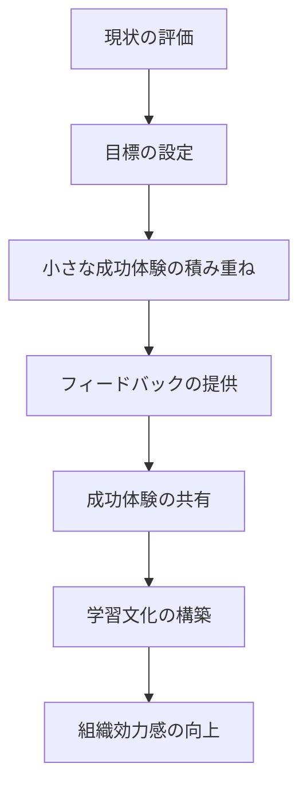

## 組織効力感を高める方法

組織効力感（Organizational Efficacy）を高める方法と、チームのパフォーマンス向上のための実践的なアプローチを詳しく解説します。

### 組織効力感とは

組織効力感は、チームや組織が目標を達成できるという信念と、そのための能力に対する自信です。

```
組織効力感の構成要素
   ├─ 個人の効力感（自己効力感）
   ├─ チームの効力感（チーム効力感）
   ├─ 組織の効力感（組織効力感）
   └─ 相互効力感（メンバー間の信頼）
```

### なぜ組織効力感が重要なのか

#### 組織効力感が低い場合の問題

**問題のある状況:**

```
組織効力感が低いチーム:
- 「どうせ無理だ」という諦めの気持ち
- チャレンジを避ける傾向
- 失敗を恐れて行動しない
- チームの結束が弱い
- パフォーマンスが低下する

影響:
- プロジェクトの成功率が低い
- イノベーションが生まれない
- チームメンバーの離職率が高い
- 組織の成長が停滞する
```

#### 組織効力感が高い場合のメリット

**改善された状況:**

```
組織効力感が高いチーム:
- 「できる」という前向きな姿勢
- チャレンジを積極的に受け入れる
- 失敗から学ぶ文化
- チームの結束が強い
- パフォーマンスが向上する

メリット:
- プロジェクトの成功率が高い
- イノベーションが生まれる
- チームメンバーの定着率が高い
- 組織が成長する
```

## 1. 個人の効力感（自己効力感）を高める方法

### 1.1 小さな成功体験の積み重ね

#### 小さな成功体験の重要性

小さな成功体験を積み重ねることで、個人の自己効力感を高めることができます。

**小さな成功体験の積み重ね:**

小さな成功体験を積み重ねるためには、以下の要素を考慮する必要があります：

**タスクの分解:**

大きなタスクを小さなタスクに分解することで、達成可能な目標を設定できます。例えば、「ユーザー認証機能の実装」という大きなタスクを以下のように分解します：

- ログイン画面のUI実装
- 認証APIの実装
- セッション管理の実装
- 単体テストの作成
- 結合テストの実施

各タスクが完了するたびに、マイルストーンとして記録し、成功体験として認識します。

**成功の定義:**

成功の基準を明確に定義することで、達成感を得やすくなります。成功の基準には以下のようなものがあります：

- タスクが完了した
- 品質基準を満たした
- 期限を守った

これらの基準は測定可能であることが重要です。

**フィードバックの提供:**

小さな成功体験を積み重ねるためには、適切なフィードバックが重要です：

- **即座のフィードバック**: タスク完了時にすぐにフィードバックを提供する
- **ポジティブなフィードバック**: 成果を認め、励ます
- **建設的なフィードバック**: 改善点があれば、建設的に指摘する

**小さな成功体験の積み重ねのコツ:**

1. **タスクの分解**: 大きなタスクを小さなタスクに分解する
2. **マイルストーンの設定**: 達成可能なマイルストーンを設定する
3. **即座のフィードバック**: タスク完了時に即座にフィードバックを提供する
4. **成功の記録**: 成功体験を記録し、振り返る

### 1.2 ロールモデルの提供

#### ロールモデルの重要性

ロールモデルを提供することで、個人が「自分もできる」という自信を持てるようになります。

**ロールモデルの提供:**

ロールモデルを提供する際は、以下の要素を考慮します：

**ロールモデルの特徴:**

効果的なロールモデルには以下の特徴があります：

- **類似した背景**: メンバーと類似した背景を持つロールモデルは、共感しやすく、「自分もできる」という自信につながります
- **達成可能な目標**: 達成可能な目標を持つロールモデルは、メンバーが目標を設定しやすくなります
- **共感できる**: メンバーが共感できるロールモデルは、モチベーションを高めます

**ロールモデルの行動の共有:**

ロールモデルの行動を共有することで、メンバーが学ぶことができます：

- **チャレンジしたこと**: ロールモデルがどのようなチャレンジをしたかを共有する
- **失敗から学んだこと**: ロールモデルが失敗からどのように学んだかを共有する
- **成功したこと**: ロールモデルがどのように成功したかを共有する

**メンタリングの提供:**

ロールモデルからのメンタリングを提供することで、メンバーの成長を支援します：

- **メンタリングの頻度**: 定期的なメンタリングを設定する（例：週1回、月1回）
- **メンタリングのトピック**: メンバーのニーズに応じたトピックを設定する

**ロールモデルの提供のコツ:**

1. **類似した背景**: 類似した背景を持つロールモデルを選ぶ
2. **達成可能な目標**: 達成可能な目標を持つロールモデルを選ぶ
3. **共感できる**: 共感できるロールモデルを選ぶ
4. **メンタリング**: ロールモデルからのメンタリングを提供する

### 1.3 ポジティブなフィードバックの提供

#### ポジティブなフィードバックの重要性

ポジティブなフィードバックを提供することで、個人の自己効力感を高めることができます。

**ポジティブなフィードバックの提供:**

ポジティブなフィードバックを提供する際は、以下の要素を考慮します：

**フィードバックの種類:**

効果的なフィードバックには以下の特徴があります：

- **具体的なフィードバック**: 具体的な行動や成果を指摘する
- **タイムリーなフィードバック**: すぐにフィードバックを提供する
- **実行可能なフィードバック**: 実行可能な改善点を提示する
- **バランスの取れたフィードバック**: 強みと改善点のバランスを取る

**フィードバックの内容:**

フィードバックの内容には以下の要素を含めます：

- **強み**: メンバーの強みを認識し、伝える
- **達成したこと**: メンバーが達成したことを認める
- **改善点**: 建設的な改善点を提示する

**フィードバックの方法:**

フィードバックの方法は、状況に応じて選択します：

- **口頭でのフィードバック**: 1on1ミーティングなどで直接伝える
- **書面でのフィードバック**: メールやドキュメントで記録として残す
- **公開でのフィードバック**: チームミーティングなどで公開的に認める
- **プライベートでのフィードバック**: 個別に伝える必要がある場合

**ポジティブなフィードバックのコツ:**

1. **具体的に**: 具体的な行動や成果を指摘する
2. **タイムリーに**: すぐにフィードバックを提供する
3. **実行可能に**: 実行可能な改善点を提示する
4. **バランス良く**: 強みと改善点のバランスを取る

## 2. チームの効力感を高める方法

### 2.1 共通の目標の設定

#### 共通の目標の重要性

共通の目標を設定することで、チームの効力感を高めることができます。

**共通の目標の設定:**

共通の目標を設定する際は、以下の要素を考慮します：

**目標の特徴（SMART原則）:**

効果的な目標は、SMART原則に基づいて設定します：

- **Specific（具体的）**: 目標が明確で具体的である
- **Measurable（測定可能）**: 目標が測定可能である
- **Achievable（達成可能）**: 目標が達成可能である
- **Relevant（関連性）**: 目標が組織の戦略と関連している
- **Time-bound（期限）**: 目標に期限が設定されている

**目標の内容:**

目標の内容には以下の要素を含めます：

- **目標の説明**: 目標を明確に説明する
- **測定指標**: 目標の達成を測定する指標を設定する
- **マイルストーン**: 目標達成に向けた中間目標を設定する

**目標の共有:**

目標を共有する際は、以下のプロセスを実施します：

- **目標の伝達**: 目標をチームメンバーに明確に伝達する
- **目標の理解確認**: メンバーが目標を理解しているか確認する
- **目標へのコミット**: メンバーが目標にコミットする
- **進捗の共有**: 定期的に進捗を共有する

**共通の目標の設定のコツ:**

1. **SMART原則**: Specific（具体的）、Measurable（測定可能）、Achievable（達成可能）、Relevant（関連性）、Time-bound（期限）
2. **チームの参加**: チームメンバーが目標設定に参加する
3. **定期的な確認**: 定期的に目標の進捗を確認する
4. **達成の祝賀**: 目標達成を祝う

### 2.2 チームの成功体験の共有

#### チームの成功体験の重要性

チームの成功体験を共有することで、チームの効力感を高めることができます。

**チームの成功体験の共有:**

チームの成功体験を共有する際は、以下の要素を考慮します：

**成功体験の内容:**

成功体験の内容には以下の要素を含めます：

- **達成したこと**: チームが達成したことを明確にする
- **克服した課題**: チームが克服した課題を記録する
- **学んだこと**: チームが学んだことを共有する
- **各メンバーの貢献**: 各メンバーの貢献を認識する

**成功体験の共有方法:**

成功体験を共有する方法には以下のものがあります：

- **祝賀**: 成功を祝う機会を設ける
- **文書化**: 成功体験を文書化し、記録として残す
- **プレゼンテーション**: 成功体験を他のチームや組織に共有する
- **振り返り**: チームで振り返りを実施し、学びを深める

**実践例:**

チームの成功体験を共有する際は、以下のプロセスを実施します：

1. **成功の祝賀**: 成功を即座に祝う
2. **各メンバーの貢献の認識**: 各メンバーの貢献を認識し、感謝を伝える
3. **学んだことの共有**: チームが学んだことを共有する
4. **成功体験の文書化**: 成功体験を文書化し、将来の参考にする
5. **振り返り**: チームで振り返りを実施し、改善点を検討する

**チームの成功体験の共有のコツ:**

1. **即座に祝う**: 成功を即座に祝う
2. **各メンバーの貢献を認識**: 各メンバーの貢献を認識する
3. **学んだことを共有**: 学んだことを共有する
4. **文書化**: 成功体験を文書化する

### 2.3 相互支援の文化の構築

#### 相互支援の文化の重要性

相互支援の文化を構築することで、チームの効力感を高めることができます。

**相互支援の文化の構築:**

相互支援の文化を構築する際は、以下の要素を考慮します：

**相互支援の行動:**

相互支援の文化には以下の行動が含まれます：

- **助けを求める**: メンバーが助けを求めることを推奨する
- **助けを提供する**: メンバーが助けを提供することを推奨する
- **知識の共有**: メンバー間で知識を共有する
- **協力**: メンバー間で協力する

**相互支援の環境:**

相互支援の文化を構築するためには、以下の環境が必要です：

- **心理的安全性**: メンバーが安全に助けを求められる環境
- **信頼**: メンバー間の信頼関係
- **尊重**: メンバー間の相互尊重
- **開放性**: オープンなコミュニケーション

**実践例:**

相互支援の文化を構築する際は、以下のプロセスを実施します：

1. **心理的安全性の確保**: メンバーが安全に助けを求められる環境を作る
2. **信頼の構築**: チームメンバー間の信頼を構築する
3. **知識の共有**: 知識共有の仕組みを構築する
4. **協力の促進**: メンバー間の協力を促進する
5. **助けを求める文化**: 助けを求めることを推奨する
6. **助けを提供する文化**: 助けを提供することを推奨する

**相互支援の文化の構築のコツ:**

1. **心理的安全性**: 心理的安全性を確保する
2. **信頼の構築**: チームメンバー間の信頼を構築する
3. **知識の共有**: 知識共有の仕組みを構築する
4. **協力の促進**: 協力を促進する

## 3. 組織の効力感を高める方法

### 3.1 組織の成功体験の記録と共有

#### 組織の成功体験の重要性

組織の成功体験を記録し共有することで、組織の効力感を高めることができます。

**組織の成功体験の記録と共有:**

組織の成功体験を記録し共有する際は、以下の要素を考慮します：

**成功体験の記録:**

成功体験の記録には以下の情報を含めます：

- **プロジェクト名**: どのプロジェクトでの成功か
- **達成したこと**: 何を達成したか
- **測定指標**: どのような指標で成功を測定したか
- **チームメンバー**: どのメンバーが関与したか
- **達成日**: いつ達成したか

**成功体験の共有:**

成功体験を共有する方法には以下のものがあります：

- **社内での共有**: 社内の他のチームや部門に共有する
- **社外での共有**: 社外のコミュニティやカンファレンスで共有する
- **文書化**: 成功体験を文書化し、記録として残す
- **プレゼンテーション**: 成功体験をプレゼンテーション形式で共有する

**実践例:**

組織の成功体験を記録し共有する際は、以下のプロセスを実施します：

1. **成功体験の記録**: 成功体験を詳細に記録する
2. **社内での共有**: 社内で成功体験を共有し、他のチームの参考にする
3. **社外での共有**: 社外で成功体験を共有し、組織のブランド価値を高める
4. **文書化**: 成功体験を文書化し、将来の参考にする
5. **プレゼンテーション**: 成功体験をプレゼンテーション形式で共有する

### 3.2 組織の学習文化の構築

#### 組織の学習文化の重要性

組織の学習文化を構築することで、組織の効力感を高めることができます。

**組織の学習文化の構築:**

組織の学習文化を構築する際は、以下の要素を考慮します：

**学習の機会:**

組織の学習文化には以下の機会が含まれます：

- **トレーニング**: 定期的なトレーニングを提供する
- **メンタリング**: メンタリングの機会を提供する
- **知識共有**: 知識共有の機会を提供する
- **実験**: 実験の機会を提供する

**学習の環境:**

組織の学習文化を構築するためには、以下の環境が必要です：

- **失敗を許容する**: 失敗を許容し、学びの機会として活用する
- **好奇心を促進する**: メンバーの好奇心を促進する
- **振り返りを促進する**: 定期的な振り返りを促進する
- **イノベーションを促進する**: イノベーションを促進する

**実践例:**

組織の学習文化を構築する際は、以下のプロセスを実施します：

1. **トレーニングの提供**: 定期的なトレーニングを提供する
2. **メンタリングの提供**: メンタリングの機会を提供する
3. **知識共有の促進**: 知識共有の機会を提供する
4. **実験の促進**: 実験の機会を提供する
5. **失敗を許容する環境**: 失敗を許容し、学びの機会として活用する環境を構築する

## 4. 実践的な組織効力感向上のフロー

### 4.1 組織効力感向上のステップ

#### 組織効力感向上のステップ

組織効力感を段階的に向上させるステップを実践します。

**組織効力感向上のステップ:**



**組織効力感向上の実践例:**

組織効力感を向上させるためには、以下のステップを実施します：

**ステップ1: 現状の評価**

組織効力感の現状を評価します：

- **個人の効力感**: 個人の効力感を1-5のスケールで評価する
- **チームの効力感**: チームの効力感を1-5のスケールで評価する
- **組織の効力感**: 組織の効力感を1-5のスケールで評価する

評価結果に基づいて、現状のレベル（低、中、高）を判定します。

**ステップ2: 目標の設定**

組織効力感の目標を設定します：

- **個人の目標**: 個人の効力感を向上させる目標を設定する
- **チームの目標**: チームの効力感を向上させる目標を設定する
- **組織の目標**: 組織の効力感を向上させる目標を設定する

目標は、現状のレベルから目標のレベル（低、中、高）を設定します。

**ステップ3: 小さな成功体験の積み重ね**

小さな成功体験を積み重ねます：

- **小さなタスク**: 達成可能な小さなタスクを設定する
- **マイルストーン**: マイルストーンを設定し、達成を記録する
- **祝賀**: 達成を祝う機会を設ける

**ステップ4: フィードバックの提供**

適切なフィードバックを提供します：

- **頻度**: 定期的なフィードバックを提供する（例：週1回、月1回）
- **種類**: ポジティブ、建設的、バランスの取れたフィードバックを提供する
- **方法**: 口頭、書面、または両方でフィードバックを提供する

**ステップ5: 成功体験の共有**

成功体験を共有します：

- **社内での共有**: 社内で成功体験を共有する
- **社外での共有**: 社外で成功体験を共有する
- **文書化**: 成功体験を文書化する

**ステップ6: 学習文化の構築**

学習文化を構築します：

- **トレーニング**: 定期的なトレーニングを提供する
- **メンタリング**: メンタリングの機会を提供する
- **知識共有**: 知識共有の機会を提供する

## 5. まとめ

組織効力感を高める方法のポイント：

- **個人の効力感**: 小さな成功体験の積み重ね、ロールモデルの提供、ポジティブなフィードバック
- **チームの効力感**: 共通の目標の設定、チームの成功体験の共有、相互支援の文化の構築
- **組織の効力感**: 組織の成功体験の記録と共有、組織の学習文化の構築
- **段階的な向上**: 現状の評価から始まり、目標設定、小さな成功体験、フィードバック、成功体験の共有、学習文化の構築へと段階的に向上

これらの方法を実践することで、組織効力感を高め、チームと組織のパフォーマンスを向上させることができます。

