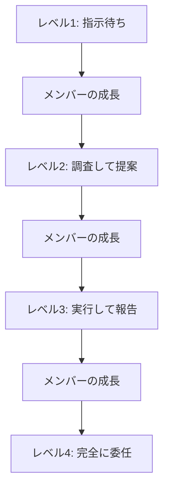

## タスク移譲のスキル

タスク移譲（Delegation）のスキルと、効果的にタスクを任せる方法を詳しく解説します。

### タスク移譲とは

タスク移譲は、リーダーやマネージャーがタスクをチームメンバーに任せるプロセスです。

```
タスク移譲の目的
   ├─ リーダーの負荷軽減
   ├─ チームメンバーの成長促進
   ├─ チームの能力向上
   └─ 組織の生産性向上
```

### なぜタスク移譲が重要なのか

#### タスク移譲なしの問題

**問題のある状況:**

```
タスク移譲をしないリーダー:
- すべてのタスクを自分で抱え込む
- チームメンバーが成長しない
- リーダーがボトルネックになる
- チームの能力が向上しない
- 組織の生産性が低下する

影響:
- リーダーの過負荷
- チームメンバーのモチベーション低下
- プロジェクトの遅延
- 組織の成長の停滞
```

#### タスク移譲による解決

**改善された状況:**

```
効果的なタスク移譲:
- リーダーの負荷が軽減される
- チームメンバーが成長する
- チームの能力が向上する
- 組織の生産性が向上する

メリット:
- リーダーの時間の有効活用
- チームメンバーのスキル向上
- チームの自律性の向上
- 組織の成長
```

## 1. タスク移譲の基本原則

### 1.1 適切なタスクの選択

#### 適切なタスクの選択とは

タスク移譲するタスクを適切に選択することが重要です。

**タスク移譲に適したタスク:**

タスク移譲に適したタスクには、以下の特徴があります：

**タスクの特徴:**

- **ルーティンワーク**: 定型的な作業で、手順が明確なタスク
- **教えられる**: メンバーに教えることができるタスク
- **時間がかかる**: リーダーが時間をかけるべきでないタスク
- **リスクが低い**: 失敗しても大きな影響がないタスク

**タスクの種類:**

- **運用タスク**: 日常的な運用業務
- **開発タスク**: 適切な指導があれば移譲可能な開発タスク
- **管理タスク**: 定型的な管理業務
- **学習タスク**: メンバーの成長につながる学習タスク

**実践例:**

タスク移譲に適したタスクの例：

- **運用タスク**: 定期的なレポート作成、データ入力など
- **開発タスク**: 既存機能の修正、簡単な機能の実装など（適切な指導があれば）
- **管理タスク**: 会議の議事録作成、スケジュール管理など
- **学習タスク**: 新しい技術の調査、ドキュメントの作成など

**タスク移譲に適さないタスク:**

タスク移譲に適さないタスクには、以下の特徴があります：

**タスクの特徴:**

- **戦略的な判断が必要**: 組織の戦略に関わる重要な判断が必要なタスク
- **機密情報を含む**: 機密情報を含むタスク
- **クリティカルなタスク**: 失敗すると大きな影響があるタスク
- **個人的な責任**: リーダー個人の責任として処理すべきタスク

**実践例:**

タスク移譲に適さないタスクの例：

- **戦略的な判断**: 組織の方向性に関する重要な決定
- **機密情報**: 顧客情報、財務情報などの機密情報を含むタスク
- **クリティカルなタスク**: 本番環境へのデプロイ、重要な契約の締結など
- **個人的な責任**: 人事評価、給与決定など

### 1.2 適切な人材の選択

#### 適切な人材の選択とは

タスクを移譲する適切な人材を選択することが重要です。

**適切な人材の選択基準:**

適切な人材を選択する際は、以下の要素を考慮します：

**メンバーの特徴:**

- **スキル**: タスクに必要なスキルを持っているか
- **経験**: タスクに必要な経験を持っているか（ジュニア、ミドル、シニア）
- **可用性**: タスクに取り組む時間があるか（0-1のスケールで評価）
- **興味**: タスクに興味を持っているか（0-1のスケールで評価）

**タスクとの適合性:**

各メンバーの適合度を以下の観点で評価します：

- **スキルの適合度**: タスクに必要なスキルとの適合度（0-1のスケール）
- **経験の適合度**: タスクに必要な経験との適合度（0-1のスケール）
- **可用性の適合度**: タスクに取り組む時間の可用性（0-1のスケール）
- **興味の適合度**: タスクへの興味の程度（0-1のスケール）

**適合度の計算:**

各メンバーの適合度を計算する際は、以下の重み付けを考慮します：

- **スキルの適合度**: 30%
- **経験の適合度**: 20%
- **可用性の適合度**: 20%
- **興味の適合度**: 30%

適合度が0.6以上のメンバーを選択します。

**実践例:**

タスクを移譲する適切な人材の選択例：

- **タスク**: 開発タスク（React、TypeScriptを使用）
- **候補1**: 田中さん
  - スキル: React、TypeScript、Next.js（適合度: 0.9）
  - 経験: ミドル（適合度: 0.8）
  - 可用性: 0.8（適合度: 0.8）
  - 興味: 0.9（適合度: 0.9）
  - 総合適合度: 0.87

- **候補2**: 佐藤さん
  - スキル: Vue、JavaScript（適合度: 0.5）
  - 経験: ジュニア（適合度: 0.6）
  - 可用性: 0.9（適合度: 0.9）
  - 興味: 0.7（適合度: 0.7）
  - 総合適合度: 0.62

この場合、田中さんがより適切な選択となります。

**適切な人材の選択のコツ:**

1. **スキルの適合**: タスクに必要なスキルを持っている
2. **経験の適合**: タスクに必要な経験を持っている
3. **可用性**: タスクに取り組む時間がある
4. **興味**: タスクに興味を持っている

## 2. タスク移譲のプロセス

### 2.1 タスク移譲の準備

#### タスク移譲の準備とは

タスク移譲を成功させるためには、適切な準備が必要です。

**タスク移譲の準備:**

タスク移譲を成功させるためには、適切な準備が必要です。準備には以下の要素が含まれます：

**タスクの明確化:**

タスクの目的、範囲、成果物、期限、成功基準を明確にします：

- **目的**: タスクの目的を明確にする（例：ユーザー認証機能の実装）
- **範囲**: タスクの範囲を明確にする（例：ログイン画面の実装、認証APIの実装、セッション管理の実装、単体テストの作成）
- **成果物**: 期待される成果物を明確にする（例：ログイン画面のコード、認証APIのコード、セッション管理のコード、単体テストのコード）
- **期限**: タスクの期限を明確にする（例：2024年2月1日）
- **成功基準**: 成功の基準を明確にする（例：すべての機能が動作する、単体テストが通過する、コードレビューが通過する、期限を守る）

**リソースの準備:**

メンバーがタスクを実行するために必要なリソースを準備します：

- **必要な情報**: 認証要件の詳細、API仕様書、データベーススキーマなど
- **必要なツール**: 開発環境、テスト環境、コードレビューツールなど
- **必要なアクセス権限**: リポジトリへのアクセス、開発環境へのアクセス、ドキュメントへのアクセスなど
- **サポート体制**: 技術的な質問への回答、コードレビュー、定期的な進捗確認など

**権限の明確化:**

メンバーに与える権限を明確にします：

- **意思決定権限**: 実装方法の決定、テストケースの決定など
- **予算権限**: 予算の使用権限（この例では予算権限なし）
- **リソース権限**: 開発環境の使用、テスト環境の使用など

### 2.2 タスク移譲の実行

#### タスク移譲の実行とは

タスク移譲を実行する際の重要なポイントを実践します。

**タスク移譲の実行:**

タスク移譲を実行する際は、以下の要素を明確に伝えます：

**説明（5W1H）:**

タスクを明確に説明するため、5W1Hを活用します：

- **なぜ（Why）**: このタスクがなぜ重要か（例：あなたのスキル向上とチームへの貢献のために重要）
- **何を（What）**: 何をすべきか（例：ユーザー認証機能の実装）
- **どのように（How）**: どのようにすべきか（例：既存のコードベースを参考にし、コーディング規約に従って実装）
- **いつまでに（When）**: いつまでにすべきか（例：2024年2月1日）
- **どこで（Where）**: どこでサポートを受けられるか（例：Slackの#devチャンネルで質問）

**期待値の設定:**

メンバーに期待する内容を明確に設定します：

- **品質の期待値**: コードレビューが通過する品質、単体テストが通過する、コーディング規約に従う
- **タイムラインの期待値**: 1週間以内に実装を完了、2週間以内にテストを完了、3週間以内にコードレビューを完了
- **コミュニケーションの期待値**: 毎日の進捗報告、ブロッカーがあれば即座に報告、質問があれば遠慮なく聞く

**サポートの提供:**

メンバーに適切なサポートを提供します：

- **サポートの可用性**: 平日9:00-18:00
- **サポートの方法**: Slackでの質問、コードレビュー、1on1ミーティング
- **サポートの頻度**: 週1回の1on1ミーティング

**タスク移譲の実行のコツ:**

1. **明確な説明**: なぜ、何を、どのように、いつまでに、どこでサポートを受けられるかを明確に説明する
2. **期待値の設定**: 品質、タイムライン、コミュニケーションの期待値を設定する
3. **サポートの提供**: 適切なサポートを提供する
4. **権限の明確化**: 意思決定権限、予算権限、リソース権限を明確にする

### 2.3 タスク移譲後のフォローアップ

#### タスク移譲後のフォローアップとは

タスク移譲後は、適切なフォローアップが必要です。

**タスク移譲後のフォローアップ:**

タスク移譲後は、適切なフォローアップが必要です。フォローアップには以下の要素が含まれます：

**進捗の確認:**

定期的に進捗を確認します：

- **頻度**: 毎日
- **方法**: 日次スタンドアップ、進捗レポート、コードレビュー
- **測定指標**: 実装の進捗率、テストの通過率、コードレビューの通過率

**フィードバックの提供:**

適切なフィードバックを提供します：

- **種類**: バランスの取れたフィードバック（ポジティブと建設的のバランス）
- **頻度**: 週1回
- **方法**: 1on1ミーティング、コードレビューコメント、Slackでのフィードバック

**サポートの提供:**

メンバーにサポートを提供します：

- **サポートの可用性**: 常に利用可能
- **サポートの方法**: Slackでの質問、コードレビュー、1on1ミーティング
- **エスカレーション方法**: ブロッカーがあれば即座に報告、リスクがあれば即座に報告、期限に間に合わない場合は即座に報告

**調整:**

必要に応じて調整を行います：

- **範囲の調整**: タスクの範囲を調整可能にする
- **タイムラインの調整**: タイムラインを調整可能にする
- **リソースの調整**: リソースを調整可能にする

**タスク移譲後のフォローアップのコツ:**

1. **定期的な進捗確認**: 定期的に進捗を確認する
2. **適切なフィードバック**: ポジティブで建設的なフィードバックを提供する
3. **サポートの提供**: 必要なサポートを提供する
4. **柔軟な調整**: 必要に応じて範囲、タイムライン、リソースを調整する

## 3. タスク移譲のレベル

### 3.1 タスク移譲のレベル分類

#### タスク移譲のレベルとは

タスク移譲には、メンバーの能力と経験に応じたレベルがあります。

**タスク移譲のレベル:**

タスク移譲には、メンバーの能力と経験に応じた4つのレベルがあります：

**レベル1: 指示待ち**

- **特徴**: 具体的な指示を待ち、その通りに実行する
- **自律性**: 低い
- **サポート**: 多い
- **例**: 「このコードをコピーして、ここを変更してください」
- **適用**: ジュニアメンバーで、リスクが高いタスク

**レベル2: 調査して提案**

- **特徴**: 調査して提案し、承認を得てから実行する
- **自律性**: 中程度
- **サポート**: 中程度
- **例**: 「この機能を実装する方法を調査しました。この方法で進めてもよいですか？」
- **適用**: ミドルメンバー

**レベル3: 実行して報告**

- **特徴**: 実行してから報告する
- **自律性**: 高い
- **サポート**: 少ない
- **例**: 「この機能を実装しました。レビューをお願いします」
- **適用**: シニアメンバーで、リスクが低いタスク

**レベル4: 完全に委任**

- **特徴**: 完全に委任し、結果のみを報告する
- **自律性**: 非常に高い
- **サポート**: 非常に少ない
- **例**: 「この機能を完了しました。本番環境にデプロイしました」
- **適用**: シニアメンバーで、高い信頼関係がある場合

**レベルの選択:**

メンバーの経験とタスクの複雑さに基づいてレベルを選択します：

- **ジュニアメンバー + リスクが高いタスク**: レベル1（指示待ち）
- **ミドルメンバー**: レベル2（調査して提案）
- **シニアメンバー + リスクが低いタスク**: レベル3（実行して報告）
- **シニアメンバー + 高い信頼関係**: レベル4（完全に委任）

### 3.2 段階的なタスク移譲

#### 段階的なタスク移譲とは

メンバーの成長に応じて、段階的にタスク移譲のレベルを上げていきます。

**段階的なタスク移譲のフロー:**



**段階的なタスク移譲の実践例:**

メンバーの成長に応じて、段階的にタスク移譲のレベルを上げていきます：

**フェーズ1: 指示待ち（1-2週間）**

- **タスク**: 既存のコードの修正、簡単な機能の実装
- **サポート**: 詳細な指示の提供、コードレビュー、毎日の進捗確認

**フェーズ2: 調査して提案（2-4週間）**

- **タスク**: 新しい機能の調査、実装方法の提案
- **サポート**: 調査のサポート、提案のレビュー、週1回の1on1ミーティング

**フェーズ3: 実行して報告（4-8週間）**

- **タスク**: 機能の実装、テストの作成
- **サポート**: コードレビュー、技術的な質問への回答、週1回の1on1ミーティング

**フェーズ4: 完全に委任（8週間以上）**

- **タスク**: 機能の完全な実装、デプロイ
- **サポート**: 必要に応じたサポート、月1回の1on1ミーティング

この段階的なアプローチにより、メンバーは徐々に自律性を高め、最終的には完全に委任できるレベルに到達します。

## 4. タスク移譲の失敗を防ぐ方法

### 4.1 よくある失敗パターン

#### よくある失敗パターンとは

タスク移譲でよくある失敗パターンを理解し、防ぐことが重要です。

**よくある失敗パターン:**

タスク移譲でよくある失敗パターンを理解し、防ぐことが重要です：

**失敗パターン1: 説明不足**

- **問題**: タスクの目的、範囲、期待値が不明確
- **影響**: メンバーが混乱し、間違った方向に進む
- **対策**: 明確な目的の説明、範囲の明確化、期待値の設定

**失敗パターン2: 権限の不明確化**

- **問題**: 意思決定権限、予算権限が不明確
- **影響**: メンバーが判断できず、進捗が停滞
- **対策**: 権限の明確化、意思決定権限の設定、エスカレーション方法の説明

**失敗パターン3: サポート不足**

- **問題**: 必要なサポートが提供されない
- **影響**: メンバーがブロッカーに直面し、進捗が停滞
- **対策**: サポート体制の構築、定期的な進捗確認、質問しやすい環境の構築

**失敗パターン4: 過度な介入**

- **問題**: リーダーが過度に介入し、メンバーの自律性を損なう
- **影響**: メンバーの成長が阻害され、モチベーションが低下
- **対策**: 適切な距離感の維持、メンバーの自律性の尊重、信頼の構築

**失敗パターン5: フィードバック不足**

- **問題**: 適切なフィードバックが提供されない
- **影響**: メンバーが改善点を理解できず、成長が停滞
- **対策**: 定期的なフィードバック、ポジティブで建設的なフィードバック、フィードバックの記録

### 4.2 失敗を防ぐチェックリスト

#### 失敗を防ぐチェックリスト

タスク移譲の失敗を防ぐためのチェックリストを実践します。

**失敗を防ぐチェックリスト:**

タスク移譲の失敗を防ぐためのチェックリストを実践します：

**準備段階:**

- [ ] タスクが明確化された
- [ ] 適切なメンバーが選択された
- [ ] リソースが準備された
- [ ] 権限が明確化された

**実行段階:**

- [ ] 説明が提供された
- [ ] 期待値が設定された
- [ ] サポートが利用可能
- [ ] コミュニケーションが確立された

**フォローアップ段階:**

- [ ] 進捗が確認された
- [ ] フィードバックが提供された
- [ ] サポートが提供された
- [ ] 調整が行われた

準備段階と実行段階のすべての項目が完了している場合、タスク移譲の準備が整ったと判断できます。

## 5. まとめ

タスク移譲のスキルのポイント：

- **適切なタスクの選択**: タスク移譲に適したタスクを選択する
- **適切な人材の選択**: スキル、経験、可用性、興味を考慮して人材を選択する
- **タスク移譲のプロセス**: 準備、実行、フォローアップを適切に行う
- **タスク移譲のレベル**: メンバーの能力と経験に応じたレベルを選択する
- **段階的なタスク移譲**: メンバーの成長に応じて段階的にレベルを上げる
- **失敗を防ぐ**: よくある失敗パターンを理解し、チェックリストで防ぐ

これらのスキルを実践することで、効果的にタスクを移譲し、チームメンバーの成長を促進し、組織の生産性を向上させることができます。

