# クラス図完全ガイド

クラス図を使用したシステム設計を、実務で使える実装例とともに詳しく解説します。

## 1. クラス図とは

### クラス図の役割

クラス図は、システムの静的構造を表現するUML図の一つです。クラス、属性、メソッド、関係性を視覚的に表現します。

```
クラス図の要素
   ├─ クラス（Class）
   ├─ 属性（Attribute）
   ├─ メソッド（Method）
   └─ 関係性（Relationship）
```

### なぜクラス図が必要か

**問題のある構成（クラス図なし）:**

```python
# 問題: クラス間の関係が不明確
class User:
    def __init__(self, name):
        self.name = name

class Order:
    def __init__(self, user):
        self.user = user

# 問題点:
# 1. クラス間の関係が不明確
# 2. 属性やメソッドの可視性が不明
# 3. 継承関係が不明確
```

**解決: クラス図による明確な設計**

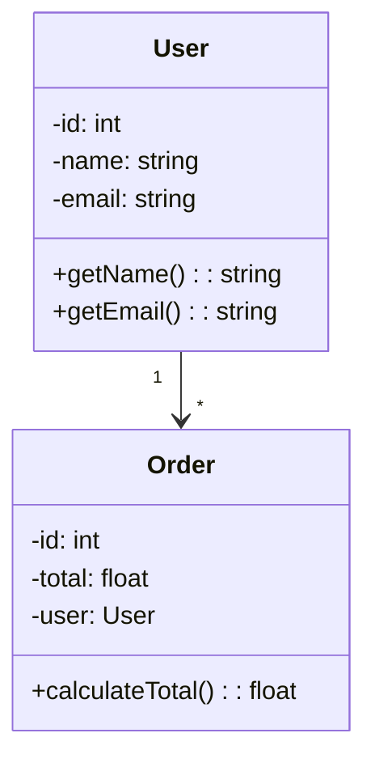

## 2. 基本的なクラス図

### クラスの表現

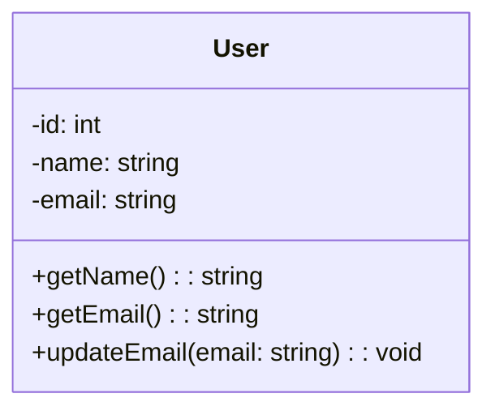

**記号の意味:**
- `-`: private（プライベート）
- `+`: public（パブリック）
- `#`: protected（プロテクト）
- `~`: package（パッケージ）

### 属性とメソッド

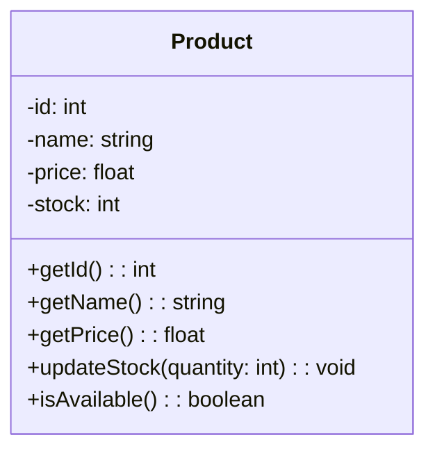

## 3. 関係性の表現

### 関連（Association）

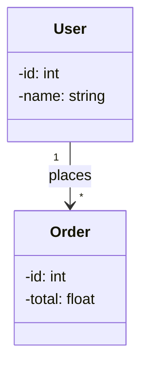

### 集約（Aggregation）

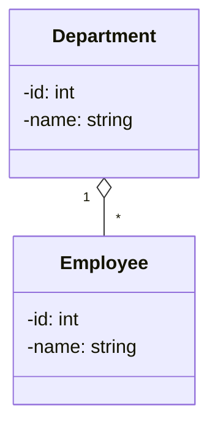

### コンポジション（Composition）

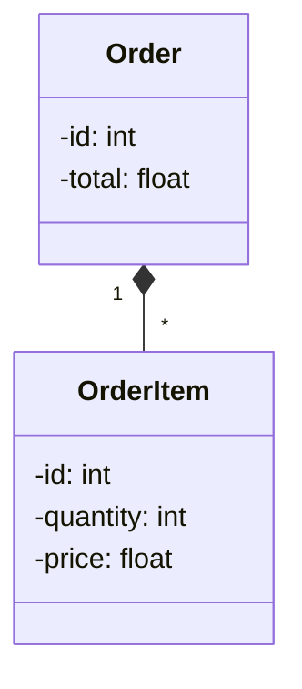

### 継承（Inheritance）

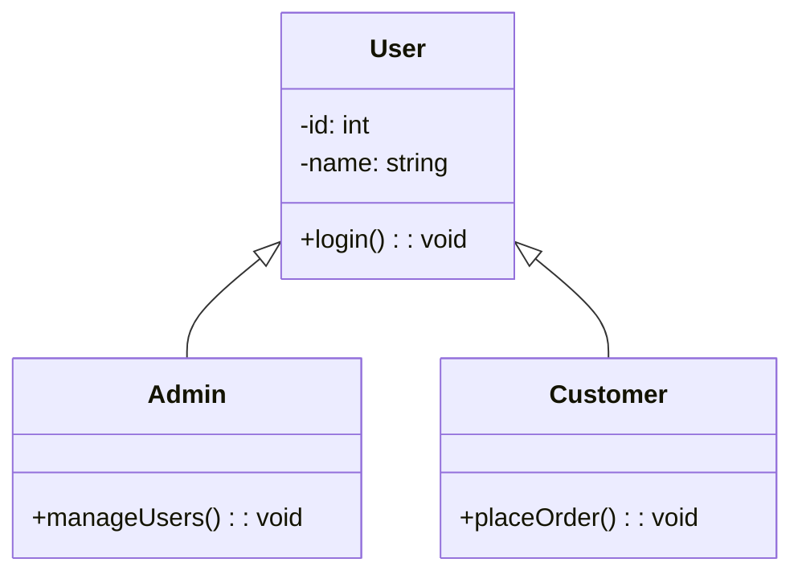

### 実装（Implementation）

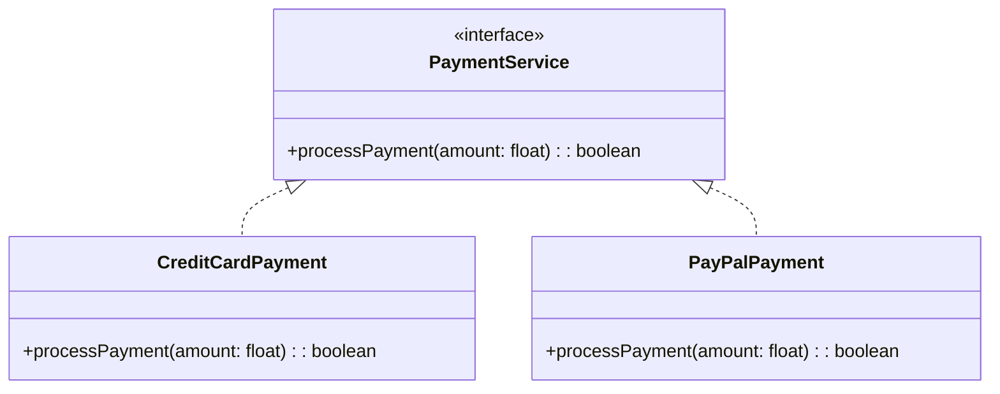

## 4. 実務でのベストプラクティス

### パターン1: ECサイトのクラス図

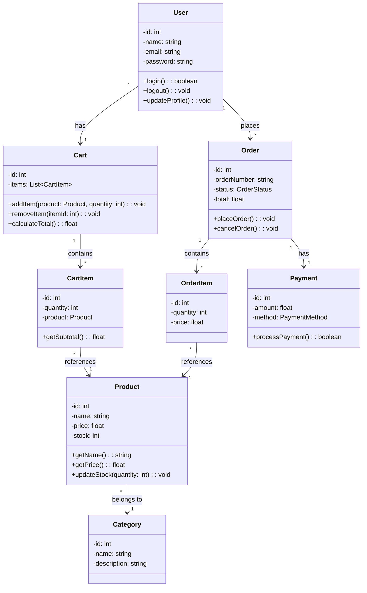

### パターン2: リポジトリパターンのクラス図

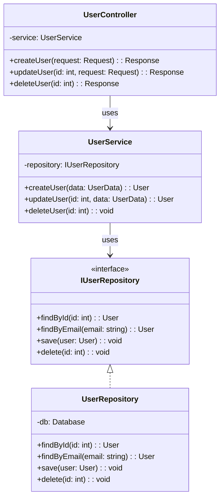

### パターン3: ファクトリーパターンのクラス図

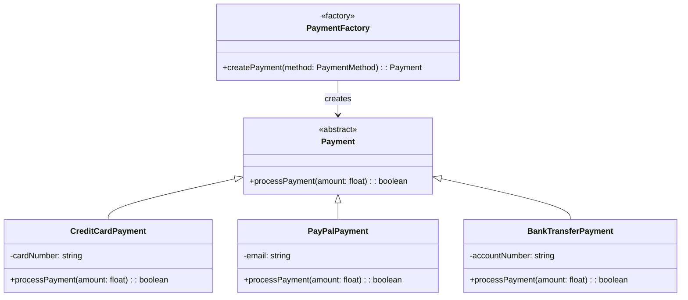

## 5. クラス図の作成手順

### ステップ1: 要件の分析

1. システムの要件を分析
2. 必要なクラスを特定
3. クラス間の関係を特定

### ステップ2: クラスの定義

1. クラス名を決定
2. 属性を定義
3. メソッドを定義

### ステップ3: 関係性の定義

1. 関連を定義
2. 継承を定義
3. 実装を定義

### ステップ4: 図の作成

1. MermaidやPlantUMLなどのツールを使用
2. 図を描画
3. レビューと修正

## 6. よくある問題と解決策

### 問題1: クラス図が複雑になりすぎる

**原因:**
- すべてのクラスを1つの図に含めている
- 関係性が多すぎる

**解決策:**
```mermaid
# パッケージごとに分割
classDiagram
    namespace UserManagement {
        class User
        class UserService
        class UserRepository
    }
    
    namespace OrderManagement {
        class Order
        class OrderService
        class OrderRepository
    }
```

### 問題2: 関係性が不明確

**原因:**
- 関連と集約の区別が不明確
- 多重度が不明確

**解決策:**
```mermaid
classDiagram
    class User {
        -id: int
    }
    
    class Order {
        -id: int
    }
    
    # 明確な多重度と役割名
    User "1" --> "*" Order : places
    # 1人のユーザーが複数の注文を持つ
```

## 7. 実装例

### Pythonでの実装

```python
# Userクラス
class User:
    def __init__(self, id: int, name: str, email: str):
        self._id = id
        self._name = name
        self._email = email
    
    def get_name(self) -> str:
        return self._name
    
    def get_email(self) -> str:
        return self._email
    
    def update_email(self, email: str) -> None:
        self._email = email

# Orderクラス
class Order:
    def __init__(self, id: int, user: User):
        self._id = id
        self._user = user
        self._items = []
    
    def add_item(self, product: Product, quantity: int) -> None:
        item = OrderItem(product, quantity)
        self._items.append(item)
    
    def calculate_total(self) -> float:
        return sum(item.get_subtotal() for item in self._items)
```

### Javaでの実装

```java
// Userクラス
public class User {
    private int id;
    private String name;
    private String email;
    
    public User(int id, String name, String email) {
        this.id = id;
        this.name = name;
        this.email = email;
    }
    
    public String getName() {
        return name;
    }
    
    public String getEmail() {
        return email;
    }
    
    public void updateEmail(String email) {
        this.email = email;
    }
}

// Orderクラス
public class Order {
    private int id;
    private User user;
    private List<OrderItem> items;
    
    public Order(int id, User user) {
        this.id = id;
        this.user = user;
        this.items = new ArrayList<>();
    }
    
    public void addItem(Product product, int quantity) {
        OrderItem item = new OrderItem(product, quantity);
        items.add(item);
    }
    
    public double calculateTotal() {
        return items.stream()
            .mapToDouble(OrderItem::getSubtotal)
            .sum();
    }
}
```

これで、クラス図の基礎知識と実務での使い方を理解できるようになりました。


