# シーケンス図完全ガイド

シーケンス図を使用したシステム設計を、実務で使える実装例とともに詳しく解説します。

## 1. シーケンス図とは

### シーケンス図の役割

シーケンス図は、システムの動的な動作を時系列で表現するUML図の一つです。オブジェクト間のメッセージのやり取りを視覚的に表現します。

```
シーケンス図の要素
   ├─ ライフライン（Lifeline）
   ├─ メッセージ（Message）
   ├─ アクティベーション（Activation）
   └─ フレーム（Frame）
```

### なぜシーケンス図が必要か

**問題のある構成（シーケンス図なし）:**

```python
# 問題: 処理の流れが不明確
def create_order(user_id, items):
    user = get_user(user_id)
    order = create_order(user)
    for item in items:
        add_item_to_order(order, item)
    process_payment(order)
    send_confirmation_email(user)

# 問題点:
# 1. 処理の順序が不明確
# 2. エラーハンドリングが不明確
# 3. 非同期処理が不明確
```

**解決: シーケンス図による明確な設計**

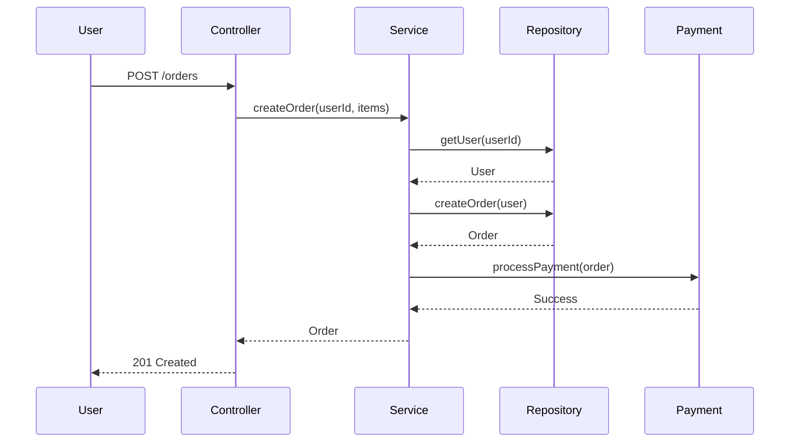

## 2. 基本的なシーケンス図

### ライフライン

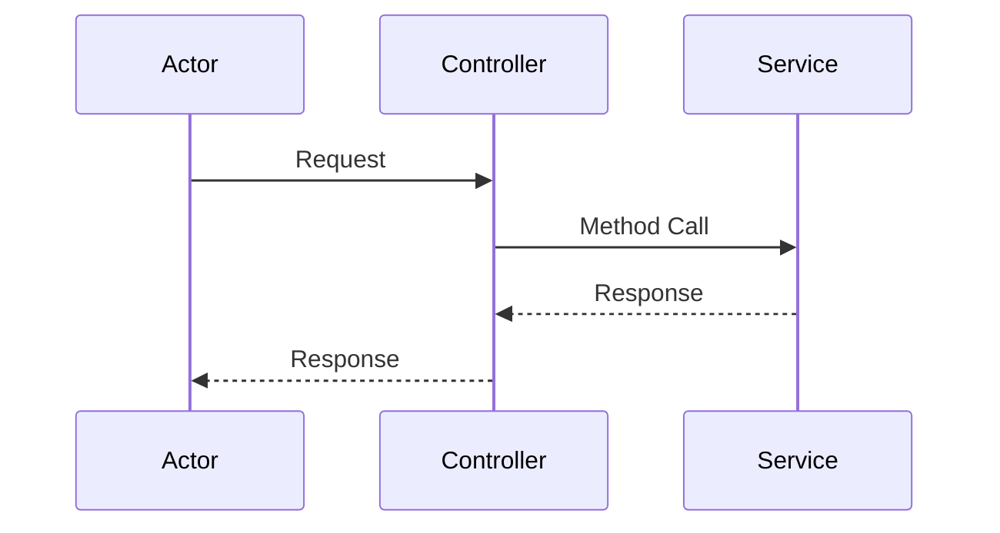

### メッセージの種類

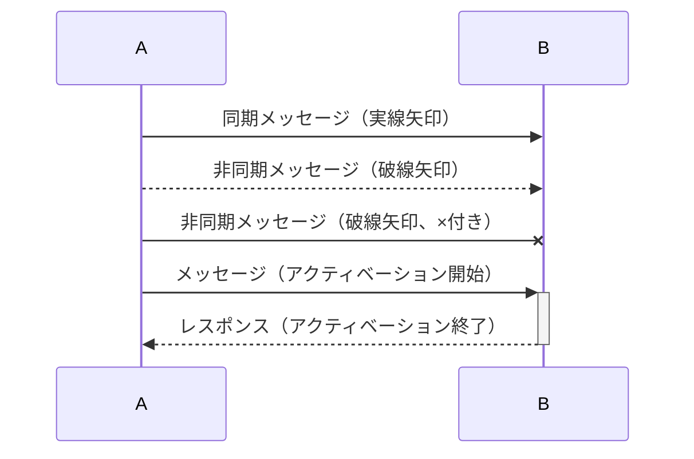

### アクティベーション

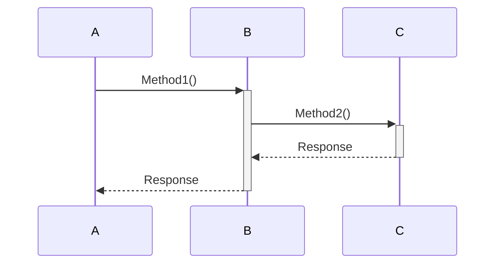

## 3. 実務でのベストプラクティス

### パターン1: ユーザー認証のシーケンス図

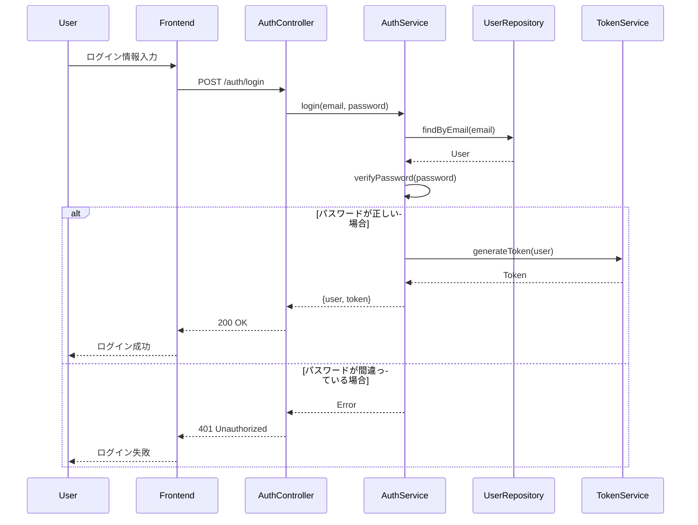

### パターン2: 注文作成のシーケンス図

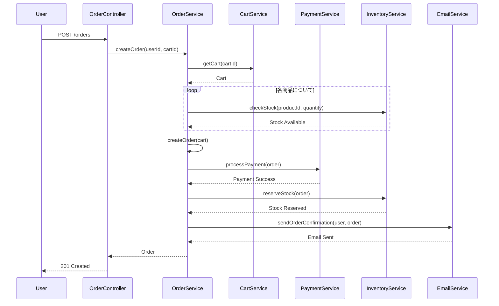

### パターン3: エラーハンドリングのシーケンス図

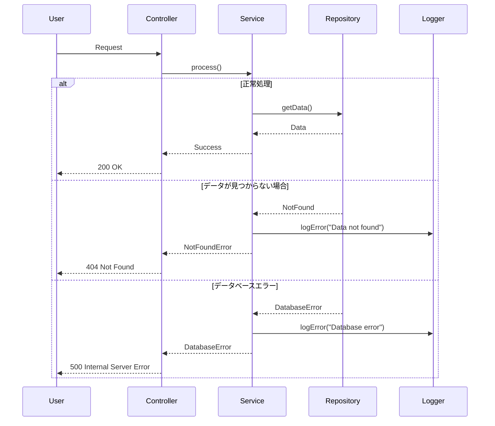

### パターン4: 非同期処理のシーケンス図

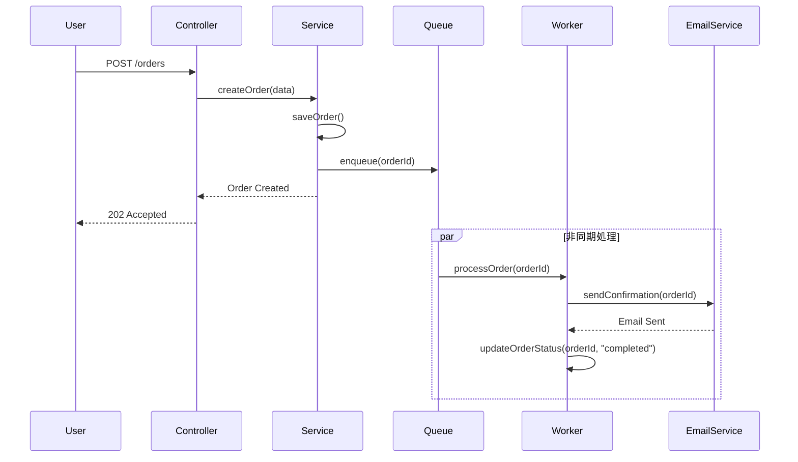

## 4. ループと条件分岐

### ループ

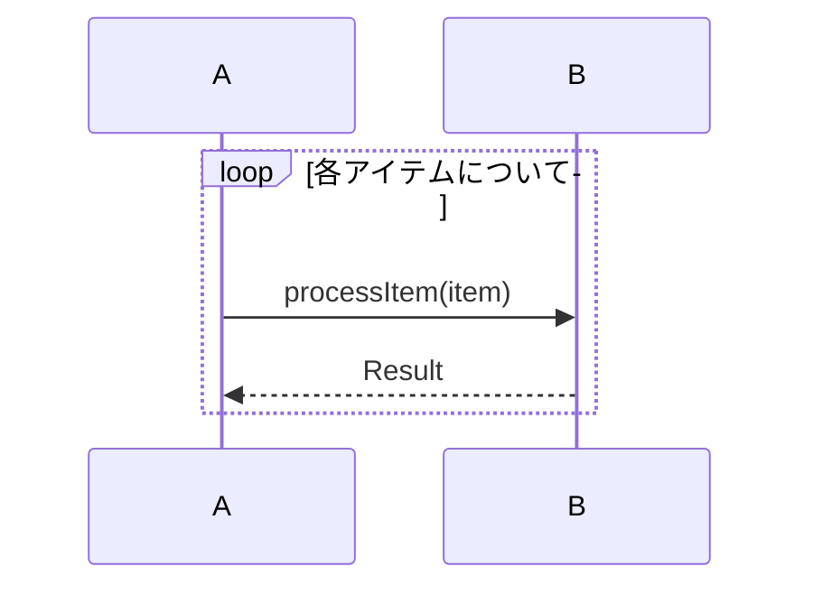

### 条件分岐（alt）

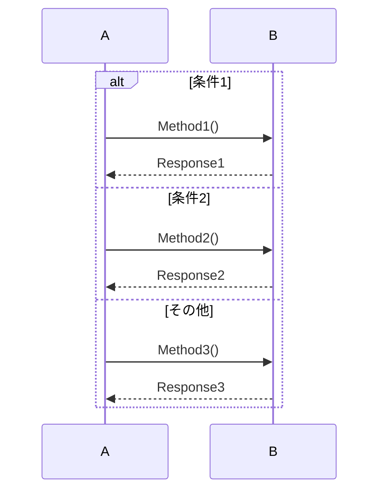

### オプション（opt）

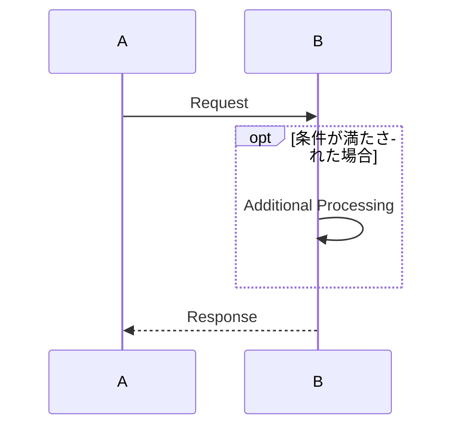

### 並列処理（par）

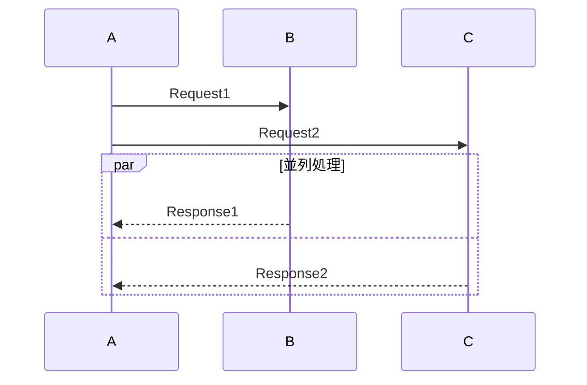

## 5. フレームの使用

### フレームの種類

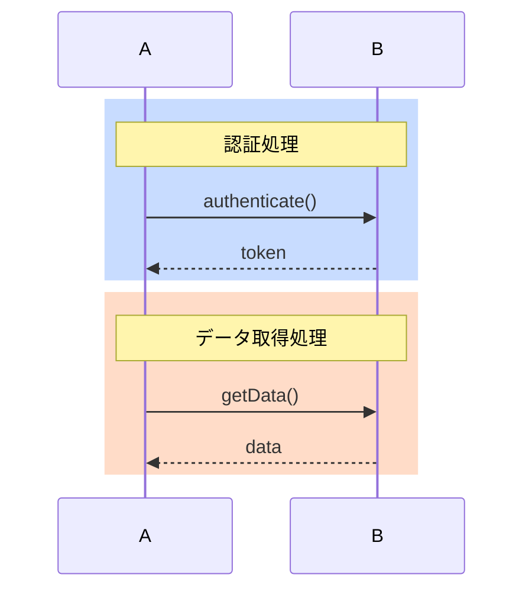

## 6. 実装例

### Pythonでの実装

```python
# 注文作成の実装
class OrderController:
    def __init__(self, order_service: OrderService):
        self.order_service = order_service
    
    def create_order(self, user_id: int, cart_id: int):
        try:
            order = self.order_service.create_order(user_id, cart_id)
            return {"status": "success", "order": order}, 201
        except Exception as e:
            return {"status": "error", "message": str(e)}, 500

class OrderService:
    def __init__(self, cart_service, payment_service, inventory_service):
        self.cart_service = cart_service
        self.payment_service = payment_service
        self.inventory_service = inventory_service
    
    def create_order(self, user_id: int, cart_id: int):
        # カートの取得
        cart = self.cart_service.get_cart(cart_id)
        
        # 在庫確認
        for item in cart.items:
            if not self.inventory_service.check_stock(item.product_id, item.quantity):
                raise ValueError("Insufficient stock")
        
        # 注文の作成
        order = Order(user_id=user_id, items=cart.items)
        
        # 支払い処理
        payment_result = self.payment_service.process_payment(order)
        if not payment_result:
            raise ValueError("Payment failed")
        
        # 在庫の確保
        self.inventory_service.reserve_stock(order)
        
        return order
```

### Javaでの実装

```java
// 注文作成の実装
@RestController
public class OrderController {
    private final OrderService orderService;
    
    public OrderController(OrderService orderService) {
        this.orderService = orderService;
    }
    
    @PostMapping("/orders")
    public ResponseEntity<OrderResponse> createOrder(
            @RequestBody CreateOrderRequest request) {
        try {
            Order order = orderService.createOrder(
                request.getUserId(), 
                request.getCartId()
            );
            return ResponseEntity.status(201).body(
                new OrderResponse(order)
            );
        } catch (Exception e) {
            return ResponseEntity.status(500).build();
        }
    }
}

@Service
public class OrderService {
    private final CartService cartService;
    private final PaymentService paymentService;
    private final InventoryService inventoryService;
    
    public Order createOrder(int userId, int cartId) {
        // カートの取得
        Cart cart = cartService.getCart(cartId);
        
        // 在庫確認
        for (CartItem item : cart.getItems()) {
            if (!inventoryService.checkStock(
                    item.getProductId(), 
                    item.getQuantity())) {
                throw new InsufficientStockException();
            }
        }
        
        // 注文の作成
        Order order = new Order(userId, cart.getItems());
        
        // 支払い処理
        boolean paymentResult = paymentService.processPayment(order);
        if (!paymentResult) {
            throw new PaymentFailedException();
        }
        
        // 在庫の確保
        inventoryService.reserveStock(order);
        
        return order;
    }
}
```

## 7. よくある問題と解決策

### 問題1: シーケンス図が複雑になりすぎる

**原因:**
- すべての処理を1つの図に含めている
- 詳細すぎる

**解決策:**
```mermaid
# 高レベルなシーケンス図
sequenceDiagram
    participant User
    participant System
    
    User->>System: Request
    System->>System: Process
    System-->>User: Response

# 詳細なシーケンス図（別の図として作成）
sequenceDiagram
    participant System
    participant Component1
    participant Component2
    
    System->>Component1: Method1()
    Component1->>Component2: Method2()
    Component2-->>Component1: Response
    Component1-->>System: Response
```

### 問題2: 非同期処理の表現が不明確

**原因:**
- 同期と非同期の区別が不明確
- コールバックの表現が不明確

**解決策:**
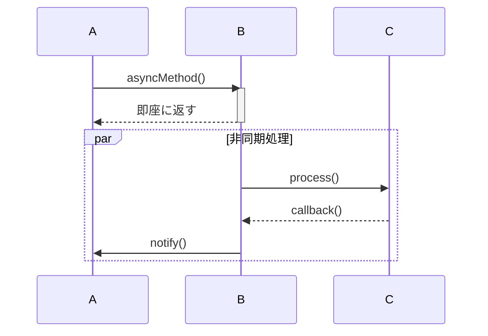

これで、シーケンス図の基礎知識と実務での使い方を理解できるようになりました。


