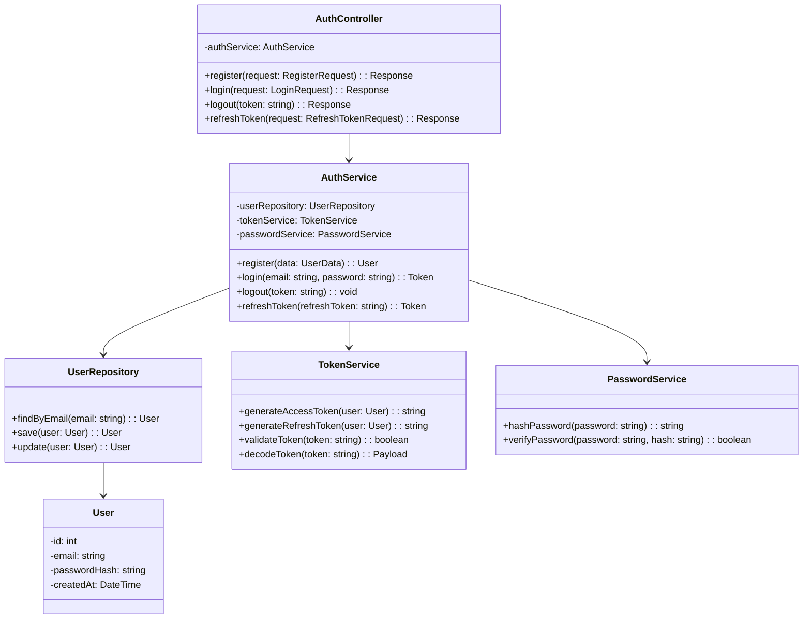
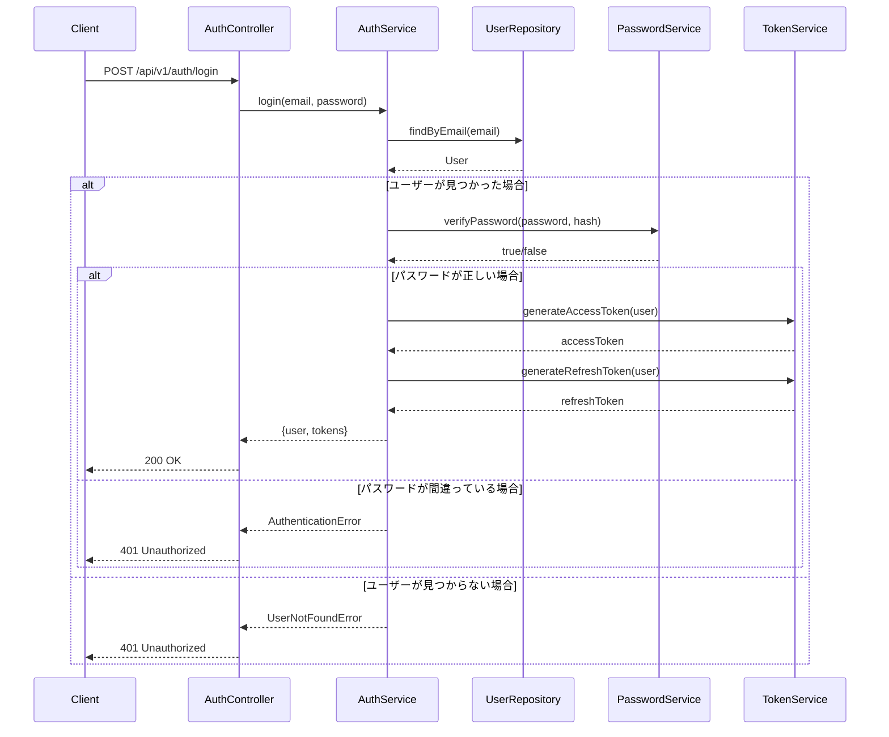
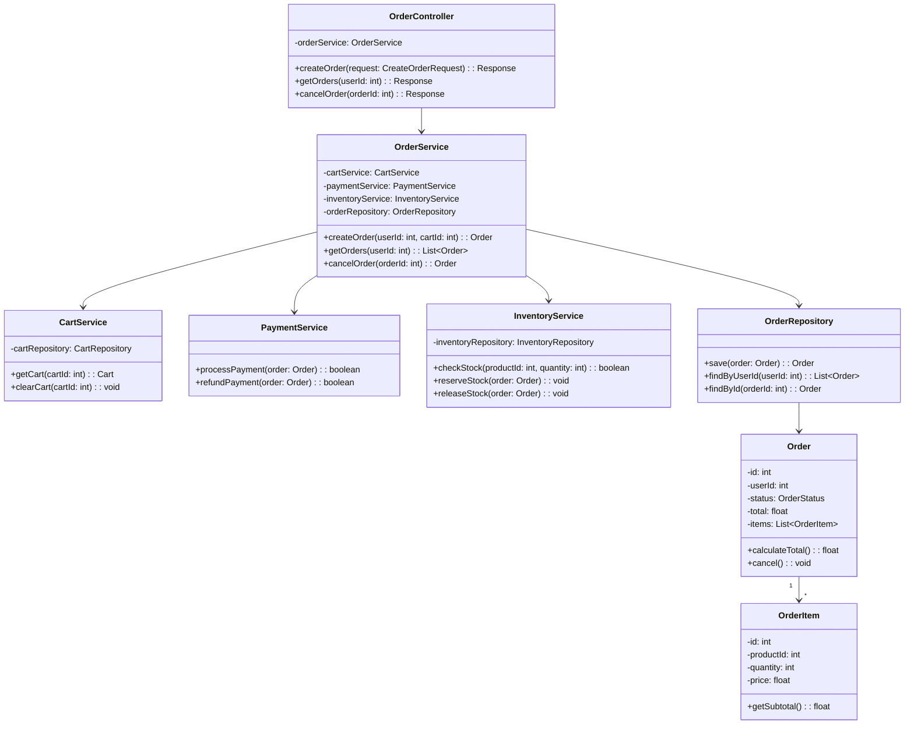
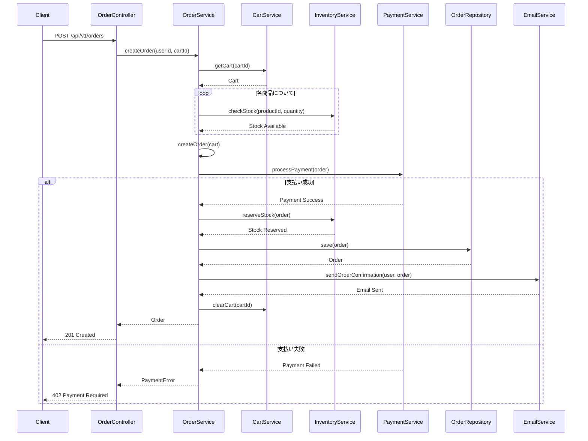

## API設計の実践例

実際のシステムを例に、API設計の実践的なユースケースを説明します。

### ユースケース1: ユーザー認証システム

#### 要件

- ユーザー登録
- ログイン
- ログアウト
- トークンリフレッシュ
- パスワードリセット

#### API設計

```javascript
// ユーザー登録
POST /api/v1/auth/register
Request Body:
{
  "username": "john_doe",
  "email": "john@example.com",
  "password": "password123",
  "password_confirmation": "password123"
}

Response (201 Created):
{
  "data": {
    "id": 1,
    "username": "john_doe",
    "email": "john@example.com",
    "created_at": "2024-01-01T00:00:00Z"
  },
  "token": {
    "access_token": "eyJhbGciOiJIUzI1NiIsInR5cCI6IkpXVCJ9...",
    "refresh_token": "eyJhbGciOiJIUzI1NiIsInR5cCI6IkpXVCJ9...",
    "expires_in": 3600
  }
}

// ログイン
POST /api/v1/auth/login
Request Body:
{
  "email": "john@example.com",
  "password": "password123"
}

Response (200 OK):
{
  "data": {
    "id": 1,
    "username": "john_doe",
    "email": "john@example.com"
  },
  "token": {
    "access_token": "eyJhbGciOiJIUzI1NiIsInR5cCI6IkpXVCJ9...",
    "refresh_token": "eyJhbGciOiJIUzI1NiIsInR5cCI6IkpXVCJ9...",
    "expires_in": 3600
  }
}

// ログアウト
POST /api/v1/auth/logout
Headers:
  Authorization: Bearer <access_token>

Response (200 OK):
{
  "message": "Logged out successfully"
}

// トークンリフレッシュ
POST /api/v1/auth/refresh
Request Body:
{
  "refresh_token": "eyJhbGciOiJIUzI1NiIsInR5cCI6IkpXVCJ9..."
}

Response (200 OK):
{
  "token": {
    "access_token": "eyJhbGciOiJIUzI1NiIsInR5cCI6IkpXVCJ9...",
    "refresh_token": "eyJhbGciOiJIUzI1NiIsInR5cCI6IkpXVCJ9...",
    "expires_in": 3600
  }
}

// パスワードリセットリクエスト
POST /api/v1/auth/password/reset-request
Request Body:
{
  "email": "john@example.com"
}

Response (200 OK):
{
  "message": "Password reset email sent"
}

// パスワードリセット
POST /api/v1/auth/password/reset
Request Body:
{
  "token": "reset_token_from_email",
  "email": "john@example.com",
  "password": "newpassword123",
  "password_confirmation": "newpassword123"
}

Response (200 OK):
{
  "message": "Password reset successfully"
}
```

#### エラーハンドリング

```javascript
// バリデーションエラー
POST /api/v1/auth/register
Request Body:
{
  "username": "",
  "email": "invalid-email",
  "password": "123"
}

Response (400 Bad Request):
{
  "error": {
    "code": "VALIDATION_ERROR",
    "message": "Validation failed",
    "details": [
      {
        "field": "username",
        "message": "Username is required"
      },
      {
        "field": "email",
        "message": "Invalid email format"
      },
      {
        "field": "password",
        "message": "Password must be at least 8 characters"
      }
    ]
  }
}

// 認証エラー
POST /api/v1/auth/login
Request Body:
{
  "email": "john@example.com",
  "password": "wrongpassword"
}

Response (401 Unauthorized):
{
  "error": {
    "code": "AUTHENTICATION_FAILED",
    "message": "Invalid email or password"
  }
}

// トークン期限切れ
GET /api/v1/users/me
Headers:
  Authorization: Bearer <expired_token>

Response (401 Unauthorized):
{
  "error": {
    "code": "TOKEN_EXPIRED",
    "message": "Token has expired",
    "refresh_url": "/api/v1/auth/refresh"
  }
}
```

### ユースケース2: 商品検索・フィルタリングシステム

#### 要件

- 商品一覧取得（ページネーション）
- 商品検索
- カテゴリフィルタリング
- 価格範囲フィルタリング
- ソート機能

#### API設計

```javascript
// 商品一覧取得（基本）
GET /api/v1/products?page=1&limit=20

Response (200 OK):
{
  "data": [
    {
      "id": 1,
      "name": "Laptop",
      "price": 999.99,
      "category": {
        "id": 1,
        "name": "Electronics"
      },
      "stock_quantity": 10,
      "created_at": "2024-01-01T00:00:00Z"
    }
  ],
  "pagination": {
    "page": 1,
    "limit": 20,
    "total": 100,
    "totalPages": 5,
    "hasNext": true,
    "hasPrev": false
  }
}

// 商品検索
GET /api/v1/products/search?q=laptop&page=1&limit=20

Response (200 OK):
{
  "data": [...],
  "pagination": {...},
  "search": {
    "query": "laptop",
    "results_count": 15
  }
}

// カテゴリフィルタリング
GET /api/v1/products?category=electronics&page=1&limit=20

// 価格範囲フィルタリング
GET /api/v1/products?min_price=100&max_price=1000&page=1&limit=20

// 複合フィルタリング
GET /api/v1/products?category=electronics&min_price=100&max_price=1000&sort=price&order=asc&page=1&limit=20

Response (200 OK):
{
  "data": [...],
  "pagination": {...},
  "filters": {
    "category": "electronics",
    "price_range": {
      "min": 100,
      "max": 1000
    },
    "sort": {
      "field": "price",
      "order": "asc"
    }
  }
}
```

#### 実装例

```javascript
// バックエンド実装（Node.js/Express）
app.get('/api/v1/products', async (req, res) => {
  try {
    const {
      page = 1,
      limit = 20,
      category,
      min_price,
      max_price,
      sort = 'created_at',
      order = 'desc',
      search
    } = req.query;
    
    // クエリビルダー
    let query = db('products')
      .leftJoin('categories', 'products.category_id', 'categories.id')
      .select('products.*', 'categories.name as category_name');
    
    // フィルタリング
    if (category) {
      query = query.where('categories.name', category);
    }
    
    if (min_price) {
      query = query.where('products.price', '>=', min_price);
    }
    
    if (max_price) {
      query = query.where('products.price', '<=', max_price);
    }
    
    if (search) {
      query = query.where(function() {
        this.where('products.name', 'like', `%${search}%`)
            .orWhere('products.description', 'like', `%${search}%`);
      });
    }
    
    // ソート
    query = query.orderBy(`products.${sort}`, order);
    
    // ページネーション
    const offset = (page - 1) * limit;
    const total = await query.clone().count('* as count').first();
    const products = await query.limit(limit).offset(offset);
    
    res.json({
      data: products,
      pagination: {
        page: parseInt(page),
        limit: parseInt(limit),
        total: total.count,
        totalPages: Math.ceil(total.count / limit),
        hasNext: page < Math.ceil(total.count / limit),
        hasPrev: page > 1
      }
    });
  } catch (error) {
    res.status(500).json({
      error: {
        code: 'INTERNAL_SERVER_ERROR',
        message: 'An error occurred while fetching products'
      }
    });
  }
});
```

### ユースケース3: 注文管理システム

#### 要件

- カートへの商品追加
- カート内容の取得
- 注文の作成
- 注文履歴の取得
- 注文のキャンセル

#### API設計

```javascript
// カートに商品を追加
POST /api/v1/cart/items
Headers:
  Authorization: Bearer <token>
Request Body:
{
  "product_id": 1,
  "quantity": 2
}

Response (201 Created):
{
  "data": {
    "id": 1,
    "product": {
      "id": 1,
      "name": "Laptop",
      "price": 999.99
    },
    "quantity": 2,
    "subtotal": 1999.98
  },
  "cart": {
    "total_items": 2,
    "total_amount": 1999.98
  }
}

// カート内容の取得
GET /api/v1/cart
Headers:
  Authorization: Bearer <token>

Response (200 OK):
{
  "data": {
    "items": [
      {
        "id": 1,
        "product": {
          "id": 1,
          "name": "Laptop",
          "price": 999.99
        },
        "quantity": 2,
        "subtotal": 1999.98
      }
    ],
    "summary": {
      "total_items": 2,
      "subtotal": 1999.98,
      "tax": 199.98,
      "shipping": 0,
      "total": 2199.96
    }
  }
}

// 注文の作成
POST /api/v1/orders
Headers:
  Authorization: Bearer <token>
Request Body:
{
  "shipping_address": {
    "name": "John Doe",
    "street": "123 Main St",
    "city": "Tokyo",
    "postal_code": "123-4567",
    "country": "Japan"
  },
  "payment_method": "credit_card",
  "payment_details": {
    "card_number": "**** **** **** 1234",
    "expiry_date": "12/25"
  }
}

Response (201 Created):
{
  "data": {
    "id": 1,
    "order_number": "ORD-2024-0001",
    "status": "pending",
    "items": [
      {
        "product_id": 1,
        "name": "Laptop",
        "quantity": 2,
        "price": 999.99,
        "subtotal": 1999.98
      }
    ],
    "shipping_address": {...},
    "total_amount": 2199.96,
    "created_at": "2024-01-01T00:00:00Z"
  }
}

// 注文履歴の取得
GET /api/v1/orders?page=1&limit=20&status=completed
Headers:
  Authorization: Bearer <token>

Response (200 OK):
{
  "data": [
    {
      "id": 1,
      "order_number": "ORD-2024-0001",
      "status": "completed",
      "total_amount": 2199.96,
      "created_at": "2024-01-01T00:00:00Z"
    }
  ],
  "pagination": {...}
}

// 注文のキャンセル
PUT /api/v1/orders/1/cancel
Headers:
  Authorization: Bearer <token>

Response (200 OK):
{
  "data": {
    "id": 1,
    "order_number": "ORD-2024-0001",
    "status": "cancelled",
    "cancelled_at": "2024-01-01T01:00:00Z"
  }
}
```

### ユースケース4: ファイルアップロードシステム

#### 要件

- ファイルアップロード
- アップロード進捗の確認
- ファイル一覧の取得
- ファイルの削除

#### API設計

```javascript
// ファイルアップロード（マルチパート）
POST /api/v1/files/upload
Headers:
  Authorization: Bearer <token>
  Content-Type: multipart/form-data
Request Body:
  file: <file>
  folder: "documents" (optional)

Response (201 Created):
{
  "data": {
    "id": 1,
    "filename": "document.pdf",
    "original_filename": "document.pdf",
    "size": 1024000,
    "mime_type": "application/pdf",
    "url": "https://cdn.example.com/files/document.pdf",
    "uploaded_at": "2024-01-01T00:00:00Z"
  }
}

// アップロード進捗の確認（チャンクアップロード）
POST /api/v1/files/upload/chunk
Headers:
  Authorization: Bearer <token>
Request Body:
{
  "upload_id": "upload_123",
  "chunk_number": 1,
  "total_chunks": 10,
  "chunk_data": "<base64_encoded_data>"
}

Response (200 OK):
{
  "upload_id": "upload_123",
  "chunk_number": 1,
  "total_chunks": 10,
  "progress": 10,
  "status": "uploading"
}

// チャンクアップロードの完了
POST /api/v1/files/upload/complete
Headers:
  Authorization: Bearer <token>
Request Body:
{
  "upload_id": "upload_123",
  "filename": "large_file.zip"
}

Response (201 Created):
{
  "data": {
    "id": 1,
    "filename": "large_file.zip",
    "size": 10485760,
    "url": "https://cdn.example.com/files/large_file.zip"
  }
}

// ファイル一覧の取得
GET /api/v1/files?folder=documents&page=1&limit=20
Headers:
  Authorization: Bearer <token>

Response (200 OK):
{
  "data": [
    {
      "id": 1,
      "filename": "document.pdf",
      "size": 1024000,
      "mime_type": "application/pdf",
      "url": "https://cdn.example.com/files/document.pdf",
      "uploaded_at": "2024-01-01T00:00:00Z"
    }
  ],
  "pagination": {...}
}

// ファイルの削除
DELETE /api/v1/files/1
Headers:
  Authorization: Bearer <token>

Response (204 No Content)
```

### ユースケース1のクラス図とシーケンス図

#### クラス図



#### シーケンス図（ログイン処理）



### ユースケース3のクラス図とシーケンス図

#### クラス図



#### シーケンス図（注文作成処理）



### まとめ

API設計の実践例：

1. **ユーザー認証システム**: 登録、ログイン、ログアウト、トークンリフレッシュ、パスワードリセット
2. **商品検索・フィルタリングシステム**: 検索、フィルタリング、ソート、ページネーション
3. **注文管理システム**: カート、注文作成、注文履歴、キャンセル
4. **ファイルアップロードシステム**: アップロード、進捗確認、一覧取得、削除

これらの実践例を参考に、実際のAPIを設計できます。クラス図とシーケンス図を使用することで、システムの静的構造と動的な動作を明確に表現できます。

