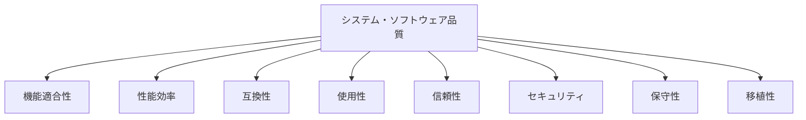

# ISO規格に基づく非機能要件完全ガイド

ISO規格に基づいた非機能要件の定義方法を、実務で使える実装例とベストプラクティスとともに詳しく解説します。

## 1. ISO規格とは

### 関連するISO規格

非機能要件に関連する主要なISO規格は以下の通りです。

```
関連するISO規格
   ├─ ISO/IEC 25010: システム・ソフトウェア品質モデル
   ├─ ISO/IEC 27001: 情報セキュリティ管理システム
   ├─ ISO/IEC 29119: ソフトウェアテスト
   ├─ ISO/IEC 12207: ソフトウェアライフサイクルプロセス
   └─ ISO/IEC 9126: ソフトウェア品質モデル（旧規格）
```

### なぜISO規格に基づくのか

**問題のある構成（ISO規格なし）:**

```
問題のある状況:
- 非機能要件の定義が曖昧
- 品質特性の体系的な整理ができていない
- 測定可能な指標が定義されていない
- 国際標準との整合性がない

影響:
- 品質の評価が困難
- ステークホルダー間の認識のズレ
- 測定・検証ができない
- 国際的なプロジェクトでの不整合
```

**解決: ISO規格による体系的な定義**

```
解決策:
- ISO/IEC 25010に基づく品質特性の定義
- 測定可能な指標の設定
- 国際標準との整合性確保

メリット:
- 品質の体系的な評価が可能
- ステークホルダー間の認識の統一
- 測定・検証が可能
- 国際的なプロジェクトでの整合性
```

## 2. ISO/IEC 25010: システム・ソフトウェア品質モデル

### ISO/IEC 25010の品質特性

ISO/IEC 25010は、システム・ソフトウェアの品質を8つの品質特性に分類しています。



### 品質特性の詳細

#### 1. 機能適合性（Functional Suitability）

**定義:**
システムが指定された機能を提供する能力

**品質副特性:**
- **機能完全性**: 必要な機能がすべて実装されているか
- **機能正確性**: 機能が正確に動作するか
- **機能適切性**: 機能が適切に設計されているか

**非機能要件の例:**

```markdown
## 機能適合性の非機能要件

### 機能完全性
- すべての要件定義書に記載された機能が実装されている
- 機能の実装率: 100%
- 未実装機能: 0件

### 機能正確性
- 機能の動作が仕様書通りである
- バグ発生率: 0.1%以下
- 機能テストの合格率: 100%

### 機能適切性
- 機能がユーザーのニーズに適合している
- ユーザー満足度: 4.0/5.0以上
- 機能の使用率: 80%以上
```

#### 2. 性能効率（Performance Efficiency）

**定義:**
システムが指定された条件下で、使用するリソースに対して適切な性能を提供する能力

**品質副特性:**
- **時間効率**: レスポンスタイム、スループット
- **リソース効率**: CPU、メモリ、ディスクの使用率
- **容量**: 同時接続数、データ量

**非機能要件の例:**

```markdown
## 性能効率の非機能要件

### 時間効率
- ページの読み込み時間: 3秒以内
- APIのレスポンスタイム: 500ms以内（95パーセンタイル）
- データベースクエリの実行時間: 100ms以内
- スループット: 1000リクエスト/秒

### リソース効率
- CPU使用率: 平均70%以下
- メモリ使用率: 平均80%以下
- ディスクI/O: 平均50%以下
- ネットワーク帯域幅: 平均60%以下

### 容量
- 同時接続数: 10,000ユーザー
- データベース容量: 1TB
- ファイルストレージ: 100GB
- ログ保持期間: 90日
```

#### 3. 互換性（Compatibility）

**定義:**
システムが他のシステムと情報を交換し、共有リソースを使用する能力

**品質副特性:**
- **共存性**: 他のシステムと共存できるか
- **相互運用性**: 他のシステムと情報を交換できるか

**非機能要件の例:**

```markdown
## 互換性の非機能要件

### 共存性
- 他のアプリケーションと競合しない
- リソースの競合: 0件
- システムの安定性: 99.9%以上

### 相互運用性
- REST APIによる情報交換が可能
- APIの互換性: 後方互換性を維持
- データフォーマット: JSON、XML、CSVに対応
- プロトコル: HTTP/1.1、HTTP/2、WebSocketに対応
```

#### 4. 使用性（Usability）

**定義:**
システムが指定されたユーザーによって使用され、理解され、学習され、魅力的である能力

**品質副特性:**
- **認識性**: ユーザーが機能を認識できるか
- **学習性**: ユーザーが学習しやすいか
- **運用性**: ユーザーが操作しやすいか
- **ユーザーエラー防止**: ユーザーエラーを防げるか
- **ユーザーインターフェースの美的品質**: UIが魅力的か
- **アクセシビリティ**: 様々なユーザーが利用できるか

**非機能要件の例:**

```markdown
## 使用性の非機能要件

### 認識性
- 機能の見つけやすさ: 3クリック以内
- エラーメッセージの明確性: ユーザーが理解できる
- ヘルプの充実度: すべての機能にヘルプを提供

### 学習性
- 新規ユーザーの習熟時間: 30分以内
- チュートリアルの完了率: 80%以上
- ヘルプドキュメントの充実度: 100%

### 運用性
- 操作の簡素化: クリック数を最小化
- ショートカットキーの提供: 主要機能にショートカットを提供
- 一貫性のあるUI: デザインシステムに準拠

### ユーザーエラー防止
- 入力バリデーション: リアルタイムでバリデーション
- 確認ダイアログ: 重要な操作に確認を要求
- エラーメッセージ: 明確で対処方法が分かる

### ユーザーインターフェースの美的品質
- デザインシステムへの準拠: 100%
- ブランドガイドラインへの準拠: 100%
- ユーザー満足度: 4.0/5.0以上

### アクセシビリティ
- WCAG 2.1 レベルAAに準拠
- キーボード操作が可能
- スクリーンリーダーに対応
- 色覚異常者への配慮
```

#### 5. 信頼性（Reliability）

**定義:**
システムが指定された条件下で、指定された期間中に指定された機能を実行する能力

**品質副特性:**
- **成熟性**: システムが安定しているか
- **可用性**: システムが利用可能か
- **障害許容性**: 障害が発生しても動作し続けられるか
- **回復性**: 障害から回復できるか

**非機能要件の例:**

```markdown
## 信頼性の非機能要件

### 成熟性
- 障害発生率: 月1回以下
- システムの安定性: 99.9%以上
- バグ発生率: 0.1%以下

### 可用性
- 稼働率: 99.9%（年間ダウンタイム: 8.76時間以下）
- 計画メンテナンス時間: 月4時間以内
- 緊急メンテナンス時間: 年24時間以内

### 障害許容性
- 単一障害点の排除: すべてのコンポーネントを冗長化
- 自動フェイルオーバー: 30秒以内
- データの整合性: 100%

### 回復性
- RTO（目標復旧時間）: 1時間以内
- RPO（目標復旧時点）: 15分以内
- バックアップの頻度: 日次
- バックアップの保持期間: 30日
```

#### 6. セキュリティ（Security）

**定義:**
システムが情報とデータを保護し、認可されたユーザーにのみアクセスを許可する能力

**品質副特性:**
- **機密性**: 情報が漏洩しないか
- **完全性**: 情報が改ざんされないか
- **真正性**: 情報が本物であるか
- **責任追跡性**: 操作を追跡できるか
- **否認防止**: 操作の否認を防げるか
- **説明責任**: 操作の責任を明確にできるか

**非機能要件の例:**

```markdown
## セキュリティの非機能要件

### 機密性
- データの暗号化: TLS 1.3以上
- 保存データの暗号化: AES-256
- アクセス制御: ロールベースアクセス制御（RBAC）
- 個人情報保護: 個人情報保護法に準拠

### 完全性
- データの改ざん検知: ハッシュ値による検証
- トランザクションの整合性: ACID特性を保証
- データベースの整合性: 制約による検証

### 真正性
- 認証: 多要素認証（MFA）の実装
- デジタル署名: 重要な操作にデジタル署名を要求
- 証明書の検証: 有効な証明書のみ受け入れ

### 責任追跡性
- 操作ログの記録: すべての操作を記録
- ログの保持期間: 90日
- ログの改ざん防止: 改ざん検知機能

### 否認防止
- デジタル署名: 重要な操作にデジタル署名を要求
- タイムスタンプ: すべての操作にタイムスタンプを付与
- 監査ログ: すべての操作を監査ログに記録

### 説明責任
- アクセスログ: すべてのアクセスを記録
- 操作ログ: すべての操作を記録
- 監査ログ: 監査可能な形式で記録
```

#### 7. 保守性（Maintainability）

**定義:**
システムが修正、更新、拡張できる能力

**品質副特性:**
- **モジュール性**: モジュール化されているか
- **再利用性**: 再利用できるか
- **解析性**: 解析しやすいか
- **変更性**: 変更しやすいか
- **試験性**: テストしやすいか

**非機能要件の例:**

```markdown
## 保守性の非機能要件

### モジュール性
- モジュールの独立性: 高い凝集度、低い結合度
- モジュールのサイズ: 1モジュールあたり500行以下
- モジュールの責任: 単一責任の原則に準拠

### 再利用性
- 共通コンポーネントの使用率: 80%以上
- ライブラリの活用: 標準ライブラリを優先
- コードの重複率: 5%以下

### 解析性
- コードの可読性: コメント率20%以上
- ドキュメントの充実度: すべてのAPIにドキュメント
- ログの充実度: すべての処理にログを記録

### 変更性
- 変更の影響範囲: 最小限に抑える
- 設定の外部化: 設定ファイルで管理
- 依存関係の管理: 明確な依存関係の定義

### 試験性
- コードカバレッジ: 80%以上
- 単体テストの実装率: 100%
- 統合テストの実装率: 80%以上
- テストの自動化率: 100%
```

#### 8. 移植性（Portability）

**定義:**
システムが異なる環境に移行できる能力

**品質副特性:**
- **適応性**: 環境に適応できるか
- **インストール性**: インストールしやすいか
- **置換性**: 他のシステムと置き換えられるか

**非機能要件の例:**

```markdown
## 移植性の非機能要件

### 適応性
- マルチプラットフォーム対応: Windows、macOS、Linux
- マルチブラウザ対応: Chrome、Firefox、Safari、Edge
- レスポンシブデザイン: モバイル、タブレット、デスクトップ

### インストール性
- インストール時間: 10分以内
- インストール手順の明確性: ドキュメントに記載
- 依存関係の自動解決: パッケージマネージャーを使用

### 置換性
- 標準プロトコルの使用: HTTP、HTTPS、WebSocket
- 標準データフォーマットの使用: JSON、XML、CSV
- APIの互換性: 後方互換性を維持
```

## 3. ISO/IEC 27001: 情報セキュリティ管理システム

### ISO/IEC 27001の概要

ISO/IEC 27001は、情報セキュリティ管理システム（ISMS）の要求事項を定義した規格です。

### 主要な管理策

#### 1. 情報セキュリティポリシー

```markdown
## 情報セキュリティポリシー

### 要件
- 情報セキュリティポリシーを文書化
- 経営層の承認を得る
- 定期的に見直し・更新

### 非機能要件の例
- 情報セキュリティポリシーの文書化: 必須
- ポリシーの見直し頻度: 年1回
- ポリシーの承認: 経営層による承認
```

#### 2. 組織の役割と責任

```markdown
## 組織の役割と責任

### 要件
- 情報セキュリティの役割と責任を明確化
- 責任者の任命
- 権限の委譲

### 非機能要件の例
- 情報セキュリティ責任者の任命: 必須
- 役割と責任の文書化: 必須
- 定期的な見直し: 年1回
```

#### 3. 人的資源のセキュリティ

```markdown
## 人的資源のセキュリティ

### 要件
- 採用前のセキュリティチェック
- 雇用期間中のセキュリティ管理
- 退職時のセキュリティ管理

### 非機能要件の例
- セキュリティ教育の実施: 年1回以上
- 機密保持契約の締結: 必須
- アクセス権限の管理: 定期的な見直し
```

#### 4. 資産管理

```markdown
## 資産管理

### 要件
- 資産の目録化
- 資産の責任者の明確化
- 資産の分類と保護

### 非機能要件の例
- 資産目録の作成: 必須
- 資産の分類: 機密性に基づく分類
- 資産の保護: 分類に応じた保護レベル
```

#### 5. アクセス制御

```markdown
## アクセス制御

### 要件
- アクセス制御ポリシーの策定
- ユーザーアクセス管理
- 特権アクセス管理
- 認証情報の管理

### 非機能要件の例
- アクセス制御ポリシーの策定: 必須
- 最小権限の原則: 必須
- 多要素認証: 重要なシステムに必須
- パスワードポリシー: 複雑さ、有効期限の設定
```

## 4. ISO/IEC 29119: ソフトウェアテスト

### ISO/IEC 29119の概要

ISO/IEC 29119は、ソフトウェアテストの標準規格です。

### テストプロセス

#### 1. テスト計画

```markdown
## テスト計画

### 要件
- テスト戦略の策定
- テストスコープの定義
- テストリソースの計画

### 非機能要件の例
- テスト計画の文書化: 必須
- テストスコープの明確化: 必須
- テストリソースの確保: 必須
```

#### 2. テスト設計

```markdown
## テスト設計

### 要件
- テストケースの設計
- テストデータの準備
- テスト環境の構築

### 非機能要件の例
- テストケースの文書化: 必須
- テストデータの準備: 必須
- テスト環境の構築: 必須
```

#### 3. テスト実行

```markdown
## テスト実行

### 要件
- テストケースの実行
- テスト結果の記録
- 欠陥の管理

### 非機能要件の例
- テスト実行の記録: 必須
- 欠陥の管理: 必須
- テスト結果の報告: 必須
```

## 5. 実務でのベストプラクティス

### パターン1: 非機能要件の定義テンプレート

```markdown
## 非機能要件定義テンプレート

### 品質特性: [品質特性名]
#### 品質副特性: [品質副特性名]
- **要件ID**: NFR-001
- **要件名**: [要件名]
- **説明**: [要件の説明]
- **測定方法**: [測定方法]
- **目標値**: [目標値]
- **測定頻度**: [測定頻度]
- **責任者**: [責任者]
- **関連ISO規格**: [ISO規格番号]

### 実装例

#### 品質特性: 性能効率
#### 品質副特性: 時間効率
- **要件ID**: NFR-001
- **要件名**: APIレスポンスタイム
- **説明**: APIのレスポンスタイムを500ms以内にする
- **測定方法**: 95パーセンタイルで測定
- **目標値**: 500ms以内
- **測定頻度**: 日次
- **責任者**: バックエンドエンジニア
- **関連ISO規格**: ISO/IEC 25010
```

### パターン2: 非機能要件の測定と検証

```markdown
## 非機能要件の測定と検証

### 測定方法
1. **パフォーマンステスト**: 負荷テスト、ストレステスト
2. **セキュリティテスト**: 脆弱性スキャン、ペネトレーションテスト
3. **可用性テスト**: 障害テスト、復旧テスト
4. **アクセシビリティテスト**: WCAG準拠テスト

### 検証方法
1. **自動テスト**: CI/CDパイプラインでの自動検証
2. **手動テスト**: 定期的な手動検証
3. **監視**: 本番環境での継続的な監視
4. **監査**: 定期的な監査の実施
```

### パターン3: ISO規格に基づくチェックリスト

```markdown
## ISO規格に基づく非機能要件チェックリスト

### ISO/IEC 25010に基づく品質特性
- [ ] 機能適合性: 機能完全性、機能正確性、機能適切性
- [ ] 性能効率: 時間効率、リソース効率、容量
- [ ] 互換性: 共存性、相互運用性
- [ ] 使用性: 認識性、学習性、運用性、ユーザーエラー防止、UIの美的品質、アクセシビリティ
- [ ] 信頼性: 成熟性、可用性、障害許容性、回復性
- [ ] セキュリティ: 機密性、完全性、真正性、責任追跡性、否認防止、説明責任
- [ ] 保守性: モジュール性、再利用性、解析性、変更性、試験性
- [ ] 移植性: 適応性、インストール性、置換性

### ISO/IEC 27001に基づくセキュリティ管理
- [ ] 情報セキュリティポリシーの策定
- [ ] 組織の役割と責任の明確化
- [ ] 人的資源のセキュリティ管理
- [ ] 資産管理
- [ ] アクセス制御

### ISO/IEC 29119に基づくテスト
- [ ] テスト計画の策定
- [ ] テスト設計の実施
- [ ] テスト実行の実施
```

## 6. よくある問題と解決策

### 問題1: 非機能要件が測定不可能

**原因:**
- 抽象的な表現のみ
- 測定方法が定義されていない

**解決策:**
```markdown
## 測定可能な非機能要件の定義

### 悪い例
- 「高速に動作する」
- 「セキュアである」
- 「使いやすい」

### 良い例
- 「APIのレスポンスタイムを500ms以内にする（95パーセンタイル）」
- 「OWASP Top 10の脆弱性が0件である」
- 「WCAG 2.1 レベルAAに準拠する」
```

### 問題2: ISO規格との整合性がない

**原因:**
- ISO規格を参照していない
- 独自の定義を使用している

**解決策:**
```markdown
## ISO規格との整合性確保

### 方法
1. ISO/IEC 25010の品質特性を参照
2. 各品質特性の副特性を明確化
3. 測定可能な指標を設定
4. 定期的な見直しと更新
```

### 問題3: 非機能要件の検証が不十分

**原因:**
- テストが実施されていない
- 測定が実施されていない

**解決策:**
```markdown
## 非機能要件の検証

### 方法
1. 自動テストの実装: CI/CDパイプラインでの自動検証
2. 定期的な測定: 日次、週次、月次での測定
3. 監視の実装: 本番環境での継続的な監視
4. 監査の実施: 定期的な監査の実施
```

これで、ISO規格に基づく非機能要件の定義方法を理解できるようになりました。

