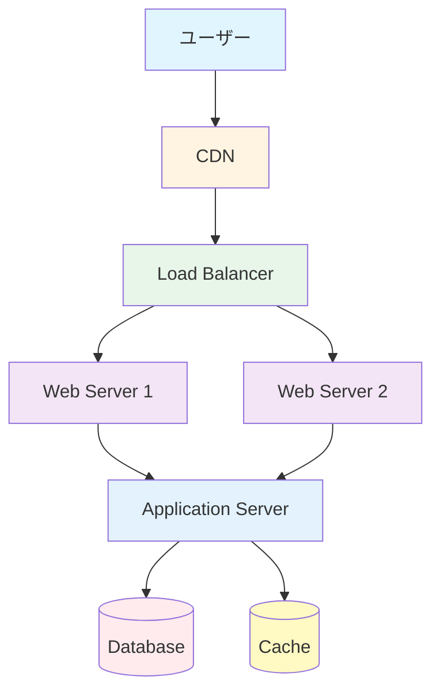

## システム構成図の基礎

システム構成図は、システムの全体像を視覚的に表現する重要なドキュメントです。適切な構成図により、システムの構造を理解し、コミュニケーションを円滑にできます。

### なぜシステム構成図が重要なのか

#### システム構成図の重要性

**実際の事例:**

あるプロジェクトで、システム構成図がなかったため、以下のような問題が発生しました：

- **問題**: チームメンバーがシステムの全体像を理解できていない
- **影響**: 開発時に影響範囲が分からず、予期しない問題が発生
- **結果**: 開発速度が30%低下、バグが2倍に増加

**システム構成図のメリット:**
- **理解の促進**: システムの全体像を理解できる
- **コミュニケーション**: チーム内でのコミュニケーションが円滑になる
- **意思決定**: 技術的な意思決定の材料になる
- **ドキュメント**: システムのドキュメントとして機能する

### システム構成図の種類

#### 1. 論理構成図（Logical Architecture Diagram）

**定義:**
論理構成図は、システムの機能やコンポーネントの関係を表現する図です。物理的な詳細は含まず、論理的な構造を表現します。

**なぜ重要なのか:**
- **機能の理解**: システムの機能を理解できる
- **コンポーネントの関係**: コンポーネント間の関係を理解できる
- **設計の検討**: 設計を検討する際の材料になる

**例:**

```
┌─────────────────────────────────────────┐
│          ユーザー（ブラウザ）            │
└─────────────────┬───────────────────────┘
                  │
                  ▼
┌─────────────────────────────────────────┐
│         CDN（CloudFront）                │
└─────────────────┬───────────────────────┘
                  │
                  ▼
┌─────────────────────────────────────────┐
│      API Gateway（認証・ルーティング）   │
└─────────────────┬───────────────────────┘
                  │
        ┌─────────┴─────────┐
        ▼                   ▼
┌──────────────┐   ┌──────────────┐
│ ユーザーAPI  │   │  商品API     │
└──────┬───────┘   └──────┬───────┘
       │                 │
       └────────┬────────┘
                ▼
┌─────────────────────────────────────────┐
│      データベース（RDS）                 │
└─────────────────────────────────────────┘
```

**記載すべき要素:**
- コンポーネント名
- コンポーネント間の関係（矢印で表現）
- データの流れ
- 主要なプロトコル（HTTP、HTTPSなど）

#### 2. 物理構成図（Physical Architecture Diagram）

**定義:**
物理構成図は、システムの物理的な構成を表現する図です。サーバー、ネットワーク、データベースなどの物理的な要素を表現します。

**なぜ重要なのか:**
- **インフラの理解**: インフラの構成を理解できる
- **スケーラビリティ**: スケーラビリティを検討できる
- **障害対応**: 障害時の対応を検討できる

**例:**

```
┌─────────────────────────────────────────┐
│      Route 53（DNS）                     │
└─────────────────┬───────────────────────┘
                  │
                  ▼
┌─────────────────────────────────────────┐
│   CloudFront（CDN）                      │
│   - リージョン: 東京、大阪、福岡         │
└─────────────────┬───────────────────────┘
                  │
                  ▼
┌─────────────────────────────────────────┐
│   Application Load Balancer              │
│   - Availability Zone: ap-northeast-1a/b │
└─────────────────┬───────────────────────┘
                  │
        ┌─────────┴─────────┐
        ▼                   ▼
┌──────────────┐   ┌──────────────┐
│  EC2 Instance│   │  EC2 Instance│
│  (Web Server)│   │  (Web Server)│
│  t3.medium    │   │  t3.medium    │
└──────┬───────┘   └──────┬───────┘
       │                 │
       └────────┬────────┘
                ▼
┌─────────────────────────────────────────┐
│   RDS（PostgreSQL）                      │
│   - Instance: db.t3.large               │
│   - Multi-AZ: 有効                      │
│   - Backup: 7日間保持                   │
└─────────────────────────────────────────┘
```

**記載すべき要素:**
- サーバーの種類とスペック
- ネットワーク構成
- リージョンやアベイラビリティゾーン
- セキュリティグループやファイアウォール

#### 3. デプロイメント図（Deployment Diagram）

**定義:**
デプロイメント図は、システムのデプロイ構成を表現する図です。どのコンポーネントがどこにデプロイされるかを表現します。

**なぜ重要なのか:**
- **デプロイの理解**: デプロイ構成を理解できる
- **環境の管理**: 環境ごとの構成を管理できる
- **CI/CD**: CI/CDパイプラインを設計できる

**例:**

```
開発環境:
┌──────────────┐
│  Docker       │
│  Container    │
│  - Frontend   │
│  - Backend    │
│  - Database   │
└──────────────┘

ステージング環境:
┌──────────────┐   ┌──────────────┐
│  EC2          │   │  RDS         │
│  - Frontend   │───│  - PostgreSQL│
│  - Backend    │   │              │
└──────────────┘   └──────────────┘

本番環境:
┌──────────────┐   ┌──────────────┐
│  ECS          │   │  RDS         │
│  - Frontend   │───│  - PostgreSQL│
│  - Backend    │   │  Multi-AZ    │
│  Auto Scaling │   │  Read Replica│
└──────────────┘   └──────────────┘
```

### システム構成図を書くための基準

#### 1. 明確な目的の設定

**目的の明確化:**

システム構成図を書く前に、以下の目的を明確にします：

- **誰のための図か**: エンジニア、経営層、クライアントなど
- **何を伝えたいか**: システムの全体像、特定の機能、インフラ構成など
- **どのレベルか**: 概要レベル、詳細レベルなど

**例:**

```
目的: 新規メンバーのオンボーディング
対象: エンジニア
レベル: 概要レベル
内容: システムの全体像と主要なコンポーネント
```

#### 2. 統一された記法の使用

**記法の統一:**

システム構成図では、統一された記法を使用します：

- **図形**: 四角形（コンポーネント）、円（データベース）、矢印（データの流れ）など
- **色**: 役割ごとに色を統一（例: フロントエンド=青、バックエンド=緑、データベース=赤）
- **ラベル**: 明確で一貫したラベルを使用

**推奨ツール:**

- **Draw.io（diagrams.net）**: 無料、多機能
- **Lucidchart**: 有料、コラボレーション機能が充実
- **Mermaid**: コードで図を書ける、GitHubで表示可能
- **PlantUML**: コードで図を書ける、テキストベース

#### 3. 適切な詳細レベル

**詳細レベルの選択:**

システム構成図は、目的に応じて適切な詳細レベルを選択します：

- **概要レベル**: 主要なコンポーネントのみ
- **詳細レベル**: すべてのコンポーネントとその関係
- **特定の領域**: 特定の領域に焦点を当てた詳細な図

**例:**

```
概要レベル:
ユーザー → API → データベース

詳細レベル:
ユーザー → CDN → Load Balancer → Web Server → Application Server → Database → Cache
```

#### 4. データの流れの明確化

**データの流れ:**

システム構成図では、データの流れを明確にします：

- **リクエストの流れ**: ユーザーからシステムへのリクエスト
- **レスポンスの流れ**: システムからユーザーへのレスポンス
- **データの同期**: コンポーネント間のデータ同期

**例:**

```
リクエストの流れ:
ユーザー → CDN → API Gateway → API Server → Database

レスポンスの流れ:
Database → API Server → API Gateway → CDN → ユーザー
```

### システム構成図の書き方

#### 1. Mermaidを使用した構成図

**Mermaidの例:**



#### 2. テキストベースの構成図

**テキストベースの例:**

```
┌─────────────────────────────────────────┐
│          ユーザー（ブラウザ）            │
└─────────────────┬───────────────────────┘
                  │ HTTPS
                  ▼
┌─────────────────────────────────────────┐
│         CDN（CloudFront）                │
│         - キャッシュ: 静的コンテンツ     │
└─────────────────┬───────────────────────┘
                  │ HTTPS
                  ▼
┌─────────────────────────────────────────┐
│      Application Load Balancer          │
│      - Health Check: /health             │
└─────────────────┬───────────────────────┘
                  │ HTTP
        ┌─────────┴─────────┐
        ▼                   ▼
┌──────────────┐   ┌──────────────┐
│  EC2 Instance│   │  EC2 Instance│
│  (Web Server)│   │  (Web Server)│
│  - Auto Scale│   │  - Auto Scale│
└──────┬───────┘   └──────┬───────┘
       │                 │
       └────────┬────────┘
                │ PostgreSQL
                ▼
┌─────────────────────────────────────────┐
│   RDS（PostgreSQL）                      │
│   - Multi-AZ: 有効                      │
│   - Backup: 7日間保持                   │
└─────────────────────────────────────────┘
```

### まとめ

システム構成図のポイント：

- **目的の明確化**: 誰のための図か、何を伝えたいかを明確にする
- **統一された記法**: 統一された記法を使用する
- **適切な詳細レベル**: 目的に応じて適切な詳細レベルを選択する
- **データの流れ**: データの流れを明確にする
- **ツールの選択**: 目的に応じて適切なツールを選択する

適切なシステム構成図により、システムの全体像を理解し、コミュニケーションを円滑にできます。

