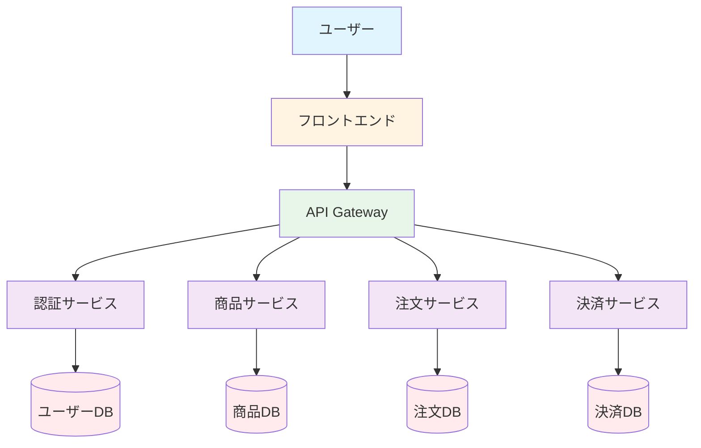
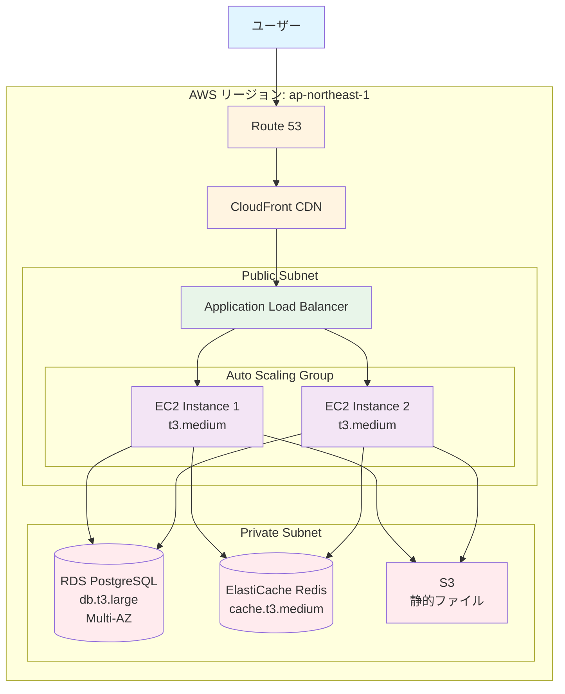
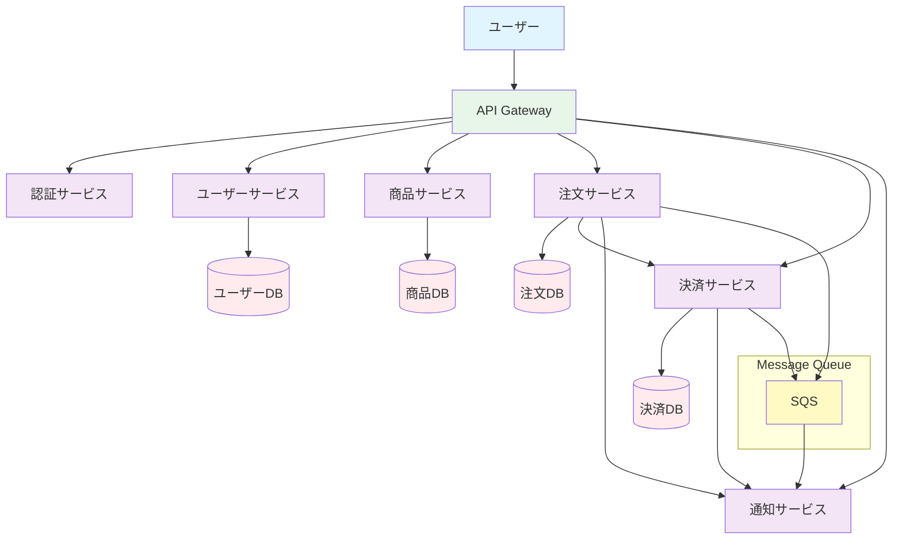
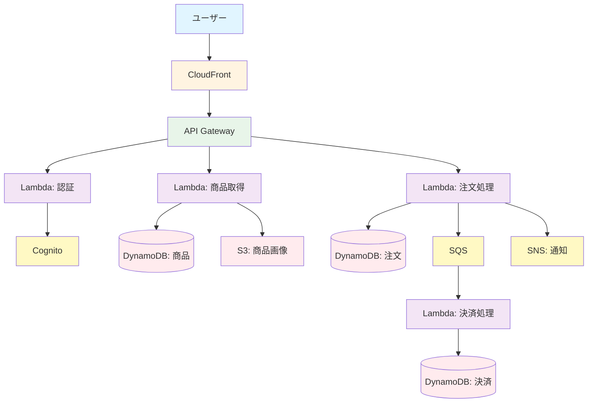
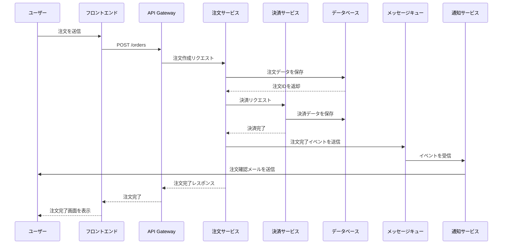
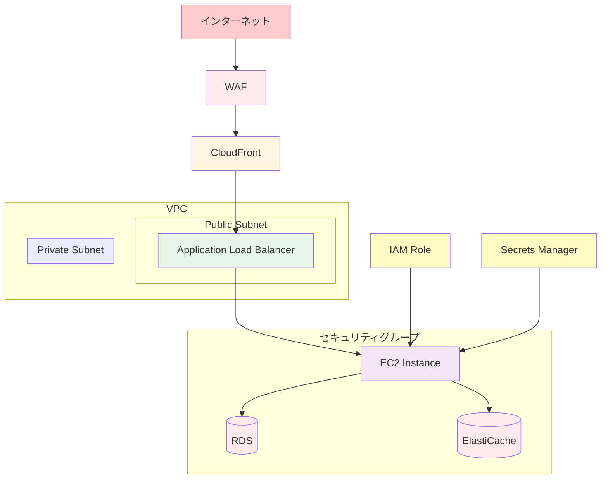

## システム構成図の実践例

実際のプロジェクトで使用されるシステム構成図の例を紹介します。

### ECサイトのシステム構成図

#### 論理構成図

**説明:**

- **フロントエンド**: Next.jsで構築されたSPA
- **API Gateway**: すべてのAPIリクエストをルーティング
- **認証サービス**: ユーザー認証と認可を担当
- **商品サービス**: 商品情報の管理
- **注文サービス**: 注文の処理
- **決済サービス**: 決済処理（Stripe連携）

#### 物理構成図

**説明:**

- **CloudFront**: 静的コンテンツの配信とキャッシュ
- **Application Load Balancer**: リクエストの分散
- **EC2 Auto Scaling**: 負荷に応じて自動スケーリング
- **RDS Multi-AZ**: 高可用性のためのマルチAZ構成
- **ElastiCache**: セッション管理とキャッシュ
- **S3**: 静的ファイルの保存

### マイクロサービスアーキテクチャの構成図

#### 論理構成図

**説明:**

- **API Gateway**: すべてのリクエストのエントリーポイント
- **各マイクロサービス**: 独立したサービスとして実装
- **メッセージキュー**: 非同期処理のためのSQS
- **サービス間通信**: HTTP/RESTまたはメッセージキュー経由

### サーバーレスアーキテクチャの構成図

#### 論理構成図

**説明:**

- **API Gateway**: RESTful APIのエントリーポイント
- **Lambda**: サーバーレス関数でビジネスロジックを実装
- **DynamoDB**: NoSQLデータベース
- **SQS**: 非同期処理のためのメッセージキュー
- **SNS**: 通知のためのPub/Subサービス

### データフロー図

#### ECサイトの注文処理フロー

**説明:**

- **シーケンス図**: 時系列での処理の流れを表現
- **各ステップ**: 明確に処理の流れを表現
- **エラーハンドリング**: エラー時の処理も記載

### セキュリティ構成図

#### セキュリティレイヤーの構成

**説明:**

- **WAF**: Web Application Firewallで攻撃を防御
- **セキュリティグループ**: ネットワークレベルのセキュリティ
- **VPC**: プライベートネットワークの構築
- **IAM**: アクセス制御
- **Secrets Manager**: 機密情報の管理

### まとめ

システム構成図の実践例のポイント：

- **目的に応じた図**: 目的に応じて適切な図を選択
- **明確な説明**: 各コンポーネントの役割を明確に説明
- **データフロー**: データの流れを明確に表現
- **セキュリティ**: セキュリティレイヤーも表現
- **ツールの活用**: Mermaidなどのツールを活用

適切なシステム構成図により、システムの全体像を理解し、コミュニケーションを円滑にできます。

