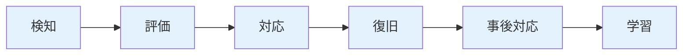

# 障害対応完全ガイド

障害対応の実践的な手法を、実務で使える実装例とベストプラクティスとともに詳しく解説します。

## 1. 障害対応とは

### 障害対応の目的

障害対応は、システムの障害を迅速に検知し、影響を最小限に抑えながら復旧する一連の活動です。

```
障害対応の目的
   ├─ 影響の最小化
   ├─ 迅速な復旧
   ├─ 原因の特定
   ├─ 再発防止
   └─ 学習と改善
```

### 障害対応のプロセス



## 2. 障害の検知

### モニタリングの設定

#### アラートの設定

```yaml
# Prometheus アラートルールの例
groups:
  - name: application_alerts
    rules:
      - alert: HighErrorRate
        expr: rate(http_requests_total{status=~"5.."}[5m]) > 0.05
        for: 5m
        labels:
          severity: critical
        annotations:
          summary: "エラー率が高い"
          description: "エラー率が5%を超えています"

      - alert: HighLatency
        expr: histogram_quantile(0.95, rate(http_request_duration_seconds_bucket[5m])) > 1
        for: 5m
        labels:
          severity: warning
        annotations:
          summary: "レイテンシが高い"
          description: "95パーセンタイルのレイテンシが1秒を超えています"

      - alert: ServiceDown
        expr: up{job="api"} == 0
        for: 1m
        labels:
          severity: critical
        annotations:
          summary: "サービスがダウン"
          description: "APIサービスが応答していません"
```

#### 監視すべきメトリクス

```markdown
## 監視すべきメトリクス

### アプリケーションレベル
- エラー率
- レイテンシ（レスポンスタイム）
- スループット（リクエスト数/秒）
- エラー数

### インフラレベル
- CPU使用率
- メモリ使用率
- ディスク使用率
- ネットワーク帯域幅
- 接続数

### ビジネスレベル
- アクティブユーザー数
- トランザクション数
- エラー率
- 収益への影響
```

### 障害の検知方法

```markdown
## 障害の検知方法

### 1. 自動検知
- **モニタリングツール**: Prometheus、Datadog、New Relic
- **ログ監視**: ELK Stack、Splunk
- **APM**: Application Performance Monitoring

### 2. ユーザーからの報告
- **サポートチケット**: Zendesk、Jira Service Desk
- **Slack/メール**: ユーザーからの直接報告
- **SNS**: Twitter、Facebookでの報告

### 3. チームメンバーからの報告
- **開発中の発見**: 開発者が発見
- **テスト中の発見**: QAが発見
- **運用中の発見**: オペレーターが発見
```

## 3. 障害の評価

### 深刻度の分類

```markdown
## 深刻度の分類

### P0 - Critical（緊急）
**定義**: システムが完全に使用不能、または重大なセキュリティ侵害

**例:**
- 本番環境が完全にダウン
- データベースがクラッシュ
- 個人情報の漏洩
- 決済システムの停止

**対応時間**: 即座（5分以内）
**目標復旧時間**: 1時間以内

### P1 - High（高）
**定義**: サービスの主要機能が使用できない

**例:**
- ログイン機能が使用できない
- 決済機能が使用できない
- APIのレスポンスが極端に遅い（10秒以上）
- データの不整合

**対応時間**: 15分以内
**目標復旧時間**: 4時間以内

### P2 - Medium（中）
**定義**: サービスの一部機能が使用できない

**例:**
- 一部のページが表示されない
- レポート機能が使用できない
- メール送信が失敗する
- パフォーマンスの劣化

**対応時間**: 1時間以内
**目標復旧時間**: 24時間以内

### P3 - Low（低）
**定義**: 軽微な問題、影響範囲が限定的

**例:**
- UIの表示が崩れている
- 軽微なバグ
- パフォーマンスの軽微な劣化
- 非主要機能の問題

**対応時間**: 4時間以内
**目標復旧時間**: 1週間以内
```

### 影響範囲の評価

```markdown
## 影響範囲の評価

### ユーザーへの影響
- **全ユーザー**: すべてのユーザーに影響
- **一部ユーザー**: 特定のユーザーグループに影響
- **新規ユーザー**: 新規登録ユーザーに影響

### 機能への影響
- **主要機能**: コア機能が使用できない
- **付加機能**: 付加的な機能が使用できない
- **非主要機能**: 非主要な機能が使用できない

### ビジネスへの影響
- **収益への影響**: 直接的な収益損失
- **信頼への影響**: ブランドイメージへの影響
- **法的リスク**: コンプライアンス違反のリスク
```

## 4. インシデント対応の流れ

### ステップ1: 検知とトリアージ

```markdown
## トリアージのプロセス

1. **障害の確認**
   - モニタリングダッシュボードの確認
   - ログの確認
   - ユーザー報告の確認

2. **深刻度の決定**
   - P0、P1、P2、P3のいずれかに分類
   - 影響範囲の確認

3. **対応者の決定**
   - オンコール担当者の呼び出し
   - エスカレーションの判断
   - チームの招集
```

### ステップ2: 封じ込め

```markdown
## 封じ込めの方法

### 1. トラフィックの制限
- **レート制限**: リクエスト数の制限
- **トラフィックの停止**: 問題のあるエンドポイントの停止
- **ロードバランサーの設定変更**: 問題のあるサーバーを除外

### 2. 機能の無効化
- **機能フラグ**: 問題のある機能を無効化
- **メンテナンスモード**: システム全体をメンテナンスモードに

### 3. ロールバック
- **デプロイのロールバック**: 最新のデプロイをロールバック
- **設定のロールバック**: 設定変更をロールバック
```

### ステップ3: 原因の特定

```markdown
## 原因特定の方法

### 1. ログの確認
- **アプリケーションログ**: エラーログの確認
- **アクセスログ**: 異常なアクセスパターンの確認
- **システムログ**: OSレベルのログの確認

### 2. メトリクスの確認
- **パフォーマンスメトリクス**: CPU、メモリ、ディスク
- **アプリケーションメトリクス**: エラー率、レイテンシ
- **ビジネスメトリクス**: トランザクション数、ユーザー数

### 3. 分散トレーシング
- **トレースの確認**: リクエストの流れを追跡
- **ボトルネックの特定**: 遅延が発生している箇所の特定

### 4. データベースの確認
- **スロークエリ**: 遅いクエリの確認
- **ロックの確認**: デッドロックの確認
- **接続数の確認**: 接続プールの枯渇
```

### ステップ4: 対応

```markdown
## 対応の種類

### 1. 一時的な対応（Workaround）
- **機能の無効化**: 問題のある機能を一時的に無効化
- **リソースの追加**: サーバーのスケールアップ
- **キャッシュのクリア**: キャッシュをクリアして再試行

### 2. 恒久的な対応（Fix）
- **バグ修正**: コードのバグを修正
- **設定の修正**: 設定の誤りを修正
- **インフラの修正**: インフラの問題を修正
```

### ステップ5: 復旧確認

```markdown
## 復旧確認のチェックリスト

- [ ] サービスが正常に動作している
- [ ] メトリクスが正常値に戻っている
- [ ] エラーログに新しいエラーが発生していない
- [ ] ユーザーからの新たな報告がない
- [ ] パフォーマンスが正常に戻っている
```

## 5. オンコール制度

### オンコールの設定

```markdown
## オンコール制度の設計

### 1. オンコール担当者の役割
- **初動対応**: インシデントの初動対応
- **エスカレーション**: 必要に応じたエスカレーション
- **インシデントレポート**: インシデントレポートの作成

### 2. オンコールのローテーション
- **週単位**: 週単位でローテーション
- **プライマリ/セカンダリ**: 2名以上でオンコール
- **オンコールカレンダー**: PagerDuty、Opsgenieで管理

### 3. オンコールの報酬
- **オンコール手当**: オンコール期間中の手当
- **対応手当**: 実際に対応した場合の手当
- **休暇の補償**: オンコール後の休暇
```

### オンコールツール

```markdown
## オンコールツール

### 1. PagerDuty
- **特徴**: 業界標準のオンコール管理ツール
- **機能**: エスカレーションポリシー、スケジュール管理

### 2. Opsgenie
- **特徴**: Atlassian製品との統合
- **機能**: インシデント管理、オンコール管理

### 3. VictorOps
- **特徴**: インシデント対応に特化
- **機能**: インシデント管理、ログ分析
```

## 6. コミュニケーション管理

### ステータスページ

```markdown
## ステータスページの運用

### 1. ステータスページの更新
- **障害発生時**: 即座にステータスを更新
- **対応中**: 定期的に状況を更新
- **復旧時**: 復旧を通知

### 2. ステータスページの内容
- **現在の状況**: 障害の状況
- **影響範囲**: どの機能に影響があるか
- **対応状況**: 現在の対応状況
- **予想復旧時間**: 復旧の見込み時間
```

### 内部コミュニケーション

```markdown
## 内部コミュニケーション

### 1. インシデントチャネル
- **#incident**: インシデント対応専用チャネル
- **#incident-p0**: P0インシデント専用チャネル
- **#monitoring**: 監視アラート専用チャネル

### 2. コミュニケーションのルール
- **定期的な更新**: 15分ごとに状況を更新
- **明確な情報**: 事実ベースの情報を共有
- **次のアクション**: 次のアクションを明確に
```

## 7. エスカレーション手順

### エスカレーションの基準

```markdown
## エスカレーションの基準

### 1. 時間ベースのエスカレーション
- **P0**: 30分以内に解決しない場合
- **P1**: 2時間以内に解決しない場合
- **P2**: 1日以内に解決しない場合

### 2. 影響ベースのエスカレーション
- **ビジネスへの重大な影響**: 即座にエスカレーション
- **セキュリティ侵害**: 即座にエスカレーション
- **データ損失**: 即座にエスカレーション
```

### エスカレーション先

```markdown
## エスカレーション先

### レベル1: オンコール担当者
- 初動対応
- 原因の特定
- 一時的な対応

### レベル2: チームリーダー
- 技術的な判断が必要な場合
- リソースの追加が必要な場合

### レベル3: 部門長/CTO
- ビジネスへの重大な影響がある場合
- 経営判断が必要な場合
```

## 8. ポストモーテム（振り返り）

### ポストモーテムの目的

```markdown
## ポストモーテムの目的

1. **原因の理解**: 障害の根本原因を理解する
2. **学習**: 障害から学び、改善する
3. **再発防止**: 同じ障害を防ぐための対策を決定
4. **プロセスの改善**: 障害対応プロセスを改善する
```

### ポストモーテムのテンプレート

```markdown
## ポストモーテムテンプレート

### 1. インシデントの概要
- **日時**: 2024/03/15 14:00 - 16:30
- **深刻度**: P0
- **影響範囲**: 全ユーザー、ログイン機能
- **復旧時間**: 2時間30分

### 2. タイムライン
- **14:00**: 障害検知
- **14:05**: トリアージ完了、P0と判定
- **14:15**: 原因特定（データベース接続プールの枯渇）
- **14:30**: 一時的な対応（接続プールサイズの増加）
- **15:00**: 恒久的な対応（コードの修正）
- **16:30**: 復旧確認完了

### 3. 根本原因
- **直接原因**: データベース接続プールのサイズが不足
- **根本原因**: 負荷テストが不十分で、実際の負荷を想定できていなかった

### 4. 影響
- **ユーザーへの影響**: 2時間30分間、ログイン機能が使用不可
- **ビジネスへの影響**: 約100万円の機会損失
- **信頼への影響**: ユーザーからの問い合わせが100件

### 5. 対応内容
- **一時的な対応**: 接続プールサイズを50から200に増加
- **恒久的な対応**: 接続プールの動的スケーリング機能を実装

### 6. 改善アクション
- [ ] 負荷テストの実施（期限: 2024/04/01）
- [ ] 接続プールの監視アラートの追加（期限: 2024/03/20）
- [ ] 自動スケーリング機能の実装（期限: 2024/04/15）

### 7. 教訓
- 負荷テストは実際の負荷を想定して実施する
- 接続プールなどのリソースも監視対象に含める
- 自動スケーリング機能を検討する
```

### ポストモーテムの実施

```markdown
## ポストモーテムの実施

### 1. 実施タイミング
- **インシデント解決後**: 1週間以内に実施
- **参加者**: インシデント対応に関わった全員

### 2. 実施方法
- **ブレスト**: 原因と改善策を議論
- **タイムラインの作成**: 時系列で整理
- **改善アクションの決定**: 具体的なアクションを決定

### 3. フォローアップ
- **改善アクションの進捗**: 定期的に進捗を確認
- **効果の確認**: 改善策の効果を確認
```

## 9. 障害対応ツール

### インシデント管理ツール

```markdown
## インシデント管理ツール

### 1. PagerDuty
- **特徴**: オンコール管理、インシデント管理
- **機能**: エスカレーション、スケジュール管理、レポート

### 2. Opsgenie
- **特徴**: Atlassian製品との統合
- **機能**: インシデント管理、オンコール管理、レポート

### 3. Jira Service Management
- **特徴**: Jiraとの統合
- **機能**: インシデント管理、変更管理、問題管理
```

### モニタリングツール

```markdown
## モニタリングツール

### 1. Prometheus + Grafana
- **特徴**: オープンソース、高カスタマイズ性
- **機能**: メトリクス収集、アラート、可視化

### 2. Datadog
- **特徴**: SaaS、統合監視
- **機能**: APM、インフラ監視、ログ管理

### 3. New Relic
- **特徴**: SaaS、APMに強い
- **機能**: APM、インフラ監視、ログ管理
```

## 10. ベストプラクティス

### 障害対応のベストプラクティス

```markdown
## 障害対応のベストプラクティス

### 1. 準備
- **ドキュメント**: 障害対応手順を文書化
- **ツール**: 必要なツールを準備
- **訓練**: 定期的な訓練を実施

### 2. 対応中
- **冷静さ**: パニックにならない
- **コミュニケーション**: 定期的に状況を共有
- **記録**: すべての対応を記録

### 3. 事後
- **振り返り**: 必ずポストモーテムを実施
- **改善**: 改善アクションを実行
- **学習**: 障害から学ぶ
```

### よくある失敗パターン

```markdown
## よくある失敗パターン

### 1. パニック
- **問題**: 冷静さを失い、適切な判断ができない
- **対策**: 事前に手順を準備、訓練を実施

### 2. 情報共有の不足
- **問題**: チーム内で情報が共有されない
- **対策**: インシデントチャネルを活用、定期的に更新

### 3. 原因特定の遅れ
- **問題**: 原因特定に時間がかかる
- **対策**: ログとメトリクスを整理、分散トレーシングを活用

### 4. 再発防止策の不実施
- **問題**: ポストモーテムで決定した改善アクションが実施されない
- **対策**: 改善アクションを追跡、定期的に進捗を確認
```

## まとめ

障害対応完全ガイドのポイント：

- **検知**: 包括的なモニタリングとアラート設定
- **評価**: 深刻度と影響範囲の適切な評価
- **対応**: 封じ込め、原因特定、対応の流れ
- **オンコール**: 適切なオンコール制度の設計
- **コミュニケーション**: ステータスページと内部コミュニケーション
- **エスカレーション**: 適切なエスカレーション手順
- **ポストモーテム**: 振り返りと改善アクション
- **ツール**: 適切なツールの選定と活用
- **ベストプラクティス**: 実践的なベストプラクティス

適切な障害対応により、可用性の高いシステムを維持できます。

